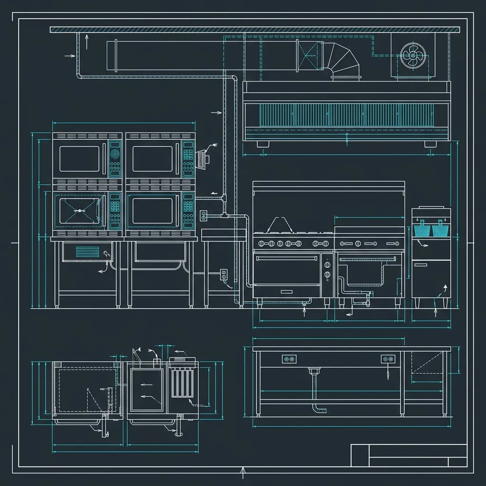

## The "Chef Mike" Reputation — And the Real Story

If you've spent any time on the internet reading about chain restaurants, you've heard the jokes. "Chef Mike" — the microwave — is Applebee's real head chef. Reddit threads, TikTok exposés, disgruntled former employees all say the same thing: everything at Applebee's gets nuked.

> **Russell's Note:** When your KDS screen is going red on a Friday night, the last thing you want is a broken line. You have to run a 120-second window or you're dead in the water.

> **Russell's Note:** People always ask why this tastes different at home. Simple. We aren't afraid of butter, salt, and keeping the flat top screaming hot.

I managed kitchens across three Applebee's locations for over five years. And I'll tell you straight: the "Chef Mike" reputation is exaggerated, but it isn't baseless. Microwaves — or more precisely, TurboChef ovens — are a critical part of the operation. But if you think your 12 oz. ribeye is getting zapped in a countertop Panasonic, you're dead wrong.

Here's the honest, line-by-line breakdown of how an Applebee's kitchen actually works — what gets microwaved, what gets grilled, and why the system is set up the way it is.

## What Specifically Gets Microwaved

Let's rip the band-aid off. Yes, a significant number of menu items pass through a TurboChef or a standard commercial microwave before they hit your table. The process works like this:

### Sides

Most of the vegetable sides at Applebee's arrive pre-portioned in seasoned butter bags. The broccoli comes in a bag with garlic butter seasoning. The green beans are the same — pre-portioned, pre-seasoned, sealed in a plastic pouch. The cook drops the bag into the TurboChef, hits a preset button, and 45 seconds later it's done. No pan, no sauté, no seasoning to order.

Mashed potatoes are prepared in bulk earlier in the day (or arrive pre-made from the supplier, depending on the location) and are held in a steam well on the line. When an order comes in, a portion gets scooped and reheated in the TurboChef if it's cooled below safe holding temp, or it goes straight from the well to the plate. Either way, nobody is peeling and boiling potatoes to order.

### Soups

The soups — loaded baked potato, tomato basil, French onion — are heated to order from bulk batches stored in the walk-in cooler. A portion gets ladled into a bowl and run through the TurboChef for about 60–90 seconds. French onion gets topped with croutons and provolone, then hit with the TurboChef again to melt and brown the cheese. This is one area where the TurboChef actually outperforms a standard microwave, because the convection element gives you that browned, bubbly cheese top you can't get from microwave energy alone.

### Some Appetizers

Spinach artichoke dip is a big one. It's pre-made in batches and portioned into ramekins that sit in the cooler. When a ticket comes in, the ramekin goes into the TurboChef, gets heated through, and comes out bubbling. It's served with tortilla chips that come out of the fryer fresh, so the dip itself is the only microwaved component on that plate.

### Desserts

The famous Applebee's Triple Chocolate Meltdown (molten chocolate cake) is a frozen cake that gets reheated in the TurboChef. The center goes molten, the outside warms through, and it gets plated with vanilla ice cream and a chocolate drizzle. It's not baked from scratch. Nobody in casual dining is baking individual lava cakes to order — the labor cost alone would make it impossible. But the TurboChef does a genuinely good job making it taste like it just came out of a real oven.

### Pasta and Sauces

This is the one that surprises people the most. The pasta — whether it's fettuccine, penne, or whatever the current menu rotation features — is pre-cooked in bulk and stored in portioned bags. When an order fires, the pasta bag goes into the TurboChef. The sauce (Alfredo, marinara, whatever the dish calls for) is heated separately or together with the pasta, depending on the recipe build. It comes out, gets tossed in a bowl, and is garnished with parsley and parmesan.

Is it the same as a line cook boiling fresh pasta and reducing a sauce to order? No. Is it bad? Honestly, for a $14 entrée and a 12-minute ticket time, it's pretty solid.

## What Gets Grilled — For Real

Now here's the part the internet doesn't want to talk about, because it doesn't fit the narrative. Applebee's has a real charbroiler, a real flat-top griddle, and a bank of commercial deep fryers. The grill side of the kitchen is doing actual cooking.

### Steaks

Every steak on the Applebee's menu — the 6 oz. sirloin, the 8 oz. top sirloin, the 12 oz. ribeye — is cooked from raw on the charbroiler. The cook seasons it with Applebee's house seasoning blend (a salt-pepper-garlic mix that's pre-portioned into shaker bottles), lays it on the grill, and cooks it to the customer's requested temperature. Every steak gets temped with a meat thermometer before it leaves the line. Medium-rare is pulled at 135°F internal, medium at 145°F, well-done at 165°F. There is no microwave involved in steak preparation. Period.

### Chicken

Grilled chicken breasts — used for salads, the Fiesta Lime Chicken, and other entrées — start raw and are cooked on the charbroiler. They're marinated or seasoned depending on the dish, and like the steaks, they get temped before plating. The chicken for wraps and sandwiches goes through the same process.

### Burgers

Burger patties are cooked on the flat-top griddle. They arrive as pre-formed patties (they're not hand-packing ground beef to order, but the patties are raw when they hit the grill). The flat-top gives them a good sear, and they're cooked to the corporate standard of 165°F internal for food safety.

### Ribs

The ribs arrive pre-smoked and partially cooked from the supplier. They get finished on the charbroiler to heat through and get grill marks and a caramelized glaze. This is similar to [how Chili's actually cooks their famous Baby Back Ribs](/articles/chilis-baby-back-ribs/) — almost every casual dining chain receives ribs par-cooked and finishes them in-house. Nobody is running a 6-hour smoker in a strip mall kitchen.

## The TurboChef Oven — It's Not What You Think

This is the single most important thing people misunderstand about Applebee's kitchen. When people say "Applebee's microwaves everything," they're picturing the $80 Walmart microwave sitting on your kitchen counter. That's not what's happening.

Applebee's uses **TurboChef ovens**, which are high-speed convection/microwave hybrid units. A TurboChef uses **impinged air** (high-velocity hot air jets) and **microwave energy simultaneously** to cook or reheat food. The result is dramatically different from a standard home microwave. You get browning, crisping, and even caramelization — things a regular microwave literally cannot do.

Each TurboChef unit costs between **$5,000 and $8,000**. Most Applebee's locations have **2–3 of them** on the line. They can cook or reheat items in **30–90 seconds**, which is how the kitchen hits its ticket time targets on a Friday night when 200 tickets are running through the KDS.

Is it a microwave? Technically, it uses microwave energy as one of its heating methods. Is it the same as your microwave at home? Not even close. Calling a TurboChef a microwave is like calling a commercial convection oven a toaster because they both use heating elements.

## How the Kitchen Is Divided

An Applebee's kitchen is split into two distinct sides, and understanding this layout is key to understanding why microwaves are so central to the operation.

### Grill Side

The grill side of the line houses the **charbroiler**, the **flat-top griddle**, and the **deep fryers**. The line cook assigned to grill side is responsible for all proteins — steaks, chicken, burgers, fried appetizers, wings, fish. This is the station that requires the most skill and the most attention. A good grill cook can make or break a Friday night service.

### Micro/Prep Side

The opposite side of the line is the **micro side** (sometimes called the utility side). This station has the **TurboChef ovens**, the **steam wells** for holding soups and sides at temp, and the **cold station** for salads and cold appetizers. The utility cook on this side handles all the sides, soups, appetizers like spinach dip, pasta dishes, and desserts. It's a high-volume position but lower skill — most of the work is portioning and pressing preset buttons on the TurboChef.

### The Expo Station

In the middle sits the **expediting station**. The expo (usually a manager or a senior cook) reads tickets as they come in on the **KDS (Kitchen Display System)**, calls items to both sides of the line, and coordinates timing so that the grilled steak and the microwaved broccoli both arrive at the pass at the same moment. The expo stages plates, adds garnishes, checks presentation, and ensures every ticket leaves the window looking right.

## Ticket Time Targets and the KDS

Speed is everything in casual dining. Applebee's corporate sets specific ticket time targets that every location is measured against:

- **Appetizers:** 8–10 minutes from the time the order hits the KDS
- **Entrées:** 12–15 minutes from order to window
- **Desserts:** 5–7 minutes

Managers track these times in real-time on the KDS. If tickets start running long — say, over 15 minutes on entrées — the manager is jumping on the line to help, finding the bottleneck, and pushing the team to recover. Corporate runs reports on average ticket times by location, and consistently slow stores get attention from district managers. This is why the TurboChef exists. You simply cannot hit a 12-minute ticket time on a 200-item menu if every side dish is being sautéed to order on a stove. The math doesn't work.

Interestingly, this kind of speed-focused system isn't unique to Applebee's. Even [McDonald's fry station](/articles/mcdonalds-fry-station/) is engineered around precise timing and equipment designed for maximum throughput. The scale is different, but the philosophy is identical.

## How Applebee's Compares to Other Casual Dining Chains

Here's the thing nobody wants to admit: **every casual dining chain does this**. [Chili's](/articles/chain/chilis) uses microwaves and TurboChefs. [Denny's](/articles/chain/dennys) uses them. TGI Friday's, Red Lobster, Olive Garden — they all have some version of this hybrid cooking system. Applebee's just caught the brunt of the internet jokes.

Chili's actually has a very similar kitchen layout — grill side for proteins, micro side for sides and apps. Denny's leans a little more heavily on the flat-top for a wider variety of items because their menu is more breakfast-oriented, but they still microwave sides and reheat soups.

The reality is that casual dining is a volume game. These restaurants serve 300–500 covers on a busy night with a kitchen crew of 4–6 people. The only way to do that with a menu of 80+ items, ticket times under 15 minutes, and a labor budget that corporate will actually approve is to use a combination of pre-prepped ingredients and high-speed cooking equipment. That's not a scandal — that's the business model.

## Does Applebee's Microwave Their Steaks?

No. This is the most common misconception and it's flatly wrong. Steaks at Applebee's are cooked from raw on a charbroiler or flat-top griddle. They're seasoned with the house blend, cooked to the customer's requested temperature, and temped with a meat thermometer before plating. No microwave, no TurboChef, no shortcut. The same goes for grilled chicken breasts and burger patties — all cooked from raw on the grill side of the line.

## What Is a TurboChef Oven?

A TurboChef is a commercial-grade, high-speed hybrid oven that combines **microwave energy** with **impinged hot air convection** to cook or reheat food in a fraction of the time a conventional oven would take. Unlike a home microwave, a TurboChef can brown, crisp, and caramelize food because of the high-velocity hot air jets that hit the food simultaneously with the microwave energy. Each unit runs between $5,000 and $8,000, and most Applebee's locations keep 2–3 on the line. They're the backbone of the micro side station and are responsible for the speed that makes casual dining ticket times possible.

## Is Applebee's Food Fresh?

It depends on what you mean by "fresh." The proteins — steaks, chicken, burgers — arrive raw and are cooked to order. That's fresh by any reasonable definition. The sides, soups, sauces, and many appetizers are pre-prepped, pre-portioned, and reheated. Some items (like the ribs) arrive par-cooked from a supplier and are finished in-house. The desserts are frozen and reheated. None of this is unusual for casual dining — it's the standard operating model across the entire segment. If you want every component of your meal cooked from scratch to order, you're looking at a 45-minute ticket time and a $35 entrée price point, which is fine dining territory, not a neighborhood Applebee's.
