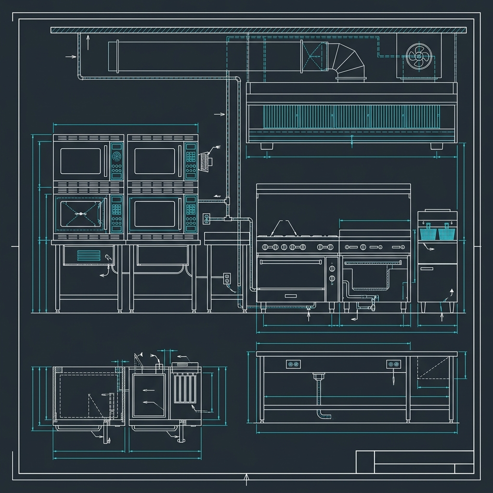

## The "Chef Mike" Reputation

If you've spent any time on the internet, you've heard the jokes. "Chef Mike" (the microwave) is often cited as the head chef at Applebee's. 

Is there truth to the rumor? Yes. Do they microwave *everything*? Absolutely not. Here is the honest breakdown of how an Applebee's kitchen balances rapid service with actual cooking.

## What Actually Hits the Grill

Let's clear the air: Applebee's has a real grill, a real flat top, and real fryers. The cooks working the grill station are actually cooking.

*   **Steaks:** The steaks arrive raw and are cooked to order on a flat top or charbroiler. They are seasoned and temped by the cook.
*   **Burgers:** The burger patties are cooked fresh on the flat top.
*   **Chicken Breasts:** The grilled chicken used in salads and entrees starts raw and is cooked on the grill.
*   **Fried Items:** French fries, mozzarella sticks, boneless wings, and onion rings are cooked to order in standard commercial deep fryers.

## Where "Chef Mike" Steps In

The microwaves are heavily utilized, but primarily for sides, sauces, and items that require reheating rather than cooking from scratch. This is standard practice in almost all casual dining chains to maintain ticket times.

Here’s what typically gets the microwave treatment:

*   **Vegetables:** The broccoli and green beans are often pre-portioned in bags with butter and seasoning, then steamed in the microwave.
*   **Mashed Potatoes:** Often reheated from a prepared state.
*   **Pasta and Sauces:** The pasta is pre-cooked and portioned. When an order comes in, the pasta and the sauce (like the Alfredo) are heated in the microwave before being combined and garnished.
*   **Soups and Dips:** The spinach artichoke dip and various soups are heated to order in microwaves.
*   **Desserts:** The famous molten chocolate cake? Heated in the microwave to make the center gooey before plating.

## The Reality of Casual Dining

The Applebee's kitchen is designed for efficiency. By utilizing microwaves for sides and sauces, the cooks can focus their attention on the proteins that require actual temperature control and timing on the grill. It's a system designed to get a massive menu out to hundreds of tables a night with consistent results.
