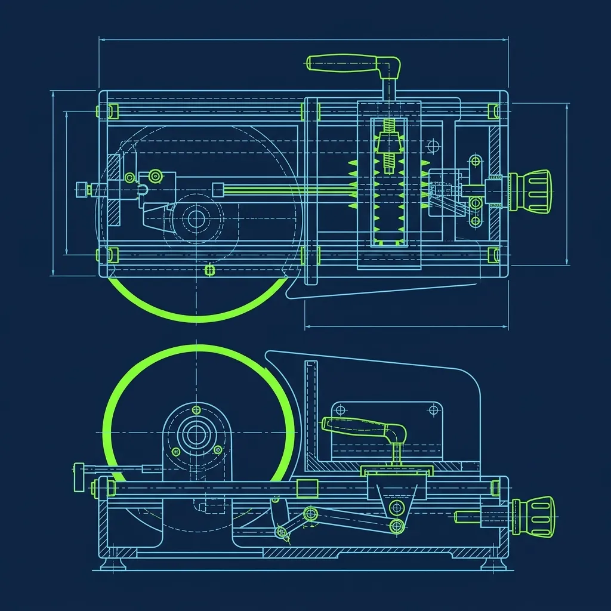
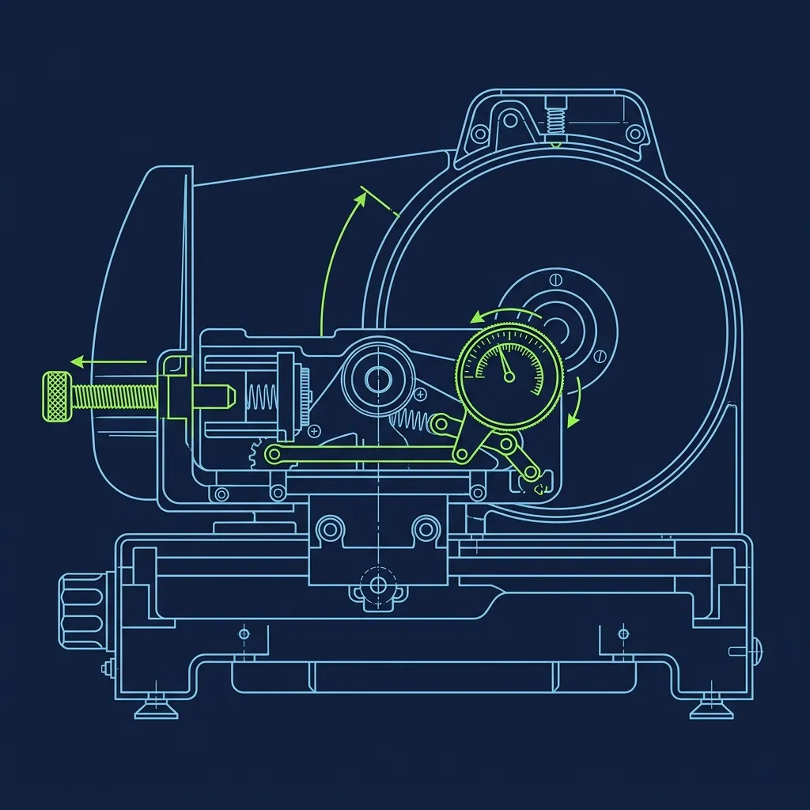

Somewhere around 2015, a photo of a raw, gelatinous bag of Arby's roast beef went viral. The internet collectively decided the meat was fake—some kind of liquid paste poured into a mold. I was managing a QSR kitchen at the time, and I remember a cashier showing me the photo on her phone during a slow Tuesday afternoon. "Is this real?" she asked. The answer is more interesting than the conspiracy theory, and the job of actually running the slicer station is one of the most tightly regulated positions in any fast food restaurant. 

## The Truth About the Meat

Yes, it is real beef. No, it does not arrive as a liquid.

> **Russell's Note:** Forget the fancy gadgets. Give me a sharp 8-inch chef's knife and a 32oz deli container labeled with blue painter's tape, and I can run any station.

> **Russell's Note:** You don't know true panic until a 15-item catering order drops right in the middle of a Sunday brunch shift. I still have nightmares about it.

Every Arby's location receives its roast beef raw, vacuum-sealed in heavy plastic bags, submerged in a salty beef broth marinade. Each bag contains roughly 10 pounds of solid beef. The prep team pulls these bags from the walk-in cooler every morning and loads the raw roasts into a slow-cooking oven where they roast for approximately 3 to 4 hours. Once the internal temperature hits the corporate safety standard—typically around 145°F for whole cuts—the roasts are transferred into a specialized holding oven where they rest and stay hot throughout the day. 

Here's the thing nobody tells you about the "liquid meat" myth: the marinade is what fooled everyone. When you tear open that vacuum-sealed bag for the first time, the raw beef is sitting in a pool of beef broth and dissolved gelatin. The meat is slippery, wet, and the liquid around it has a slightly gelatinous consistency. Out of context, it looks bizarre. Someone snapped a photo, slapped it on Reddit, and the myth went viral. But that liquid is just a standard brine marinade—salt, water, and natural flavorings. Once the roast spends four hours in the oven, it comes out looking and tasting exactly like the roast beef you would make at home, just scaled up to feed a few hundred people a day. 

## The Deli Slicer Station

Arby's does not pre-slice their meat. Every single sandwich gets its meat sliced fresh, paper-thin, on a massive commercial-grade deli slicer positioned right on the assembly line. This is not a decorative feature—it is the operational heart of the store.

If you are assigned to the slicer station, you have already earned serious trust. In most locations, only managers or specifically certified adult employees touch this machine. One memorable shift, new hires stare at the slicer on their first day like it is a medieval torture device, and honestly, that level of respect is appropriate.

**The Technique:** You place the hot roast beef onto the slicer carriage, turn the machine on, and rapidly slide the carriage back and forth across a spinning blade. The paper-thin slices fall directly onto a digital scale below. Veteran operators develop a smooth, rhythmic cadence—almost musical—that produces perfectly uniform slices without tearing or jamming. Jerky, uneven strokes produce ragged slices that look terrible on the sandwich and waste product.

**The Weight:** Every Arby's sandwich has a strict weight requirement, and there is zero wiggle room. A Classic Roast Beef gets exactly 3.0 ounces of meat. You slice until the digital scale reads exactly 3.0, then use tongs to transfer the hot meat onto the bun. During a lunch rush, you are doing this dozens of times in rapid succession, and the muscle memory has to be automatic. I've watched operators hit 3.0 within a tenth of an ounce on the first pass, every single time—it is genuinely impressive once the rhythm clicks.

**The Blade Thickness Setting:** The slicer has an adjustable blade guard that controls slice thickness, and corporate mandates a very specific setting—thin enough that the slices are nearly translucent. If a manager catches you running the blade too thick, the machine gets recalibrated and you get retrained on the spot. Thick slices throw off the weight accuracy and completely change the sandwich texture. The customer expects that signature Arby's pile of impossibly thin, juicy meat, and a thick-cut roast beef sandwich is an entirely different product.

## Safety Gear and the End-of-Night Breakdown

Here is where the slicer station gets genuinely serious. Commercial deli slicers are incredibly dangerous. The blade is razor-sharp, spinning at high RPM, and completely exposed during operation. One slip without protection, and that blade will take the tip of a finger off before you even register the pain. Because of this hazard, employees under the age of 18 are legally prohibited from operating or cleaning the slicer in almost every state. This is not a corporate suggestion—it is federal labor law under the [Fair Labor Standards Act](https://www.dol.gov/agencies/whd/child-labor).

The end-of-night cleaning procedure is rigorous and takes about 15 to 20 minutes if done correctly. After unplugging the machine—not just turning it off, but physically pulling the plug from the wall—you must disassemble the blade guard, the carriage plate, and the product tray. Each component is scrubbed individually with a food-safe sanitizer and a non-abrasive sponge. The blade itself is wiped carefully from the center outward, never in a circular motion along the edge. One circular wipe in the wrong direction and you are making a trip to the emergency room.

You are required to wear a thick Kevlar mesh glove during this entire process. More times than I can count, exactly one employee try to "save time" by skipping the glove. He nicked two fingertips on the same night and never made that mistake again. Cutting corners on slicer cleaning is also a serious health code violation—the kind that can shut a store down during an inspection.

## The Morning Calibration Routine

The slicer station does not just fire up when the doors open. There is a dedicated morning calibration every single day. The opening manager powers up the slicer, verifies the blade guard setting with a thickness gauge, and runs a test slice to ensure the blade is sharp and cutting cleanly.

Dull blades are a bigger problem than most people realize. A sharp blade slices through the roast beef like butter. A dull blade tears the meat instead, creating a stringy, ragged texture that looks unappetizing and falls apart on the sandwich. Worse, a dull blade is actually more dangerous than a sharp one because it requires you to apply more force on the carriage, increasing the risk of a slip. When the blade is dull, it has to be sent out for professional sharpening, and the store switches to a backup slicer until the primary returns. High-volume stores that push through hundreds of pounds of meat per week need sharpening every few weeks.

The reality is that the slicer station is the one job at Arby's where you cannot fake competence. The scale does not lie, the blade does not care about your excuses, and every sandwich that leaves the line is a direct reflection of your skill. It is demanding, it requires absolute focus, and most slicer operators I have worked with take genuine pride in the craft. There is something satisfying about hitting 3.0 ounces on the first pass, sixty times in a row, without a single tear in the meat.

## Frequently Asked Questions

### Does Arby's roast beef contain fillers or artificial ingredients?

No. The roast beef is a solid cut of beef marinated in a seasoned brine solution containing salt, water, and natural flavorings. There are no fillers, soy, or artificial binders. This is standard for commercial deli-style roast beef—the same process high-end delis use, just at a larger scale. The marinade tenderizes the meat and adds flavor during the slow-roasting process.

### Why is the meat sliced to order instead of pre-sliced?

Slicing to order serves two critical purposes. First, freshly sliced meat retains its moisture and flavor far better than pre-sliced meat sitting in a warming tray. The difference in texture is night-and-day. Second, slicing to order allows precise weight control for every sandwich, which keeps food costs consistent and ensures customers get exactly what they are paying for. Pre-slicing would make portion control nearly impossible at speed.

### How often is the slicer blade replaced or sharpened?

The blade does not get replaced often, but it gets professionally sharpened on a regular rotation—typically every few weeks depending on store volume. High-volume stores that slice hundreds of pounds of meat per week need sharpening more frequently. A dull blade is both a safety hazard (it requires more force, increasing slip risk) and a quality problem (it tears the meat instead of slicing it). If you notice the blade dragging instead of gliding, tell your manager immediately.

---

*For more behind-the-counter breakdowns, check out [how Jersey Mike's runs their hot sub grill station](/articles/jersey-mikes-hot-sub-grill) or learn [why Five Guys refuses to use freezers](/articles/five-guys-no-freezers). If you are curious about how other chains handle their signature cooking equipment, read our guide on [KFC's Original vs. Extra Crispy process](/articles/kfc-original-vs-extra-crispy).*
