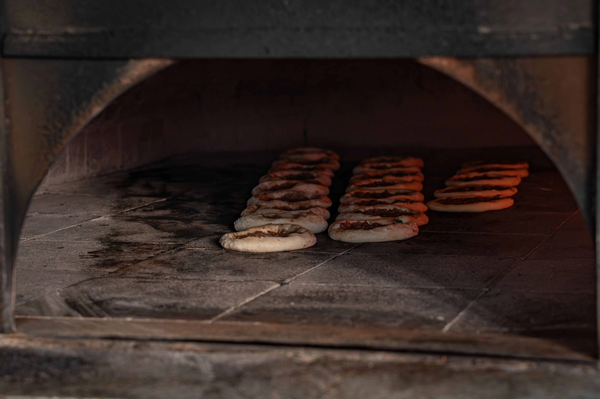

If there is one urban legend that refuses to die in the fast food industry, it is the myth of Arby's "liquid meat." For decades, rumors have circulated that Arby's roast beef arrives at the store as a gelatinous liquid paste in a bag, which is then squeezed out, formed into a solid mass, and cooked until it hardens.

As someone who has spent a decade overseeing fast food operations, I know from experience where this rumor came from and why it is completely false. 

The truth is much simpler, though the operational process is entirely unique in the Quick Service Restaurant (QSR) space. Arby's is one of the only major drive-thru chains that actually slow-roasts raw meat inside the restaurant every single day. 

## The Delivery and the Broth

To understand the liquid meat myth, you have to look at how the product arrives on the delivery truck. 

The roast beef comes in large cardboard boxes, kept refrigerated, never frozen. Inside those boxes are heavy-duty plastic roasting bags. Inside each bag is a solid, raw, whole cut of beef (usually a shoulder roast) weighing roughly 10 pounds. 

**The Source of the Myth:** The reason people think the meat is liquid is because the raw roast is suspended in a seasoned beef broth inside the sealed bag. When an employee carries the bag to the oven, the dark brown broth sloshes around, obscuring the solid chunk of meat inside. 

That broth is in practice a marinade and a basting liquid. It is primarily made of water, salt, and sodium phosphates. Its job is to keep the beef incredibly moist during the long cooking process. Without it, the meat would dry out and turn into shoe leather in the oven.

## The 3-Hour Roasting Protocol

Cooking a roast at Arby's is not a fast process. You can't just drop a patty on a clamshell grill for 45 seconds like you do at Wendy's. Managing the roast beef inventory is one of the hardest jobs for an Arby's shift manager, because if you run out of meat in the middle of the lunch rush, it takes over three hours to replace it.

Here is the exact cooking process:

1. **The Oven Loading:** Employees take the raw beef—still completely sealed inside the plastic roasting bag—and place it onto a wire rack. They slide the racks into a large convection oven. The bags are designed to withstand high heat without melting.
2. **The Slow Roast:** The oven is set to a low temperature, usually around 200°F (93°C). The meat cooks extremely slowly for roughly three to four hours. Cooking it slowly inside the sealed bag basically braises the beef in its own juices and the added broth, tenderizing the tough shoulder muscle.
3. **The Temperature Check:** This is the critical control point. When the timer goes off, the employee pulls the roast out and uses a calibrated digital thermometer to pierce the bag and temp the center of the meat. It must reach a safe internal temperature (usually 138°F or higher for medium-rare/medium, depending on specific corporate guidelines and local health codes).

If a store gets unexpectedly slammed with customers and burns through their roast beef supply faster than projected, they cannot speed up the ovens. The manager simply has to tell customers, "We are out of roast beef for the next two hours." It is an operational nightmare.

## The Resting and Slicing Phase

Once the beef reaches the correct internal temperature, the process still isn't over. You cannot slice the roast immediately. 

If you take a 10-pound piece of hot meat directly out of the oven and put it on a high-speed deli slicer, it will shred into messy, unappealing chunks, and all the juices will bleed out onto the cutting board. The meat has to rest.

The cooked roasts are moved to a specialized holding cabinet (a UHC or similar heated holding unit). They sit in this cabinet for at least 30 minutes. This resting phase allows the muscle fibers to relax and the juices to redistribute and reabsorb into the meat. 

**Slicer Calibration:** The deli slicers at Arby's are serious pieces of industrial equipment. They are constantly calibrated to slice the beef incredibly thin. Thin slicing is the final step in ensuring the meat is tender enough to bite through easily.

Only after the resting period is the plastic bag finally cut open. The excess broth is drained away, and the solid, cooked roast is placed onto the slicer. As orders come in, the employee runs the carriage back and forth, shaving the beef into paper-thin ribbons that pile up perfectly on the bun.

## The Bottom Line

Fast food operations rely on standardization, but they don't rely on magic chemistry to turn liquid into solid meat. The Arby's roasting process is actually closer to how a traditional deli or a home cook prepares a pot roast than it is to standard fast food burger flipping. 

The next time someone tries to tell you the liquid meat myth, you can assure them that the only liquid involved is the seasoned broth used to keep a massive, solid piece of beef from drying out in the oven.

## Troubleshooting the Roasting Process

When I managed new hires, one of the most common mistakes during the roasting process was failing to properly secure the oven door or prematurely probing the bag. If a trainee pierces the plastic bag before the minimum three-hour mark just to check the temperature, they create a vent. That vent allows the critical steam and broth to escape into the oven cavity. The result is a dried-out, ruined roast that the store has to throw away—a massive hit to the daily food cost.

Managing the hold times after the roast comes out is the most important step. If the roast sits in the holding cabinet for too long beyond its expiration window, the meat fibers break down completely, resulting in a mushy texture when sliced. The shift manager has to constantly balance the number of roasts in the oven against the anticipated customer volume to ensure fresh, perfectly rested meat is always ready for the slicer.
