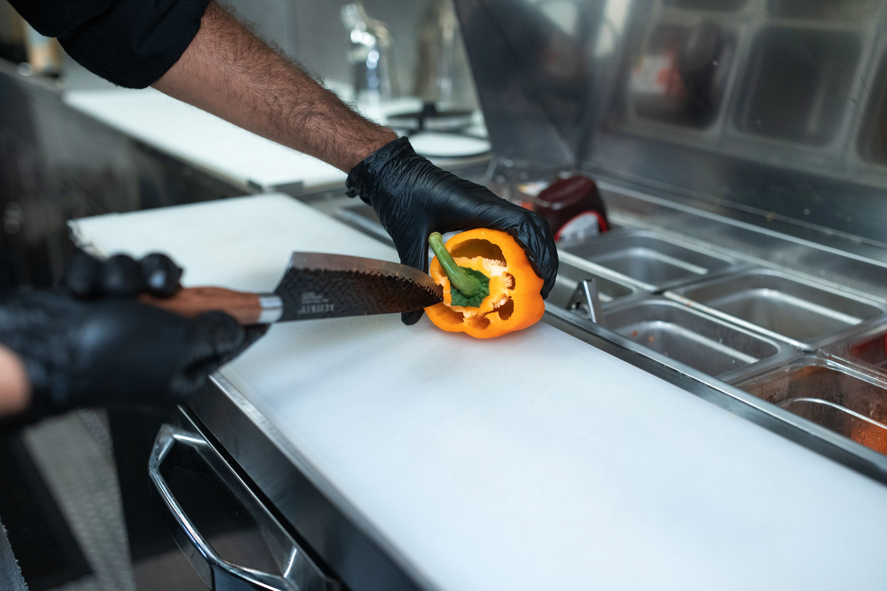

Nobody warns you about the hands. When you start working in food service, you expect the sore feet and the grease burns. You don't expect the skin on your knuckles to start cracking and bleeding every time you make a fist.

The reality of the line is that you wash your hands roughly 40 to 50 times per shift. Between that and plunging your hands into quaternary ammonium sanitizer (Quat) buckets to wipe down the line, your skin's moisture barrier is entirely stripped away. 

Standard drugstore lotion won't fix it. It just washes off the next time you hit the hand sink. You need barrier creams as part of your daily fast-food gear. Effective QSR management means protecting your team's most valuable tools: their hands.

## 1. O'Keeffe's Working Hands

This is the holy grail for mechanics, construction workers, and line cooks. It comes in a green puck, and it's not a lotion—it's a heavy-duty concentrated cream.

	

		
	

	

		<h4 class="product-card-title">O'Keeffe's Working Hands Hand Cream</h4>
		

			
It creates a protective layer on the skin's surface that instantly boosts moisture levels and helps prevent further moisture loss. Unscented and non-greasy.

		

		<a href="https://www.amazon.com/s?k=O%27Keeffe%27s+Working+Hands+Hand+Cream&tag=fastfoodguides-20" target="_blank" rel="noopener noreferrer nofollow" class="btn btn-amazon">
			<svg width="20" height="20" viewBox="0 0 24 24" fill="none" stroke="currentColor" stroke-width="2" stroke-linecap="round" stroke-linejoin="round" style="margin-right:0.5em;"><circle cx="9" cy="21" r="1"></circle><circle cx="20" cy="21" r="1"></circle><path d="M1 1h4l2.68 13.39a2 2 0 0 0 2 1.61h9.72a2 2 0 0 0 2-1.61L23 6H6"></path></svg>
			Check Price on Amazon
		</a>
	

	<strong>ProTip: Application Timing</strong>
	Don't apply it before your shift. The latex or nitrile prep gloves won't slide on over sticky hands. Apply it heavily the minute you clock out, and again right before bed.

## 2. Neutrogena Norwegian Formula

If the O'Keeffe's is too thick for you, this is the runner-up. It was originally developed for fishermen pulling nets in freezing saltwater, which is basically the equivalent of working the dish pit on a Friday night.

	

		<svg width="24" height="24" viewBox="0 0 24 24" fill="none" stroke="#FF9900" stroke-width="2" stroke-linecap="round" stroke-linejoin="round"><path d="M14.7 6.3a1 1 0 0 0 0 1.4l1.6 1.6a1 1 0 0 0 1.4 0l3.77-3.77a6 6 0 0 1-7.94 7.94l-6.91 6.91a2.12 2.12 0 0 1-3-3l6.91-6.91a6 6 0 0 1 7.94-7.94l-3.76 3.76z"></path></svg>
	

	

		<strong>Manager's Gear Pick: Neutrogena Norwegian Formula</strong>
		
Glycerin-rich, highly concentrated, and very little is needed per application. <a href="https://www.amazon.com/s?k=Neutrogena+Norwegian+Formula+Hand+Cream&tag=fastfoodguides-20" target="_blank" rel="noopener noreferrer nofollow">View on Amazon &rarr;</a>

	

	<strong>ProTip: Check the Sani-Bucket Dilution</strong>
	If everyone on the shift is getting a severe rash, your Quat sanitizer concentration is too high. Grab the test strips. It should be between 200 and 400 ppm. If the strip turns dark purple immediately, the dispenser needs recalibration.

## The Verdict

Take care of your hands. If the skin cracks, it becomes a food safety violation, and you'll be forced to wear a finger cot and a glove over it for a week, which makes running the register impossible.

## The Hidden Cost of Ignoring Contact Dermatitis

Let's talk about the reality of ignoring the damage happening to your skin. Many rookies assume that dry hands are just an occupational hazard—something you tough out. But when you are dealing with industrial-grade chemicals like heavy degreasers for the fryer vat or quaternary ammonium for the dining room tables, you are not just dealing with dry skin. You are dealing with occupational contact dermatitis.

When the moisture barrier of your skin is fully stripped, those chemicals begin to penetrate deeper layers of the epidermis. This leads to chronic inflammation, intense itching, and microscopic fissuring. Once your skin fissures, every single time you apply hand sanitizer or reach into a bucket of hot soapy water in the three-compartment sink, it will feel like you are dipping your hands into battery acid. 

I've watched tough, experienced line cooks completely lose their speed and efficiency during a Friday night dinner rush simply because their hands were too raw to rapidly assemble hot sandwiches or aggressively scrub a charbroiler. It affects your performance, it affects your mood, and it makes a tough job completely miserable.

### Preventative Maintenance for Your Skin

Think of your hands the same way you think about the preventative maintenance schedule for the ice cream machine. If you wait until the machine is completely locked up and throwing error codes to lubricate the O-rings, you've waited too long. 

The same applies here. You cannot wait until your knuckles are bleeding to start applying a barrier cream. The trick is consistency. The moment you clock out and wash your hands for the final time that day, apply a heavy coat of O'Keeffe's. Do not use the cheap, scented lotions from the drugstore—those are mostly water and alcohol, and the alcohol will just burn and further dry out the damaged tissue. You need something glycerin-based or wax-based to literally seal the skin and give your body an eight-hour window while you sleep to repair the moisture barrier. 

Also, pay attention to the glove situation. Constantly sweating inside latex or nitrile gloves creates a maceration effect—your skin gets soft and waterlogged, making it even more susceptible to chemical burns when you take the gloves off and wash your hands. Change your gloves frequently, dry your hands completely before putting a new pair on, and respect the chemicals you are working with. Your hands are your livelihood in this industry; protect them fiercely. Good QSR management requires ensuring every worker has the proper fast-food gear and skin protection to survive the shift.
