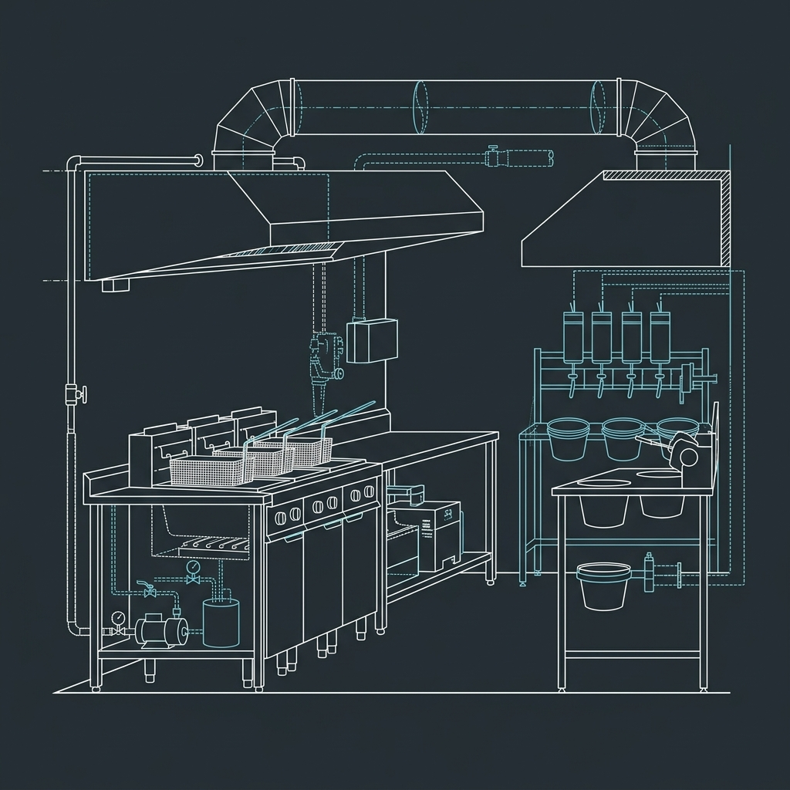

## The Chaos of the Fry Station

If you've never stood behind the line at a Buffalo Wild Wings on a Sunday afternoon during football season, you can't fully appreciate the controlled pandemonium that makes this chain work. Tickets are printing non-stop. Every single one demands a different combination of wing type, count, and sauce. One ticket wants 20 traditional Medium, the next wants 6 boneless Mango Habanero, and the one behind it is a party platter split across four sauces. The kitchen display screen is a wall of orange and red.

> **Russell's Note:** When your KDS screen is going red on a Friday night, the last thing you want is a broken line. You have to run a 120-second window or you're dead in the water.

> **Russell's Note:** Forget the fancy gadgets. Give me a sharp 8-inch chef's knife and a 32oz deli container labeled with blue painter's tape, and I can run any station.

The entire operation hinges on two positions: the fry cook and the sauce tosser. The fry cook is the engine. The tosser is the transmission. If either one falls behind, the whole restaurant feels it within minutes — ticket times balloon, servers start hovering, and managers start jumping on the line. There's no hiding. BWW kitchens are built around the fryer and the sauce station, and during peak hours, those two stations are the loudest, hottest, most demanding spots in any casual dining kitchen in the country.

## The Wing Cook Process and Fryer Setup

### The Equipment

BWW locations run Henny Penny or Pitco high-volume open fryers — these aren't the sealed [pressure fryers](/articles/kfc-pressure-fryers/) you'd find at a place like [KFC's pressure fryers](/articles/kfc-pressure-fryers/). They're open-well units designed for high throughput. A typical BWW kitchen has between 4 and 6 fryer wells, each holding multiple baskets. Oil temperature is maintained between 350°F and 360°F, and the fryer banks are the single biggest energy draw in the building.

### Traditional Bone-In Wings

Traditional wings arrive raw and fresh (never frozen at most locations). They're portioned and stored in walk-in coolers, then pulled to the fry station in bulk during prep. Bone-in traditional wings cook for 12 to 14 minutes at 350°F–360°F. That's a long cook time by fast food standards, and it's the main reason BWW ticket times can push past 15 minutes during a rush. There's no shortcut here. Wings are never par-cooked or held under heat lamps. Every order is cooked to completion from raw, which means the fry cook has to be constantly calculating — dropping baskets in a staggered sequence so that orders finish in the right order and nothing sits.

### Boneless Wings

Boneless wings are a different animal. They arrive frozen and pre-breaded from the supplier. Drop time is 6 to 7 minutes, roughly half the cook time of traditional. This makes boneless orders significantly easier on the fry cook's timing, but it also means they can't be dropped at the same time as a traditional order on the same ticket unless the cook intentionally staggers them. The goal is always to have everything for a single ticket land on the sauce station at the same time.

### Managing the Baskets

The fry cook is juggling multiple baskets across those 4 to 6 wells simultaneously. Each basket is tagged mentally (or sometimes with colored clips) to a specific ticket. During a heavy rush, a skilled fry cook might have 8 to 12 baskets in oil at once, all at different stages. Drop times are called out or tracked on a timer board. Pull a basket 60 seconds early and you're sending out undercooked wings. Pull it 60 seconds late and they're dry. There's very little margin.

## The Sauce Station Layout

The sauce station sits immediately adjacent to the fryer — usually within arm's reach. It's divided into two zones: cold sauces and heated sauces.

### Cold Sauces

Cold sauces are stored in refrigerated wells, kept at 40°F or below. These include ranch-based sauces like Parmesan Garlic, as well as creamy or dairy-adjacent options. The refrigeration keeps them food-safe and at the right viscosity. Cold sauces tend to coat a little thicker, which is why the pump calibrations account for that.

### Heated Sauces

Heated sauces sit in hot wells maintained at 140°F or above — the FDA minimum for hot holding. Sauces like Mango Habanero, Asian Zing, Blazin', and the classic Buffalo variations all live here. Keeping them hot serves two purposes: food safety compliance and better flow. A warm sauce disperses more evenly during the toss and clings to the wing surface without clumping.

### Pump Dispensers

Each sauce — whether hot or cold — feeds through a dedicated pump dispenser. These pumps are calibrated so that one pump delivers a consistent, measured volume of sauce. The toss recipes are built around pump counts per order size. For example, a 6-count order might get 2 pumps of sauce. A 10-count gets 3 pumps. A 20-count might get 5. These numbers vary slightly by sauce (thicker sauces may need an extra half-pump), but the system removes guesswork entirely. A new employee on their first day can pump the right amount of sauce if they follow the chart posted at the station.

## The Toss Bucket Technique

This is the signature move. The thing that makes BWW wings taste the way they do.

### The Buckets

BWW uses specialized large plastic tossing buckets — think oversized deli containers with snap-on lids. The interior walls are textured, not smooth. That texture is critical. When wings slam against those walls during the toss, the friction helps emulsify the sauce slightly and creates micro-abrasions on the wing surface that give the sauce something to grip. It's the difference between a wing with sauce sitting on top of it and a wing where the sauce is *bonded* to the skin.

### The Technique

The mechanics behind it: The tosser pumps the calibrated amount of sauce directly onto the wings. The lid snaps on. Then comes the shake — and it's not gentle. It's a violent, rhythmic, almost aggressive shaking motion. Up-down, side-to-side, with a slight rotation. The wings are colliding with each other, with the textured walls, and with the sauce from every angle. The whole process takes about 5 to 8 seconds per toss. That's it. Five to eight seconds and every wing in that bucket has a perfectly even, emulsified coating.

Compare this to [Wingstop's sauce process](/articles/wingstop-sauce-process/), where wings are tossed in metal bowls with a different technique. The BWW bucket method is specifically engineered for speed and consistency at high volume.

### Why It Works

The combination of textured walls, measured sauce, and aggressive agitation creates a mini-emulsification event inside the bucket. The residual fry oil on the wing's surface blends with the sauce during the toss, creating a coating that's richer and more adherent than if you just ladled sauce over a pile of wings. It's food science meets brute force.

## Dry Rub Application: A Different Beast

Dry rubs — Desert Heat, Lemon Pepper, Salt & Vinegar, [Chipotle](/articles/chain/chipotle) BBQ Dry Rub — are a completely different process than wet sauces, and they're less forgiving.

### Timing Is Everything

Wings destined for a dry rub must be tossed **immediately** out of the fryer. Not 30 seconds later. Not after you finish the wet sauce order in front of it. Immediately. Here's why: the residual oil on the wing's surface is what makes the dry rub adhere. That oil is hottest and most "active" in the first few seconds after pulling. If the wings sit for even a minute, the surface oil begins to cool and absorb back into the skin. At that point, the dry rub just slides off and collects at the bottom of the bucket — and you've got bland wings and wasted seasoning.

### The Technique

The process is reversed from wet sauces. The dry rub goes into the bucket first. Then the freshly fried wings go on top. Lid on. Toss. The rub coats the oily surface and sticks. If you put the wings in first and the rub on top, the rub tends to clump and distribute unevenly. Rub first, wings second — that's the rule.

## Handling Refire Orders

Refires are the bane of every BWW kitchen. A refire happens when wings come back — wrong sauce, undercooked, customer complaint, whatever the reason. They don't get thrown away and restarted from scratch (unless they're truly unsalvageable). Instead, the wings go back into the fryer for 2 to 3 minutes to re-crisp, then they're re-sauced in a **clean** bucket. Never re-toss in a dirty bucket with leftover sauce residue from the original order.

Refire wings jump the queue. They take priority over new orders because the customer is already waiting and unhappy. But they cost the kitchen dearly — you're burning 2 to 3 minutes of fryer time that should be going to the next ticket, you're using additional sauce, and you're pulling the tosser's attention away from the flow. During a heavy rush, two or three refires in a row can crater your ticket times for the next 20 minutes.

## Managing 20+ Sauces: Inventory, Prep, and Rotation

BWW's sauce menu is enormous — typically north of 20 options including seasonal and limited-time offerings. Managing that inventory is a daily operation.

### Daily Sauce Prep

Some sauces arrive as finished product from the supplier and go straight into the pump dispensers. Others are mixed in-house from a base sauce plus add-ins — a base Buffalo sauce might get a specific ratio of hot sauce concentrate and butter blend added to hit the target flavor profile. Sauce prep happens during the morning shift before the kitchen opens, and it's usually assigned to a dedicated prep cook.

### Stock Rotation and Date Labeling

Every sauce container gets a date label the moment it's opened or prepped. First-in, first-out (FIFO) is non-negotiable. Sauces that sit too long lose flavor, change viscosity, and can become a food safety issue. Cold sauces especially have a tight shelf life once opened.

### Pump Dispenser Maintenance

The pump dispensers get broken down and deep-cleaned on a weekly cycle. Sauce residue builds up in the pump mechanisms and can clog the lines, throw off calibration, or cross-contaminate flavors. During seasonal or LTO (limited-time offer) sauce rollouts, the station has to be reconfigured — new pumps installed, old sauces removed, labels updated, toss charts reprinted with new pump counts.

## Speed and Flow During Peak Service

Thursday through Sunday — especially during NFL, NBA, and March Madness — BWW kitchens operate at a fundamentally different tempo. Ticket volume can triple compared to a Tuesday lunch. The fry station might have every single well loaded with baskets. The tosser is working non-stop, sometimes with a second person jumping in to help during the worst surges.

Communication between the fry cook and the tosser becomes the most important thing in the kitchen. The fry cook calls out what's dropping and what's coming up. The tosser stages buckets, pre-pumps sauces for the next batch, and plates finished orders onto trays in the correct sequence. A well-drilled fry-and-toss team can push out 30 to 40 orders per hour during peak. A poorly coordinated team? Half that, and the whole restaurant suffers.

Managers on duty during game nights are almost always stationed near the fry area, expediting orders, managing refire situations, and making sure the sauce station stays stocked. Running out of a sauce during a Saturday night rush is a nightmare scenario that requires a mid-service prep interruption — something every kitchen tries to avoid at all costs.

## Are Buffalo Wild Wings Fried or Baked?

Yes, BWW traditional and boneless wings are deep-fried, not baked. Traditional bone-in wings are fried from raw in open fryers at 350°F–360°F for 12 to 14 minutes. Boneless wings are fried from frozen for 6 to 7 minutes. There is no baking, grilling, or air-frying involved in the standard wing preparation. The only exception is certain menu items like grilled chicken wraps or salads, which use different cooking methods — but the wings themselves are always fried.

## Does BWW Make Their Sauces In-House?

It's a mix. Some BWW sauces arrive as finished products from centralized suppliers and are loaded directly into pump dispensers. Others are mixed in-house during daily prep from a base sauce plus specific add-ins to achieve the target flavor. The exact breakdown varies by sauce and can change over time as BWW adjusts their supply chain. Either way, every sauce is portioned, date-labeled, and stored according to strict food safety protocols — cold sauces refrigerated below 40°F, hot sauces held at 140°F or above.

## How Long Does It Take to Cook Wings at BWW?

Traditional bone-in wings take 12 to 14 minutes from raw at 350°F–360°F. Boneless wings (frozen, pre-breaded) take 6 to 7 minutes. Add another 30 seconds to a minute for the tossing and plating process. During a busy rush, total ticket time from order placement to tray-up can push past 15 to 20 minutes due to queue depth at the fryer, but the actual cook time per basket doesn't change. BWW does not par-cook or hold wings under heat lamps — every order is cooked fresh to completion.
