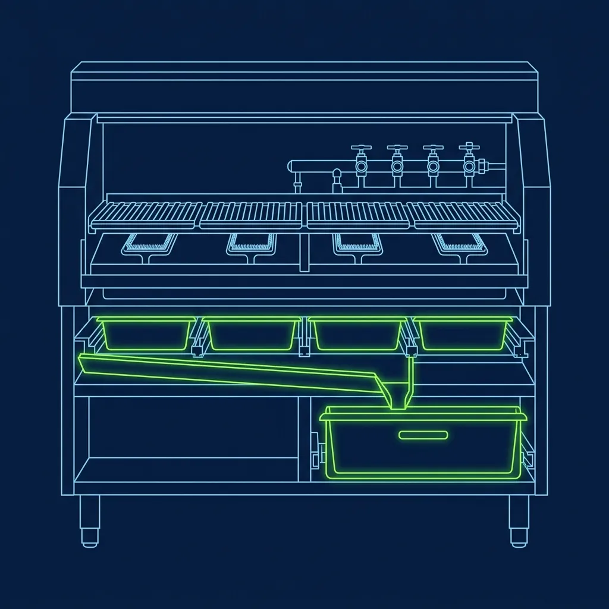
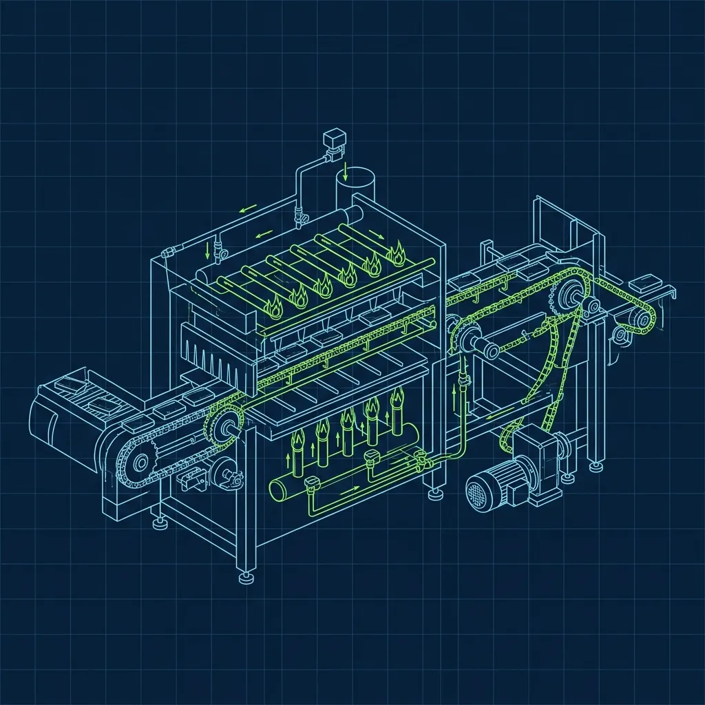

Every fast food restaurant has a closing task that nobody wants. At [Wendy's](/articles/chain/wendys), it is the Frosty machine. At [Domino's](/articles/chain/dominos), it is the dough trays. At Burger King, it is the broiler. And honestly, the broiler might be the worst of all of them, because you are not just cleaning grease off a flat surface—you are chiseling carbonized fat out of a machine that was shooting 600-degree flames at raw beef for the last 16 hours. I have closed hundreds of kitchens across multiple chains, and the BK broiler breakdown is the one task that made me seriously reconsider my career choices at 11:30 PM on a Saturday night. 

## The Cooldown Phase: Your 30-Minute Head Start

You cannot clean a 600-degree machine. That should be obvious, but I have watched impatient closers try to speed things up by splashing cold water on the broiler interior. Do not do this. Cold water on superheated metal causes instant warping of the expensive grates, and worse, it can create a dangerous steam explosion that sends scalding water vapor directly into your face. 

The moment the manager confirms no more broiler orders are coming in, shut the gas off. Every minute you shave off the cooldown phase is a minute closer to clocking out. The machine needs at least 20 to 30 minutes to cool to a point where you can safely touch the internal components. 

Here's the thing nobody tells you during training: the cooldown window is your most valuable time of the entire close. Smart closers do not stand around watching the broiler cool. They use those 30 minutes to demolish every other task on the closing checklist—wiping down the sandwich board, draining the fryers, sweeping the floors, restocking the walk-in. The goal is to have the broiler be the absolute last item on your list, so when you finish reassembly, you can clock out immediately. Standing around waiting while the broiler cools and everything else still needs doing is how you end up leaving two hours past the end of your shift.

## The Breakdown and Scrub: Where the Real Work Begins

Once the broiler is cool enough to handle—still quite warm, but no longer capable of giving you a third-degree burn on contact—the physical labor begins.

**Step 1: The Catch Pans.** Beneath the flames sit massive metal trays that have been catching raw beef grease all day long. You pull these trays out slowly and carefully. They are incredibly heavy and filled with sloshing, semi-solid fat that has the consistency of warm candle wax. One wrong tilt and you are wearing it. Pro tip from someone who learned the hard way: double-bag your trash bags before dumping the grease. A single bag will almost always leak or tear under the weight of hot fat, and cleaning a grease spill off the back-of-house floor adds 20 minutes to your close that you absolutely cannot afford.

**Step 2: The Conveyor Belts.** You manually detach the heavy metal chain-link belts that pull the burgers through the fire chamber. These belts are caked in carbonized grease and beef residue. They are also awkward to handle—heavy, floppy, and coated in a substance that feels like a combination of axle grease and charcoal.

**Step 3: The Soak.** All removable parts—trays, guards, belts—get hauled to the three-compartment sink and submerged in a highly potent industrial degreaser solution. These parts need to soak for at least 15 minutes. Do not rush this step. The degreaser needs time to break down the baked-on carbon, and pulling parts out too early just means you will be scrubbing twice as hard.

**Step 4: The Interior Scrub.** This is where most of the time and effort goes. Using a specialized wire brush and a putty knife, you have to physically scrape the carbonized black buildup off the interior walls of the broiler. This is not regular grease. This is baked-on char that has been exposed to open flames for 16 or more hours. It does not wipe off. It does not scrub off easily. You chisel it with the putty knife, follow up with the wire brush, then wipe it down with a degreaser-soaked towel. I routinely went through four or five towels on the interior alone. Your arms will be black up to the elbows by the time you are done, and that carbon gets under your fingernails and stays there for days.

**Step 5: Scrubbing the Soaked Parts.** After the removable components have soaked, pull each piece out, scrub it with a heavy-duty Scotch-Brite pad, rinse it under scalding hot water, and lay the parts out on a sanitized drying rack. The chain-link conveyor belts are the absolute worst because grease gets trapped in every single individual link, and you have to work through each section by hand. There is no shortcut. Fold the belt into manageable sections and work through it link by link. It feels slower, but you actually get each section cleaner in less total time than trying to wrestle the entire belt at once.

## The Reassembly: Getting It Right the First Time

Once every component is scrubbed and dried, you reassemble the entire broiler. The catch pans slide back in, the belts are reattached and properly tensioned, and all the guards and covers are secured.

Here is where precision matters: if you reassemble incorrectly—if a belt is too loose, a pan is not seated properly, or a guard is misaligned—the morning crew will discover the problem within minutes of firing up the machine. And you will hear about it. I once had a closer who seated the conveyor belt with too little tension. When the morning manager fired up the broiler, the belt slipped off the rollers and jammed. It took 45 minutes to fix, the store opened late, and the closer got a written coaching the next day. Do it right the first time. Check your work before you leave.

## The Secret Veteran Closers Know

The best broiler closers I have ever worked with did not wait until 11 PM to start battling the grease. They practiced preventative maintenance throughout their entire shift. During slow periods, they would empty the bottom catch pans, use a wire brush to knock loose carbon off the belt, and wipe down the exterior housing. The difference between closing a broiler that was maintained all day versus one that was neglected is the difference between a 45-minute breakdown and a 90-minute nightmare.

If you walk into a closing shift and the day crew did not touch the broiler once, you are in for a long, greasy night. But here is the silver lining that veteran closers rarely admit: nobody bothers you while you are scrubbing the broiler. There are no customers, no drive-thru beeps, no managers barking orders. It is just you, the machine, and a wire brush. For some closers, that solitude is the best part of the entire shift.

## Frequently Asked Questions

### How long does the full broiler cleaning process take?

From the moment the gas is shut off to the moment the machine is fully reassembled and ready for the morning crew, the entire process typically takes between 45 minutes and 1.5 hours. The biggest variable is how well the day crew maintained the broiler throughout their shift. A neglected broiler with heavy carbon buildup can easily add 30 extra minutes of scrubbing. On a good night with a well-maintained machine, an experienced closer can have the entire thing done in under an hour.

### Do you need special protective equipment?

Yes. You should always wear heat-resistant gloves when handling components that are still warm, and chemical-resistant gloves when working with the industrial degreaser solution—that stuff will dry out and crack your skin in a hurry. Many stores also require long sleeves or arm guards to prevent burns from residual heat. Non-slip shoes are absolutely essential because the floor around the broiler area becomes a skating rink of grease during the breakdown. I have watched people slip and nearly fall into the open broiler cavity. Wear the shoes.

### What happens if the broiler is not cleaned properly?

Excessive grease and carbon buildup is a serious fire hazard. If the accumulated fat is not removed, it can ignite during the next day's operation, causing an uncontrolled grease fire inside the machine. Beyond the fire risk, a dirty broiler affects food taste, produces excessive smoke that overwhelms the exhaust hood, and will result in a failed health inspection. Health inspectors specifically check the broiler interior, catch pans, and exhaust filters, and a visibly dirty broiler is one of the fastest ways to get a critical violation.

---

*Want to understand how the broiler works before you have to clean it? Start with our guide on [how the Burger King broiler operates and whether it is dangerous](/articles/burger-king-broiler). For a look at closing duties at other chains, check out [the complete Wendy's closing duties checklist](/articles/wendys-closing-duties). And to understand the role that controls the kitchen before closing time, read about [the Burger King Expeditor role during a rush](/articles/burger-king-expeditor-role).*
