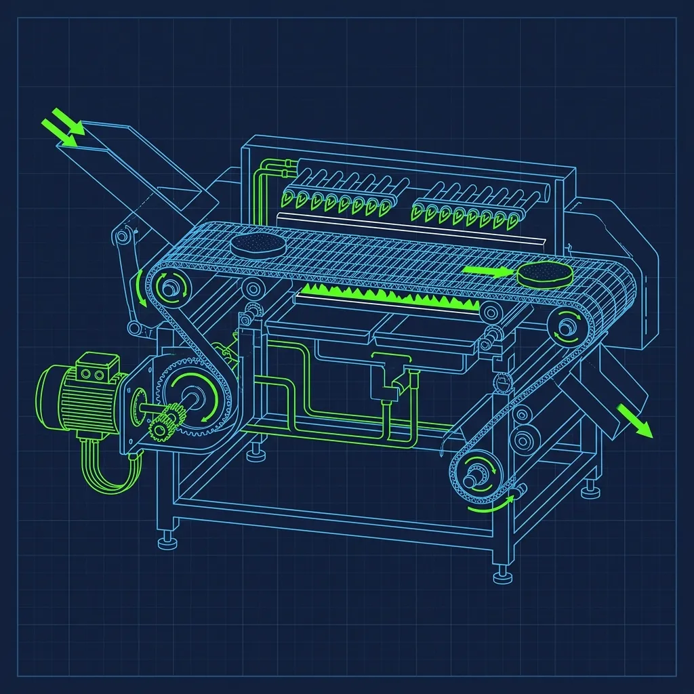
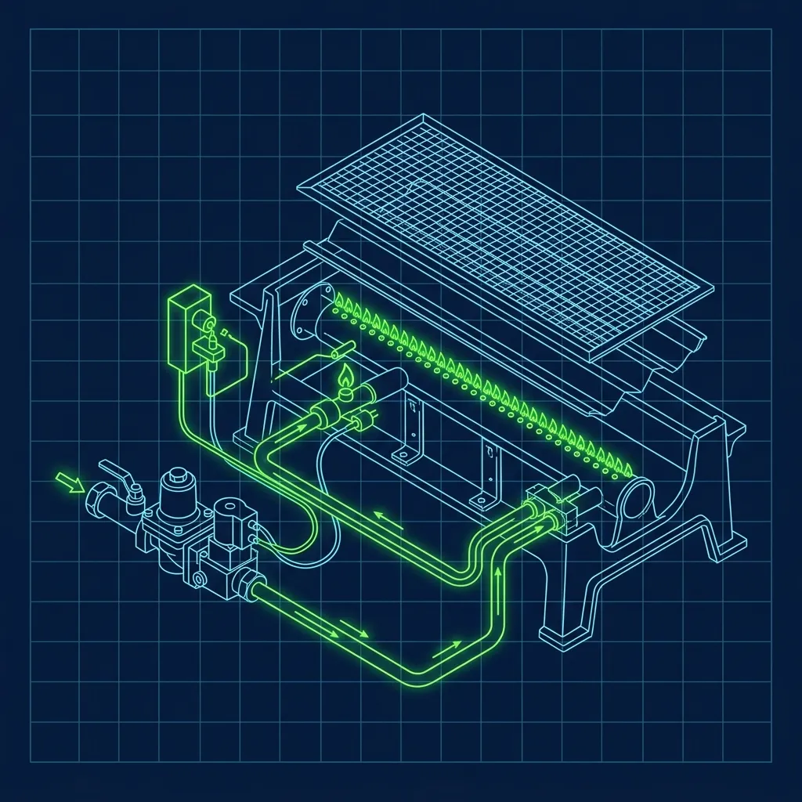

Burger King's entire brand identity is built around four words: "Flame-Grilled Whopper." Unlike [McDonald's](/articles/chain/mcdonalds) or [Wendy's](/articles/chain/wendys), which cook their burgers on flat metal surfaces, Burger King uses a massive piece of machinery that shoots actual fire at frozen beef. The first time I stood in front of one, I could feel the heat radiating through my apron from three feet away. It is the most intimidating piece of equipment in any QSR kitchen I have ever worked in, and learning to respect it is the single most important thing a new broiler cook can do. 

## How the Flame Broiler Actually Works

> **Russell's Note:** Time to lean, time to clean. It's an annoying cliché, but when the health inspector (the ultimate clipboard warrior) shows up unannounced, you'll be glad you wiped down the low-boys.

> **Russell's Note:** Any BOH veteran will tell you: the walk-in cooler is the only soundproof place to take a 30-second mental break when the KDS screen is totally full.

The Burger King broiler is essentially a continuous conveyor belt oven that runs directly over open gas flames. Imagine a horizontal tunnel about five feet long, with gas burners on the top and bottom, and a moving metal chain-link belt running through the middle. That is the broiler. 

**The Feed:** You stand at the front of the machine and pull frozen beef patties out of a small freezer drawer located directly beneath the broiler. The patties come in different sizes—regular for a Hamburger, larger for a Whopper—and they go on the belt frozen solid, straight from the box. 

**The Drop:** You place the frozen patties directly onto the moving chain-link conveyor belt. During a lunch rush, you might be dropping patties every 15 to 20 seconds. The belt never stops, so if you fall behind on the feed, you create a gap in production that leaves the sandwich makers building with nothing. Maintaining a steady, rhythmic pace is the single most important skill a broiler cook can develop. I've seen new hires panic when the orders stack up, start fumbling with the patty boxes, and suddenly there is a 90-second gap on the belt. That is an eternity during a rush.

**The Fire:** The belt pulls the meat through the interior of the machine where gas burners shoot open flames directly onto the meat from above and below simultaneously. The internal temperature exceeds 600°F. This cooks the burger all the way through in approximately 2 to 3 minutes and gives it those signature grill marks. Those char lines are not cosmetic—they are actual burn marks from direct flame contact, and they are a major part of why Burger King burgers taste distinctly different from anything cooked on a flat griddle.

**The Catch:** The cooked patties slide out the back of the machine and drop into holding pans. From there, they are immediately placed into specialized heated holding cabinets—called Universal Holding Cabinets, or UHCs—where they stay hot and moist until they are needed for a sandwich build. Every patty in the cabinet has a maximum hold time, usually around 15 to 20 minutes. After that, it gets tossed. This is where food cost management meets the broiler: feed too many patties and they expire in the cabinet. Feed too few and the sandwich board runs dry.

## Is It Dangerous?

I am going to be completely blunt: yes, it can be dangerous if you do not respect the machine.

**Burn Hazards:** The most common injury is a minor burn on the forearm from accidentally brushing against the hot metal guard or housing when dropping patties onto the belt. These are not serious burns—more like quick contact burns that leave a red mark for a few days—but they happen to virtually every new broiler cook within the first week. You learn to keep your arms precisely positioned very quickly after the first one.

**Grease Flare-Ups:** Because you are cooking frozen beef over open flames, grease constantly drips down into the catch pans below. Periodically, a "flare-up" occurs—accumulated grease ignites and flames shoot higher than normal, sometimes licking out past the feed opening. The machine is engineered to handle this, and the exhaust hood pulls the excess heat and smoke up and out. But the first time it happens to a new hire, they usually jump back about three feet. I always warned new cooks on day one: "The broiler is going to burp fire at you. It is normal. Do not drop the patties on the floor."

**Smoke and Air Quality:** On particularly heavy days, the volume of grease and fat burning inside the machine produces thick, heavy smoke. The broiler is equipped with a powerful exhaust hood, but if the hood filters are dirty or clogged—and they get dirty fast—the smoke spills out into the kitchen. Your eyes water, your throat burns, and the entire back of house smells like a tire fire. This is exactly why keeping the hood filters clean is a critical maintenance task, not just a closing chore.

## How to Work the Broiler Safely

Burger King has rigorous safety protocols, and they exist for very good reasons.

- **Use the Tongs:** Never use your bare hands to adjust a patty that is already on the belt near the flames. Always use the long metal tongs. I have seen cooks reach in with their fingers to reposition a patty that was crooked, and every single time, they regretted it immediately.
- **Stay Hydrated:** Standing in front of a 600-degree machine for an 8-hour shift will dehydrate you faster than you think. Keep a water bottle close and drink constantly. I used to go through a full gallon of water on a summer broiler shift, and I still felt dried out by the end.
- **Wear the Right Gear:** Closed-toe, non-slip shoes are mandatory. Keep your sleeves rolled down, not up—your forearms need the protection. Many veteran broiler cooks keep a damp towel draped over one shoulder, not for cleaning, but to cool down their neck and face during intense rushes. It looks ridiculous. It works.
- **Keep It Clean Throughout the Day:** The number one cause of dangerous flare-ups is accumulated grease. Good cooks empty the bottom catch pans periodically during their shift and use a wire brush to knock carbon off the belt during slow periods. If you wait until closing to deal with all the grease, you are asking for trouble.

## When the Broiler Goes Down

Despite its rugged construction, the broiler is a mechanical system that breaks. The most common failure is a faulty igniter—the component that lights the gas burners. When the igniter dies, the gas flows but does not light, and the machine shuts itself down as a safety measure.

A broken broiler during a Friday night rush is one of the most stressful scenarios in the entire restaurant. The manager has to decide: do we microwave pre-cooked patties (which taste noticeably worse and customers can tell), or do we temporarily stop taking burger orders entirely? Either way, it is a bad night. I have personally been in a store where the broiler went down at 6:15 PM on a Friday, and we did not get a technician until Saturday morning. We microwaved everything for the rest of the night. The complaints were relentless.

Working the broiler is intense, exhausting, and physically demanding. But many cooks actually prefer it over dealing with the complex sandwich builds on the board. You drop the meat, you watch the fire, you pull the pans. It is straightforward, rhythmic work—and once you find your groove, there is something almost meditative about feeding patties into a wall of flame for eight hours straight.

## Frequently Asked Questions

### Do the burgers really taste different because of the broiler?

Absolutely. The open-flame cooking method produces a distinctly smoky, charred flavor that a flat griddle simply cannot replicate. The grill marks are not just cosmetic—they are actual char lines from direct flame contact, and they contribute real flavor compounds through the Maillard reaction and caramelization. This is the entire reason Burger King invested in this complex, expensive machinery instead of using simple flat-tops like their competitors.

### How often does the broiler need professional maintenance?

Most stores have a scheduled maintenance visit from a certified technician at least once every few months. The tech inspects gas lines, cleans burner assemblies, checks conveyor belt tension, and replaces worn components. Between professional visits, the daily cleaning performed by the closing crew is what keeps the machine running smoothly. A well-maintained broiler can run for years. A neglected one will break down at the worst possible moment.

### Is the broiler always running during business hours?

In most stores, yes. The broiler is fired up first thing in the morning during the opening shift and runs continuously until the last burger order of the night. It takes about 15 to 20 minutes to reach full operating temperature, so shutting it off during a slow mid-afternoon period and restarting it later is generally not practical. The gas cost of running it continuously is baked into the operating budget.

---

*If you want to know what happens after the broiler shuts off, read our guide on [how hard it is to clean the Burger King broiler at closing](/articles/burger-king-broiler-closing). For a look at the role that controls the entire kitchen during a rush, check out [the Burger King Expeditor role explained](/articles/burger-king-expeditor-role). And if you are curious how another chain handles their signature cooking method, see our breakdown of the [Wendy's clamshell grill](/articles/wendys-clamshell-grill).*
