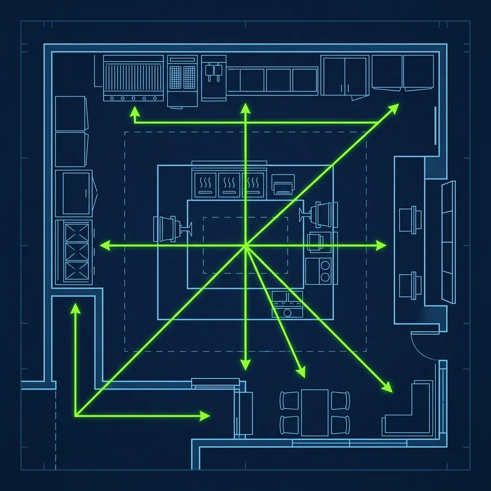
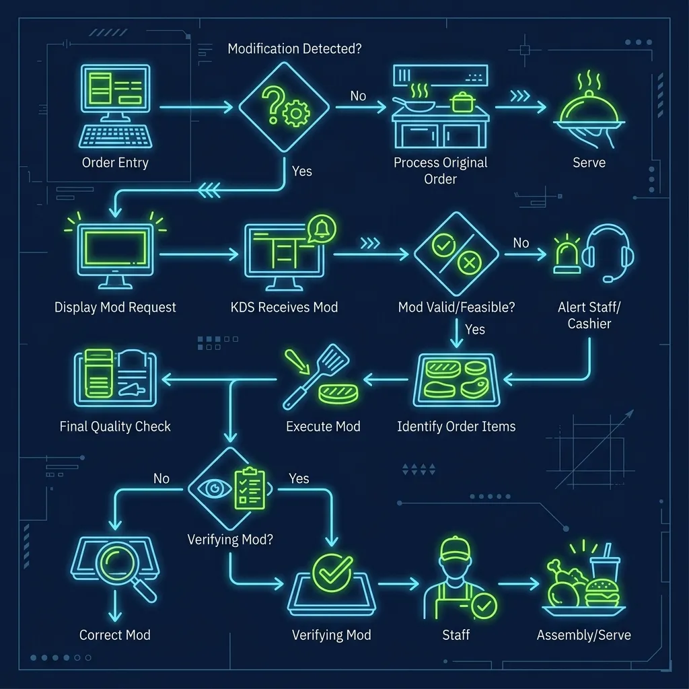

During a Friday night dinner rush at Burger King, the kitchen sounds like a factory floor—the broiler is roaring, fryers are screaming, and the drive-thru screen is filling up with customized Whopper orders faster than anyone can read them. In the middle of all of this chaos, one person is standing perfectly still, eyes locked on a monitor, hands moving at a pace that looks almost choreographed. That person is the Expeditor, and they are the only thing standing between a smooth rush and a complete operational meltdown. I have worked Expo during some of the busiest dinner rushes in my career, and Having lived through it, it is simultaneously the most stressful and most satisfying role in the entire building. 

## The Bridge Between Kitchen and Customer

> **Russell's Note:** People always ask why this tastes different at home. Simple. We aren't afraid of butter, salt, and keeping the clamshell grill screaming hot.

> **Russell's Note:** Any BOH veteran will tell you: the walk-in cooler is the only soundproof place to take a 30-second mental break when the KDS screen is totally full.

The Expeditor does not take orders. They do not cook food. They do not touch a register. They stand at the exact center of the operation—right at the end of the sandwich chute, between the heated holding area and the bagging station—and they act as air traffic control for the entire restaurant. 

Their sole job is to guarantee two things: **accuracy** and **speed**.

The physical positioning of the Expo is deliberate and strategic. From their station, they can see the drive-thru order monitor, the front counter screen, the sandwich board, and the fry station simultaneously without turning their body. If they have to take more than two steps or turn around to check something, the station layout is wrong and needs to be reconfigured. I have personally rearranged bagging stations at stores where the Expo position was poorly designed, and the improvement in throughput was immediate. 

During a peak rush, the Expo might verify and bag 60 to 80 orders per hour. Every single one has to be correct. That is roughly one order every 45 seconds to a minute, for two to three hours straight, with zero margin for error. One mistake cascades into a remake, which backs up every order behind it, which spikes drive-thru times, which makes the district manager's dashboard light up red.

## The Core Duties of the Expo

**Bagging the Orders:** As sandwich makers finish burgers and slide them down the heated chute, the Expo grabs them, matches them to the order on the screen, adds fries and drinks, verifies any modifications, and places everything into the bag. This sounds simple until you are doing it with eight bags in progress simultaneously and a drive-thru timer counting down in the corner of the screen.

**Quality Control:** The Expo is the last line of defense before food reaches the customer's hands. If a cook wraps a burger sloppily—bun crooked, wrapper half-open, toppings spilling out the side—the Expo rejects it and tells the kitchen to remake it. If the fries look pale and limp, they go back. The Expo has to be ruthless about quality, because every sloppy sandwich that makes it past them becomes a customer complaint and a remake that costs twice the time.

**Calling the Production:** The Expo reads the flow of the entire store. They are not just reacting to orders—they are anticipating them. If they see a bus pull into the parking lot, the Expo does not wait for 20 orders to hit the screen. They yell back to the cooks: "I need 12 Whopper patties down and two baskets of fries dropped, right now!" If they see the holding cabinet getting low on regular patties, they call for more before the cabinet goes empty. Good Expos are always two to three minutes ahead of the current moment.

**Distributing the Finished Orders:** Once a bag is sealed and verified, the Expo hands it off to either the drive-thru window cashier or the front counter cashier, effectively clearing that order from the screen. The handoff has to be clean and fast—no setting bags down in a pile for someone else to sort through later. Each bag goes directly to the person who is handing it to the customer.

## The Modification Nightmare

Here's the thing nobody warns you about before your first Expo shift: the hardest part is not the speed. It is the modifications.

A standard Whopper has lettuce, tomato, onion, pickle, ketchup, and mayo. That is the baseline. But customers constantly customize their orders, and every single modification has to be verified before the food leaves the counter.

A typical modified order might read: "Whopper No Onion, No Pickle, Add Mustard, Light Lettuce, Extra Mayo." The Expo has to open the wrapper, visually inspect the sandwich, confirm every modification matches the screen, re-wrap it, and bag it—all in about 10 seconds. If you accidentally hand out a "No Mayo" Whopper that is dripping with mayo, that customer is coming back to the counter, and now you have a remake that slows down every order behind it.

I watched Expos get burned by stacked modifications—an order with five customized Whoppers, each one different, all for the same car in the drive-thru. You have to check each one individually, match them to the correct line item on the screen, and bag them in order. Miss one modification and the entire order comes back.

## Why the Manager Always Works Expo

In almost every fast food restaurant I have worked in, the strongest manager on duty takes the Expo station during peak hours. There are two reasons for this.

First, the Expo controls the speed of the entire store. If the Expo is slow, drive-thru times plummet and the front counter backs up. The Expo position is also the perfect physical vantage point to oversee both the cashiers handling money and the cooks handling food, allowing the manager to run the entire shift from a single spot without ever leaving the line.

Second, there is an authority component that cannot be ignored. The Expo needs the ability to reject food and demand remakes without hesitation or social discomfort. A regular crew member might feel awkward telling a coworker their sandwich looks terrible. A manager does not have that problem. They will send a poorly wrapped Whopper straight back to the board without a second thought, because they know that sending out bad food costs the store far more than the 30 seconds it takes to remake it. I have rejected dozens of sandwiches during a single rush. Every single remake stings in the moment, but every one prevents a complaint that would cost ten times more to resolve.

## Training to Become an Expo

Most Burger King locations train potential Expo workers through a staged process. First, you shadow an experienced manager during a real rush—not a slow Tuesday afternoon, but an actual Friday dinner. You watch how they read the screen, how they call production, how fast their hands move. Then you are given the station during a controlled slow period to practice the flow without the pressure. Finally, you run Expo during a moderate rush with the manager standing right behind you, ready to step in if you start drowning.

The key skills to develop are memorizing the menu modifications by sight, building a physical rhythm for bagging that becomes automatic, and learning to read the order screen fast enough to anticipate what is coming before it arrives. The best Expos I have ever worked with could glance at the screen and tell you what the kitchen would need in four minutes without even thinking about it.

## Frequently Asked Questions

### Can a regular crew member work the Expo station?

Technically, yes. In some stores, experienced crew members who have demonstrated strong accuracy and speed are allowed to work Expo during slower rushes or mid-afternoon lulls. However, during a peak dinner or lunch rush, the manager almost always takes the position because it requires the authority to direct the entire team and make immediate judgment calls about food quality. If a crew member is consistently excelling at Expo, it is usually a strong signal that they are being groomed for a management promotion.

### What happens if the Expo falls behind during a rush?

When the Expo falls behind, the entire operation starts to collapse. Bags stack up on the counter, drive-thru times spike past the corporate target, front counter cashiers start fielding complaints from customers who have been waiting, and the kitchen loses its production cues because the Expo is not calling ahead. In a worst-case scenario, the manager might have to temporarily pause taking new orders to let the kitchen catch up—which means lost revenue and a parking lot full of frustrated customers watching the drive-thru line stop moving.

### How is the Expo role different from similar positions at other chains?

The core concept is the same across most QSR chains—someone stands between the kitchen and the customer to verify accuracy and control flow. At [Taco Bell](/articles/chain/taco-bell), this role is called the [Linebacker](/articles/taco-bell-linebacker-role), and it functions similarly. The key difference at Burger King is the broiler complexity: because the broiler runs on a continuous conveyor, the Expo has to coordinate with a cooking system that has a fixed cycle time. You cannot speed up the broiler. The patties take exactly as long as they take. So the Expo has to think further ahead than they would at a chain with instant-cook equipment.

---

*For a deep dive into the machine the Expo is coordinating with, read our guide on [how the Burger King broiler works](/articles/burger-king-broiler). To understand what happens after the Expo's shift ends, check out [how hard it is to clean the broiler at closing](/articles/burger-king-broiler-closing). And for a similar role at another chain, see our breakdown of the [Taco Bell Linebacker position](/articles/taco-bell-linebacker-role).*
