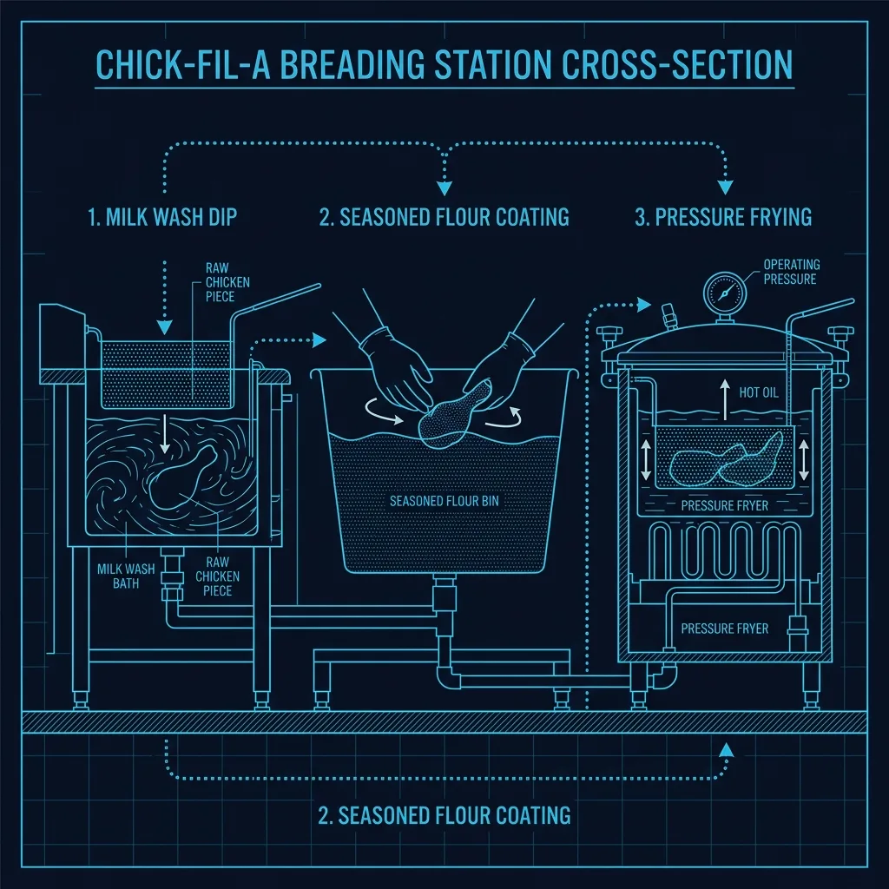
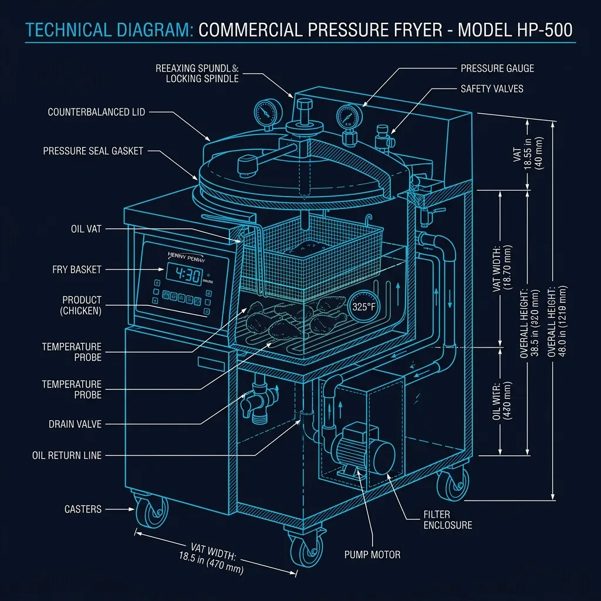

## The Chicken Arrives Raw. Every Single Piece.

This is the first thing that surprises most people about Chick-fil-A. Unlike the majority of fast food chains that receive their chicken pre-breaded, pre-cooked, or flash-frozen from a factory, **Chick-fil-A receives raw, unfrozen chicken breast filets** at every single location. *(Related guide: [How Chick-fil-A Makes Their Lemonade — The Hand-Squeezed Morning Process](/articles/chick-fil-a-lemonade/))*

Every piece of chicken you eat there was hand-breaded in that specific restaurant, by an actual human being, earlier that day or within the last few hours. This is not marketing language. This is the operational reality, and it has massive implications for how their kitchen functions. *(Related guide: [How the Chick-fil-A iPOS Drive-Thru System Works](/articles/chick-fil-a-ipos-system/))*

The reason most fast food chicken tastes roughly the same everywhere — and the reason Chick-fil-A tastes noticeably different — comes down to this single operational decision. Hand-breading in-house is significantly more labor-intensive, more expensive, and more prone to human error. But it produces a texture and flavor profile that factory-processed chicken simply cannot replicate. *(Related guide: [Why Does Chick-fil-A Have Employees Standing Outside With Tablets?](/articles/chick-fil-a-drive-thru-tablets/))*

## The Milk Wash: Step One

The breading process starts with a **milk wash bath**. This is not buttermilk (a common myth), and it's not a simple egg wash like you'd use at home. It's a proprietary milk-and-egg blend that serves two critical functions:

1. **Moisture adhesion** — The wash gives the flour something to grab onto. Without it, the breading falls off in the fryer.
2. **Flavor layering** — The milk proteins undergo a Maillard reaction during frying, contributing to the golden color and slightly sweet undertone that distinguishes Chick-fil-A's chicken from competitors.

The chicken filets are submerged fully in the wash and allowed to sit. The timing matters. Too short and the coating won't adhere uniformly. Too long and the chicken absorbs too much liquid, which causes oil splatter in the fryer and produces a soggy result.

## The Seasoned Flour: Step Two

After the milk wash, each filet is transferred into the **seasoned flour bin**. This is where most of the signature Chick-fil-A flavor actually comes from.

The flour blend is not mixed in-store. It arrives as a **pre-mixed proprietary powder** in sealed bags. Team members don't know the exact spice ratios — and frankly, they don't need to. The consistency comes from the factory formulation, not from the person doing the breading.

### The Pressing Technique

This is where training becomes critical. The filet can't just be dropped into the flour and pulled out. The correct technique involves:

- **Pressing the filet firmly** into the flour with both hands
- **Flipping and pressing again** to ensure full coverage on both sides
- **Shaking off excess** — too much flour creates a thick, cakey coating that doesn't cook evenly

New hires consistently make two mistakes here: they either don't press hard enough (resulting in thin, patchy breading that shows bare chicken underneath) or they don't shake off the excess (resulting in raw flour pockets that taste pasty after frying).

The difference between a perfectly breaded filet and a mediocre one is entirely in the hands of the person at this station. There is no machine that does this.

## The Pressure Fryer: Step Three

This is the piece of equipment that truly separates Chick-fil-A from every other chicken chain. They use **Henny Penny pressure fryers** — the same fundamental technology that Colonel Sanders originally used at KFC before KFC largely moved away from them for speed reasons.

### How Pressure Frying Works

A pressure fryer is not just a deep fryer with a lid. When the lid seals, it traps steam released by the chicken itself. This creates a pressurized environment (typically around 12-14 PSI) that does two things simultaneously:

1. **Cooks faster** — The elevated pressure raises the effective cooking temperature of the moisture inside the chicken, reducing cook time to about **4 minutes and 30 seconds** for a standard filet.
2. **Locks in moisture** — The pressure prevents moisture from escaping the chicken as rapidly as it would in an open fryer. This is why Chick-fil-A's chicken is noticeably juicier than chicken fried in a standard open vat.

### The Temperature and Timing

The oil is maintained at **325°F** — notably lower than most fast food fryers, which typically run at 350-375°F. The lower temperature, combined with the pressure environment, produces a gentler cook that doesn't dry out the meat.

The 4:30 cook time is not a suggestion. It's programmed into the fryer. When the timer goes off, the pressure is automatically released, the lid unlocks, and the basket is lifted. Overcooking by even 30-60 seconds produces a noticeably drier product.

## Why This Matters for Speed — and Why Chick-fil-A Is Often Slower

The hand-breading process is the single biggest bottleneck in Chick-fil-A's kitchen. Here's the math:

- A typical busy location might need **200-300 filets** during a lunch rush (11 AM - 2 PM)
- Each filet must be individually hand-breaded (milk wash → flour → press → shake)
- A skilled breader can process roughly **one filet every 8-12 seconds**
- The pressure fryers have a capacity limit and a **mandatory 4:30 cook cycle**

This means the kitchen is constantly playing a forecasting game: how many filets do we need to bread and fry *right now* to keep up with the drive-thru demand 5-10 minutes from now? Bread too few and you run out, creating wait times. Bread too many and you waste food (cooked chicken has a strict hold time before it must be discarded).

## The Hold Time Problem

Once the chicken comes out of the fryer, it goes into a **heated holding cabinet**. But Chick-fil-A's internal quality standard is aggressive: chicken is supposed to be held for a maximum of **20 minutes** before it's considered past-prime and should be wasted out.

This creates enormous pressure on the kitchen staff to get the forecasting right. During peak hours, the breading station and the fryers are running continuously, and the margin for error is thin.

## What You're Actually Tasting

When you bite into a Chick-fil-A sandwich and notice that the breading is different from a typical fast food chicken sandwich — crispier on the outside, more tender on the inside, with a flavor that has a slight sweetness to it — you're tasting the combined result of three things:

1. **Raw chicken breaded by hand** minutes before cooking (not factory-breaded weeks ago)
2. **A proprietary flour blend** that is consistent across every location
3. **Pressure frying at a lower temperature** that locks in moisture while creating a distinct crust

No single one of these factors would produce the same result alone. It's the combination — and the labor-intensive process required to execute it consistently across 3,000+ locations — that makes Chick-fil-A's chicken operationally unique in the fast food industry.
