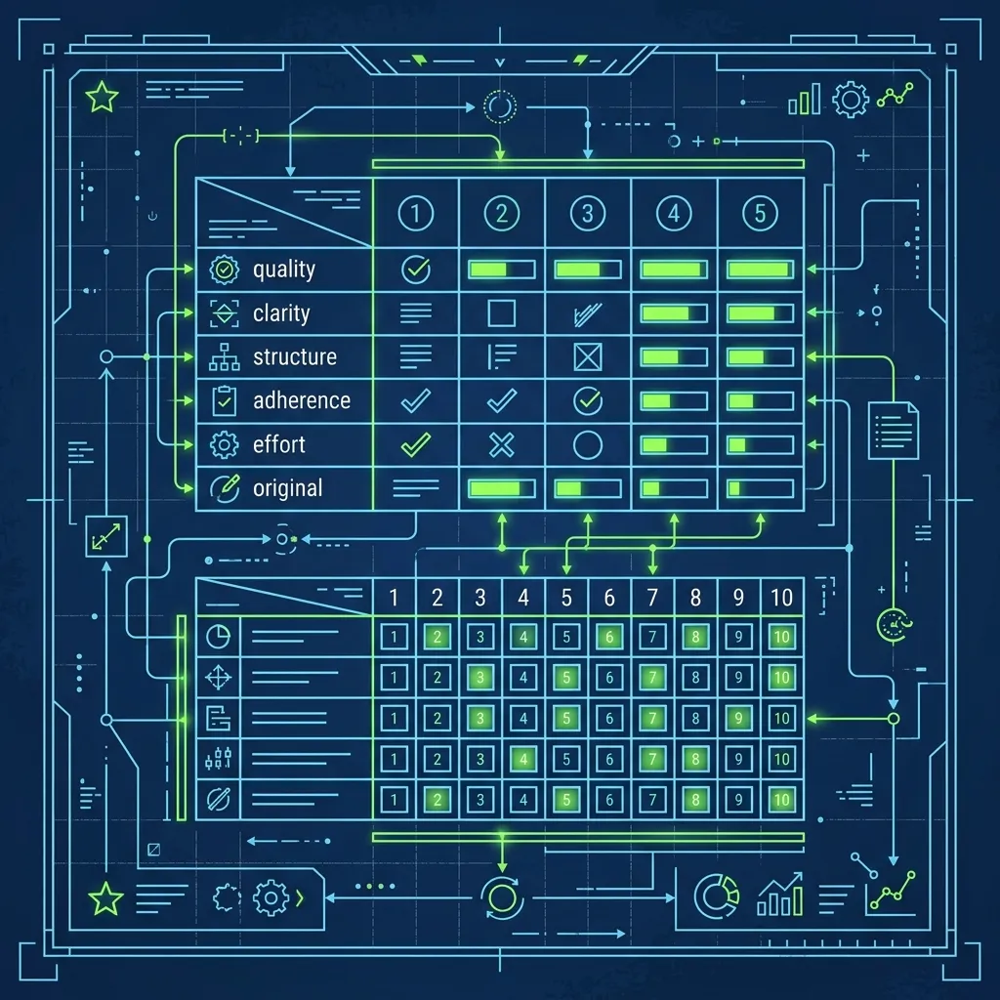
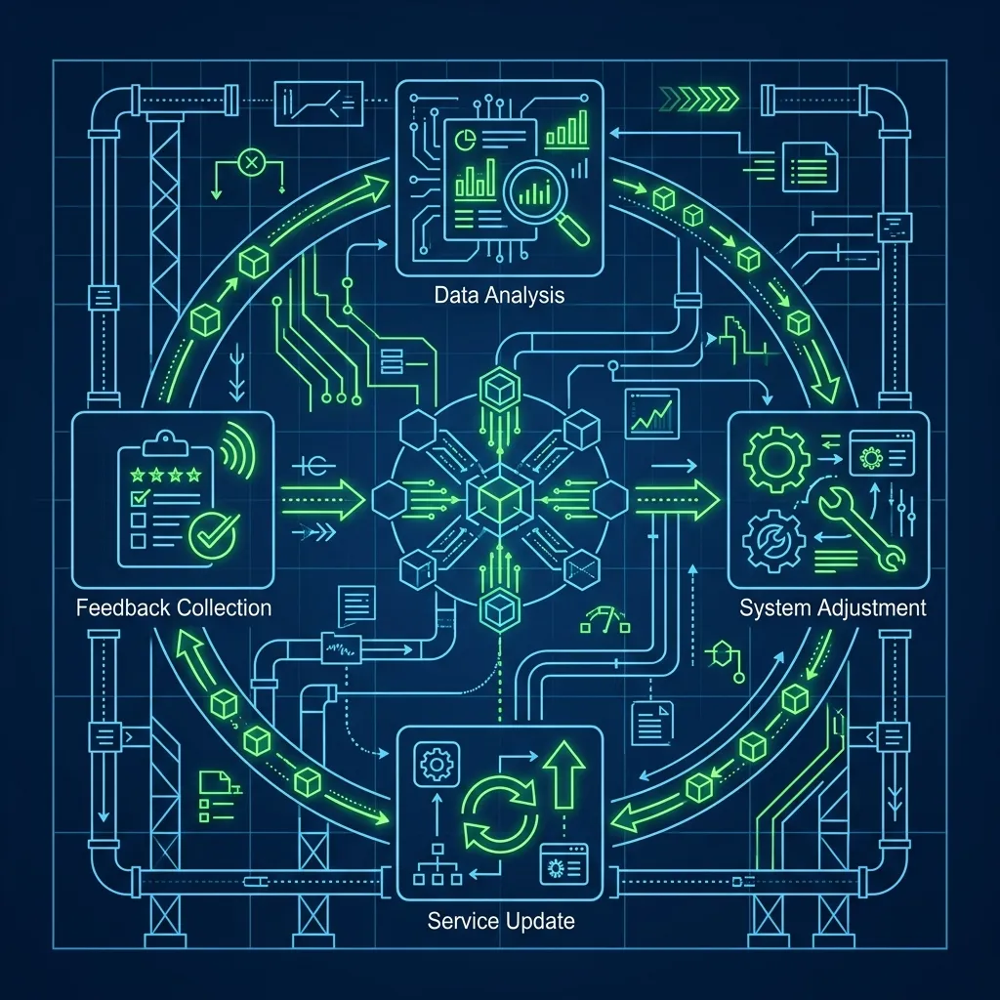

Chick-fil-A is not a normal fast food job. I say that as someone who has worked in or managed kitchens across half a dozen major chains, and nothing I encountered at any of them prepared me for the level of hospitality discipline that Chick-fil-A demands from every single team member. Most QSR chains train you to take orders fast and keep the line moving. Chick-fil-A trains you to make a stranger feel like you genuinely care about their day—and then they measure whether you actually did it. The entire system is built on four non-negotiable behaviors called the Core 4, and if you are applying for a job here, understanding these four pillars is the difference between getting hired and getting a polite rejection email. 

## The Chick-fil-A Core 4 Explained

The Core 4 is the foundational customer service model that is drilled into every Chick-fil-A Team Member from their very first training shift. It is not a suggestion or a best practice. It is a mandatory behavioral standard, and here is what each pillar requires: 

1. **Create Eye Contact.** You do not look down at the register, stare at the menu board, or glance at your coworker while a guest is talking to you. You look them directly in the eye. This sounds simple until you are on hour seven of a Saturday lunch rush and you have taken 200 orders and your brain is running on autopilot. Maintaining genuine eye contact when you are exhausted is harder than it sounds, and it is the first thing managers notice slipping. 

2. **Share a Smile.** Yes, it sounds cliché. No, they are not joking. A genuine smile is a strict requirement, not a suggestion. The key word is "genuine." Chick-fil-A managers are trained to distinguish between a real smile and a forced, dead-eyed customer service grimace. If your smile does not reach your eyes, you will hear about it during your next coaching session.

3. **Speak with an Enthusiastic Tone.** You cannot sound bored, tired, or annoyed—even if it is 9:45 PM and you have been on your feet since 6:00 AM. Your vocal energy has to project warmth and genuine interest. Working the line, I observed team members get pulled aside after a single interaction where their tone dropped flat. It is monitored that closely.

4. **Stay Connected to Make It Personal.** This is the hardest one and the one that separates Chick-fil-A from every other chain. "Making it personal" means engaging the guest beyond the transaction. Ask how their day is going. Comment on the weather. Notice that a mom is juggling three kids and proactively bring a high chair to the table before she has to ask. This pillar is about reading people and anticipating needs, and it requires genuine emotional intelligence that cannot be faked.

*Note: The famous phrase "My Pleasure" is technically part of a separate mandate called "Second Mile Service," but it goes hand-in-hand with the Core 4 and is expected at virtually every location.*

## Why the Core 4 Actually Works

The Core 4 is not just a training poster gathering dust on the break room wall. It is the single biggest reason Chick-fil-A consistently ranks as the number one fast food chain in customer satisfaction surveys, year after year, by a wide margin.

Every interaction a Team Member has with a guest is evaluated through the Core 4 lens. Managers regularly observe crew members during shifts and provide specific, real-time feedback. "I noticed you did not make eye contact with that last guest—check in with yourself." During secret shopper evaluations—which Chick-fil-A takes more seriously than any other chain I have encountered—the evaluator is specifically checking whether the employee made eye contact, smiled, spoke enthusiastically, and made the interaction feel personal. These are not subjective vibes. They are scored on a rubric, and stores that score poorly face intense scrutiny from their Operator and the corporate support team.

The result is a customer experience that feels dramatically different from walking into a [Burger King](/articles/chain/burger-king) or [McDonald's](/articles/chain/mcdonalds). That difference is not accidental. It is a system, engineered and enforced, and every employee is expected to execute it consistently on every single guest interaction, hundreds of times per shift.

## How to Demonstrate the Core 4 in Your Interview

Here is the part that catches most applicants off guard: Chick-fil-A hiring managers are trained to evaluate you against the Core 4 during the interview itself. They are not just listening to your answers. They are watching your behavior in real time.

**When you walk in:** Do not look at your phone in the lobby. Make immediate eye contact with the person at the counter, smile, and speak with energy: "Hi! I'm here for an interview with [Manager's Name]." You just demonstrated three of the four pillars before you even sat down.

**During the questions:** Sit up straight. Maintain consistent eye contact with the interviewer—not staring, but naturally engaged. When they ask a question, pause briefly, then answer with a slight, genuine smile. Do not give one-word answers. The Core 4 is about connection, and saying "Yeah" or "I guess" demonstrates the opposite of enthusiastic engagement.

**The "Tell me about a time..." question:** When they ask you to describe a time you helped someone, frame your story around the fourth pillar. Explain how you noticed someone needed something before they asked and took action proactively. "I was at my last job and noticed a customer was struggling to carry their bags to the car while holding an umbrella. I walked around the counter, grabbed the bags, and walked them out." That story demonstrates anticipation, initiative, and personal connection—exactly what Chick-fil-A is looking for.

**When you leave:** Do not just say "Thanks, bye." Say something personal: "I really appreciate you taking the time to talk with me today. I hope you have a great rest of your shift." You just executed the fourth pillar one more time on your way out the door.

## Common Mistakes That Kill Your Interview

Even if you have excellent work experience, certain behaviors during the interview will immediately disqualify you at most Chick-fil-A locations:

- **Looking at your phone at any point.** Even glancing at a notification while waiting in the lobby signals a lack of attentiveness. Leave it in your car or put it on silent in your pocket and do not touch it.
- **Giving one-word answers.** The interview is a conversation, not an interrogation. If you cannot sustain a warm, two-way dialogue during a low-pressure 15-minute interview, the hiring manager knows you will not be able to do it during a high-pressure 8-hour shift.
- **Not asking questions back.** When they ask if you have any questions at the end, you must have at least one. "[What does a](/articles/raising-canes-bird-specialist) typical shift look like here?" or "What do your best team members do that sets them apart?" Both show genuine interest and keep the conversation personal—which is literally pillar four.
- **Badmouthing a previous employer.** Every fast food manager has heard "My last job was terrible." Chick-fil-A is looking for people who stay positive and focus on solutions, not complaints. Even if your last job was genuinely awful, reframe it: "I learned a lot, but I'm looking for a place that takes customer service as seriously as I do."

## What the Core 4 Looks Like on the Floor

Understanding the Core 4 in theory is easy. Executing it consistently on the floor, during a 150-car lunch rush, when you have been standing for six hours and your feet hurt and the customer in front of you is annoyed about a wait time you had nothing to do with—that is the real test.

The best team members I have observed at Chick-fil-A practice all four pillars on every single guest, including the difficult ones. Especially the difficult ones. Maintaining eye contact, a genuine smile, and a warm tone while a frustrated customer is complaining about a wrong order is what separates good team members from great ones. Anyone can be pleasant when things are easy. Chick-fil-A wants people who can be pleasant when things are hard.

## Frequently Asked Questions

### Do you have to say "My Pleasure" at Chick-fil-A?

Yes. While "My Pleasure" is technically part of the Second Mile Service initiative rather than the Core 4 itself, it is a mandatory response at virtually every Chick-fil-A location. When a guest says "Thank you," you respond with "My Pleasure" instead of "You're welcome" or "No problem." It is one of the most recognizable elements of the entire brand, and new hires who default to "No problem" will be corrected immediately and repeatedly until the habit sticks.

### Can you get fired for not following the Core 4?

You are unlikely to be terminated for a single slip-up, but consistently failing to embody the Core 4 will absolutely lead to corrective action. Managers track individual performance closely through shift observations and secret shopper scores. Employees who repeatedly fail to make eye contact, smile, or engage with guests will be coached, written up, and eventually let go if they do not improve. The Core 4 is not optional—it is a condition of employment.

### Is the Core 4 the same at every Chick-fil-A location?

Yes. The Core 4 is a corporate-wide standard that applies to every single Chick-fil-A restaurant, regardless of location or Operator. Individual stores may layer additional hospitality practices on top of the Core 4—some locations have their own greeting scripts or table-touching routines—but the four foundational pillars are universal and non-negotiable across all 3,000+ locations.

---

*For a look at the technology that makes Chick-fil-A's legendary speed possible, read our guide on [how the Chick-fil-A iPOS drive-thru system works](/articles/chick-fil-a-ipos-system). To see how another chain approaches employee development with similar rigor, check out [the In-N-Out Level System explained](/articles/in-n-out-level-system). And for a different take on operational excellence, explore [the Starbucks Customer Support Cycle](/articles/starbucks-customer-support-cycle).*
