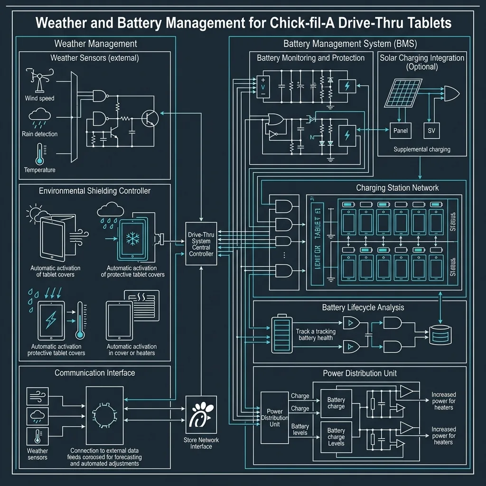

If you look at the drive-thru layout of a [McDonald's](/articles/chain/mcdonalds) or a [Wendy's](/articles/chain/wendys), the architecture is fundamentally the same as it was in the 1980s. A customer pulls up to a metal speaker box, shouts their order into a microphone, and drives forward. The speaker box is a structural bottleneck. No matter how fast the kitchen cooks the food, you can only process one car at a time through that speaker.

Chick-fil-A looked at that bottleneck and completely engineered it out of existence. 

Instead of forcing cars to wait in a single-file line for a speaker box, Chick-fil-A sends their cashiers out into the parking lot. Armed with iPads and rugged credit card readers, they walk up to the cars. This system is known internally as **iPOS (iPad Point of Sale)**, and it is the single biggest reason why a Chick-fil-A can process 150 cars an hour while a competitor struggles to hit 80.

This is a gritty, operational look at how the iPOS system actually works, how the store manages the logistics of outdoor workers, and the incredible pressure it puts on the kitchen.

## The Problem with the Speaker Box

To understand the genius of the iPOS system, you have to understand the math of a traditional drive-thru. 

When a minivan with four kids pulls up to a Wendy's speaker box, that minivan might sit there for three solid minutes while the parents try to figure out what everyone wants. During those three minutes, the five cars stuck behind the minivan cannot order. The kitchen inside might be completely empty and waiting for tickets, but they are starved for work because the speaker box is blocked.

Chick-fil-A’s solution is "Tandem Ordering." By sending three or four team members outside with tablets, they can walk down the line of cars. If the minivan needs three minutes to decide, the team member can just walk past them to the next car, take that order, and beam it directly to the kitchen. The kitchen never stops working.

## The iPOS Hardware

You cannot just take a consumer iPad into a 95-degree parking lot in July and expect it to survive. The hardware is heavily modified for commercial abuse.

The core of the system is an Apple iPad, but it is locked inside a massive, ruggedized sled. This case serves three critical functions:
1. **Drop Protection:** Team members are constantly moving on concrete. The case is designed to survive waist-high drops onto asphalt.
2. **Payment Processing:** The sled has a built-in card reader (usually a proprietary swiper/chipper combination) that connects directly to the iPad via the Lightning or USB-C port, not Bluetooth. Bluetooth is too unreliable in a parking lot filled with 40 running cars.
3. **Glare Reduction:** The cases often feature built-in hoods or sunshades so the team member can actually read the screen in direct sunlight.

<strong>Operational Reality:</strong> Battery management is a massive logistical hurdle. iPads running maximum screen brightness while maintaining a constant Wi-Fi connection to the store's server will drain fast. The store requires a dedicated charging rack inside, and Shift Leaders must aggressively swap out dead tablets for fresh ones mid-rush to prevent the line from collapsing.

## The "Face-to-Face" Advantage

Chick-fil-A leans heavily into their customer service reputation. The iPOS system forces "Face-to-Face" interaction. But from a purely operational standpoint, Face-to-Face ordering solves a massive accuracy problem.

When you order through a speaker box, the audio is heavily compressed. "I want a number two, no tomato" often sounds like "I want a number two and a potato." The cashier miskeys it, the kitchen makes it wrong, and the customer complains at the window, destroying the drive-thru timer.

With iPOS, the team member is standing three feet from the driver. They can hear them clearly, read their lips, and instantly clarify confusing orders. Furthermore, the team member takes the payment right there in the parking lot. By the time the car reaches the physical drive-thru window, the transaction is already finished. The only thing left to do is hand them the bag.

## Managing the Elements

The biggest challenge with the iPOS system isn't the technology; it's the weather. Chick-fil-A is asking teenagers to stand on asphalt for hours at a time.

The company has invested millions in mitigating this. If you drive past a Chick-fil-A in the summer, you will see the outdoor team wearing specialized cooling vests that hold frozen gel packs. They wear wide-brimmed safari hats, and the stores construct massive, permanent metal canopies over the drive-thru lanes equipped with high-powered industrial fans and misting systems.

In the winter, they deploy heavy parkas, thermal pods, and propane heaters. However, there are strict corporate safety guidelines. If there is lightning within a certain radius, or if temperatures drop below a dangerous threshold, the outdoor team is immediately pulled inside, and the store reverts back to the traditional speaker box. 

When this happens, the sudden drop in order velocity hits the store like a brick wall. The line immediately backs up into the street.

## The Kitchen Pressure

The most fascinating aspect of the iPOS system is what it does to the kitchen. 

In a normal fast-food restaurant, the speaker box acts as a natural pace-setter. The kitchen gets one order, they have 45 seconds to make it, and then they get the next order. 

When you have four people outside taking orders on iPads simultaneously, the kitchen screen does not get one order at a time. It gets hit with a shotgun blast of four orders at once, every 30 seconds. 

The breading table and the fryers have to operate at a relentless, hyper-aggressive pace to keep up. The kitchen routing has to be flawless. The person dropping the waffle fries must constantly monitor the queue, anticipating the volume of large fries needed three minutes before the cars even reach the window.

If the kitchen falls behind, the entire iPOS system backfires. The cars will have ordered and paid, but they will sit parked at the window waiting for food, creating a permanent roadblock. 

This is why Chick-fil-A focuses so heavily on cross-training and specialized roles like the "Expeditor"—the person whose sole job is to stuff the bags and verify accuracy. The iPOS system proves that if you can eliminate the speaker box, the only limit to your revenue is how fast your kitchen can drop chicken into the fryer.
