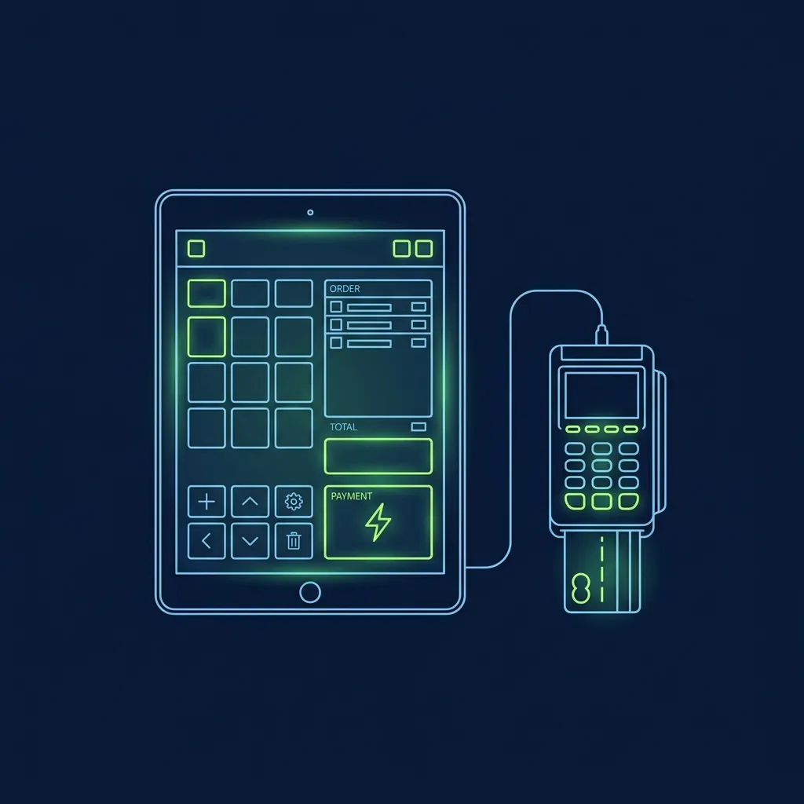
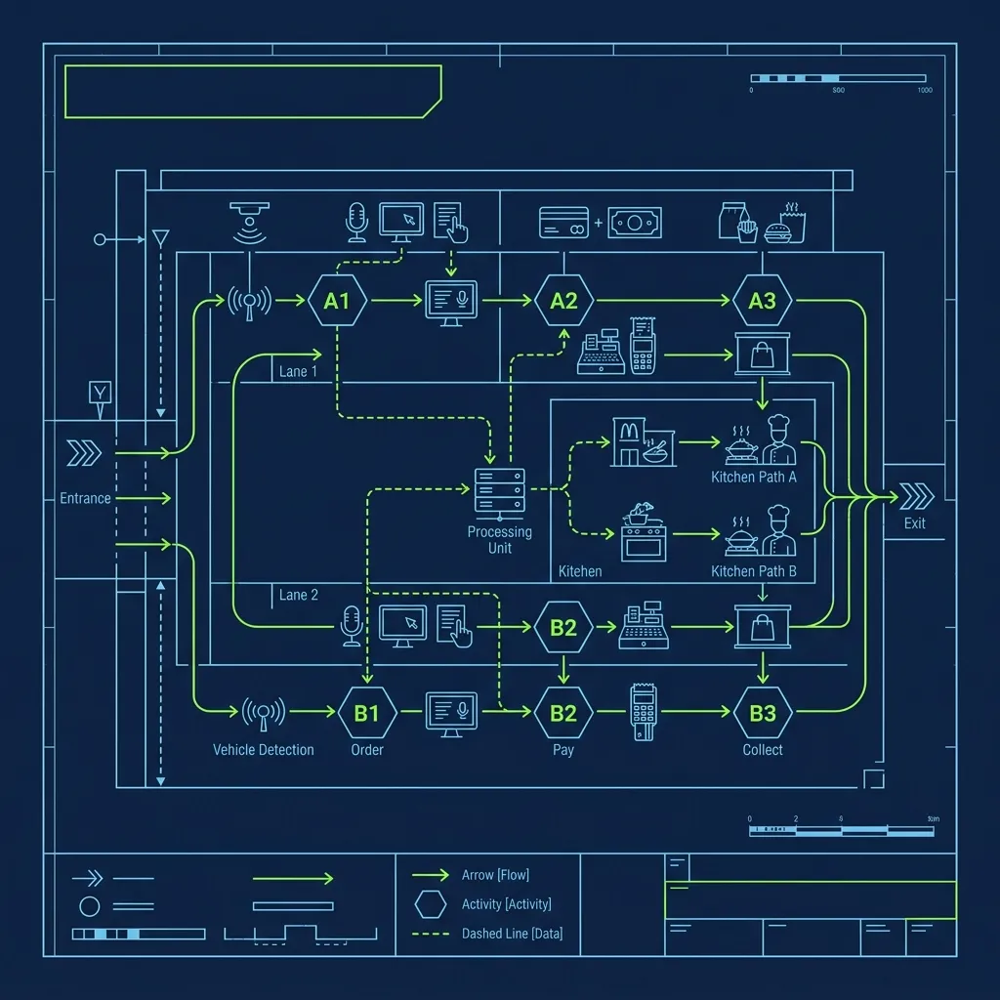

If you have ever pulled into a Chick-fil-A drive-thru during lunch hour and seen a line of 40 cars wrapping around the building, your first instinct was probably to leave. Then you noticed something strange: the line was actually moving. Fast. Faster than any 10-car line you have ever sat in at a [McDonald's](/articles/chain/mcdonalds) or [Taco Bell](/articles/chain/taco-bell). The reason is a system called iPOS—Internet Point of Sale—and it is one of the most brilliantly engineered operational innovations in the entire fast food industry. I have spent years studying drive-thru operations across multiple chains, and nothing comes close to what Chick-fil-A has built here. They did not just improve the drive-thru. They fundamentally reinvented it. 

## Bypassing the Speaker Box Bottleneck

> **Russell's Note:** Forget the fancy gadgets. Give me a sharp 8-inch chef's knife and a 32oz deli container labeled with blue painter's tape, and I can run any station.

> **Russell's Note:** Any BOH veteran will tell you: the walk-in cooler is the only soundproof place to take a 30-second mental break when the KDS screen is totally full.

Every traditional fast food drive-thru has the same fundamental problem: the speaker box is a bottleneck. Car A has to finish their entire order before Car B can even pull up to the microphone. If Car A is a family of six debating between nuggets and strips, everyone behind them sits and waits. The speaker box creates a single-file chokepoint that limits even the fastest kitchens to about 50 to 60 cars per hour at best. 

Chick-fil-A's iPOS system eliminates the bottleneck entirely by turning one speaker box into four to six simultaneous ordering stations. 

The real process: These iPads run the full point-of-sale interface and are paired with mobile credit card readers. The team members walk directly up to cars in a staggered formation—one employee might be taking an order from the car at position three in line while another has already moved to position seven.

The beauty is parallel processing. While one employee is helping a family of six customize four different meals—no pickles on this one, extra sauce on that one—another employee three cars back has already taken a simple order from a solo driver, swiped their card, and sent the order to the kitchen. Multiple orders are being entered simultaneously from different positions in the line. The single-file bottleneck that cripples every other drive-thru simply does not exist here.

## The "Send" Before the Window

The true brilliance of iPOS is not just where the order is taken—it is when.

The moment the outside team member taps "Send" on the iPad and swipes the customer's credit card on the mobile reader, two things happen simultaneously:

- **Payment is cleared.** The customer is fully checked out before they have even touched the gas pedal to move forward. There is no fumbling for a wallet at the window, no waiting for a card to process, no "Oh wait, I forgot to add a milkshake."
- **The kitchen is prompted.** The order appears instantly on the Kitchen Display System (KDS) inside the store.

The explanation is simpler than you'd think: By the time the car physically reaches the drive-thru window, the food has already been cooked, bagged, and is literally waiting in the expediter's hand. The customer pulls up, the window opens, and the bag is there. It feels almost magical from the customer's perspective. At a traditional drive-thru, you place your order at the speaker box, pull to the window, and then wait while the kitchen scrambles. Chick-fil-A flipped that entire sequence on its head.

This lead time is what allows Chick-fil-A to push 150 or more cars per hour through a single drive-thru lane. The kitchen is never reacting to the car at the window—they are always working on cars that are still five to eight positions back in line. By the time a car arrives at the window, the order has been cooking for three to four minutes already.

## The Face-Matching Challenge

One of the trickiest operational problems the iPOS system creates is car-to-order matching at the pickup window. Because orders are taken far back in the line—sometimes 10 or more cars from the window—the crew inside has to figure out which bag belongs to which car as they arrive.

iPOS team members solve this by noting identifying details about each vehicle directly in the order notes on the iPad: "Red Honda Civic," "White F-150 with roof rack," "Silver minivan with kids in back." When the car pulls up to the window, the crew member inside matches the vehicle description to the order on their screen and grabs the correct bag.

During peak rushes, this system has to work flawlessly. I watched what happens when it breaks down—a 12-piece nugget meal handed to someone who ordered a spicy deluxe, followed by two cars' worth of corrections that back up the entire line. Good iPOS operators are specific and consistent with their car descriptions. "Blue car" is not good enough when there are three blue cars in a row. "Blue Hyundai Elantra, passenger side scratch on front bumper" is what separates a smooth rush from chaos.

Some locations have also begun deploying camera systems and digital order tracking boards at the window to reduce reliance on manual descriptions. These systems photograph each car as it passes a checkpoint and link the image to the corresponding order, making the matching process faster and more accurate.

## The Weather Factor: What iPOS Team Members Actually Endure

Being an iPOS team member is not a glamorous job. You are standing outside, in a parking lot, for hours at a time, in whatever weather your region decides to throw at you that day.

**Summer heat:** In southern locations where temperatures regularly exceed 100°F, iPOS team members rotate out every 20 to 30 minutes to prevent heat exhaustion. Stores keep coolers of water and electrolyte drinks outside specifically for the drive-thru crew, and shade canopies with industrial fans are deployed to provide some relief. Even with these precautions, I have seen team members come inside after a 25-minute rotation looking like they just stepped out of a swimming pool. The iPad screens also get finicky in extreme heat—touchscreens become unresponsive, glare makes the display unreadable, and the devices occasionally overheat and shut down.

**Winter cold and rain:** During cold weather or heavy rain, team members are issued high-visibility cold-weather gear, and many stores deploy heated "weather pods"—enclosed canopy structures with industrial heaters—so employees can stay warm while they punch in orders. Rain is the worst scenario because the iPad screens do not respond well to wet fingers, and card readers sometimes struggle with damp cards. Good iPOS operators learn to keep a small towel in their apron pocket for exactly this reason.

The physical demands of the role are real, and Chick-fil-A invests more in protective gear and rotation schedules for outside team members than most people realize. It is a tough position, but many iPOS workers prefer it because they get to interact directly with customers rather than standing behind a counter all day, and the fast pace makes the shift fly by.

## What Happens When the Wi-Fi Goes Down

The iPOS system runs on a dedicated local Wi-Fi network. You might assume that if the store loses its internet connection to corporate servers, the entire operational advantage disappears instantly. But Chick-fil-A solved this by turning every single restaurant into its own edge-computing data center. Every Chick-fil-A operates its own 3-node Kubernetes cluster (using k3s) physically located in the back room. 

This highly resilient "edge" architecture ensures that the iPads, the point-of-sale, the Kitchen Display System (KDS), and even the IoT fryers keep communicating locally and processing orders flawlessly even if the store completely loses external internet. The IT setup at a busy Chick-fil-A is more robust than what you would find at most small tech startups—because the revenue impact of a 30-minute outage during lunch rush is measured in thousands of dollars.

## Frequently Asked Questions

### Do iPOS team members get paid more than inside workers?

iPOS team members are generally paid the same base hourly rate as other front-of-house team members. However, some Operators offer a small premium or prioritize iPOS workers for more total weekly hours because the role requires strong interpersonal skills, speed under pressure, and the willingness to work in uncomfortable weather conditions. The role is also seen as a proving ground for leadership potential—team members who excel at iPOS are often fast-tracked for promotion.

### Can customers still use the speaker box when iPOS is active?

At most locations, the speaker box remains technically functional even when iPOS is deployed, but it is rarely used during peak hours because outside team members reach the cars before they get to the speaker. During slower periods when iPOS is not active—typically early morning or late evening—customers order through the speaker box as usual.

### How long does it take to learn the iPOS system?

Most new team members can learn the basics of the iPad interface in a single training shift. The technology itself is intuitive—the menu layout is logical and the payment processing is straightforward. The harder skill to develop is the speed and confidence needed to approach cars, take accurate orders under time pressure, and handle payment smoothly while standing outside in potentially harsh weather. That operational comfort level usually takes two to three weeks of regular practice before it becomes second nature.

---

*To understand the hospitality philosophy that drives every Chick-fil-A interaction, read our complete guide on [the Chick-fil-A Core 4 and how to pass the interview](/articles/chick-fil-a-core-4). For a comparison of how other chains manage their drive-thru timing, check out [how the Taco Bell drive-thru timer system works](/articles/taco-bell-drive-thru-timer). And for a completely different approach to order technology, see our breakdown of [how the Sonic switchboard system operates](/articles/sonic-switchboard-how-it-works).*
