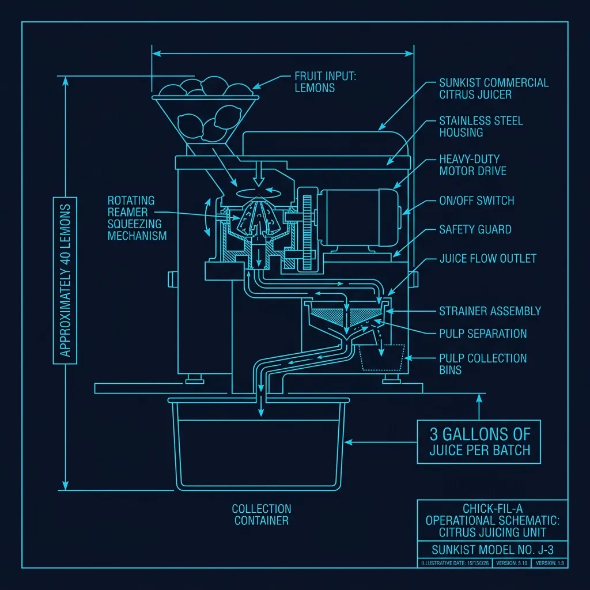
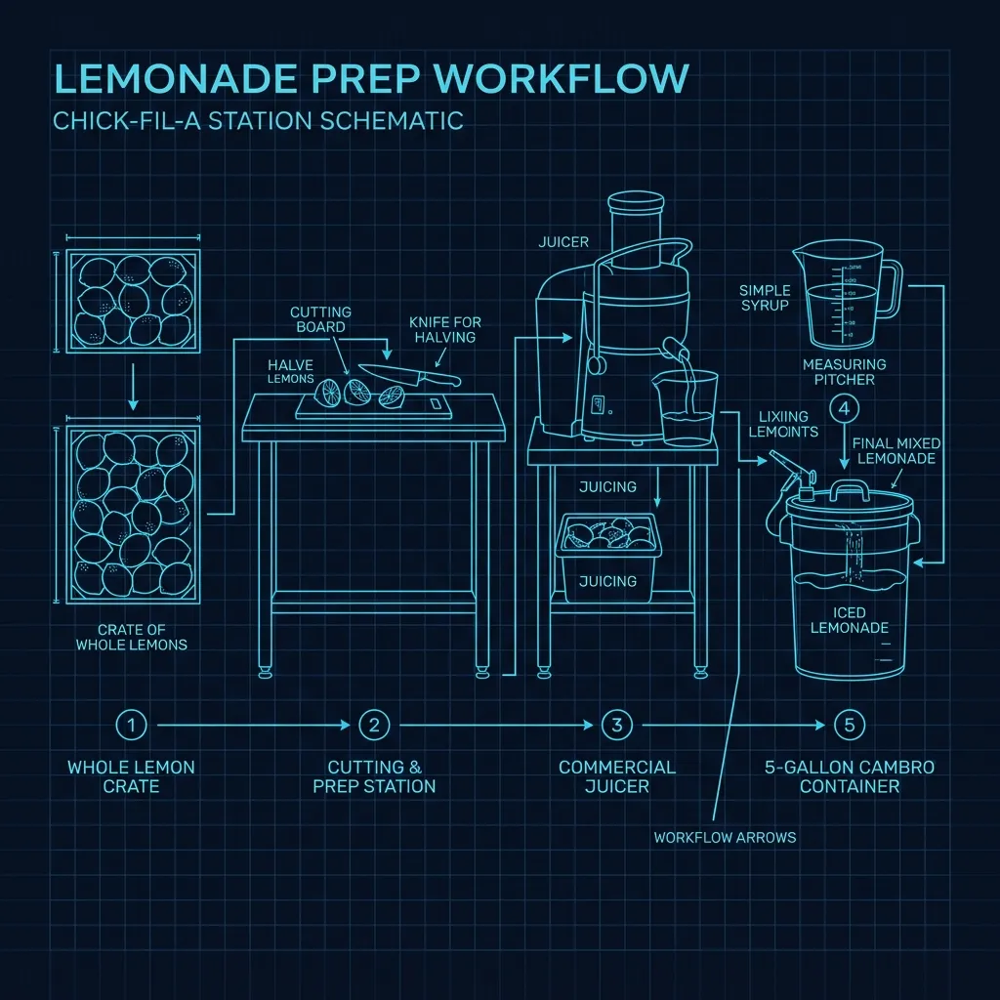

## Yes, They Actually Squeeze Real Lemons

This isn't marketing spin. Chick-fil-A's lemonade is made from **real lemons, squeezed in the restaurant, every single morning**. There is no concentrate. There is no pre-made mix shipped from a warehouse. A team member stands at a prep station and juices whole lemons before the restaurant opens. 

In an industry where nearly every drink comes from a syrup bag connected to a fountain machine, Chick-fil-A's lemonade is a genuine anomaly. It costs them significantly more in labor and ingredients than a fountain drink, it creates a daily prep obligation that never stops, and it's one of the primary reasons their lemonade tastes different from every other fast food lemonade on the market. 

## The Morning Prep: Start to Finish

The lemonade prep happens every morning before the restaurant opens, typically between **6:00 and 9:00 AM** depending on the location. Here's the full process: 

### Step 1: Wash and Cut the Lemons

The prep team receives cases of **whole Sunkist lemons** from the produce delivery. Each lemon is washed and then **cut in half by hand** on a cutting board. A typical location will cut **30 to 50 lemons per batch**, depending on projected sales volume for the day.

High-volume locations — particularly drive-thru-heavy stores in the Southeast — may go through **several hundred lemons per day** across multiple batches.

### Step 2: Juice on the Commercial Juicer

The halved lemons go into a **commercial citrus juicer** — most locations use a Sunkist or similar commercial-grade reamer-style juicer. This is not a hand-press or a manual squeezer. It's an electric unit with a rotating reamer that extracts juice quickly while separating seeds and excess pulp.

The juicing process produces approximately **3 gallons of fresh lemon juice** from a full batch of lemons. The juice collects in a container below the juicer with a strainer that catches seeds but allows some pulp through — Chick-fil-A's lemonade is intentionally **slightly pulpy**, which is one of the visual cues that it's made from real fruit.

### Step 3: Make the Simple Syrup

The sweetener in Chick-fil-A's lemonade is **simple syrup** — a mixture of pure cane sugar dissolved in water. This is made in-house by combining measured amounts of sugar and warm water in a container and stirring until fully dissolved.

The ratio is specific and standardized across all locations. Chick-fil-A's recipe card specifies the exact amount of sugar per batch to maintain consistency. The syrup is made fresh alongside the lemon juice.

### Step 4: Combine in the Cambro

The fresh lemon juice and simple syrup are combined in a **large Cambro container** (a food-grade plastic cambro, typically 5 gallons) with filtered water. The ratio is:

- Fresh-squeezed lemon juice
- Simple syrup (sugar + water)
- Additional cold filtered water to reach the target volume

The mixture is stirred thoroughly and then stored in the walk-in cooler or transferred directly to the front-of-house dispensing container.

## The Dispensing Setup

Unlike fountain drinks that are mixed on-demand from syrup and carbonated water, Chick-fil-A's lemonade is **pre-made and dispensed as a finished product**. The front-of-house team pours it from cambros or dispensing urns directly over ice into cups.

This means the lemonade's taste can vary slightly throughout the day as ice melts in the holding container or as a fresh batch replaces an older one. Morning lemonade tends to be slightly more concentrated, while late-afternoon lemonade may be slightly more diluted if the batch has been sitting with melting ice.

### Diet Lemonade

Chick-fil-A also offers a **diet lemonade** that uses Splenda (sucralose) instead of cane sugar in the simple syrup. The lemon juice is the same — fresh-squeezed, from the same batch. The only difference is the sweetener. This is still made in-house, not from a mix.

### Frosted Lemonade

The Frosted Lemonade is a blend of the hand-squeezed lemonade with Chick-fil-A's **Icedream** (their vanilla soft-serve dessert). It's blended to order in a milkshake mixer, creating a creamy, smoothie-like consistency. Because both components are proprietary — hand-squeezed lemonade and Icedream — the Frosted Lemonade is genuinely unique to Chick-fil-A.

## Why This Process Is Unusual (And Expensive)

To understand how unusual Chick-fil-A's approach is, consider what every other major chain does:

| Chain | Lemonade Method |
|---|---|
| **[McDonald's](/articles/chain/mcdonalds)** | Minute Maid syrup from a bag, mixed by the fountain machine |
| **[Wendy's](/articles/chain/wendys)** | Minute Maid concentrate mixed with water |
| **[Burger King](/articles/chain/burger-king)** | Fountain-dispensed from syrup |
| **[Taco Bell](/articles/chain/taco-bell)** | Brisk brand, dispensed from a fountain |
| **Chick-fil-A** | Fresh lemons, squeezed in-store daily |

The cost difference is significant:

- **Fountain lemonade** costs the restaurant approximately **$0.05–$0.10 per cup** in syrup and CO2
- **Chick-fil-A's hand-squeezed lemonade** costs approximately **$0.40–$0.60 per cup** in lemons, sugar, and labor

When you're selling millions of cups per day across 3,000+ locations, that difference adds up to hundreds of millions of dollars annually in additional cost. Chick-fil-A justifies this by charging a premium — a medium lemonade at Chick-fil-A is typically **$2.29–$2.79**, compared to $1.00–$1.79 for fountain lemonade at competitors.

## The Operational Burden

### It Never Stops

Unlike a fountain machine that runs until the syrup bag is empty (which might last several days), the lemonade supply has to be **replenished constantly**. A busy Chick-fil-A might go through **8–12 batches per day** during summer months, which means someone is squeezing lemons multiple times throughout the day — not just during morning prep.

### Waste Management

Juicing 100+ lemons per day produces a significant amount of waste — rinds, seeds, and pulp. This creates a disposal burden that fountain-drink-only restaurants don't have. Most locations have designated waste bins for citrus waste that are emptied multiple times per day.

### Consistency Control

Maintaining taste consistency is harder with a natural product. Lemons vary in size, juice content, and acidity depending on the season, the growing region, and how long they've been in the supply chain. A January lemon from California tastes different from a July lemon from Florida.

Chick-fil-A addresses this through:
- **Standardized recipes** with exact measurements for juice, sugar, and water
- **Taste testing** — managers are trained to taste-check lemonade batches
- **Supplier specifications** — Chick-fil-A's contracts specify lemon size and juice yield requirements

## What You're Actually Tasting

When you drink Chick-fil-A's lemonade, you're tasting three things that are absent from every fountain lemonade:

1. **Real citrus oils** from the lemon rind — during juicing, some of the aromatic oils from the peel make it into the juice, adding a brightness and complexity that synthetic citric acid can't replicate
2. **Natural pulp** — the small amount of pulp that passes through the strainer adds texture and visual authenticity
3. **Cane sugar** rather than high-fructose corn syrup — most fountain lemonades use HFCS as the sweetener, which has a different sweetness profile than cane sugar

The combination produces a lemonade that tastes noticeably "realer" than fountain versions — tarter, more aromatic, with a slightly uneven sweetness that comes from natural variation rather than machine-precise syrup ratios.

It costs Chick-fil-A dramatically more to produce. But it's become one of their most identifiable menu items, and customers notice immediately when they compare it side-by-side with any competitor's fountain lemonade. That's the trade-off Chick-fil-A made decades ago, and they've never gone back.
