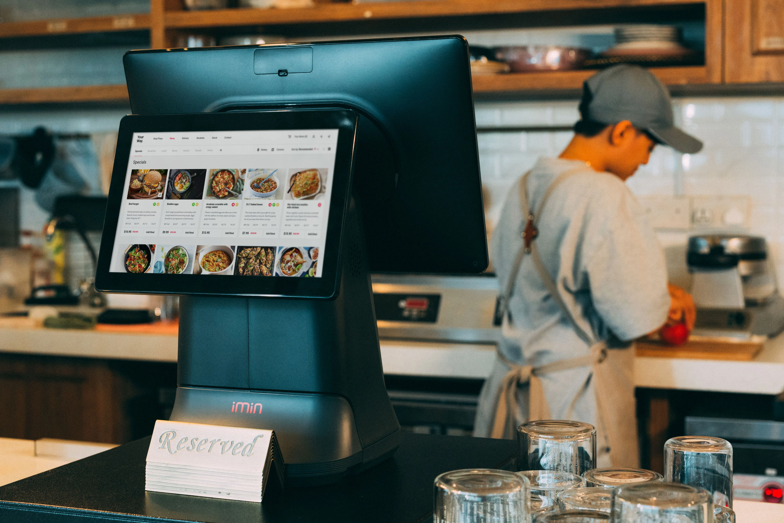

When customers think of Chick-fil-A, they focus on two menu staples: the pressure-fried chicken sandwich and the waffle potato fries. From a quick-service kitchen management perspective, cooking the chicken sandwich is actually the predictable, rhythmic part of the kitchen. 

**The fry station is where the operational bottleneck happens.** 

During a Friday 12:30 PM lunch rush when a store is processing 150 cars per hour through the drive-thru, the fry cook is the hardest-working person in the building. A single fry station must drop, shake, drain, salt, box, and serve over **40 to 60 pounds of potatoes every hour**. 

Unlike standard shoestring fries (such as McDonald's 1/4-inch cut), waffle fries feature a complex lattice geometry that introduces severe thermodynamic challenges. This is the exact culinary science and management playbook behind the Chick-fil-A Waffle Fry Station.

## 1. Waffle Cut Physics: Surface Area vs. Heat Retention

Why did Chick-fil-A choose the waffle cut when every major competitor uses straight shoestring or crinkle cuts? The answer lies in condiment mechanics and structural differentiation.
*   **The Dip Advantage:** A waffle fry acts as a rigid, grid-like spoon designed to scoop maximum quantities of Chick-fil-A Sauce, Polynesian Sauce, or ketchup without snapping or bending in the customer's hand.
*   **The Thermodynamic Penalty:** Because the lattice cut creates an enormous surface-area-to-volume ratio, waffle fries radiate internal heat into the ambient air exponentially faster than solid, thick-cut fries. Once removed from the 350°F oil, a waffle fry has a usable thermal lifespan of less than **300 seconds** before its starch cell walls collapse, turning the exterior soggy and the interior mealy.

## 2. Canola Oil: The Fry Station Engine

While Chick-fil-A pressure-fries its chicken breasts in refined peanut oil, the waffle fry station operates on a dedicated open-vat fryer battery filled exclusively with **canola oil**. 

### Temperature Recovery and Separation
From an operations standpoint, using dedicated canola oil provides critical advantages:
1.  **Allergen Separation:** Cooking fries in canola oil rather than peanut oil provides an additional layer of separation, and the dedicated fryers prevent cross-contamination with the breaded chicken products.
2.  **Rapid Temperature Recovery:** When a 5-pound basket of frozen waffle fries is submerged into 350°F oil, the thermal shock drops the vat temperature dramatically. High-BTU commercial burners must recover the 350°F baseline in under 45 seconds, ensuring the potatoes flash-fry rather than boiling in lukewarm oil.

**ProTip:** In early 2025, Chick-fil-A rolled out an updated Waffle Potato Fry recipe featuring a light pea starch coating. This structural enhancement was specifically designed to extend the thermal lifespan of the fries, keeping them crispier for longer during delivery and drive-thru transport.

  <strong>Manager's Insight: The "Mid-Cook Shake" Rule</strong>
  A common mistake made by new fry cooks is dropping a loaded basket into the vat and leaving it untouched until the 2-minute-and-45-second timer beeps. 
    
  Because waffle fries are wide and flat, they naturally stack on top of one another like wet playing cards when submerged. If left unshaken, the touching surfaces never contact hot oil, resulting in pale, raw, doughy patches on the finished fry. We train cooks on the mandatory **30-Second Shake**: exactly 30 seconds after dropping a basket, the cook must lift the basket clear of the oil, give it a vigorous two-handed vertical toss to separate the lattice discs, and plunge it back into the vat.

## 3. The Salting Station: The 2-Pump Rule

Once the fryer timer sounds, the cook lifts the basket, allows it to hang over the vat for 5 to 7 seconds to drain surface oil, and dumps the golden waffle fries into the heated stainless steel dump station.

### Salting Calibration
Unlike chains where cooks vigorously shake an open salt shaker over the fries by hand, Chick-fil-A utilizes an engineered **Accu-Salt Dispenser** (a custom hopper with precise discharge holes).
*   **The 2-Pump Standard:** For a standard basket drop, the cook holds the dispenser 12 inches above the dump bin and applies exactly **two measured pumps** of proprietary, fine-grain sea salt. 
*   **The Toss and Scoop:** Immediately after salting, the cook uses a specialized wide fry scoop to toss the potatoes gently from bottom to top twice. This distributes the salt grains evenly while the surface oil is still liquid enough to bind the crystals to the potato skin.

**ProTip:** The Accu-Salt Dispenser must be cleaned and dried daily. If moisture from the hot fries travels up into the dispenser holes, the sea salt will clump, causing uneven salting and forcing the cook to bang the dispenser, which breaks the internal mechanism over time.

## 4. Packaging and The Strict Holding Clock

Because waffle fries lose their crispness so rapidly, packaging and holding protocols are enforced with military precision by kitchen shift leaders.

### The Box vs. Bag Geometry
Chick-fil-A serves fries in iconic open-top red cardboard cartons (Small, Medium, Large). 
*   **The Upright Packing Rule:** Fry cooks must scoop fries so that the individual waffle discs stand vertically inside the carton rather than lying flat. This prevents the fries from crushing each other under their own weight and allows steam to escape vertically through the open top rather than condensing inside the box.
*   **The 2-Minute Holding Limit:** During peak lunch and dinner dayparts, boxed waffle fries sitting under the ceramic infrared heat lamps have a maximum allowable hold time of **2 to 5 minutes**. If a box sits beyond this window, the heat lamps dry out the interior potato starch, creating a tough, cardboard-like texture. 

To maintain speed of service without violating quality timers, elite fry cooks use predictive KDS pacing—dropping half-baskets every 45 seconds to create a continuous, uninterrupted river of fresh waffle fries that never sit in the chute longer than 60 seconds before being handed to a customer.
