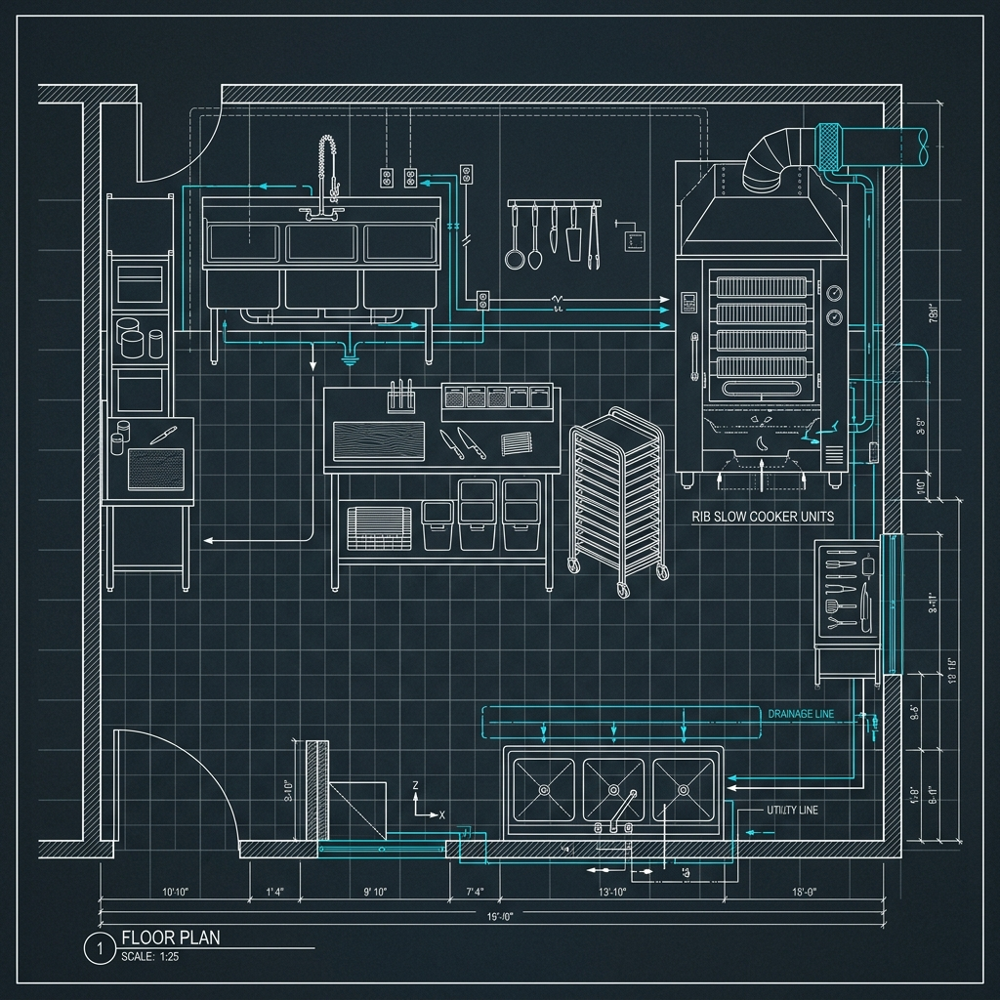

## "I Want My Baby Back, Baby Back..."

Let's be honest — Chili's built an entire brand identity around that jingle. For a lot of people, it's the first thing that pops into their head when someone says "Chili's." And it did its job almost too well: it set an expectation that there's some mythical pit out back where a guy in a stained apron is slow-smoking racks of baby backs over smoldering hardwood for the better part of a day.

> **Russell's Note:** Any BOH veteran will tell you: the walk-in cooler is the only soundproof place to take a 30-second mental break when you're getting slammed and holding on drops.

> **Russell's Note:** People always ask why this tastes different at home. Simple. We aren't afraid of butter, salt, and keeping the flat top screaming hot.

I managed multiple Chili's kitchens over a stretch of years, and I can tell you right now: that is not what's happening. There is no smoker in the back. There's no woodpile next to the dumpster. But before you get cynical about it, hear me out — because the actual process is more interesting than you think, and the ribs are still genuinely good for a chain restaurant.

What Chili's does is run a hybrid system: off-site smoking for the base flavor, precision reheating for tenderness, and high-heat grilling on-site for finish and char. Every single step is engineered around consistency, speed, and food safety. And when it's executed correctly, it works extremely well.

## The Off-Site Smoking Process

Chili's moves an absurd volume of ribs. We're talking about a chain with over 1,600 locations nationwide — there's no universe where each individual restaurant is running its own smoking program. The math doesn't work, the labor doesn't work, and the consistency would be a nightmare.

Instead, the ribs are smoked at centralized processing facilities. Here's how that breaks down:

### Pecan Wood Smoking

The ribs are smoked low and slow using pecan wood. Pecan is a milder hardwood — it gives a clean, slightly sweet smoke flavor without overpowering the pork the way mesquite or hickory can. The result is a noticeable smoke ring and a legitimate smoky taste baked into the meat before it ever reaches a restaurant.

### Vacuum-Sealing and Flash Freezing

After the smoking process, the ribs are portioned, vacuum-sealed in heavy-duty plastic bags, and flash-frozen. Flash freezing locks in moisture and smoke flavor far better than a slow freeze would. The vacuum seal prevents freezer burn and oxidation during transit and storage. These sealed portions are then shipped frozen to individual locations in cases.

This is the part that makes some barbecue purists uncomfortable, but it's the exact same principle that high-end barbecue joints use when they vacuum-seal brisket for overnight holds. The difference is scale. It's not all that different in concept from [the Applebee's microwave situation](/articles/applebees-microwave-reality/) — centralized prep exists everywhere in chain restaurants — but the execution at Chili's is genuinely more hands-on than most people assume.

## The Sous Vide Pre-Cooking Process

This is the part that most guests have no idea about, and honestly, it's where the real science is.

Some Chili's locations have shifted to a sous vide-style approach for bringing the ribs to temperature. Rather than just throwing cold (or even thawed) ribs straight into a holding oven, the ribs are slowly brought to temp while still sealed in their vacuum bags. This happens in one of two ways:

- **Precision water bath:** The sealed bags go into a temperature-controlled water bath — basically a large-scale sous vide setup. The water circulates at a consistent temp, bringing the ribs up evenly without any hot spots.
- **CVap (Controlled Vapor) oven:** Many locations use CVap ovens, which cook using a combination of heated water vapor and dry air. The humidity control is the key — it means the ribs are surrounded by moist heat, so the collagen in the connective tissue breaks down into gelatin without the meat fibers drying out.

The internal temperature target is somewhere around **185°F to 195°F**. That's the sweet spot for pork ribs where the collagen has fully rendered, the meat pulls cleanly from the bone, and you get that fork-tender, pull-apart texture that everyone expects. Go too low and the ribs are chewy. Go too high and you start losing moisture fast.

This step is the unsung hero of the entire process. It's why Chili's ribs are consistently tender even when the grill cook is having an off day.

## How the Ribs Arrive: Pre-Portioned and Ready

The ribs show up at each restaurant frozen, packed in cases, with each vacuum-sealed bag containing a pre-cut portion. There's no butchering happening in-house — the portioning is done at the processing facility.

- **Half rack:** Typically 6-7 bones. This is the standard single-serving order.
- **Full rack:** Typically 12-14 bones. In practice, this is almost always two half-rack portions plated together, not a single uncut slab.

The prep team is responsible for pulling cases from the freezer and transferring them to the walk-in cooler for thawing. This happens **24 to 48 hours before service** — you can't rush-thaw ribs under running water and expect good results. The slow thaw in the walk-in keeps the meat at a safe temperature (under 41°F) while allowing it to defrost evenly.

During morning prep, cooks will check the thaw status, rotate stock (first in, first out), and stage the portions that are ready for the sous vide or CVap step. It's not glamorous work, but it's the kind of thing that separates a well-run kitchen from a sloppy one.

## The Grill Finishing Technique

Here's where the ribs get their personality. Everything up to this point is about tenderness and consistency — the grill is about flavor and visual appeal.

When an order fires, the pre-cooked ribs go onto a **high-heat charbroiler running at 500°F or higher**. They spend roughly **3 to 5 minutes per side** on the grill. That's it. The ribs are already fully cooked at this point, so the grill isn't doing any further cooking in the traditional sense.

What it *is* doing is creating **Maillard reaction browning** — that complex chemical reaction between amino acids and sugars that produces the deep, savory, slightly caramelized flavor you associate with grilled meat. It's also caramelizing the sugars in the barbecue sauce, which creates the sticky, lacquered bark on the outside.

The grill marks matter, too. A good grill cook gets clean, defined crosshatch marks. It's partly presentation, but it's also an indicator that the ribs spent enough time on the grate to develop real char. If the marks are pale or nonexistent, the ribs didn't get enough heat or contact time.

## Signature Sauce Application: Basting vs. Glazing

Not all sauce applications are the same, and this is where the three main rib flavors diverge:

### Original BBQ (Basting Method)

The Original BBQ sauce is applied in **2 to 3 layers during grilling**. The cook brushes the first coat on, lets the heat caramelize it for 60-90 seconds, then applies another coat. This layered basting approach builds up a thick, sticky bark — each layer fuses into the one below it as the sugars caramelize. The result is a glossy, deeply flavored exterior with some char on the edges.

### Texas Dry Rub

Dry rub ribs get seasoned **before** they hit the grill. The spice blend goes on while the ribs are still slightly tacky from the sous vide bag, which helps the rub adhere. On the grill, the spices toast and bloom in the heat, creating an aromatic crust without any sauce. These ribs showcase more of the smoke flavor since there's no sweet sauce competing with it.

### Honey-[Chipotle](/articles/chain/chipotle) (Final Glaze)

Honey-Chipotle ribs get a **final glaze after grilling**. The ribs come off the charbroiler, then the cook brushes the Honey-Chipotle sauce on as the last step. Because this sauce has a higher sugar content from the honey, applying it during grilling would cause it to burn rather than caramelize. The post-grill glaze keeps the sauce glossy and slightly runny rather than charred.

This level of sauce differentiation is something most guests never think about, but it's the kind of detail that [Buffalo Wild Wings' sauce tossing process](/articles/buffalo-wild-wings-sauce-tossing/) also takes seriously — different sauces require different application techniques to get the best result.

## Temperature Hold Requirements

During busy service, not every rack of ribs is cooked to order from the sous vide stage. Pre-heated ribs are held in **Alto-Shaam or CVap holding cabinets** set to **150°F to 160°F**. These cabinets use controlled humidity to prevent the meat from drying out during the hold.

But here's the thing: held ribs have a limited window. The general guideline is **2 to 4 hours** before quality starts to degrade noticeably. After that window, the meat texture gets mushy, the moisture loss catches up despite the humidity, and the ribs start to taste reheated rather than fresh. At that point, they get discarded.

This is why you'll sometimes get incredible ribs at Chili's and sometimes get slightly disappointing ones. If you're eating during a rush and the kitchen is turning ribs over fast, you're getting freshly heated, freshly grilled ribs. If you're eating at 3 PM on a Tuesday, there's a chance those ribs have been sitting in the hold cabinet a bit longer than ideal.

**Pro tip:** If you want the best shot at fresh ribs, go during peak dinner hours (6-8 PM). The volume ensures rapid turnover.

## How They Handle Different "Doneness" Requests

There's no rare, medium, or well-done for ribs. They're pork ribs cooked to 185°F+ — they're done. But guests still make requests, and here's how the kitchen handles them:

- **"I want them more done"** or **"extra crispy":** The grill cook leaves them on the charbroiler longer. More time means more char, more sauce caramelization, and a firmer exterior bark. The interior doesn't change much since the ribs are already fully cooked.
- **"Less sauce"** or **"light sauce":** The cook does a single, lighter baste instead of the standard 2-3 coats. Simple as that.
- **"Extra sauce":** More coats during grilling, plus a ramekin of sauce on the side.
- **"No sauce":** The ribs hit the grill naked and get served with the smoke flavor and whatever dry seasoning is on them. Some cooks will hit them with a light dry rub if there isn't one already.

None of these requests change the fundamental cooking process. The ribs are pre-cooked — the grill is just the finishing stage.

## Baby Back vs. Full Rack Portioning

A quick anatomy lesson: baby back ribs come from the **top of the rib cage**, where the ribs connect to the spine. They're shorter, more curved, and have a higher meat-to-bone ratio than spare ribs. The "baby" in the name refers to the size of the bones, not the age of the pig.

At Chili's, baby backs are the standard offering. When you order a "full rack," you're getting **two half-rack portions plated together** — not a single continuous rack. Each half rack has 6-7 bones, so a full plate has 12-14 bones total. They're arranged on the plate to look like one continuous rack, but if you look closely, you'll see the seam where the two halves meet.

This is purely a portioning and logistics decision. Shipping full uncut racks would create inconsistent portion sizes and make the vacuum-sealing process harder. Pre-cutting into half racks keeps everything uniform.

## Why the System Works

Here's the bottom line: a traditional barbecue joint spends 6-8 hours smoking a rack of ribs from raw. Chili's puts a plate in front of you in about **15 minutes** from the time the order fires.

That's not cutting corners — it's distributing the labor. The smoking happened at the processing facility. The sous vide or CVap step happened hours before your order. The grill finish happens in real time. Every stage of the traditional barbecue process is still there; they've just been separated and optimized for a high-volume restaurant environment.

Is it the same as ribs from a dedicated barbecue joint with a custom-built offset smoker? No. But it's consistent, it's genuinely smoked, and on a good night with a sharp grill cook, it's a legitimately solid plate of ribs. For a chain restaurant running 1,600+ kitchens, that's an impressive feat of food engineering.

## Are Chili's Ribs Really Smoked?

Yes, they are. The ribs are smoked with pecan wood at centralized processing facilities before being shipped to restaurants. The smoke ring is real, and the smoky flavor is baked into the meat — it's not coming from liquid smoke or artificial flavoring. What's different from a traditional barbecue joint is that the smoking happens off-site, not in the restaurant kitchen. But the process itself uses real wood and real smoke.

## How Long Does It Take to Get Ribs at Chili's?

From the time your order hits the kitchen screen to the time it's plated and heading to your table, you're looking at roughly **12 to 18 minutes**. The bulk of that time is the grill finishing step (3-5 minutes per side) plus sauce application, plating, and any side items that need to fire simultaneously. Because the ribs are pre-smoked and pre-heated, the kitchen doesn't need hours of lead time. It's one of the fastest rib experiences you'll find at any restaurant, chain or independent.

## Are Chili's Ribs Pre-Cooked?

Yes, 100%. The ribs arrive at the restaurant already smoked, and they're brought to serving temperature using a sous vide-style process or CVap oven before service. The charbroiler grill at the end is a finishing step — it's there for browning, sauce caramelization, and char, not for cooking the ribs from raw. This is the same basic approach used by most high-volume restaurants that serve barbecue-style items. The ribs are fully cooked and food-safe before they ever touch the grill.
