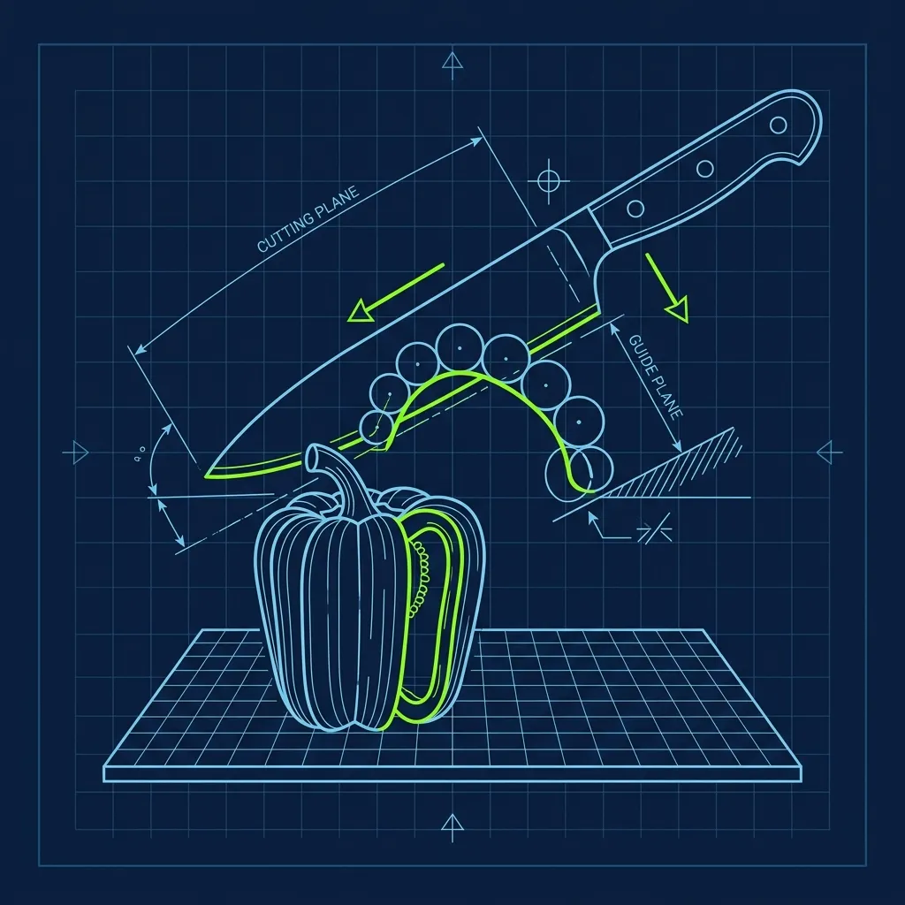
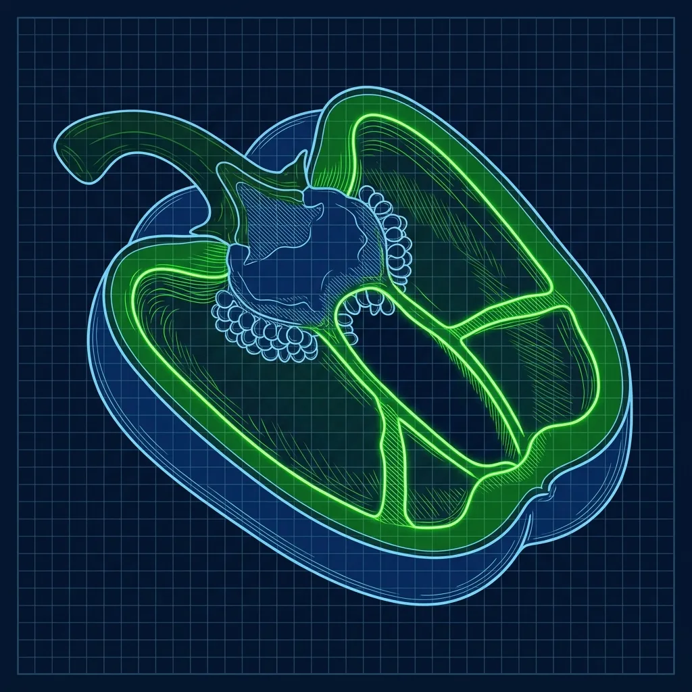

The prep shift at Chipotle starts at 6:00 AM, and for the next several hours, you are going to become intimately familiar with a chef's knife. You will slice chicken, dice onions, chop cilantro, juice limes until your hands sting, and prep enough guacamole to fill a bathtub. But the single most scrutinized task of the entire morning—the one that will make or break your prep career—is slicing the fajita veggies. 

I witnessed managers dump entire hotel pans of sliced bell peppers straight into the trash can because the cuts were sloppy. Not "sort of off." Sloppy. And the prep cook who sliced them had to start the entire batch over from scratch while the rest of the team stared. The reason comes down to operations. 

## The 1/4-Inch Rule and Why It's Non-Negotiable

The official Chipotle recipe card dictates that every single slice of bell pepper and onion must be exactly 1/4 of an inch thick. Not roughly. Not "about." Exactly. And here's the thing nobody tells you during orientation: you cannot use a mechanical slicer, a mandoline, or any other shortcut device. You must use a standard 8-inch or 10-inch chef's knife and achieve that level of precision entirely by hand. 

Across 40 to 60 pounds of raw produce. Every single morning.

Achieving this requires what culinary schools call the "claw grip," and at Chipotle, it is absolutely non-negotiable. Your non-cutting hand curls its fingers inward, knuckles pressed flat against the side of the blade to guide each cut. Your fingertips should never be exposed or extended. If a manager catches you cutting with your fingers flat and extended—the way most people slice an onion at home—they will stop you immediately and retrain you on the spot. This is not just a precision technique. When you are slicing through 50-plus pounds of produce at high speed, the claw grip is the primary defense against a trip to the emergency room.

The knives themselves matter too. Chipotle provides standard chef's knives that are sharpened regularly, either in-house with a honing rod or sent out for professional sharpening. A sharp knife is everything. A dull blade crushes bell peppers instead of slicing them cleanly, and crushed peppers release excess moisture that turns your fajita veggies into a soggy mess on the flat-top grill. I always told my prep cooks: a few passes on the honing steel before every single shift. It takes 30 seconds and it makes the difference between clean, professional cuts and ragged vegetable mush.

## Why the Size Matters More Than You Think

There are three reasons Chipotle obsesses over this, and none of them are arbitrary:

- **Grill Timing:** The fajita veggies cook rapidly on a screaming-hot flat-top grill. If some slices are half an inch thick and others are paper-thin, the thin ones will burn into black carbon while the thick ones remain raw and crunchy in the center. Uniform thickness is the only way to guarantee uniform cooking, and the grill cook does not have time during a lunch rush to babysit individual slices of bell pepper.

- **Bite Consistency:** A Chipotle burrito is all about ingredient distribution. When a customer bites into their burrito and pulls out a massive, un-cut hunk of raw onion, the experience is ruined. Consistent 1/4-inch slices break down evenly across every bite, blending with the rice, protein, and salsa the way they are supposed to.

- **Portion Control:** This is the one that surprises people. A 4-ounce serving of perfectly sliced fajita veggies looks and feels completely different from a 4-ounce serving of randomly hacked chunks. Uniform cuts mean that every customer gets visually and functionally the same amount of food. When your cuts are inconsistent, some bowls look overloaded and others look skimpy—even if the scale says they weigh the same.

## The Color Separation Challenge

The fajita veggie prep is not just about the cut. It is about how you handle the different peppers. The recipe typically calls for a mix of green bell peppers, red bell peppers, and yellow or poblano peppers, along with sliced onions. Each pepper type has a slightly different thickness and water content, which means you need to subtly adjust your pressure and speed as you switch between them. Reds are softer and will crush under too much downward force. Greens are firmer and can handle a more aggressive stroke.

The onions are their own beast entirely. Because onion layers naturally curve and separate, maintaining a true 1/4-inch slice requires you to work slowly and deliberately. More times than I can count, new hires blaze through onions at top speed, producing cuts where the outer layers are the right thickness but the inner layers are paper-thin or doubled up into half-inch chunks. Rushing through onions is how you get an entire batch rejected. Slow down, use the ridges as your guide, and let the knife do the work.

Here's a pro tip that saved me hundreds of hours: when you cut a bell pepper in half and lay it flat, the natural ridges on the inside of the pepper create visual lanes that are roughly 1/4-inch apart. Let those ridges guide your knife, and you will achieve more consistent slices with less mental effort.

## The Grill Validation Knife Test

When an employee attempts to become a Certified Grill Cook, they undergo a "Validation" test where an Area Manager or General Manager watches them prep under real-world conditions. The evaluator will literally pull out a ruler or a visual guide and measure the employee's sliced bell peppers. If the cuts are sloppy, inconsistent, or too thick, the employee fails the certification. Mastering the 1/4-inch fajita veggie slice is a fundamental rite of passage.

The reality is that validation is not a one-time pass-or-fail event, either. Even after you earn your certification, managers continue to spot-check your prep work during regular shifts. If your cut quality has slipped—maybe you got lazy, maybe your knife is dull, maybe you are rushing—you will be pulled aside for retraining. Chipotle treats consistency as an ongoing standard, not a box to check once and forget about. I've seen cooks who passed validation six months ago get their work tossed and get sent back to the cutting board for a refresher. It happens.

If you fail the knife test during validation, don't panic. It does not get you fired. You simply don't pass that day. You keep working your current role, get additional training time, and attempt again. Most employees who fail the first time pass on their second or third attempt after focused practice. The trick is to practice at home—buy a bag of onions and a cheap bell pepper from the grocery store and spend 15 minutes with the claw grip at your kitchen counter. That muscle memory translates directly to faster, more accurate prep work when you're on the clock and a clipboard is watching.

For a deeper dive into the full validation process, check out [What Actually Happens During the Chipotle Grill Validation Test](/articles/chipotle-grill-validation). And if you've made it past prep and are struggling on the line, [The Secret to Rolling a Massive Chipotle Burrito](/articles/chipotle-massive-burrito-rolling) will save your sanity during the lunch rush.

## Frequently Asked Questions

### How long does it take to prep all the fajita veggies for a full day?

It depends on the store's volume, but a typical location preps between 40 and 60 pounds of fajita veggies every morning. For an experienced prep cook, this takes about 30 to 45 minutes of continuous cutting. A new employee might take over an hour, especially if the manager makes them redo batches that don't meet the 1/4-inch standard. I've watched first-week prep cooks take nearly two hours because they kept getting batches rejected and had to start over. It's painful, but that's how you learn.

### Do you have to wear a cut-resistant glove while prepping veggies?

Chipotle requires the use of a Kevlar cut-resistant glove on the non-cutting hand during certain prep tasks, particularly when cutting proteins like chicken and steak. Policies on wearing the glove during vegetable prep can vary by store, but many managers strongly encourage it for all knife work—especially for newer employees who are still building their muscle memory. My advice: just wear it. Your pride is not worth a severed tendon.

### What happens if you fail the knife test during Grill Validation?

Failing the knife test does not get you fired. You continue working in your current role and are given additional training time to practice your cuts before attempting the validation again. Most employees who fail the first time pass on their second or third attempt after focused practice. The evaluators want you to succeed—they are not trying to trick you. They just need to see that you can maintain the standard consistently under pressure.

---
