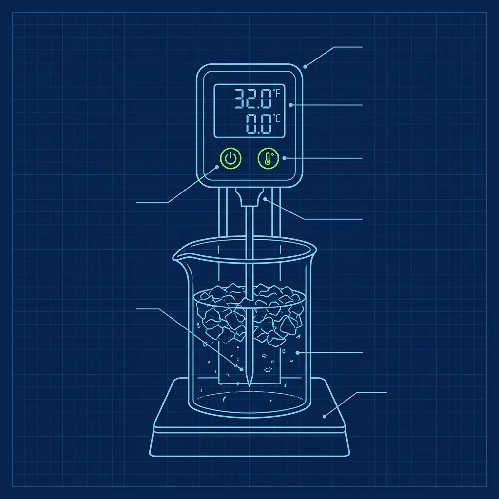

Working the grill at Chipotle is widely considered the hardest station in the restaurant. You are the engine of the entire operation. If the grill goes down—if you fall behind on chicken, run out of rice, or let the fajita veggies die—the entire line stops moving and every ticket in the restaurant backs up. I've watched lunch rushes collapse in under three minutes because the grill cook got overwhelmed and couldn't recover. 

Because the role is that critical, Chipotle doesn't just hand it to anyone. You have to earn it by passing a rigorous practical exam called Grill Validation. If you're preparing for your validation day, This is how the process actually runs: 

## What Grill Validation Actually Looks Like

Validation is not a written test. It is not a multiple-choice quiz. It is a live, hands-on performance evaluation where a manager—usually your General Manager, sometimes the Field Leader—shadows you during a real shift with a printed checklist on a clipboard. They are not jumping in to help you. They are not cooking alongside you. They are standing behind you, watching every move you make, and grading you in real time. 

> **Russell's Note:** People always ask why this tastes different at home. Simple. We aren't afraid of butter, salt, and keeping the clamshell grill screaming hot.

> **Russell's Note:** Forget the fancy gadgets. Give me a sharp 8-inch chef's knife and a 32oz deli container labeled with blue painter's tape, and I can run any station.

Here's the thing nobody tells you: they intentionally schedule validation during a peak rush period. Lunch. Sometimes dinner. They want to see you perform under genuine, full-throttle pressure—not during a dead Tuesday afternoon when orders trickle in one at a time. If you can't keep the grill stocked and the line fed while 40 customers are queued up, you are not ready for the role. The observation period typically covers 1.5 to 2.5 hours of continuous work, so they're looking for consistency over time, not just a single perfect batch.

## The 4 Key Areas That Make or Break You

### 1. The Call System and Line Communication

This is where most people fail, and it has nothing to do with cooking ability. You must constantly communicate with the line workers. You are required to accurately respond to "Calls"—when the line person shouts "Chicken working" or "Half-pan of steak," you need to confirm you heard it and give an ETA. If the line runs out of white rice and you didn't have a backup already steaming, that's an instant fail.

Communication is a two-way street. You are also expected to proactively call out when food is ready. When you have a fresh pan of chicken cut and seasoned, you announce it clearly: "Chicken up!" so the line worker can swap it in immediately. Silence from the grill station is a massive red flag during validation. It signals that you're not managing the flow—you're just reacting, and reacting means you're already behind.

Back when I was running shifts, solid cooks who could prep chicken in their sleep fail validation because they went quiet under pressure. Talk. Even if it feels awkward, narrate everything: "Chicken on the grill, temping in 4 minutes, rice has 6 minutes left." That verbal awareness is half the test.

### 2. Cut Sizes and Knife Safety

Chipotle takes its cut sizes with deadly seriousness. Chicken must be cut into exact 3/4-inch uniform pieces. [Fajita veggies must be sliced to the precise 1/4-inch specification](/articles/chipotle-fajita-veggie-cut) dictated by the corporate recipe cards. The manager will literally pick up pieces of your cut chicken and inspect the size. I've watched evaluators lay chicken pieces against a ruler.

The cut size requirement exists because it directly affects cooking time and food safety. A piece of chicken that is twice the intended size may not reach the required 165°F internal temperature in the standard cook time, creating a genuine food safety risk. Conversely, pieces that are too small will overcook, dry out, and turn into tough, chewy rubber that degrades the customer experience. Either way, you fail.

And if you are caught not wearing your Kevlar cutting glove at any point during the validation—even for a second—you fail the entire test immediately. No exceptions.

### 3. Food Safety and Temp Logs

Chipotle has arguably the strictest food safety protocols in the fast food industry. During validation, you must demonstrate proper procedure for temping chicken on the grill—hitting 165°F in multiple spots—and correctly logging it in the physical or digital Black Book.

Every single batch of protein that comes off the grill must be temped and logged. This is not a suggestion. It is not something you do when you remember. It is a non-negotiable requirement that applies to every cook on every shift. During validation, the evaluator watches to see if you temp the chicken in the thickest part of the largest piece, not just a small piece on the edge where the temperature will obviously read higher.

They will also verify that you calibrated your thermometer at the start of your shift by testing it in ice water—it should read 32°F. If you skipped calibration and your thermometer is reading 5 degrees high, every batch of chicken you temped might actually be undercooked. That's a food safety catastrophe waiting to happen, and it's an automatic fail.

### 4. Clean As You Go

A messy grill area is a failing grill area. If your cutting board is covered in raw chicken juice while you try to slice steak, you fail. If your station looks like a bomb went off, you fail. You must constantly wipe down your surfaces, swap out dirty cutting boards, and keep the rice station spotless.

The "Clean As You Go" standard means that at any random moment during your shift, your station should look organized and sanitary. Validation evaluators specifically hunt for cross-contamination risks. Using the same cutting board for raw chicken and then steak without sanitizing it in between is an automatic failure, regardless of how well you performed in every other category. I witnessed cooks ace the knife work, nail every call, temp every batch perfectly—and then fail because they forgot to swap a cutting board.

## What Happens After You Pass (or Fail)

Passing Grill Validation is a significant milestone in your Chipotle career. It officially certifies you to work the grill station independently, and it is typically a prerequisite for promotion to Kitchen Manager or Service Manager. Some stores celebrate with a shout-out during the pre-shift meeting or your name goes up on a recognition board.

Whether you get a raise depends on your store. Some locations offer a small hourly bump—typically $0.25 to $0.50—for validated grill cooks. Others tie the validation to promotion eligibility rather than an immediate pay increase. Ask your GM before your attempt so you know what's on the table.

If you fail, do not spiral. Your GM will debrief with you after the shift, walk through the specific areas where you fell short, and schedule additional training shifts before your next attempt. Most employees who fail the first time do so because of nerves, not lack of skill. There is no hard limit on attempts, but if you fail repeatedly, your GM may decide you are better suited for a different station. Most people pass within two or three tries, especially with focused practice between each one.

The secret to passing? Do a full mock run the day before. Ask an experienced grill cook to shadow you with a clipboard and give you honest feedback. Pre-stage everything before the rush hits—rice cooking, backups marinating, station fully stocked. And do not let the clipboard make you nervous. Stick to the recipe cards, vocalize everything, and never take off your cut glove.

For more on mastering the knife skills that the validation tests, read [The Strict Science of the Chipotle Fajita Veggie Cut](/articles/chipotle-fajita-veggie-cut). And once you're validated, you'll want to make sure the line side of the house can keep up—check out [Rolling a Massive Double-Meat Burrito](/articles/chipotle-massive-burrito-rolling).

## Frequently Asked Questions

### How long does the Grill Validation test take?

The validation typically covers one full rush period—roughly 1.5 to 2.5 hours of observed performance. The evaluator watches you for the entire duration, not just a few minutes. They want to see consistency over time: can you maintain cut standards, communication, food safety, and station cleanliness simultaneously when you're 90 minutes deep into a lunch rush and your arms are starting to burn?

### Can you use notes or recipe cards during the validation?

Yes, and you should. Chipotle expects its grill cooks to reference the recipe cards—having them visible at your station during validation is not a sign of weakness, it shows you take accuracy seriously. What you should not need notes for is the physical technique: knife skills, grill timing, and station workflow should be muscle memory by the time you attempt validation.

### Do you get a raise for passing Grill Validation?

This varies by store and Operator. Some locations offer a small hourly raise—typically $0.25 to $0.50—for validated grill cooks, while others tie the validation to promotion eligibility rather than an immediate pay increase. Ask your GM about your store's specific policy before your validation attempt so there are no surprises.

---
