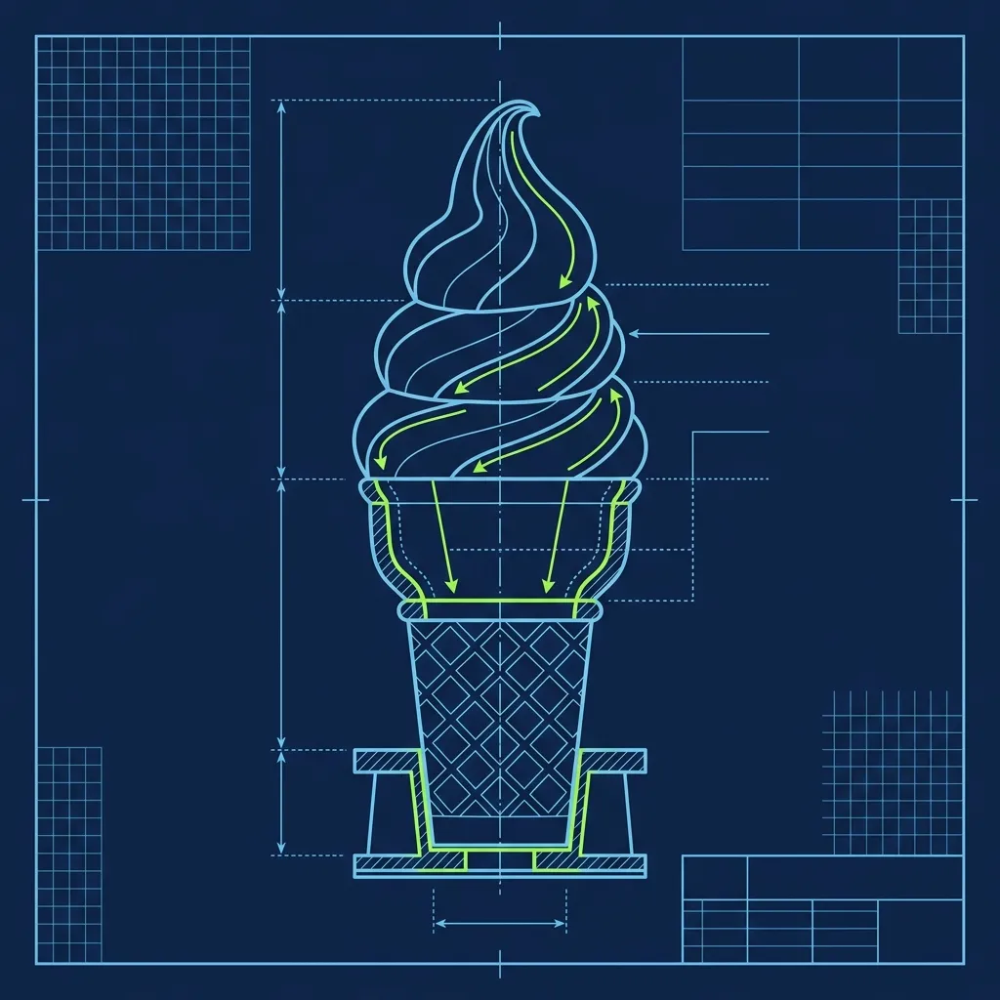
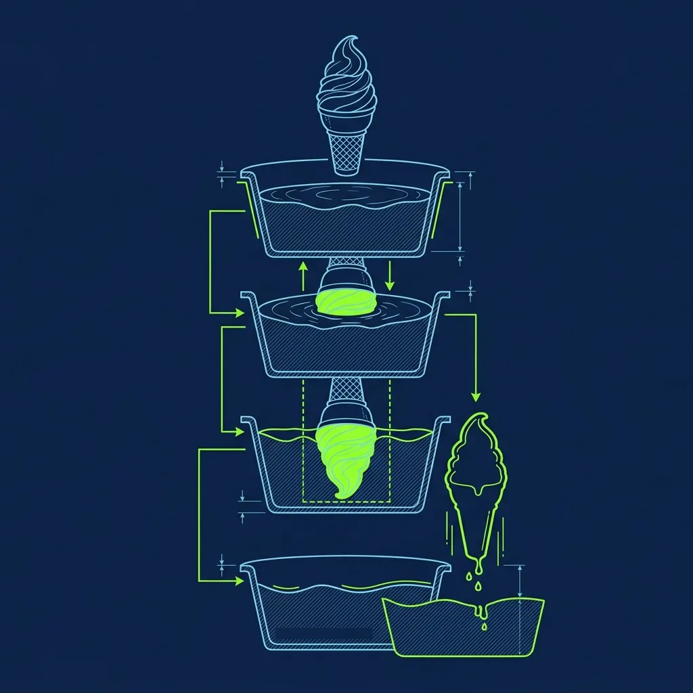

At Dairy Queen, making an ice cream cone is not just about pulling a lever and hoping for the best. Every single cone that leaves the counter—small, medium, or large—must have the brand's iconic signature sitting right on top: the Curl. That perfect little "Q" swirl of soft serve that loops back onto itself like a question mark made of frozen cream. 

I've watched new Chill Staff employees stare at the soft serve machine with genuine dread during their first training shift. The curl looks effortless when a veteran does it. It looks impossible when you try it yourself for the first time and end up with a lopsided blob that slowly slides off the side of the cone like a melting glacier. Let me walk you through it. 

## The Foundation: Building in Tiers

You do not just swirl soft serve into one continuous, messy mountain. A proper Dairy Queen cone is built in distinct tiers, internally referred to as "balls." Each ball is a deliberate, controlled layer: 

> **Russell's Note:** The Sysco truck being late will ruin a prep shift faster than anything else. You learn to pivot immediately or the lunch rush will crush you.

> **Russell's Note:** Any BOH veteran will tell you: the walk-in cooler is the only soundproof place to take a 30-second mental break when the KDS screen is totally full.

- A **Small** cone gets 2 balls and a curl
- A **Medium** cone gets 3 balls and a curl
- A **Large** cone gets 4 balls and a curl

Each ball has a specific weight and volume that contributes to the overall portion size. This tiered system isn't just about making the cone look pretty—it ensures that every customer gets the correct amount of ice cream regardless of who's working the machine. A perfectly built medium cone should weigh the same whether a ten-year veteran or a first-week hire made it. When a manager puts your cone on a scale during training and it comes in an ounce light or an ounce heavy, you know your tiers are off.

## The Technique: Base, Tiers, and the Snap

The entire cone is built in one continuous motion. You don't stop and restart between tiers—it's a flowing sequence that takes about 5 to 8 seconds total.

1. **The Base:** Hold the cone completely straight under the spigot, centered. Pull the handle down fully, letting the ice cream fill the inside of the cone first. This is your hidden foundation—the ice cream inside the wafer cone that the customer never sees but that gives the cone its structural stability.

2. **The Tiers:** As the ice cream rises above the rim of the cone, you quickly lower the cone about an inch, creating the first visible ball. Then push it slightly back up into the flow of ice cream to create a visual ridge—a clear line between the first ball and the second. Repeat this down-and-up motion for the required number of tiers. Each tier should be roughly the same size, stacked directly on center.

3. **The Curl:** This is the moment of truth. Once you have the final tier built, you push the handle up to completely stop the flow of ice cream. As the flow stops, you quickly jerk your wrist down and twist it in a tight, circular "C" motion. The remaining soft serve stretching from the spigot to the cone snaps cleanly, and the tail folds over onto itself in a perfect little loop.

The wrist motion for the curl is what takes the most practice. If you twist too slowly, the tail of ice cream droops and hangs limply off the side like a sad flag. If you twist too aggressively, the tail snaps off completely and you lose the curl entirely—just a flat, decapitated stump where the signature should be. The sweet spot is a quick, confident flick, almost like snapping a whip, combined with a slight downward pull that gives the tail just enough length to loop back over.

I always told new hires: watch the ice cream, not your hand. New employees tend to stare at their own wrist during the curl, which throws off their timing completely. Focus on the point where the ice cream meets the cone. You'll develop a better feel for when to snap the tail by watching the product itself rather than obsessing over your hand movement.

## The Machine Calibration Factor

Here's the thing nobody tells you: even with perfect technique, your cones will look wrong if the machine is not properly calibrated. The soft serve machine has adjustable settings for temperature and overrun—the amount of air mixed into the product—and both directly affect how the ice cream behaves.

If the mix is too warm, the ice cream will be runny and won't hold its shape. The tiers will melt into each other and the curl will droop immediately, no matter how good your wrist snap is. If the mix is too cold, the soft serve will be overly stiff and will break instead of flowing smoothly, making the curl impossible—you'll get jagged, fractured edges instead of a clean loop.

Most stores calibrate their machines first thing in the morning, but temperatures can drift throughout the day, especially during a busy summer afternoon when the machine is running nonstop. If you notice your cones suddenly aren't holding their shape despite good technique, don't blame yourself—alert a manager. The machine likely needs a quick recalibration. During one shift, I noticed new employees spiral into frustration thinking their skills disappeared when it was the machine's temperature that shifted two degrees.

## The Chocolate Dip: Where Cones Go to Die

If you thought the curl was hard, try dipping it in chocolate. The Chocolate Dipped Cone is the single most terrifying order for a new Chill Staff employee, and for good reason.

You take your perfectly curled masterpiece—the cone you just spent 8 seconds carefully building—turn it completely upside down, and submerge it into a heated vat of liquid chocolate coating. You are dunking frozen soft serve into warm liquid chocolate and trusting that physics will let you pull it back out intact.

The dipping motion must be a single, fluid action: invert the cone, submerge it to just above the rim of the wafer, and immediately pull straight back up. Do not swirl the cone around in the chocolate. Do not admire your work. Any extra movement increases the time the ice cream is exposed to the warm coating, and that warm coating is actively melting your soft serve from the outside in. You have roughly 1.5 seconds before the structural integrity of the cone starts to fail.

If your ice cream is too warm, or if you hesitate and hold it in the chocolate for even a half-second too long, the entire soft serve structure will slide off the wafer cone and plunge to the bottom of the chocolate vat. This is a disaster. The melted ice cream contaminates the entire vat of chocolate coating. A manager has to drain the vat, clean it out thoroughly, and refill it with fresh coating. It's expensive, it's time-consuming, and it will earn you the most withering look a shift lead has ever given another human being. It is one of the most dreaded mistakes a Chill Staff employee can make.

Once you pull the cone out cleanly, hold it inverted for about two seconds to let the excess chocolate drip off, then flip it right-side up. The chocolate coating hardens almost instantly when it contacts the cold soft serve, creating that satisfying snap-when-you-bite-it shell. Speed and confidence are the only path to success. Hesitation is how cones die.

For the other DQ skill that haunts new employees' nightmares, check out [Why Dairy Queen Flips Blizzards Upside Down](/articles/dairy-queen-blizzard-flip). And if you want to see what ice cream equipment maintenance looks like at another chain, [The Wendy's Frosty Machine Boil-Out](/articles/wendys-frosty-machine-boil-out) is its own special kind of ordeal.

## Frequently Asked Questions

### How long does it take to learn the perfect curl?

Most new employees start producing consistently acceptable curls after about one to two weeks of regular practice. But doing it at speed during a rush—while simultaneously managing Blizzard orders, working the register, and restocking toppings—takes closer to a full month before it feels natural and automatic. The curl in isolation is one thing. The curl under pressure with six customers watching is something else entirely.

### What happens if you drop a cone into the chocolate dip vat?

The soft serve melts into the warm chocolate and contaminates the entire vat. A manager has to drain it, scrub it clean, and refill it with fresh chocolate coating. It's one of the most expensive single mistakes a Chill Staff employee can make, and it usually earns a quiet but very memorable conversation with the shift lead. The fix takes 15 to 20 minutes, during which no dipped cones can be sold.

### Does every DQ location require the curl?

Yes. The curl is a brand standard mandated by Dairy Queen corporate. Every cone served at every location is expected to have the signature curl on top. If a cone goes out without it, the cone technically does not meet brand standards. Enforcement varies by store and by how busy the shift is, but the expectation is universal. The direction of the curl doesn't matter—left-handed employees can twist the opposite way and produce a mirror-image curl that's perfectly acceptable.

---
