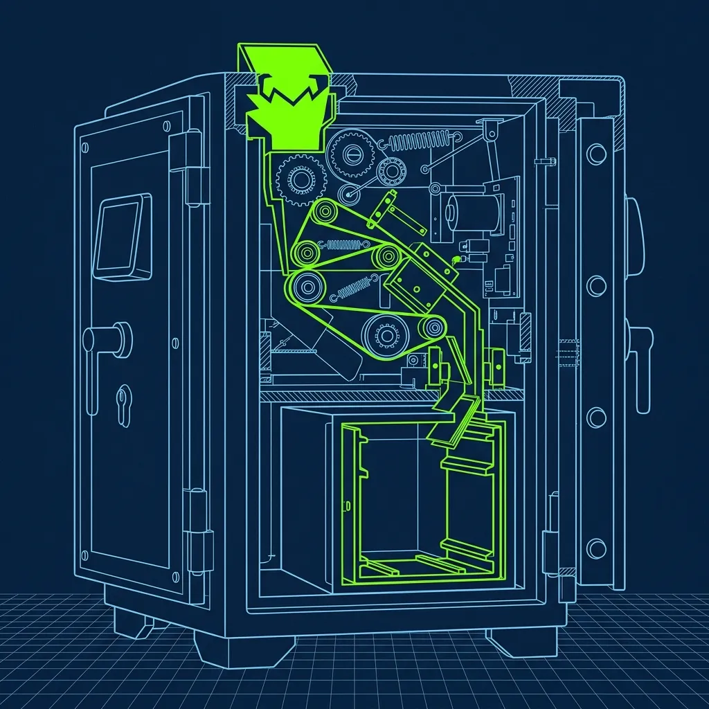
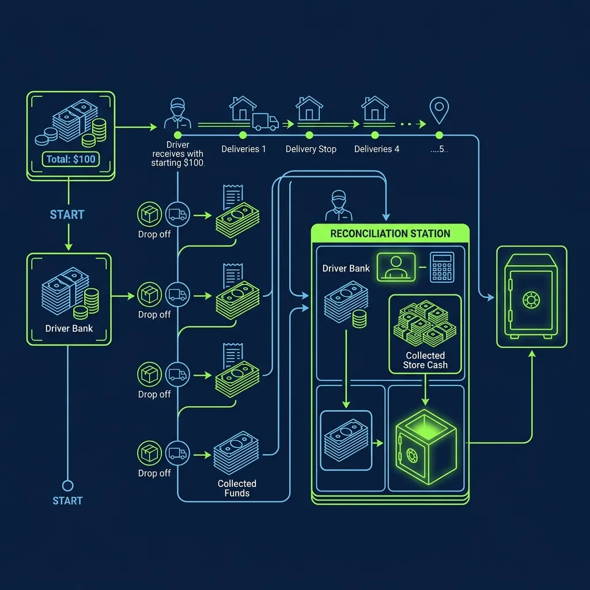

Delivering pizzas late at night sounds straightforward until you realize you're driving through unfamiliar neighborhoods in the dark with cash in your pocket and a lit-up car topper advertising exactly where you work. Delivery drivers are targets, and every major pizza chain knows it. That's why Domino's—and virtually every other delivery-focused chain—enforces one of the strictest, most non-negotiable safety policies in the industry: the $20 Bank Rule. 

I've managed stores where drivers got robbed. I've had the conversations with the police, the corporate risk team, and the shaken driver sitting in the back office afterward. This rule exists because it works, and violating it is one of the fastest ways to get yourself instantly terminated. Step by step, this is the workflow: 

## How the $20 Bank Works

When you clock in for a delivery shift, the manager hands you a "bank." It is exactly $20 in small bills—typically a ten, a five, and five ones. This money is not yours. It belongs to the store. Its sole purpose is to provide change to customers who pay for their pizzas with cash. 

> **Russell's Note:** The Sysco truck being late will ruin a prep shift faster than anything else. You learn to pivot immediately or the lunch rush will crush you.

> **Russell's Note:** Time to lean, time to clean. It's an annoying cliché, but when the health inspector (the ultimate clipboard warrior) shows up unannounced, you'll be glad you wiped down the low-boys.

The rule is absolute: you are never, under any circumstances, allowed to have more than $20 of the store's money in your possession while out on a delivery. The stickers plastered on every Domino's delivery bag, every store window, and often on the car topper itself all say the same thing: "Driver Carries Less Than $20."

At the end of your shift, you must return the bank in full. If you come back short, the difference comes out of your pocket. If you come back with more than $20 of store money because you skipped a cash drop, you are in violation of policy—and the store cares a lot more about the violation than the money.

## The Cash Drop System

Here's where the rule gets operationally real. A customer hands you a $50 bill for a $30 pizza. You give them $20 in change from your bank. Now you are holding a $50 bill—the store's money—and you are in violation of the rule until you get back and drop it.

The moment you walk back through the store's door, the very first thing you do is perform a Cash Drop. You go directly to the manager's station or the store's smart safe—a small, secure lockbox bolted to the floor or counter—and slide the $50 bill into the slot. The system logs that you deposited the money, your cash-on-hand resets, and you are back in compliance.

This is not optional. It is not something you do "when you get around to it." The expectation is that the cash drop happens before you grab your next delivery, before you use the restroom, before you check your phone, before you do literally anything else. Some managers will stand at the door and physically watch you walk from the entrance to the safe. If you leave for your next delivery with $70 in your pocket because you forgot to drop or got distracted, you are painting a target on yourself every mile you drive.

I've fired drivers for this. Not because I wanted to—because the policy is ironclad and corporate will audit your cash drop logs. If there's a pattern of late drops or skipped drops, the franchisee is going to hear about it, and the conversation rolls downhill fast.

## The Double and Triple Run Complication

The $20 rule gets complicated during busy Friday and Saturday nights when drivers take multiple deliveries per run. If you're carrying two or three orders at once—a "double" or a "triple"—you might collect cash from multiple customers before returning to the store.

On a triple run, you can easily accumulate $60 or more in store cash before you make it back. Experienced drivers handle this by keeping the money organized: separating each customer's payment into different pockets or small envelopes, mentally tracking what belongs to the store versus what's a tip. The instant they walk through the door, they drop everything that isn't their tip money or their original $20 bank.

Some veteran drivers will even detour back to the store between deliveries on a particularly cash-heavy night, just to drop the money and stay compliant. It costs them a few minutes, but it eliminates the risk. I always respected that move—it showed the driver understood why the rule exists, not just that the rule exists.

## Why Enforcement is This Aggressive

The enforcement is not about the money. Twenty dollars is not going to make or break a Domino's franchise. The enforcement is entirely about driver safety and deterrence.

If a criminal knows that holding up a Domino's driver will net them a maximum of $20, the risk-to-reward ratio plummets. A robbery carries serious criminal charges. Risking those charges for $20 is a dramatically less attractive proposition than risking them for $200. The stickers, the signage, the policy itself—it all exists to communicate one message to potential robbers: there is almost nothing to take.

If a manager does a random pocket check and finds $80 in your wallet from previous cash deliveries you forgot to drop, you will be severely reprimanded or terminated on the spot. The store doesn't care about recovering the $80. They care that you spent the last hour driving around neighborhoods advertising "I have significantly more cash than advertised." You were a liability to yourself and to the brand's safety reputation.

The policy also protects the store from internal theft. When every dollar is tracked through the cash drop system, it becomes extremely difficult for a driver to skim money from cash orders. The system creates a paper trail that accounts for every dollar collected on every delivery, which is reconciled at the end of the night during the cash-out process. If your numbers don't add up, the system flags it, and the conversation is not a pleasant one.

Domino's official policy on actual robberies is simple: comply fully. Hand over the money. Do not resist. Drive away as soon as it's safe. Call 911 and your store manager immediately. The store absorbs the loss—the driver is never held financially responsible for money taken during a robbery. The entire point of the $20 rule is to make sure that worst-case scenario involves losing $20, not $200.

For more on the financial realities of delivery driving, check out [Do Domino's Drivers Pay For Their Own Gas?](/articles/dominos-gas) and [What Does the Oven Tender Role Actually Do?](/articles/dominos-oven-tender-role). If you're worried about the risks of the job, [What Happens if a Pizza Delivery Driver Gets in an Accident](/articles/pizza-delivery-driver-accident) covers the insurance side.

## Frequently Asked Questions

### Can customers tip with cash without it violating the rule?

Yes. Cash tips are yours to keep and are not counted as part of the store's bank. However, if a cash tip pushes your total cash-on-hand significantly over $20, you should still perform a cash drop when you return to the store to stay within the spirit of the policy. Some stores require you to drop everything except the original $20 bank—tips included—and then your accumulated tips are returned to you at the end of the shift during cash-out. Ask your manager which system your store uses on your first day.

### What if a customer doesn't have exact change and you can't make change from your $20?

If a customer hands you a $100 bill for a $25 order and you don't have enough in your bank to make change, you politely explain that drivers carry limited cash and suggest they pay with a card or a smaller bill. If they insist, you call the store for guidance. The one absolute rule: never leave a delivery without collecting payment. That creates an accounting gap that is far worse than an awkward conversation at the door.

### Do you carry your personal wallet separately from the bank?

Most experienced drivers leave their personal wallet locked in the glove compartment or trunk during deliveries. Your personal cash, credit cards, and ID stay physically separate from the store's bank money. If someone does attempt a robbery, you hand over the bank only. Your personal belongings stay hidden and protected. It's a small habit that makes a big difference in a worst-case scenario.

---
