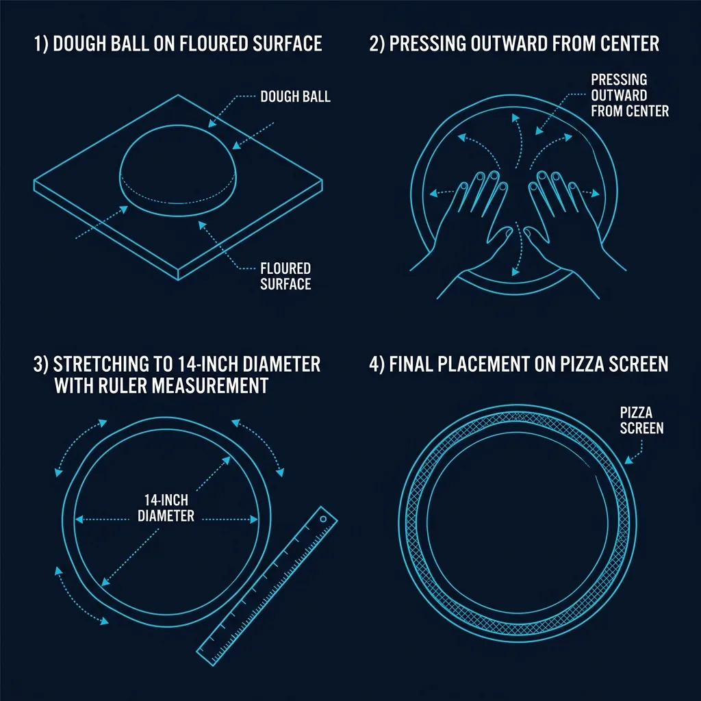
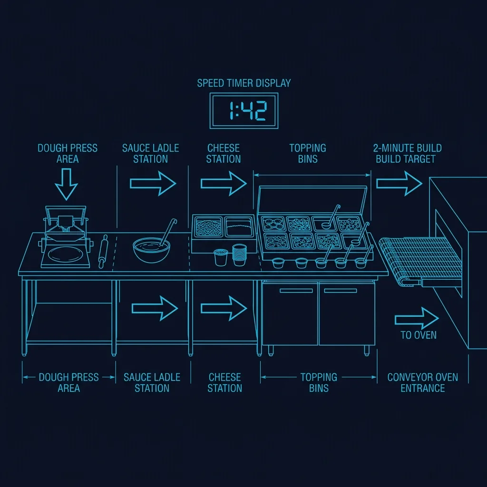

## The Dough Does Not Arrive as Dough

This is one of the most common misconceptions about Domino's. People assume the stores are mixing flour and water in back. They are not. **Domino's dough arrives pre-made from a regional commissary** in the form of individual dough balls, each one weighed to correspond to a specific pizza size. 

> **Russell's Note:** When your KDS screen is going red on a Friday night, the last thing you want is a broken line. You have to run a 120-second window or you're dead in the water.

> **Russell's Note:** Time to lean, time to clean. It's an annoying cliché, but when the health inspector (the ultimate clipboard warrior) shows up unannounced, you'll be glad you wiped down the low-boys.

A small pizza uses a smaller dough ball. A large uses a bigger one. An XL Brooklyn-style uses the largest. Every single dough ball is the same weight for its size class, down to the gram. This is how Domino's maintains consistency across 19,000+ locations worldwide. 

The dough balls arrive refrigerated in stacked trays and are placed directly into the walk-in cooler. Before they can be used, they need to be pulled out and allowed to **proof at room temperature** — a process that typically takes 45-60 minutes, during which the yeast activates and the dough becomes pliable enough to stretch. 

This is why prep timing matters so much. If the morning crew doesn't pull enough dough trays in time, the evening rush crew is stretching cold, resistant dough that tears easily and won't hold its shape.

## The Hand-Stretch Process

Domino's does not use a dough press or a sheeter machine for its standard hand-tossed crust. Every pizza is **hand-stretched by the person working the makeline**.

### Step 1: Cornmeal and Flour the Surface

The stretch starts on a floured prep surface. A light dusting of cornmeal goes down first — this serves a dual purpose. It prevents sticking, and it creates that slightly gritty texture on the bottom of the crust that becomes crunchy in the oven.

### Step 2: Press From the Center

The dough ball is placed on the floured surface and **pressed outward from the center using fingertips, never a rolling pin**. Rolling pins compress the gas bubbles that the yeast created during proofing. Fingertip pressing preserves those bubbles, which is what gives the finished crust its airy, bread-like structure.

A common rookie mistake is pressing too aggressively in the center, creating a paper-thin spot that tears during baking or when toppings are added. Experienced stretchers develop a feel for how thin is "thin enough" — typically about 3-4mm in the center.

### Step 3: Stretch to Size

Once the center is pressed out, the dough is picked up and allowed to hang while the stretcher rotates it, letting gravity do the work of widening the circle. This is the closest thing to "tossing" that happens at Domino's, though it's nothing like the theatrical spinning you see at independent pizzerias.

The target diameter depends on the size ordered:
- **Small:** 10 inches
- **Medium:** 12 inches
- **Large:** 14 inches
- **XL Brooklyn:** 16 inches

The store has **sizing rings** or marked spots on the prep surface to verify the diameter. Undersized pizzas are a customer complaint waiting to happen. Oversized pizzas waste dough and throw off food cost.

### Step 4: Place on the Screen

The stretched dough is placed onto a **pizza screen** — a flat, perforated metal disk that goes directly into the oven. The screen's perforations allow heat to reach the bottom of the crust, which is how the bottom gets crispy without needing a brick oven or a stone deck.

## The Makeline: Where Speed Is Everything

The makeline is the assembly station where the pizza goes from raw stretched dough to a fully topped pie ready for the oven. At Domino's, this station is engineered for speed above all else.

### The Layout

From left to right, a standard Domino's makeline looks like this:

1. **Dough/stretch area** — where the hand-stretching happens
2. **Sauce station** — a ladle or squeeze bottle of sauce with a pre-measured portion
3. **Cheese station** — shredded mozzarella in a large bin
4. **Topping bins** — a refrigerated rail of 15-20 toppings, each in its own compartment
5. **Oven entrance** — the conveyor belt that feeds into the impinger oven

### The 2-Minute Build Target

Domino's internal training sets a target of **2 minutes or less** to build a pizza from the moment the order ticket prints to the moment the pizza enters the oven. This includes stretching the dough, saucing, cheesing, and applying all toppings.

For a simple one-topping pizza, this is very achievable. For a specialty pizza with 5+ toppings, it's a genuine challenge — especially when multiple orders are printing simultaneously during a Friday night rush.

### Portioning: The Hidden Skill

Every topping has a **specified portion weight** that corresponds to each pizza size. For example, a large pizza might call for exactly 8 ounces of mozzarella and 24 slices of pepperoni.

In practice, experienced makeline workers don't weigh every pizza. They develop a muscle memory for what the correct amount looks like. But new hires are often tested with a scale during their first few weeks — a manager will randomly weigh a completed pizza to check whether the portions are accurate.

Over-portioning is a bigger problem than under-portioning. A team member who consistently throws on too much cheese might not get complaints from customers, but they'll absolutely get a conversation from the manager when food cost percentages come back high at the end of the week.

## The Oven: It's Not What You Think

Domino's does not use traditional pizza ovens. They use **Lincoln Impinger conveyor ovens** — a long, tunnel-shaped oven with a conveyor belt that moves the pizza through at a fixed speed.

### Why Conveyor Ovens?

The conveyor oven removes the single biggest variable in pizza cooking: human judgment. There's no "checking if it's done." The oven is set to a specific temperature (typically **475-500°F**) and the conveyor belt moves at a specific speed (typically **6-7 minutes** from entrance to exit).

Every pizza that enters the oven exits the oven at the exact same time. Whether a new hire or a 10-year veteran placed it on the belt, the cook time is identical. This is how Domino's achieves consistency at scale.

The trade-off is flexibility. A conveyor oven can't do a "well-done" pizza the way a deck oven can (by simply leaving it in longer). To adjust doneness, you'd have to change the conveyor speed, which affects every pizza in the oven at that moment.

## The Cut Table: Where It All Comes Together

After exiting the oven, the pizza hits the **cut table** — the final station before boxing. The cut table worker:

1. Slides the pizza off the screen onto the cutting surface
2. Cuts with a **rocker blade** (not a wheel cutter — rocker blades are faster)
3. Verifies the order against the ticket (correct toppings, correct size)
4. Boxes it and routes it to either the delivery shelf or the carryout warmer

During a rush, the cut table is arguably the most stressful position in the store. Pizzas are coming off the conveyor at a constant rate, and if the cut table falls behind, there's literally nowhere for the pizzas to go. They start piling up on the oven exit, and the ones sitting there continue to cook from residual heat, becoming overdone.

## Why This System Works — And Where It Breaks Down

Domino's makeline system is a marvel of fast food engineering. It takes one of the most variable food products imaginable — a hand-stretched, hand-topped pizza — and forces it through a system so standardized that any trained employee can produce a consistent result.

But the system breaks down at the same point it always does in QSR: **volume versus labor**. When order volume spikes beyond the makeline's capacity and the store is short-staffed, the 2-minute build target becomes impossible. Dough gets rushed and tears. Toppings get eyeballed instead of portioned. The cut table backs up.

The stores that handle this well are the ones where the manager is actively managing the line — calling out orders, re-routing staff to bottleneck positions, and pulling extra dough trays from the walk-in before they're needed. The stores that handle it poorly are the ones where the manager is answering phones in the front while the makeline collapses behind them.

That's the difference between a great Domino's and a mediocre one. The system is the same everywhere. The execution is not.
