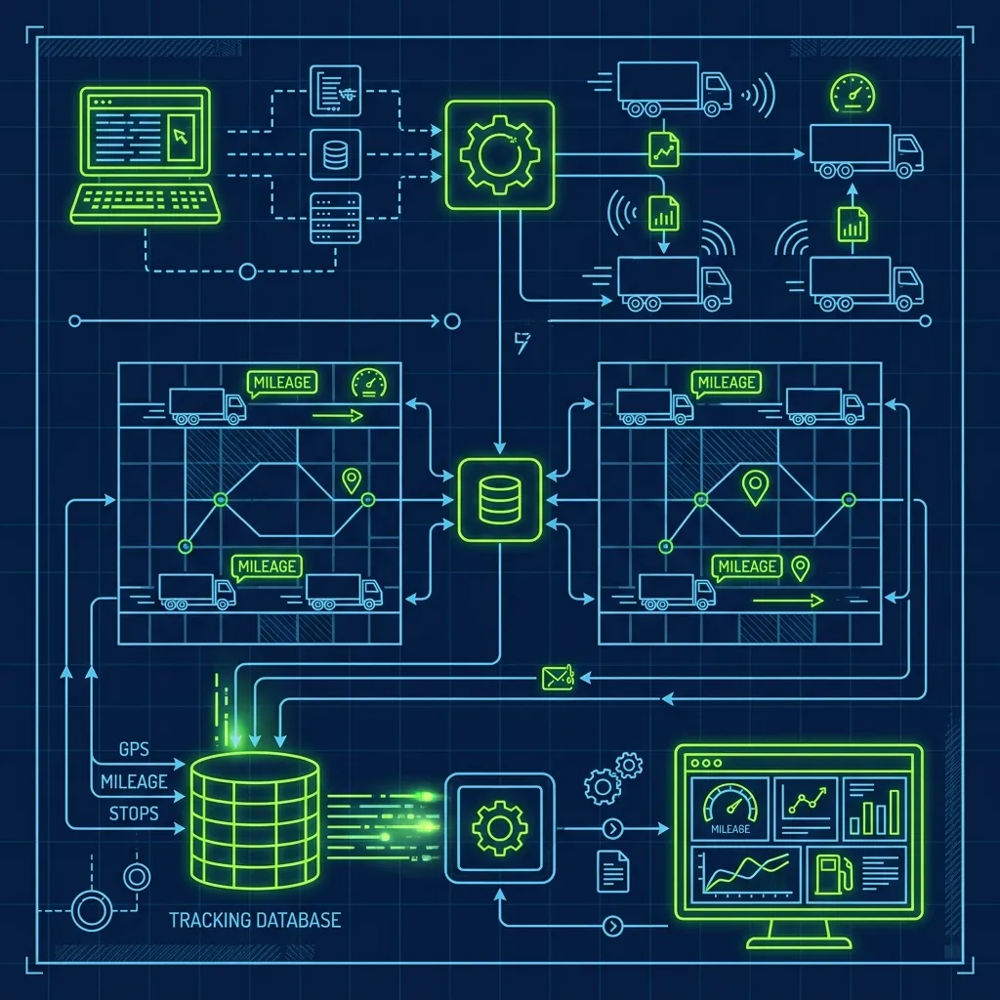
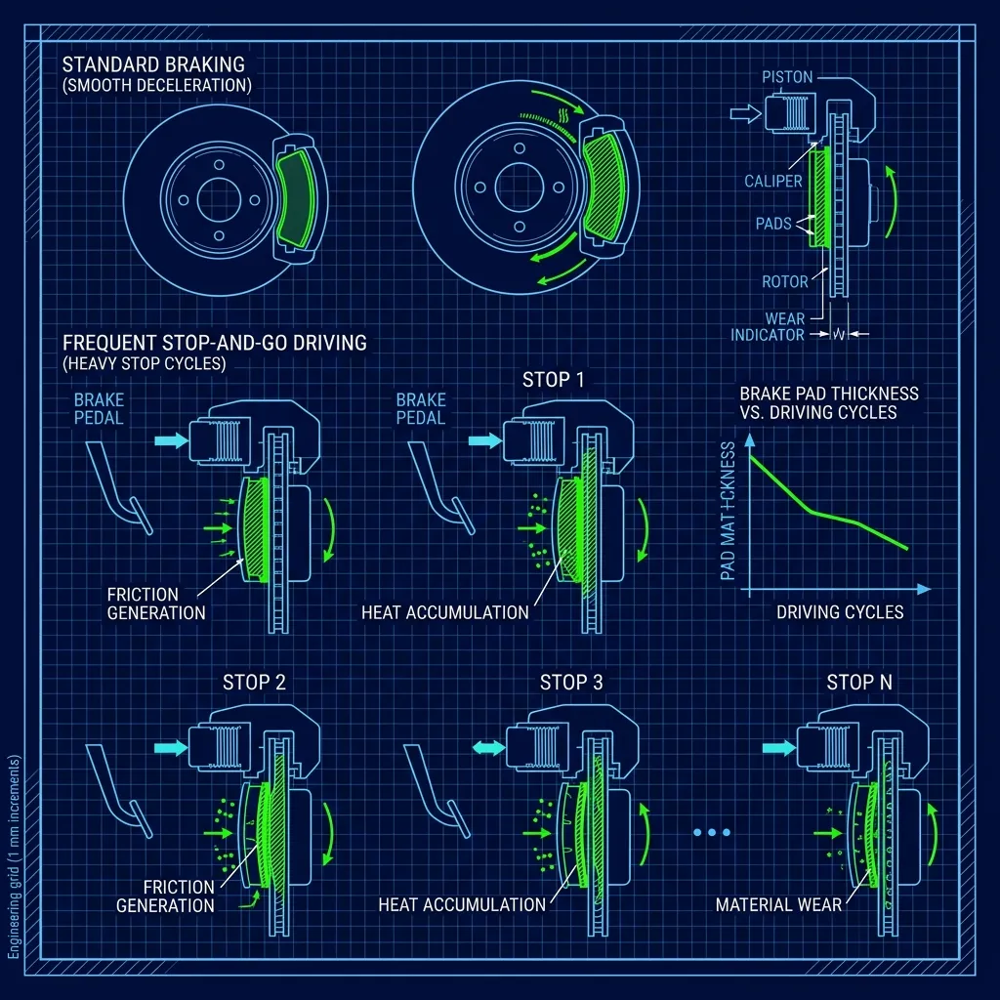

Here's the conversation I had with almost every single delivery driver applicant who walked through my door: "So do I pay for gas, or does Domino's?" The answer is both simpler and more complicated than you'd expect, and the difference between a driver who clears $25 an hour on a Friday night and one who barely breaks even usually comes down to understanding exactly how the money works before they accept the job. 

## The Short Answer: You Pay at the Pump, They Pay You Back

> **Russell's Note:** When your KDS screen is going red on a Friday night, the last thing you want is a broken line. You have to run a 120-second window or you're dead in the water.

> **Russell's Note:** People always ask why this tastes different at home. Simple. We aren't afraid of butter, salt, and keeping the flat top screaming hot.

Yes, you fill up your own tank with your own money. Domino's does not hand you a corporate gas card. There's no fleet fuel account. You drive to the gas station on your way to work, swipe your debit card, and that's that. 

But here's the thing nobody tells you during the interview—Domino's reimburses you for every mile you drive on the clock. At the end of every single shift, when the manager "cashes you out," your mileage reimbursement is rolled into your take-home pay along with your credit card tips and any cash adjustments. The store's dispatch computer tracks the distance from the store to each delivery address and back, so the mileage calculation isn't something you have to argue about. It's automatic. 

The reimbursement rate varies by franchise, but most stores I've worked with or managed paid somewhere between $0.35 and $0.45 per mile. Some adjust quarterly based on local gas prices. Others haven't touched the rate in three years. This is one of those things you absolutely need to ask about before you accept the position.

## Per-Mile vs. Per-Delivery: The Debate That Actually Matters

Most Domino's franchises use one of two reimbursement models, and which one your store uses will directly impact your nightly take-home more than most new drivers realize.

**Per-mile reimbursement** means the computer calculates the exact round-trip distance for every delivery you take, and you get paid a set rate for each mile. If you're delivering to suburban neighborhoods five or six miles from the store, this adds up fast. I've seen drivers on per-mile reimbursement clear $15 to $20 in mileage alone on a busy Friday, on top of their hourly wage and tips.

**Per-delivery flat rate** means you get a set amount—usually $1.00 to $1.50—for every delivery you complete, regardless of distance. Take a double? You get the rate twice. This model favors drivers in dense urban areas where every drop is a mile or two from the store. If you're running short deliveries all night, a $1.25 flat rate on a 1.2-mile round trip works out to over a dollar per mile in effective reimbursement. That's excellent.

The reality is that per-mile is better for suburban and rural stores, and per-delivery is better for dense city stores. Before you accept a driver position at any specific franchise, ask the manager which model they use and what the current rate is. I've seen drivers transfer from one franchise to another across town and gain $30 a week just because the reimbursement model better fit their delivery area. It's that significant.

## The Math: Is the Reimbursement Actually Enough?

Let me run the numbers I used to show new hires during orientation, because this is where the job either makes sense or doesn't.

If gas costs $3.50 per gallon and your car gets 30 miles per gallon (think Honda Civic, Toyota Corolla, Hyundai Elantra), each mile costs you roughly $0.12 in fuel. If the store reimburses you at $0.40 per mile, you pocket $0.28 per mile in pure reimbursement profit—money that goes toward nothing but your bank account. On a 60-mile shift, that's nearly $17 in reimbursement surplus before you count a single dollar of tips or hourly pay.

Now flip it. If you're driving a V8 pickup that gets 14 miles to the gallon, that same mile costs you $0.25 in fuel. Your reimbursement surplus just dropped to $0.15 per mile, and that's before you factor in the accelerated wear on a heavier vehicle. I've seen new hires show up in lifted trucks and wonder why they're barely breaking even after gas. The vehicle you drive is the single biggest variable in whether delivery driving is profitable.

**The verdict:** If you're driving a fuel-efficient sedan, Domino's delivery is one of the best-paying hourly jobs in fast food. Drivers at my stores regularly averaged $20 to $25 an hour on busy nights when you combined their $7.25 to $9 hourly rate, tips, and mileage reimbursement. But you need the right car.

## The Hidden Costs Nobody Mentions in the Interview

The mileage reimbursement covers your gas and then some—but it does not cover the accelerated wear and tear on your vehicle. Delivering 50 to 100 miles per shift, four or five nights a week, puts serious stress on your car. Here's what I saw drivers dealing with constantly:

- **Oil changes every 6 to 8 weeks** instead of every 3 to 4 months. You're racking up miles fast, and skipping oil changes in a high-mileage delivery car is a recipe for engine failure.
- **Brake pads every 8 to 12 months.** All that stop-and-go driving in neighborhoods wears pads down much faster than highway commuting.
- **Tires every 12 to 18 months.** Between potholes, speed bumps, and constant turning, your tread wears unevenly and quickly.
- **Insurance complications.** Some providers require a commercial or delivery rider if they find out you're using your personal vehicle for commercial deliveries. Not all charge extra, but driving without proper coverage can leave you personally liable if you get into an accident on a delivery run. This is not a small risk—read our guide on [what happens if a pizza delivery driver gets in an accident](/articles/pizza-delivery-driver-accident) for the full breakdown.

The smartest drivers I ever managed set aside $5 to $10 per shift from their reimbursement surplus into a separate savings account dedicated exclusively to vehicle maintenance. When the brake job came due six months later, the money was already there.

## The Tax Angle Most New Drivers Miss Completely

Here's the thing nobody tells you, and it's potentially worth hundreds or even thousands of dollars a year: as a delivery driver using your personal vehicle for work, you can deduct your mileage on your taxes using the IRS standard mileage rate. That rate is often significantly higher than what the store reimburses you—and it's calculated on top of whatever the store already paid you.

To claim it, you need documentation. I always told my drivers to download a free mileage-tracking app on day one—something that runs in the background and automatically logs every delivery trip. Without a log, you cannot claim the deduction, and you are literally leaving money on the table every single pay period.

For more on how the cashout process works at the end of every shift, check out [The Domino's $20 Bank Rule explained](/articles/dominos-20-bank-rule).

## Pro Tips for New Domino's Delivery Drivers

1. **Fill up before your shift, never during.** Starting with a full tank means you never have to stop for gas mid-rush. On a busy Friday night, every minute at the pump is a delivery—and a tip—that went to another driver. I've watched drivers lose $15 to $20 in tips over a shift because they had to fuel up at 7 PM.

2. **Learn every shortcut in your delivery area within the first two weeks.** GPS apps are fine, but they don't know that the alley behind Oak Street cuts two minutes off the route to the apartment complex on 5th. Veteran drivers who know their area cold can run deliveries 20 to 30% faster than GPS-reliant rookies, which means more deliveries per hour and more tips per shift.

3. **Track your total vehicle expenses, not just gas.** Keep receipts for oil changes, tire rotations, brake work, and even car washes. Your accountant or tax software will thank you, and you'll have a clear picture of your true hourly earnings after all vehicle costs are factored in.

If you're considering the inside positions instead, take a look at [what the Oven Tender role actually involves](/articles/dominos-oven-tender-role)—it's the highest-pressure station in the building and a completely different kind of challenge.

## Frequently Asked Questions

### Does Domino's provide a delivery vehicle?

No. The vast majority of Domino's franchise locations require drivers to use their own personal vehicle with valid insurance and current registration. A handful of corporate-owned or ultra-high-volume urban stores may have company cars or e-bikes, but this is extremely rare. If you don't have a reliable car, you cannot work as a delivery driver—full stop.

### What happens when gas prices spike suddenly?

Some franchises adjust their per-mile reimbursement rate periodically to reflect local gas price changes, but this is not guaranteed, and the adjustments frequently lag behind actual price increases by weeks or even months. During the gas price surges I managed through, my best drivers compensated by being more strategic about routing—taking doubles and triples whenever possible to maximize deliveries per mile driven.

### Is it worth delivering in a hybrid or electric vehicle?

Absolutely. A hybrid or EV dramatically reduces your per-mile fuel cost, which effectively turns the mileage reimbursement into near-pure profit. I had a driver running a Prius who cleared more in reimbursement surplus alone than some other drivers made in tips. The only consideration for full EVs is range—if your delivery area demands 80-plus miles per shift, make sure your vehicle can handle it without a mid-shift charge.

---
