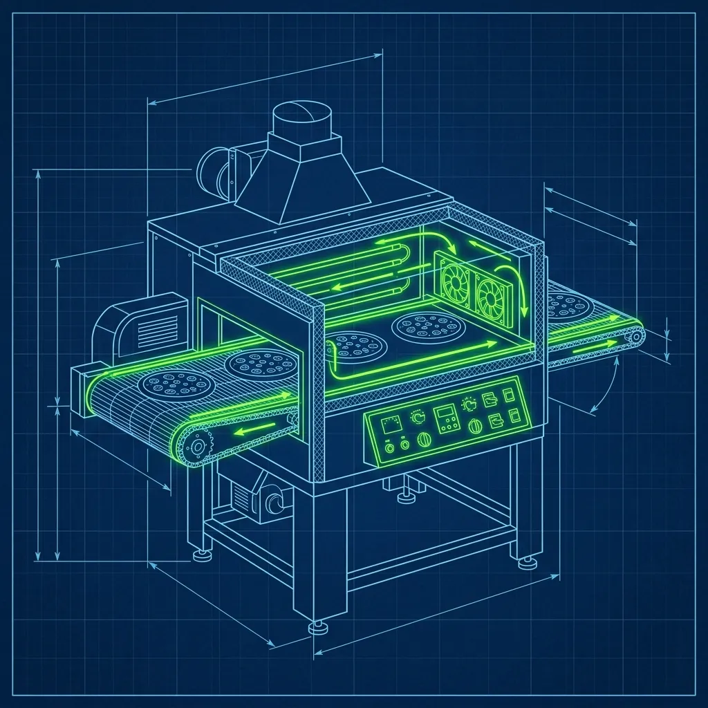
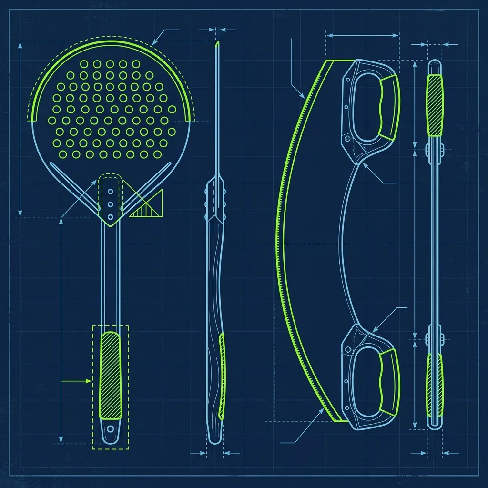

Walk into any Domino's at 6:30 on a Friday evening and you'll see controlled chaos on the makeline—dough flying, sauce being spread, cheese being tossed. But that's the easy part. The person who actually determines whether the entire store sinks or swims is standing at the opposite end of a 450-degree conveyor belt oven, sweating through their shirt, catching pizzas as fast as they emerge from the tunnel. That person is the Oven Tender, and I've watched it break more promising new hires than any other position in the building. 

## The Catch: A Conveyor Belt That Never Stops

Domino's uses massive Lincoln Impinger conveyor-belt ovens. Raw pizzas go in one end, travel through a tunnel of superheated air at around 450°F, and emerge fully baked roughly seven minutes later. The belt doesn't pause. It doesn't slow down. It doesn't care that you just dropped the rocking blade. 

During a Friday dinner rush, the makeline might be feeding four or five pizzas side-by-side into that oven every 30 seconds. Do the math—on the other end, four or five fully baked, screaming-hot pizzas are constantly sliding toward the edge of the belt, ready to tumble off onto the floor if nobody's there to grab them. 

The Oven Tender stands at the exit with a long metal peel—a flat spatula designed to slide under a pizza in one motion. You catch the pizza right as it reaches the belt's edge, transfer it to the cutting board in one fluid movement, and immediately reach for the next one. On more than one occasion, experienced Tenders work the oven with the calm efficiency of a blackjack dealer, catching and sliding pizzas without ever breaking stride. I've also seen new hires freeze up and watch three pizzas hit the floor in the span of ten seconds. The belt does not forgive hesitation.

## The Cut and Box: 15 Seconds Per Pizza or You're Drowning

Catching the pizza is only step one. Here's the full sequence a good Oven Tender executes in under 15 seconds:

1. **Catch** the pizza with the metal peel as it exits the belt.
2. **Transfer** it to the stainless steel cutting table.
3. **Grab the rocking blade**—a heavy, two-handled curved blade—and cut the pizza into 8 even slices with two perpendicular passes. One smooth, firm press per cut. If you lift and re-press, you get jagged slices and you've wasted a full second you don't have.
4. **Apply the finishing touches.** Grab the squeeze bottle of garlic-herb oil and paint the crust in a quick circular motion. Shake the parmesan-herb blend over breadsticks or bread bites if they're in the batch.
5. **Slide the pizza into the correct box**, close it, slap the label on, and stack it on the heat rack for the driver.

Fifteen seconds. And the next row of pizzas is already emerging while you're still closing the box on the last one. Fall behind by 30 seconds and you'll have pizzas stacking up on the belt edge, pushing each other off onto the metal rack or—worse—the floor. A pizza that hits the floor is an immediate discard and a full remake, which sets the order back another seven minutes and cascades delay through the entire queue.

## Reading the Labels: The Mental Game That Breaks New Hires

Here's the thing nobody tells you about the oven—the physical speed is demanding, but the mental organization is what actually separates a competent Tender from a great one. When a pizza exits the oven, it doesn't have a name tag baked into the cheese. It's just a pizza with toppings.

The Oven Tender has to look at that hot pizza, instantly recognize it as a "Large Thin Crust Half-Pepperoni Half-Mushroom," then scan through the stack of 30 or 40 printed receipt labels waiting on the table, find the matching label, and slap it on the correct box. During a slow Tuesday afternoon, this is manageable. During a Friday rush with 40 labels printed out and pizzas coming every few seconds, it's a mental endurance test.

The veteran Tenders I trained all developed their own systems. Some pre-sorted labels by order number. Some grouped them by delivery versus carryout. Some arranged them geographically by driver route so they could batch multiple pizzas for the same driver together. The specific system didn't matter nearly as much as having one at all. A Tender with no label organization system will mismatch labels within the first 20 minutes of a rush, guaranteed.

And mismatching is catastrophic. One wrong label means the wrong pizza goes to the wrong customer. That's two angry phone calls, two full remakes, two re-deliveries, and 20-plus minutes of wasted labor. Pulling double shifts taught me that a single labeling error snowball into a half-hour backlog during peak. It's the kind of mistake that makes an entire shift go sideways.

## The Garlic Oil: Two Seconds That Customers Absolutely Notice

Before closing any box, the Oven Tender applies Domino's signature garlic-herb oil to the crust. It's a rapid pass with a squeeze bottle—takes about two seconds. Breadsticks and bread bites also get a shake of the parmesan-herb seasoning blend.

These finishing touches are not optional, and they're not cosmetic. Customers notice immediately when the garlic oil is missing. The crust looks dry and pale instead of golden and glistening, and it's one of the most common sources of complaints during high-volume rushes when a frazzled Tender starts skipping steps to keep up. I always told my Tenders: if you're falling behind, call out to the makeline and ask them to hold for 30 seconds. A brief pause in production is infinitely better than shipping 10 boxes with dry crusts and fielding the phone calls afterward.

## The Heat: What Standing at 450 Degrees for Four Hours Actually Feels Like

I need to be straight about this—the oven position is physically punishing in a way that the other stations simply aren't. The conveyor belt radiates a constant wall of 450-degree heat directly at the Tender's face, chest, and arms for the entire shift. By the end of a four-hour Friday rush, your face is flushed red, your shirt is soaked through, and your forearms have a collection of small red marks from accidental contact with the hot peel or the oven's metal edge.

Smart Tenders keep a towel draped over one shoulder to wipe sweat from their hands and forehead. Wet, sweaty hands on a metal peel and a rocking blade are a legitimate safety hazard—one slip and you've either dropped a pizza or cut yourself. A water bottle within arm's reach is absolutely non-negotiable. I've seen dehydration hit Tenders faster than they expected, especially new hires who aren't used to sustained heat exposure. Dizziness at the oven is real and it's dangerous.

The oven position isn't an official promotion—there's no title change or automatic pay bump. But in every Domino's I've managed, the oven was reserved for the most trusted and capable insiders. Being assigned to the oven is the store's way of saying you're the best they've got. It's a point of pride for the people who master it.

For a look at another high-pressure pizza position, check out [the Papa John's dough slapping technique](/articles/papa-johns-dough-slapping)—it's a completely different kind of physical skill. And if you're considering the delivery side instead, read [the truth about Domino's gas reimbursement](/articles/dominos-gas) before you apply.

## Frequently Asked Questions

### How long does it take to learn the Oven Tender position?

Most new employees can learn the basic mechanics—catching, cutting, and boxing—within two or three training shifts. But being fast and accurate enough to handle a full Friday night rush takes several weeks of consistent practice. The label-matching skill, in particular, only develops through real-world repetition under pressure. I typically wouldn't let a new hire solo the oven on a Friday for at least three to four weeks.

### What happens if a pizza falls on the floor?

It's an immediate discard—no exceptions, no "five-second rule," no brushing it off. The makeline has to rebuild the pizza from scratch, which adds a minimum of seven minutes (the full bake time) to the order. During a rush, a single dropped pizza can cascade into delays across multiple orders. This is why the Tender position is so critical—one moment of hesitation can cost the store significant time and product.

### Can you communicate with the makeline if you're falling behind?

Absolutely, and you should. If pizzas are stacking up faster than you can process them, call out to the makeline and ask them to hold for 30 seconds. Every experienced manager and makeline worker understands this request. A brief production pause is a far better outcome than dropped pizzas, mismatched labels, and a string of remakes. The stores that run smoothest during rushes are the ones where the Tender and the makeline are in constant communication.

---
