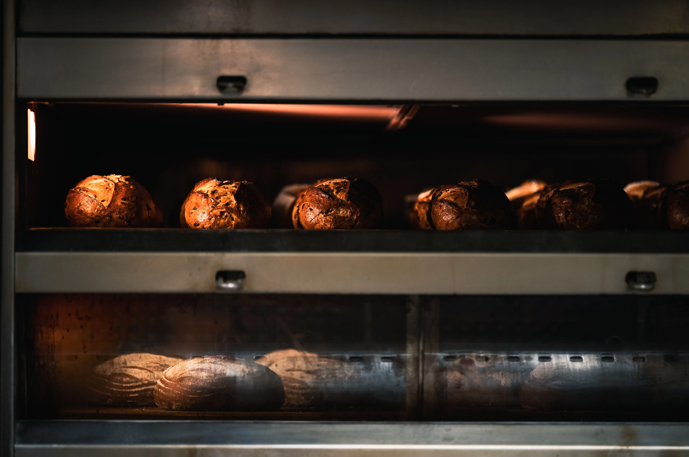

The reality of the line is that the moment an unannounced auditor walks through your front doors with a clipboard and a calibrated thermometer, the entire shift changes. Whether it is EcoSure, Steritech, or the local health department, the vibe in the store instantly goes from controlled chaos to absolute panic. If you are running the shift, your heart drops into your stomach. 

Corporate manuals tell you that if your store operates according to the standard operating procedures every day, an audit is nothing to worry about. That is entirely disconnected from the reality of running a high-volume fast-food restaurant. When you are understaffed, burning through a Friday lunch rush, and taking orders at a breakneck pace, the microscopic operational details slip. That is exactly what auditors are paid to find.

Step by step, this is the workflow to survive the initial five minutes of an audit. If you lose control in those first five minutes, your score will tank into a failing grade before the auditor even steps into the walk-in cooler.

## The Stall Tactics

When the auditor walks in, they usually approach the front counter and ask for the manager on duty. Your front counter staff needs to know the drill. They do not wave the auditor straight to the back. They tell the auditor to wait, and they physically come to the back line to get you. 

This buys the kitchen about thirty seconds. When you walk to the front, you do not just shake their hand and walk them back. You politely ask for their corporate ID and their business card. You pull out the corporate vendor logbook and painstakingly verify their credentials. This isn’t just security; it is a tactical stall. 

While you are verifying their ID in the lobby, your strongest shift lead is executing the "Audit Drill" in the back of house. 

<strong>ProTip: The Audit Drill:</strong> Every experienced shift lead knows the drill. While the manager stalls the auditor, the shift lead immediately dumps all sanitizer buckets and redraws fresh ones, pulls any prepped items with expired timers, and ensures everyone on the line has fresh, unsoiled aprons and gloves.

## The Quat Trap

The single most common critical violation happens in the first two minutes, and it almost always involves the quaternary ammonia (quat) sanitizer buckets. 

Auditors go straight for the sanitizer buckets on the line. They dip their test strips to check the parts per million (PPM). Corporate standards usually require 200 PPM. 

What actually happens is that a crew member filled the bucket two hours ago. The automatic chemical dispenser might be slightly off calibration. Worse, the crew member threw three cotton bar towels into the bucket. Cotton absorbs the active quaternary ingredient over time. The water might still be pink and soapy, but when the auditor dips their strip, it reads 100 PPM. Boom. That is a critical health and safety violation, and your audit is already circling the drain.

This is exactly why the Audit Drill demands dumping and redrawing every bucket the moment the auditor enters the building. You cannot trust a bucket that has been sitting on the line during a rush. 

## The Hold Timer Graveyard

Once they pass the sanitizer, the auditor will scrutinize the prep stations. Modern fast-food lines run on a strict system of hold timers. Sliced tomatoes might get a 4-hour timer. Shredded lettuce might get a 2-hour timer. 

During a massive rush, the prep person is frantically slicing tomatoes and throwing the pans onto the line to keep the sandwich makers supplied. Pressing the little button on the digital hold timer gets forgotten. Or, an older pan gets pushed to the back, and the timer expires while the crew is too busy to notice.

When the auditor walks the line, they check every single pan. If a pan has no sticker, or if the digital timer is flashing red indicating it expired twenty minutes ago, they document it. It does not matter if you just sliced the tomatoes ten minutes ago; if there is no timer, it is considered expired product. 

This is where the line cooks need to be ruthless. If a timer is expired, the product must be thrown in the trash immediately before the auditor reaches the station. Hesitation will cost you the audit. 

## Pencil-Whipped Temp Logs

The third trap involves the food safety temperature logs. Every morning, and usually at shift changes, a manager must temp the walk-in coolers, the freezers, and the holding cabinets, recording the numbers in a massive binder.

When a store is short-staffed, the manager opening the store might just sit in the office and write "34°F" down the entire column for the walk-in cooler without ever actually checking the thermometer. This is known as pencil-whipping.

The auditor knows this trick. They will open your logbook, look at the perfectly uniform numbers, and then walk straight to your walk-in cooler with their calibrated pyrometer. If your book says the cooler has been sitting at a perfect 34°F all week, but their pyrometer reads 42°F because the condenser coil is freezing over, you are caught. 

Falsifying food safety logs is a massive breach of trust, and depending on the strictness of your corporate office, it is often a fireable offense.

<strong>ProTip: Equipment Calibration:</strong> Check the ambient thermometers inside your walk-in daily. If the health inspector or EcoSure auditor finds a discrepancy between the internal ambient reading and your logbook, they will dig deeper into all of your food safety records. Always temp the air, not just the food.

## Managing the Aftermath

Surviving the audit requires maintaining absolute control of the floor. You cannot argue with the auditor. If they find a violation, you acknowledge it, you have a crew member correct it immediately in front of them, and you move on. Showing that you are actively managing the issue mitigates the damage.

The reality of the fast-food industry is that audits will happen when you are least prepared for them. The stores that pass are not the ones with perfect equipment; they are the stores that have drilled their crew to react instantly and silently the moment a stranger with a clipboard walks through the door. Maintain the stall, dump the buckets, check the timers, and never, ever pencil-whip the temp log.

## The Post-Audit Recovery Plan

If your store does fail an EcoSure audit, the recovery process is grueling. The immediate aftermath involves a complete operational reset. The multi-unit manager or franchise owner will typically arrive on-site within 24 hours to conduct a severe debriefing. 

The entire management team will be placed on an action plan. This usually involves mandatory daily self-audits using the exact EcoSure checklist, where the general manager must document the store's compliance every single morning. The store is usually subjected to a rapid re-audit within 30 days. If the store fails the re-audit, corporate may pull the franchise agreement or terminate the entire management staff. Surviving the post-audit period requires an absolute zero-tolerance policy for safety violations, meaning employees who previously got away with minor infractions (like improper handwashing or missing name tags) are often let go to protect the store's operational standing.
