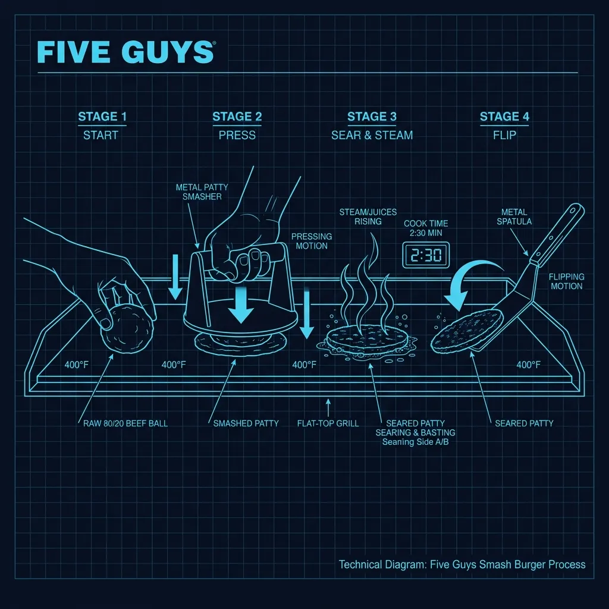
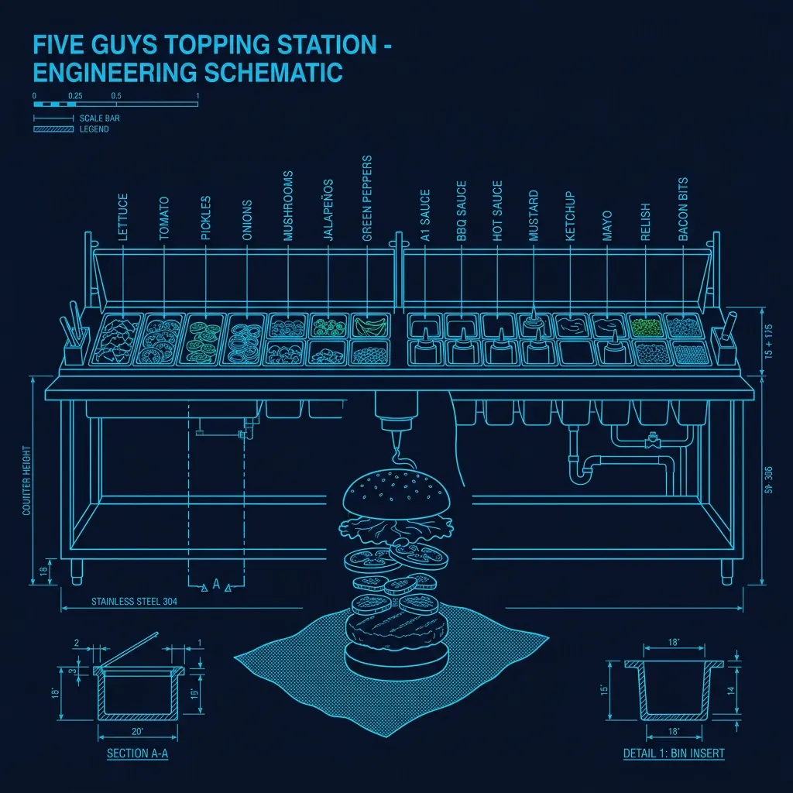

## The Beef Arrives Fresh. Every Single Day.

Five Guys has exactly one rule about their beef that drives every other operational decision in the kitchen: **it is never frozen. Ever.** The ground beef arrives fresh from a regional distributor every morning (sometimes twice a day at high-volume locations), and it must be used within a strict window before it's wasted out. 

This is the same principle as [Wendy's](/articles/chain/wendys) "fresh, never frozen" claim, but Five Guys takes it a step further. While [Wendy's](/articles/chain/wendys) receives pre-formed patties, **Five Guys receives bulk ground beef** and portions it into balls by hand in the restaurant. Every single patty starts as a hand-formed ball of ground beef, weighed to spec on a scale. 

The standard weight for a "little" hamburger patty (the single) is approximately **3.3 ounces** of raw beef. A regular hamburger gets two patties. This means a standard Five Guys burger has roughly 6.6 ounces of raw beef before cooking — significantly more than most fast food competitors. 

## The Hand-Smash Process

Five Guys does not use pre-formed patties, patty presses, or any mechanical forming device. Every patty is **hand-smashed on the flat-top grill** by the cook.

### Step 1: Ball to Grill

The cook takes a pre-weighed ball of ground beef and places it directly on the flat-top grill, which runs at approximately **400°F**. The grill surface is seasoned with a thin layer of peanut oil (this is why Five Guys has prominent peanut allergy warnings — the peanut oil is used throughout the cooking process).

### Step 2: The Smash

Within seconds of the ball hitting the grill, the cook uses a **metal press tool** to smash it flat. This is done with one firm, decisive push — not a gradual pressing. The goal is to flatten the ball into a patty roughly 4–5 inches in diameter in a single motion.

The smash accomplishes two critical things:
- **Maximizes surface contact** with the hot grill, creating a deep Maillard crust
- **Sets the patty's shape** before the proteins seize up from the heat

### Step 3: Season and Wait

Immediately after the smash, the cook hits the patty with **Lawry's Seasoned Salt** — the only seasoning Five Guys uses on their burgers. No pepper, no garlic, no proprietary blend. Just Lawry's.

The patty cooks on the first side for approximately **2 to 2.5 minutes**. During this time, the cook does not touch it. Pressing or moving the patty after the initial smash would break the crust that's forming on the contact surface.

### Step 4: The Flip

After the first side is fully crusted, the cook flips the patty exactly once. The second side cooks for approximately **1.5 to 2 minutes**. Five Guys patties are cooked **well-done by policy** — there is no option for medium or rare. This is a food safety decision driven by the fact that ground beef (as opposed to whole-muscle steaks) carries a higher risk of bacterial contamination throughout the meat.

The total cook time is roughly 4 minutes per patty. During a lunch rush, a single flat-top grill might have 12–16 patties cooking simultaneously at various stages.

## The Assembly: Foil, Not Paper

This is where Five Guys diverges from virtually every other burger chain. The burger is **assembled on a sheet of aluminum foil**, not in a paper wrapper or a box.

### Why Foil?

The foil wrap serves a specific purpose: **it traps steam**. When the hot burger is wrapped in foil, the residual heat creates a mini steam environment that:

1. **Melts the cheese** more completely (if cheese was ordered)
2. **Softens the bun** slightly, preventing it from becoming dry or crumbly
3. **Keeps the burger hot** during the time between assembly and customer pickup

The trade-off is that the foil also traps moisture from the toppings, which can make the bun soggy if the burger sits too long. This is why Five Guys emphasizes speed between assembly and handoff. A wrapped burger that sits in the bag for more than 5–7 minutes starts to deteriorate noticeably.

## The 15+ Free Toppings

Five Guys' most famous operational feature is their **unlimited free toppings** policy. While most burger chains charge $0.50–$1.50 for extras like bacon, mushrooms, or jalapeños, Five Guys includes all standard toppings at no additional cost.

The topping station is set up as a long line of **stainless steel bins** filled with pre-prepped ingredients:

### The Standard Toppings (All Free)

- Mayo, ketchup, mustard
- Lettuce, tomato, pickles
- Grilled onions, raw onions
- Grilled mushrooms
- Green peppers, jalapeños
- A.1. Steak Sauce, BBQ sauce, hot sauce
- Relish

### How Portioning Works (Or Doesn't)

Here's the operational reality of "free toppings": **there are no portion controls**. Unlike [McDonald's](/articles/chain/mcdonalds), where every pickle slice and onion portion is specified to the gram, Five Guys gives the assembler discretion to add a "reasonable" amount of each topping.

In practice, this means your burger's topping load depends heavily on who's making it. An experienced assembler will add balanced portions that make the burger structurally sound. A newer employee might overload the burger to the point where it falls apart when you unwrap it.

The lack of portioning also means **food cost is highly variable** at Five Guys compared to other chains. A customer who orders a burger with just ketchup and a customer who orders one with every single topping costs the restaurant very different amounts to serve, but they pay the same price. The business model accounts for this by pricing the burgers higher than competitors — a regular cheeseburger at Five Guys is typically $10–$12, compared to $5–$7 at most competitors.

## The Bun: Toasted on the Flat-Top

Five Guys' buns are **sesame seed buns** that are toasted face-down on the same flat-top grill used for the burgers. They go on the grill during the last minute of the patty's cook time so they're ready simultaneously.

The buns are toasted in the beef fat and peanut oil residue on the grill surface, which adds a subtle richness to the bread. This is intentional and is one of the reasons Five Guys' buns taste different from what you'd get from the same bun toasted in a dedicated bun toaster.

## The Bag: Why Everything Goes in Together

Five Guys is one of the few chains that puts the fries **directly in the bag** with the wrapped burgers, rather than in a separate container inside the bag. An extra scoop of fries goes on top of whatever is in the carton.

This is a deliberate decision. The fries are cooked in peanut oil at **325°F** (a lower temperature than most chains) and are meant to be eaten immediately. The heat from the fries warms the entire bag, keeping everything at serving temperature. The peanut oil also has a higher smoke point and different flavor profile than the vegetable or canola oil used by most competitors.

The downside is that the bag gets greasy. Very greasy. Five Guys knows this — it's essentially a feature at this point.

## What Makes Five Guys Operationally Unique

The combination of fresh (never frozen) beef, hand-smashed patties, unlimited free toppings, and foil wrapping creates an operational model that is genuinely different from every other burger chain:

1. **Higher labor cost** — Hand-forming patties and custom-topping every burger requires more skilled labor than pulling pre-formed patties from a freezer
2. **Higher food cost** — Fresh beef has a shorter shelf life (more waste), and unlimited toppings mean unpredictable per-burger costs
3. **Slower throughput** — A Five Guys kitchen can't match the volume of a [McDonald's](/articles/chain/mcdonalds) or [Burger King](/articles/chain/burger-king) because every burger is essentially made to order
4. **Higher prices** — All of the above costs are passed to the customer, which is why Five Guys sits in the "better burger" price tier

But the result is a burger that tastes noticeably different from a standard fast food burger. The hand-smashed crust, the fresh beef, the toasted-in-beef-fat bun, and the generous toppings create a product that justifies the premium — at least for the customers who keep coming back.

That's [the Five Guys](/articles/five-guys-fry-calibration) model: spend more on ingredients and labor, charge more at the register, and bet that the quality difference is obvious enough that customers will pay for it. So far, across 1,700+ locations, the bet has paid off.
