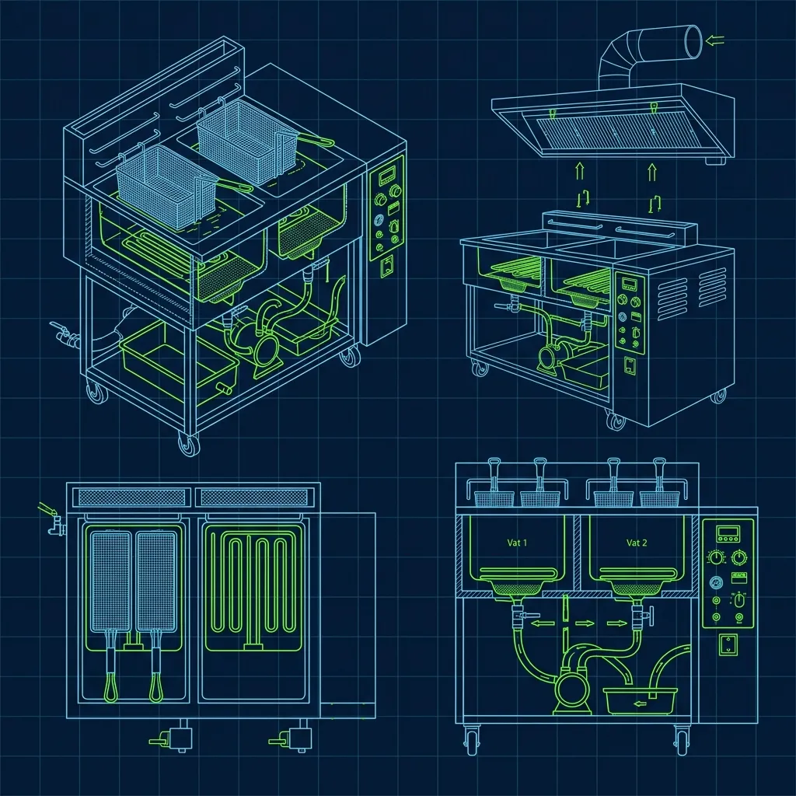
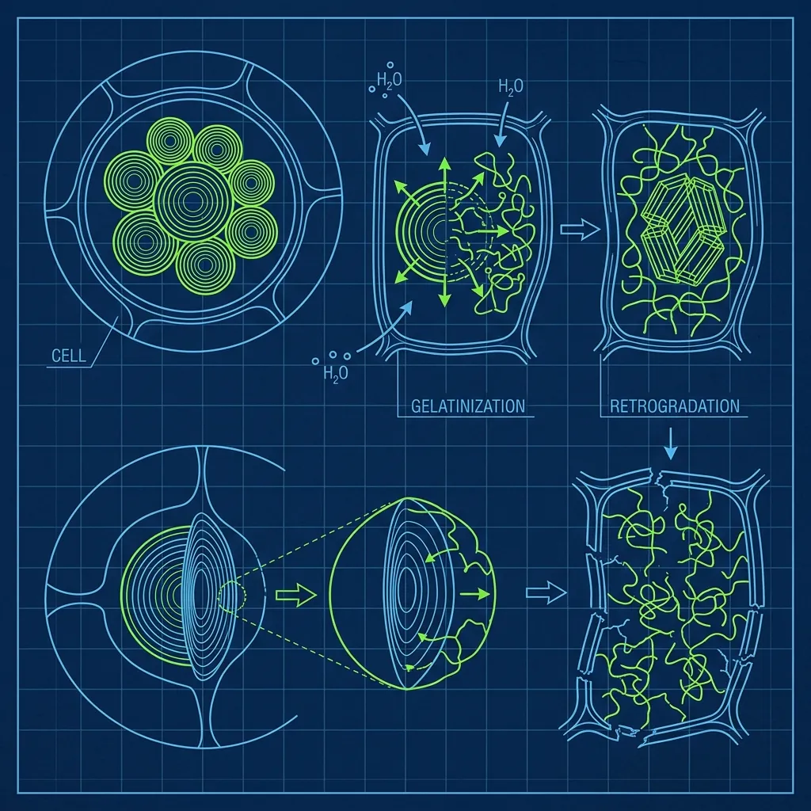

Five Guys is famous for two things: burgers that weigh more than your phone and fries that overflow the bag and fill the entire bottom of the paper sack. But that crispy-on-the-outside, mashed-potato-on-the-inside texture doesn't happen because someone presses a button on a commercial fryer. It happens because every single morning, before a single customer walks through the door, the opening crew runs a calibration ritual that would feel more at home in a test kitchen than a fast-food restaurant. I've worked alongside Five Guys operators and trained under their systems, and the level of daily attention they give to a french fry is something most chains wouldn't even consider. *(Related guide: [Does Five Guys Really Not Have Any Freezers?](/articles/five-guys-no-freezers/))*

## The Morning Potato Prep: It All Starts With a Knife and Cold Water

Five Guys does not use frozen fries. Not a single frozen potato product exists anywhere in their building. Every morning, the prep team hauls 50-pound bags of raw Idaho or Kennebec potatoes out of the walk-in cooler, washes them, and runs them through heavy-duty wall-mounted manual slicers that cut each potato into uniform sticks in one pull of the lever. *(Related guide: [What is the In-N-Out \](/articles/in-n-out-board-station/))*

But here's the thing nobody tells you about the prep—cutting the potatoes is the easy part. The critical step is what happens immediately after: the starch wash. *(Related guide: [What is the Wendy's Double-Sided \](/articles/wendys-clamshell-grill/))*

Once cut, the fries are dumped into large buckets of cold water. This isn't a quick rinse under the faucet. The cut fries soak in that water, and the water gets changed multiple times until it runs relatively clear. Cloudy water means there's still excess surface starch clinging to the fries, and that starch is the enemy. If it stays on, the fries will brown and burn on the outside before the interior is fully cooked, and they'll stick together in clumps instead of separating into individual crispy sticks.

Some batches need 20 minutes of soaking. Others need 30 or more, depending on how starchy the particular potato variety is that week. This variable alone—how long the starch wash takes—is one of the first things the opening crew has to evaluate each morning. A new shipment of potatoes from a different farm can require a completely different soak time than the batch from last week. It's not something you can set and forget.

## The Two-Stage Cook: Why Five Guys Fries Are Different From Every Other Chain

You cannot just drop raw potato sticks into 350-degree peanut oil and expect a Five Guys fry. They use a strict two-stage cooking process borrowed from the Belgian double-fry technique, adapted for a high-volume fast-food environment:

**Stage 1 — The Pre-Cook:** Fresh-cut, starch-washed fries are lowered into peanut oil at a moderate temperature and cooked for approximately two and a half minutes until they're limp, slightly opaque, and visibly softened. They're pulled out and transferred to a cooling rack to rest.

**Stage 2 — The Final Cook:** When a customer actually orders fries, a portion of pre-cooked fries is dropped into hotter oil for another two and a half to three minutes. The exterior crisps up into a golden shell while the interior stays soft and pillowy.

The science is straightforward: the first cook gelatinizes the starch inside the potato, turning the interior creamy and smooth. The rest period allows the exterior surface to dry slightly, forming a thin skin. When that skin hits the hotter oil in the second cook, it crisps almost instantly. The result is that signature crunch on the outside with an almost whipped-potato texture inside. It's the same reason why great French restaurants double-fry their pommes frites, just executed on a line that's pushing 200 orders an hour.

## The Calibration: What Actually Happens and Why It's Non-Negotiable

Here's the thing nobody outside the industry understands about potatoes: they're a living agricultural product, and they change constantly. A potato harvested in September has different sugar content than one harvested in November. A potato stored in cold conditions for two months has converted more of its starch into sugar. A potato from Idaho behaves differently than one from Washington state. These variations directly affect how fast the fry browns, how long it needs to cook, and what the finished product looks and tastes like.

Every morning, before the store opens, the opening manager and the fry cook run the calibration:

1. **Test batch of pre-cooks.** They drop a small batch of that day's potatoes into the oil and pull them at the standard time.
2. **The Mush Test.** They take a pre-cooked fry, break it in half, and squeeze the interior between their fingers. The inside should have the consistency of smooth mashed potatoes—no hard, raw, grainy bits. If there's resistance, the pre-cook time needs to go up.
3. **Test batch of final cooks.** They take pre-cooked fries through the second stage and evaluate the result.
4. **Visual color check.** Five Guys has strict visual standards. Finished fries should be light golden—never pale and limp, never dark brown. If the edges are browning too quickly, the temperature gets adjusted down a few degrees. If they're coming out too light, the timer gets bumped up.
5. **Documentation.** The opening manager logs the day's settings—pre-cook time, final cook time, oil temperature—in the prep log. If a different cook takes over the afternoon shift, they know exactly where the timers should be set without guessing.

The entire calibration process takes 20 to 30 minutes on a normal day. If a new shipment of potatoes arrives from a different farm or a different region, it might take a few extra rounds of testing to dial in the right settings. I've seen calibration take close to 45 minutes when the potatoes were behaving unusually—high-sugar winter potatoes that wanted to brown in 90 seconds were the worst offenders.

## Why Peanut Oil and Why It Matters

Five Guys exclusively uses 100% refined peanut oil for frying. The choice isn't arbitrary:

- **High smoke point.** Peanut oil can handle the intense heat of the second-stage cook without breaking down, turning rancid, or developing off flavors. Vegetable oil blends and canola oil both degrade faster at sustained high temperatures.
- **Clean, neutral-to-nutty flavor.** Peanut oil complements the potato without overpowering it. You taste potato and salt, not oil.
- **Consistent performance.** Peanut oil maintains its viscosity and cooking properties across multiple batches better than most alternatives, which means more consistent fry quality throughout a long service day.

The trade-off is the allergen risk. Every Five Guys location posts prominent peanut allergy warnings, and the open boxes of peanuts in the dining area reinforce the point. If a customer has a severe peanut allergy, Five Guys is unfortunately not an option for them—there's no workaround.

## Seasonal Shifts: The January Problem

Here's a detail that separates experienced Five Guys fry cooks from rookies: potatoes harvested in late fall convert starch to sugar during cold winter storage. By January and February, the sugar content in stored potatoes can spike noticeably. Higher sugar means faster browning, which means your September timer settings will burn your January fries.

Veteran fry cooks watch for this proactively. If test batches start coming out darker than expected after the New Year, they drop their timers by 10 to 15 seconds before the first customer even orders. Rookies who don't anticipate the seasonal shift will spend the first hour of service shipping dark-brown, over-caramelized fries and fielding complaints before they figure out what changed.

For a deeper dive into why Five Guys operates so differently from other fast-food chains, check out [why Five Guys doesn't have any freezers](/articles/five-guys-no-freezers)—the no-freezer policy is directly connected to why the fry calibration exists in the first place. And for a look at another high-intensity line position, see [what the In-N-Out Board station actually involves](/articles/in-n-out-board-station).

## Frequently Asked Questions

### How long does the morning fry calibration take?

The full process—cutting, soaking, running test batches, performing the Mush Test, and adjusting timers—typically takes 20 to 30 minutes on a normal day when the potatoes are behaving predictably. If a new shipment arrives from a different farm or region, or if the potatoes have been in cold storage long enough to change their sugar profile, calibration can stretch to 45 minutes with additional rounds of testing.

### Do customers actually notice the difference between a well-calibrated and poorly calibrated batch?

Absolutely. A properly calibrated batch is light golden, audibly crispy on the outside, and almost fluffy inside. A poorly calibrated batch will be either pale and limp with a hard, undercooked center, or dark brown and overly crunchy with a burnt aftertaste. Regular Five Guys customers can tell immediately—and they will let you know about it. Fries are the single most complained-about item when calibration is off.

### What happens if the fry cook skips calibration entirely?

If the timers from the previous day are left unchanged and the new batch of potatoes has different sugar or moisture content, fries will come out inconsistent all day long. You'll get a mix of burnt fries, pale fries, and fries with raw centers—sometimes in the same batch. The opening manager is ultimately responsible for ensuring calibration happens every morning without exception. Skipping it is one of the fastest ways to generate a wave of customer complaints before the lunch rush even starts.

---
