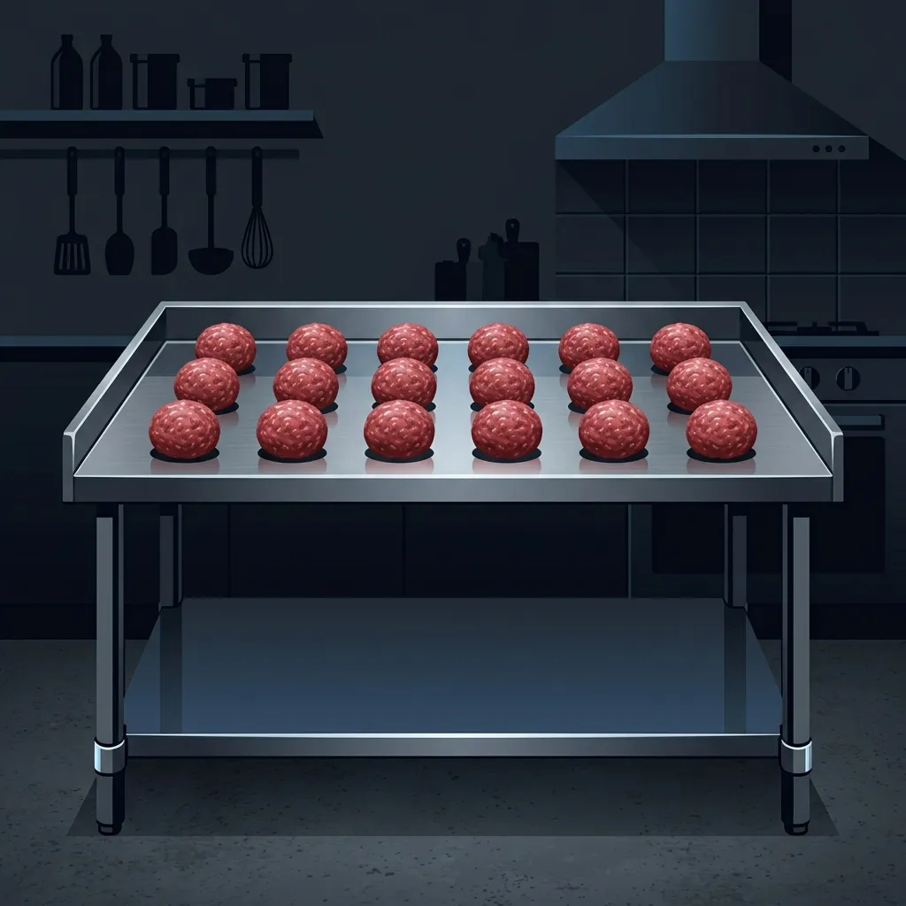

Five Guys built its entire brand on a single, unwavering promise: there are [no freezers](/articles/five-guys-no-freezers/) in the building. While other fast food chains rely on massive distribution centers to press, freeze, and ship perfectly uniform burger patties in cardboard boxes, Five Guys does it the hard way.

This commitment to fresh food means that the back-of-house operations at Five Guys look more like a high-volume butcher shop than a modern fast food kitchen. Before a single customer walks through the doors at 11:00 AM, a dedicated morning prep crew has already been in the building for hours, engaging in one of the most physically repetitive tasks in the industry: rolling the meat.

This is precisely what happens:

## The 5 AM Arrival

The morning prep shift at a busy Five Guys location usually begins at 5:00 AM or 6:00 AM. The prep crew walks into a cold, quiet kitchen and immediately heads to the walk-in cooler. 

Inside the cooler are massive, 40-pound chubs (plastic-wrapped tubes) of fresh ground beef. This beef is a proprietary blend of chuck and sirloin, delivered fresh from regional meatpackers multiple times a week. The prep crew hauls these heavy chubs out to the stainless steel prep tables. 

The first step is breaking the beef down. The prep cook takes a heavy knife, slices the plastic casing open, and dumps the massive block of ground beef onto the sanitized table. There are no automated portioning machines or patty presses. The entire process relies on a digital scale, a pair of gloved hands, and raw speed.

## The 3.6-Ounce Rule

Consistency is the hardest thing to achieve when you are preparing food completely by hand. To ensure every burger cooks evenly and tastes the same, Five Guys enforces a strict weight requirement: every single patty must weigh exactly 3.6 ounces.

The prep cook grabs a handful of beef from the pile, pinches off a chunk, and drops it onto the digital scale. If it weighs 3.9 ounces, they pinch a bit off. If it weighs 3.2 ounces, they add a sliver. 

Once the portion hits exactly 3.6 ounces, the real work begins. The cook rolls the beef rapidly between their palms, forming a tight, perfectly round sphere. They are not pressing the beef into flat patties—they are making meatballs. 

These meatballs are placed into specialized plastic cambro tubs. Each tub holds exactly 64 meatballs, separated by sheets of waxed paper to prevent sticking. A busy Five Guys location goes through hundreds, sometimes thousands, of these meatballs in a single day. A seasoned prep cook can weigh, roll, and stack a meatball in a matter of seconds, falling into a hypnotic rhythm that lasts for hours.

## Why Meatballs Instead of Patties?

The obvious question is: why go through the trouble of rolling meatballs when you are just going to flatten them into burgers anyway? Why not buy fresh beef that is already pressed into patties?

The answer lies in the cooking method. Five Guys cooks their burgers using the "smash" technique. When an order comes in, the grill cook takes the 3.6-ounce meatball, places it on the screaming hot flat-top grill, and uses a heavy metal press to smash the ball completely flat. 

Smashing a loosely packed, round meatball directly on the hot steel forces the fat and juices outward, creating maximum contact with the cooking surface. This generates the jagged, heavily caramelized crust (the Maillard reaction) that gives a Five Guys burger its signature flavor. If the prep crew pre-pressed the meat into flat patties hours in advance, the meat would become dense, tough, and fail to develop that perfect crispy edge on the grill.

## The Physical Toll

When I managed kitchens, the meat prep shift was universally regarded as the hardest job in the building. It is incredibly monotonous and physically taxing. 

Standing in one spot for three hours, pinching cold beef, and rolling it aggressively between your palms puts massive strain on your wrists and shoulders. The ambient temperature in the kitchen has to be kept reasonably cool to ensure the fresh beef stays within food safety temperature parameters, meaning the prep cooks are handling nearly freezing meat for hours on end. 

If the crew falls behind and the lunch rush hits before enough cambros are stacked in the chef base coolers under the grill, the store will run out of meat. You cannot rush the 3.6-ounce rule, and you cannot serve a customer a burger if the meat isn't rolled. The prep team is the quiet engine that keeps the entire restaurant running.

## Frequently Asked Questions

### Can you ask for a burger cooked medium-rare at Five Guys?
No. Because Five Guys uses fresh ground beef and smashes the patties incredibly thin to cook quickly, every single burger is cooked well-done. The high fat content of the beef blend ensures the meat stays juicy even when fully cooked.

### Does the prep crew add salt or seasoning to the meat while rolling it?
No. The ground beef is kept completely pure during the morning prep phase. Adding salt to the raw meat before cooking would draw out moisture and make the burgers dry. The grill cooks only season the patties with salt and pepper right after smashing them on the grill.

### What happens to the leftover meat at the end of the night?
Because Five Guys refuses to freeze their beef and strictly adheres to freshness standards, any raw meatballs that expire or do not get sold within their designated shelf life are discarded. This is why store managers are obsessed with accurate sales forecasting—rolling too much meat destroys their food cost metrics.
