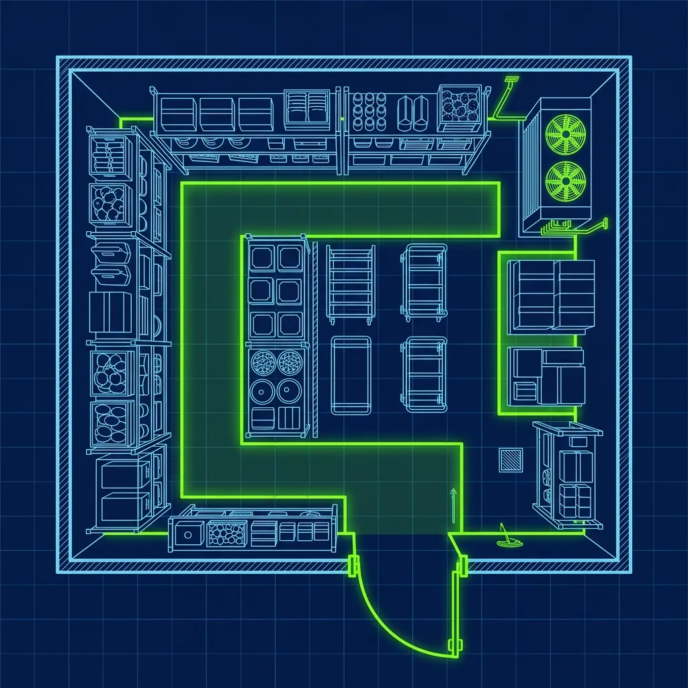
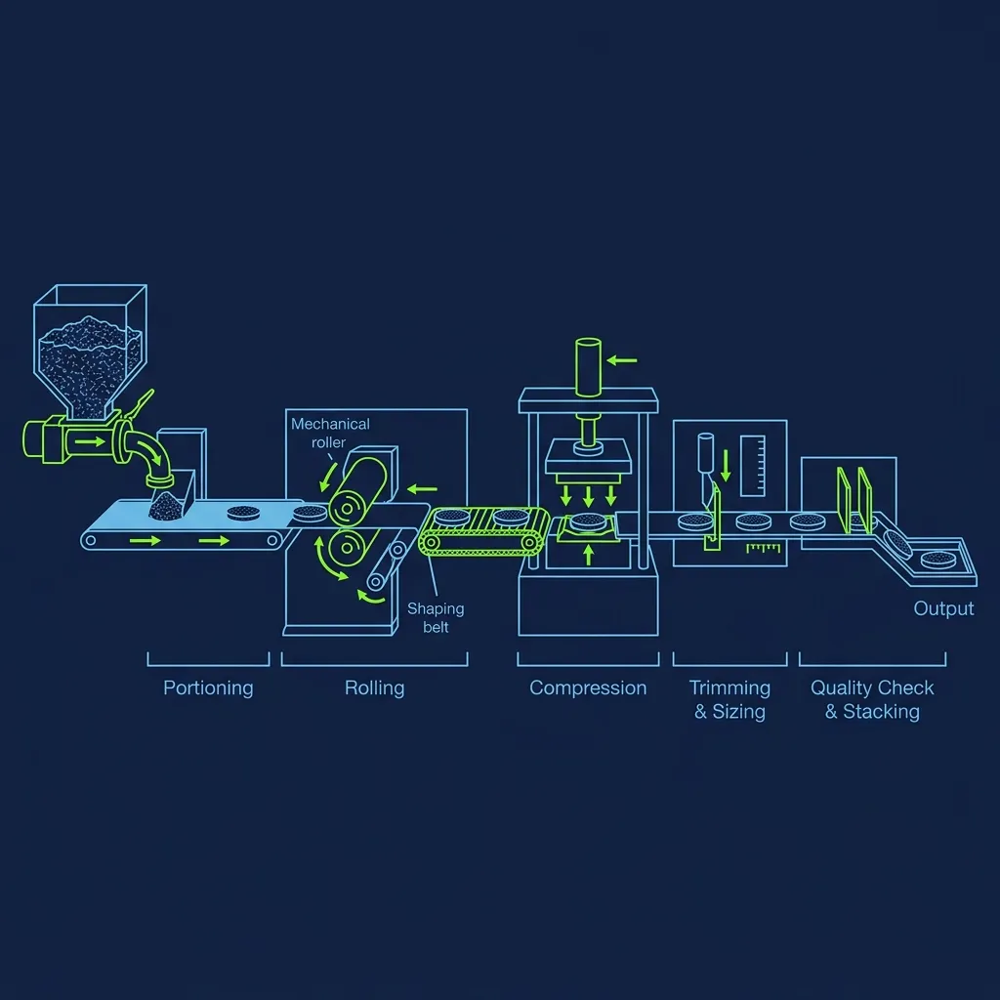

In an industry where nearly every fast-food kitchen has at least one walk-in freezer packed with frozen patties, frozen chicken, frozen fries, and frozen everything else, Five Guys makes a claim that sounds almost delusional: they don't have freezers. No walk-in freezer. No reach-in freezer. No chest freezer hidden in the back. Nothing in the entire building that goes below 32°F. 

I'll be straight with you—the first time I heard this, I assumed it was marketing spin. Every restaurant has a freezer somewhere, right? But I've been through Five Guys kitchens, talked to their managers, and watched their operations up close. The claim is 100% legitimate. And the operational implications of running a high-volume fast-food restaurant with zero frozen storage are far more intense than most people realize. 

## The Walk-In Cooler: The Single Most Important Piece of Equipment in the Building

> **Russell's Note:** Time to lean, time to clean. It's an annoying cliché, but when the health inspector (the ultimate clipboard warrior) shows up unannounced, you'll be glad you wiped down the low-boys.

> **Russell's Note:** Forget the fancy gadgets. Give me a sharp 8-inch chef's knife and a 32oz deli container labeled with blue painter's tape, and I can run any station.

Without a freezer, Five Guys lives and dies by their walk-in cooler. And it's not the cramped, closet-sized cooler you'll find at most fast-food joints. A typical Five Guys walk-in is significantly larger than what you'd expect—it has to be, because it's holding everything the store needs for the next one to two days, all of it fresh, all of it perishable, all of it on a ticking clock. 

Inside that cooler on any given morning you'll find:

- **Raw ground beef** in vacuum-sealed tubes, waiting to be portioned and hand-rolled into patties
- **Cases of fresh produce**—whole tomatoes, onions, lettuce, mushrooms, jalapeños, green peppers
- **Hundreds of pounds of raw potatoes** in 50-pound bags
- **Gallons of condiments**, backup supplies of buns, and cases of cheese slices

Temperature control is absolutely non-negotiable. That cooler must hold between 34°F and 40°F at all times. If the compressor fails overnight and the internal temperature drifts above 40°F for an extended period, the morning crew may walk in to find that the entire inventory—thousands of dollars' worth of fresh product—has to be thrown away before the store even opens. I've heard horror stories from Five Guys managers about summer compressor failures that resulted in $3,000 to $5,000 in scrapped inventory before 7 AM.

The cooler compressor is essentially the heartbeat of the restaurant. If it stops, the restaurant stops.

## The Morning Prep: Why Five Guys Openers Work Harder Than Almost Anyone in Fast Food

Here's where the no-freezer reality hits hardest for employees. At most fast-food chains, the morning prep involves pulling frozen product out of the freezer, stacking it on the line, and maybe doing some light slicing or portioning. At Five Guys, there is no frozen product to pull. Everything starts from raw, whole ingredients, and every single item has to be prepped by hand.

**The beef:** Meat arrives fresh in vacuum-sealed chubs (tubes). The prep team has to manually weigh out individual portions and hand-roll every hamburger patty for the day. A busy Five Guys location might roll 1,000 to 2,000 patties by hand every single morning. That's hours of repetitive, physical work—weigh, ball, flatten into the mold, stack on a tray, repeat. There are no pre-formed frozen patties to unwrap.

**The produce:** You can't buy pre-chopped frozen onions at Five Guys. Employees hand-chop fresh onions, slice fresh tomatoes on mandoline-style slicers, hand-shred fresh lettuce, slice mushrooms, dice jalapeños, and cut green peppers—all from whole, raw vegetables delivered fresh to the store. Your eyes will burn from the onions, your hands will smell like jalapeños for hours, and your cutting board will be covered in tomato juice. It's real prep, not "open a bag and dump it in a pan" prep.

**The potatoes:** The fries start as 50-pound bags of raw Idaho potatoes that must be washed, run through a manual wall-mounted dicer, and soaked in cold water to remove excess starch. The soaking process alone can take 20 to 30 minutes per batch, with multiple water changes until the water runs clear. For a complete breakdown of how the fry cooking process works, read [the Five Guys fry calibration guide](/articles/five-guys-fry-calibration)—it's an entire daily ritual unto itself.

A typical opening crew of two to three people starts their shift hours before the restaurant opens. The prep list on a Monday morning is a full sheet of paper, and every item on it starts from scratch. If you've ever worked at a chain where "prep" meant unwrapping frozen product and putting it in warming trays, Five Guys will feel like a completely different job. Because it is.

## Delivery Schedules: The Supply Chain That Makes It Possible

The no-freezer model only works because Five Guys receives deliveries far more frequently than a typical fast-food restaurant. Most locations get deliveries three to five times per week, depending on sales volume. The beef delivery alone might come every other day. Produce deliveries are similarly frequent because fresh vegetables have shelf lives measured in days, not weeks.

The General Manager's ordering process is essentially a daily forecasting exercise. They're projecting sales based on:

- Historical sales data for that day of the week
- Local events (a high school football game on Friday night means 30% more burgers)
- Weather patterns (a gorgeous Saturday means higher traffic; a blizzard means you cut your order)
- School schedules (summer break versus school year changes traffic patterns dramatically)

A miscalculation in either direction has immediate consequences. Over-order and you waste expensive fresh product that can't be frozen for later. Under-order and you have to "86" items off the menu—which at Five Guys means telling customers you're out of burgers, fries, or hot dogs. When your entire menu has three items, running out of one of them is unacceptable.

## The Only Exception: The Ice Machine

The only piece of equipment in a Five Guys that brings water below the freezing point is the ice machine for the soda fountain. That's it. Every piece of food in the building is strictly refrigerated, never frozen, at every stage from delivery to customer. This is a core part of the brand's identity—the founders believe that freezing any ingredient, even as a temporary backup, would compromise the taste and texture customers expect.

## What It's Actually Like to Work There

Here's the reality that most people don't think about: working at Five Guys feels much more like working in a traditional, high-prep commercial kitchen than a typical fast-food operation. You're not pressing buttons on a microwave. You're not pulling frozen bags out of a warmer. You're actually cooking—handling raw ingredients, rolling proteins, cutting vegetables, working a fryer that requires daily calibration.

If you're someone who wants to develop real culinary skills in a fast-food environment, Five Guys is one of the best places to start. The prep intensity is significantly higher than any other major chain I've worked with, and the skills transfer directly to full-service restaurant kitchens.

The trade-off is that the work is harder, more physical, and less forgiving. You can't fall behind on prep and catch up by pulling extra product from the freezer—there is no safety net. If the morning crew doesn't finish prep before open, the store literally cannot serve food until they do.

For a look at another chain that takes fresh prep seriously, check out [the Chipotle grill validation process](/articles/chipotle-grill-validation). And to see how a very different chain handles its signature product with an entirely different approach, read [how the Arby's meat slicer actually works](/articles/arbys-meat-slicer).

## Frequently Asked Questions

### Is it true that Five Guys posts the source of their potatoes on the wall?

Yes. Most Five Guys locations have a chalkboard or printed sign in the dining area that tells customers exactly which farm their current batch of potatoes came from, including the state and sometimes the specific farm name. It's part of the brand's commitment to ingredient transparency and freshness—they want you to know that the fries you're eating came from an actual farm, not a factory freezer.

### What happens if the walk-in cooler breaks down?

A cooler failure is treated as a genuine emergency. The General Manager is called immediately regardless of the hour, and a refrigeration technician is dispatched as fast as possible. If the internal temperature rises above 40°F for an extended period, food safety regulations require the store to discard all perishable product. Depending on the severity, the store may have to close entirely until the cooler is repaired and restocked with fresh deliveries. It's the single most catastrophic equipment failure that can happen in the building.

### Does the no-freezer policy make Five Guys more expensive to operate?

Significantly. Fresh ingredients cost more to source and ship. The shorter shelf life means more frequent deliveries and tighter inventory management. The labor cost is substantially higher because of the intensive daily prep—you need more people, starting earlier, doing more physical work. This is one of the primary reasons Five Guys burgers and fries are priced higher than most fast-food competitors. The company views it as a worthwhile trade-off for the quality and taste difference that customers can genuinely perceive.

---
