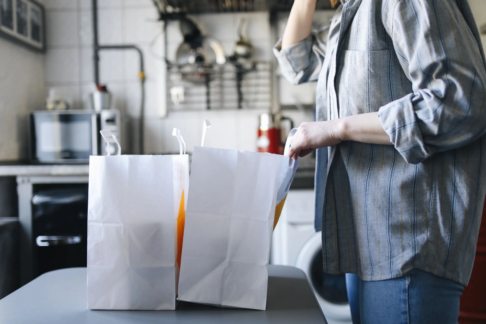

The reality of the line has fundamentally changed over the last five years. You aren't just running a fast food restaurant anymore. You are running a logistics hub for a half-dozen independent delivery companies, and corporate expects you to handle it with the exact same amount of labor.

Between UberEats, DoorDash, Grubhub, and the sudden rise of "virtual" ghost kitchens operating out of your fryers, the traditional front-counter make-line is dead. The tablet alarm is constantly chiming, drivers are shoving their phones in the cashier's face, and your drive-thru times are bleeding out because the grill is buried under a $85 digital order for a ghost brand nobody had even heard of last week.

If you don't aggressively manage the digital flow, it will break your shift.

## The Fifteen Percent Margin Trap

Franchisees love turning on third-party delivery apps because they look like pure incremental revenue. What actually happens is the apps take a massive 15% to 30% commission off the top. To compensate, corporate artificially raises the prices on the digital menus.

But from the kitchen's perspective, a burger is a burger. You still have to toast the bun, drop the meat, and wrap the foil. The problem is the sheer volume of unpredictable bulk orders. A drive-thru customer rarely orders ten combo meals at once. A DoorDash customer does it at 12:15 PM in the middle of your lunch rush, instantly bottlenecking the fry station. 

  <strong>Ticket Sequencing is Survival:</strong> Never let digital tickets blindly intermingle with drive-thru tickets on the KDS monitor. You must train your expeditor to mentally prioritize drive-thru (which is actively timed and affects your bonuses) while staggering the assembly of the massive digital drops. 

## The Time/Temperature Nightmare

Here is what corporate ignores when they celebrate digital sales: the catastrophic food safety liability of third-party delivery. 

You cook the food to temperature. You seal the bag perfectly. You place it on the wire rack for pickup. And then... the driver doesn't show up for forty-five minutes. 

That bag of food is now sitting at room temperature. The fries are gelatinous, the lettuce is wilted from the steam of the burger, and the internal temperature of the meat is plunging straight into the Danger Zone (41°F - 135°F). When the customer finally eats it and gets violently ill, they don't blame the delivery app. They call the health department and blame your store.

If you are a Kitchen Manager, you are legally liable for this. You cannot afford to be ignorant of advanced food safety protocols when managing delivery logistics. 

<a href="https://www.shareasale.com/r.cfm?b=67890&u=765432&m=54321" target="_blank" rel="noopener noreferrer nofollow" class="btn btn-amazon">Get ServSafe Manager Certified</a>

If you want to actually advance in this industry and protect yourself from catastrophic liability, you need the **ServSafe Manager Certification**. It is the absolute gold standard for understanding Time/Temperature Control for Safety (TCS) foods in high-volume delivery environments. Getting certified isn't just about passing a test; it gives you the leverage to force your GM to buy heated holding cabinets for delivery bags. Do not run a digital make-line without being certified. 

## The Ghost Kitchen Hijack

Some stores are now operating multiple "virtual" restaurants out of the same kitchen. You might be wearing a Wendy's uniform, but you're frying chicken wings for a completely different brand name that only exists on DoorDash.

This destroys your prep sheets. You are now juggling entirely different flavor profiles, unique packaging constraints, and separate waste logs. Step by step, the workflow has to be isolated. If you mix the ghost kitchen packaging with your standard inventory, your end-of-month food cost metrics will be a disaster. 

Treat the ghost kitchen as a completely hostile entity. Isolate its prep. Assign one specific line cook to handle those tickets during peak. If you try to weave them into the standard flow, the entire kitchen will crash.
