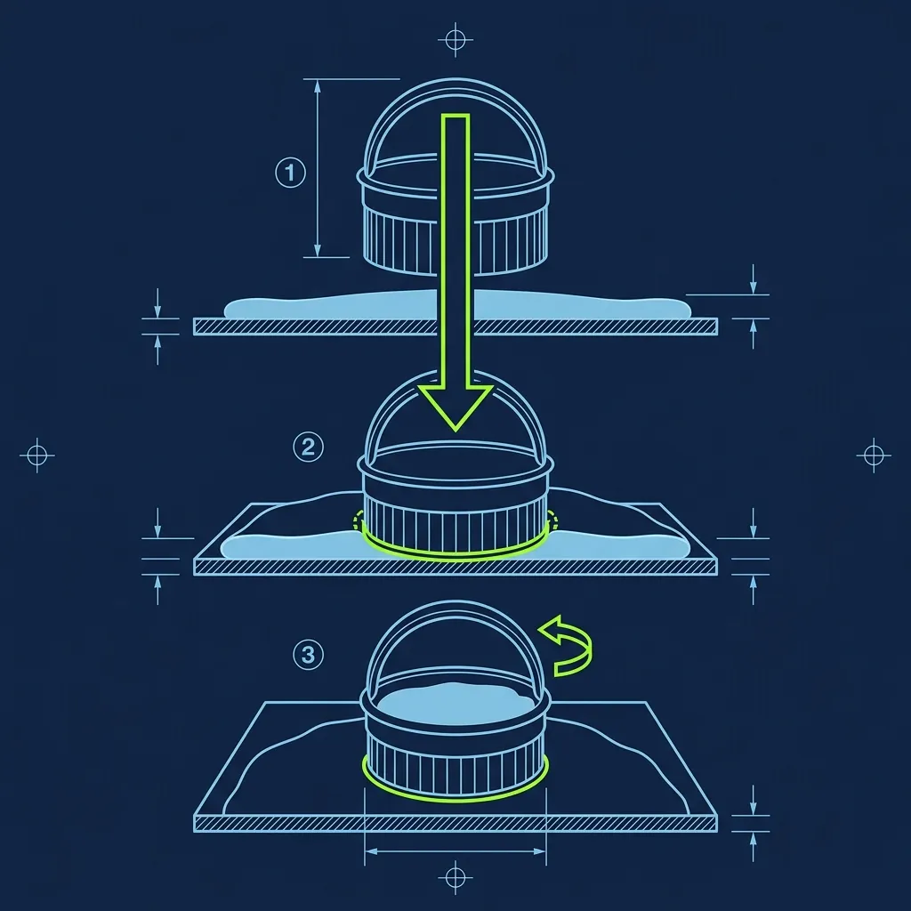
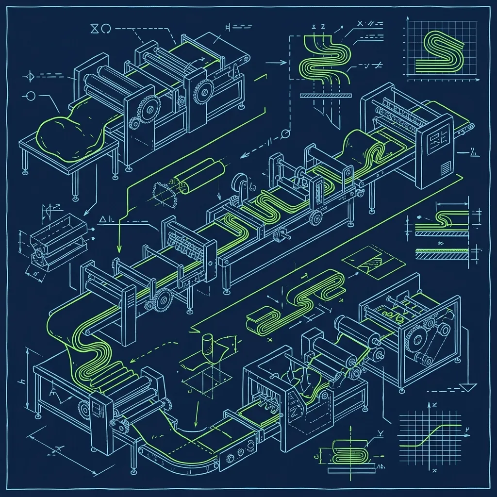

Most fast-food chains use frozen, pre-formed biscuits that arrive in a box, get tossed on a sheet pan, and go into an oven. Hardee's doesn't do that. Their biscuits are made entirely from scratch—mixed, kneaded, rolled, cut, and baked in-store, every single morning, by a dedicated employee called the Biscuit Maker. And that person's alarm goes off at 3:15 AM. 

I've worked alongside Biscuit Makers and trained under their mentorship, and Take it from someone who's been there — without hesitation: this is one of the most respected, most skilled, and most physically demanding positions in all of fast food. If the Biscuit Maker doesn't show up, the entire breakfast operation is in jeopardy. There is no backup plan that doesn't involve another trained human being walking through that door at 4 AM. 

## The 4:00 AM Arrival: Alone in a Dark Kitchen

The Biscuit Maker arrives at the store with the opening manager, usually around 4:00 AM. The parking lot is empty. The dining room is dark. The ovens are cold. Your first task is getting the massive convection ovens fired up—they need 15 to 20 minutes to reach the correct baking temperature, so timing your first batch to go in right when the oven is ready is part of the routine. 

While the ovens heat, you're setting up your station: a massive stainless steel table that gets dusted with a generous layer of flour, a heavy rolling pin, metal biscuit cutters, baking sheets prepped with a light coat of grease or parchment, and all of your measured ingredients within arm's reach.

The first 15 minutes are all about precision setup. You weigh out your dry mix, make sure your buttermilk is properly cold—warm buttermilk activates the leavening agents prematurely and kills the rise before the biscuit ever sees the inside of an oven—and mentally walk through your first batch timing. Veteran Biscuit Makers have this sequence burned into muscle memory. They can have their station prepped and the first batch of dough mixed before the oven's preheat light clicks off.

## The From-Scratch Process: Where Most New Hires Fail

Here's the step-by-step, and pay attention to the kneading step because that's where the job lives or dies:

1. **The Mix:** You dump large bags of Hardee's proprietary biscuit mix—which contains flour, baking powder, and shortening—into a mixing bin. Then you pour in gallons of real, cold buttermilk. Not room-temperature. Cold. The temperature of the buttermilk matters more than most new hires understand.

2. **The Knead:** You use your bare, sanitized hands to bring the dough together. This is where the vast majority of new Biscuit Makers screw up. The instinct is to keep working the dough until it's perfectly smooth and uniform—like bread dough. That's exactly wrong. Overworked biscuit dough develops too much gluten, and the resulting biscuit will be tough, chewy, and dense instead of tender and flaky. The technique is to fold the dough over itself a few times—just enough to bring it together—and then stop. You should still see visible streaks of dry mix and buttermilk marbling through the dough. That shaggy, imperfect texture is what creates the beautiful flaky layers when the biscuit bakes and steam pushes the folds apart.

3. **The Roll:** You turn the dough out onto the floured table and roll it to the exact required thickness. Too thick and the biscuit won't cook through. Too thin and it'll dry out in the oven and crumble when someone tries to build a sandwich on it.

4. **The Cut:** Using a metal biscuit cutter, you punch out the circular biscuits and lay them onto the prepped baking sheet. Here's a detail that separates the pros from the amateurs: press the cutter straight down and lift it straight up. Do not twist. Twisting the cutter seals the edges of the dough and prevents the biscuit from rising properly in the oven. A clean, straight cut lets the layers expand freely.

5. **The Scrap Reroll:** After your first round of cuts, you'll have leftover dough scraps. Gently press them together and roll them out one more time. These "second-roll" biscuits won't be quite as tender as the first batch, but they're perfectly acceptable for service. Do not attempt a third roll—by that point the dough is overworked and those biscuits will be noticeably tough.

## The 15-Minute Rule: Continuous Baking All Morning Long

Here's the thing nobody tells you about the Biscuit Maker position—you don't just make one huge batch at 4 AM and serve them until the breakfast menu shuts down at 10:30. Corporate policy dictates that biscuits must be baked fresh continuously throughout the entire morning.

That means you're rolling, cutting, and baking a new tray of biscuits every 15 to 20 minutes for your entire shift. From 4 AM until you clock out around noon, it's a constant cycle: mix, knead, roll, cut, bake, pull, repeat. Your forearms will ache from the rolling pin. You will go home with flour in your hair, under your nails, in your shoes, and somehow behind your ears. It's exhausting, physical, repetitive work that requires focus for eight straight hours.

But I'll say this—Biscuit Makers are almost universally the most respected employees in the building. Everyone from the GM to the newest drive-thru hire knows that without the Biscuit Maker, there is no breakfast. And they get to clock out by noon and enjoy their entire afternoon while the rest of the crew is still grinding through the lunch rush.

## Reading the Flow: The Art of Batch Sizing

Biscuits that sit in the warmer too long—usually anything past 20 to 30 minutes after leaving the oven—have to be pulled and discarded. The exterior hardens, the interior loses its moist, fluffy texture, and a stale Hardee's biscuit is immediately noticeable to any customer who's had a fresh one.

This creates a constant judgment call for the Biscuit Maker: how many biscuits do I bake per tray? During the 6 AM to 8 AM peak, you're running full trays of 24 and they're getting pulled to the sandwich station almost as fast as they come out of the oven. But at 9:15 AM on a dead Tuesday? Roll a full tray and most of them hit the trash.

Experienced Biscuit Makers learn to read the flow of customers in real time. They scale down to half-trays or even quarter-trays during lulls, then ramp production back up when they hear the drive-thru speaker start beeping again. The best ones I've worked alongside could predict a rush five minutes before it hit based on the parking lot traffic and the time of day. That kind of situational awareness comes only from months—sometimes years—of doing the job.

## The Cold Dough Commandment

I'll leave you with the single most important rule the best Biscuit Makers follow: keep everything cold. The number one enemy of a great biscuit is warm dough. The kitchen is hot—convection ovens blasting at 425°F all morning will heat up the surrounding air considerably. The longer you handle the dough, the more the warmth from your hands melts the shortening embedded in the mix. That shortening is what creates the flaky layers—when it melts prematurely during handling instead of inside the oven, you lose the layering effect entirely.

If the dough starts feeling soft and sticky during a warm morning, step away and let it rest in the cooler for five minutes. It's worth the pause. A batch of properly cold-dough biscuits will outperform a batch of warm, overhandled biscuits every single time, and your regulars will taste the difference.

For a look at another from-scratch baking operation in fast food, check out [the Panera overnight baker position](/articles/panera-overnight-baker)—it's a similarly early, similarly demanding role with its own unique pressures. And to see how another chain handles daily fresh prep without freezers, read [why Five Guys doesn't use freezers at all](/articles/five-guys-no-freezers).

## Frequently Asked Questions

### Does every Hardee's location actually make biscuits from scratch?

Yes. It is a core part of the brand's identity and corporate enforces it strictly. The proprietary biscuit mix is delivered to every location, and every store is required to have a trained Biscuit Maker on staff. Unlike many fast-food breakfast items that arrive frozen and pre-formed, Hardee's biscuits are genuinely mixed, kneaded, rolled, cut, and baked on-site every single day. It's one of the few truly from-scratch items left in the fast-food industry.

### How long does it take to become a certified Biscuit Maker?

Training typically takes one to two weeks of shadowing an experienced Biscuit Maker during the early morning shift. You're not allowed to work the station solo until the General Manager or your training mentor signs off on your consistency. The main skills being evaluated are dough texture—proving you won't over-mix—uniform biscuit thickness, clean cutter technique, and your ability to maintain the continuous baking cycle without falling behind or wasting product during slow periods.

### Do Biscuit Makers get paid more than other positions?

It varies by franchise, but many locations do offer a small pay premium for the Biscuit Maker role—typically $0.50 to $1.50 more per hour. The 4:00 AM start time is notoriously difficult to staff, and the role requires a specialized skill set that not every employee can develop. Even at franchises where the hourly rate is identical, Biscuit Makers often get priority for overtime hours and are considered among the most valuable and hardest-to-replace team members in the building.

---
