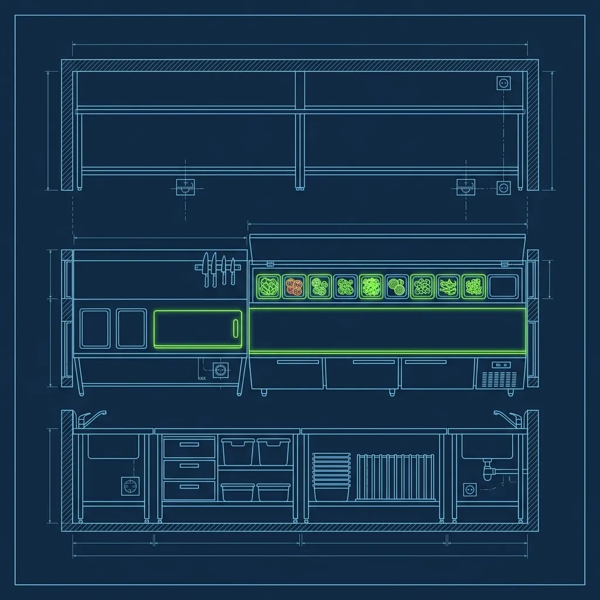
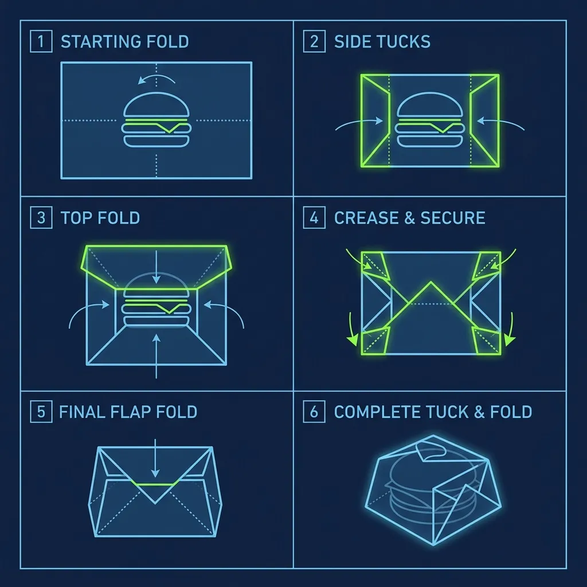

At [In-N-Out](/articles/chain/in-n-out) Burger, the kitchen runs on stations, and every station has a number. The Grill cook at Level 6 gets all the bragging rights. But here's the thing nobody tells you—the station directly behind the Grill, the one that most people have never even heard of, is universally considered the hardest job in the entire building. That station is called **The Board**, and it lives at Level 5 in the [The In-N-Out Level System Explained (Level 1 to Level 7)](/articles/in-n-out-level-system/))*

The Board is where burgers are dressed, assembled, and wrapped. And the person standing at that stainless steel table dictates the tempo of the entire kitchen. If the Board person falls behind by even thirty seconds during a Friday dinner rush, every single thing downstream starts to break. 

## The Board Setup and Station Layout

The Board person stands at a stainless steel prep table positioned directly across from the Grill cook. It's a face-to-face arrangement, and there's a reason for that—communication between the Board and the Grill has to be instantaneous. The Grill cook toasts the buns and places them onto the Board table. From that moment, the clock is ticking. 

Your job is to dress those buns perfectly, every single time. You apply the Secret Spread using a pump dispenser, then layer on shredded lettuce, tomato slices, pickles, and raw onions—all in a specific order that never changes. The condiments, vegetables, and spread are arranged within arm's reach in a standardized layout. The lettuce bin sits closest to your dominant hand. The tomato tray is always in the same position. The spread pump never moves. This layout is identical at every In-N-Out location, which means an experienced Board person can transfer to a different store and feel right at home within minutes.

On more than one occasion, new hires underestimate the setup phase. Before the store opens, you need to make sure every single container is fully stocked and positioned correctly. If you run out of shredded lettuce mid-rush and have to walk to the cooler, you've just created a fifteen-second gap that the Grill cook cannot absorb. Those fifteen seconds mean burnt patties.

## The Wrapping Speed That Separates Good from Great

Once the Grill cook drops the cooked patties onto your dressed buns, you enter the most demanding phase: the wrap. A top-tier Board person can dress, wrap, and bag a finished burger in under five seconds. That's not an exaggeration—it's a benchmark that experienced Associates actually hit during peak hours.

The wrap uses a specific tuck-and-fold method with wax paper. You tear a sheet from the roll, place the completed burger at a diagonal on the paper, fold the bottom corner up and over the burger, tuck the sides in tightly, and roll the entire thing forward in one fluid motion. Done correctly, the burger sits in a neat paper cradle with the top half of the ingredients visible and the bottom half tightly secured to hold everything together.

Here's where it gets tricky. You have to memorize which wrapped burger belongs to which order. If a customer ordered a Double-Double Animal Style and a plain Hamburger with no onions, those burgers have to land in the bag in the exact sequence the receipt dictates. Mix them up and the customer opens the wrong one first—that's a complaint, a remake, and wasted time. During a heavy rush, you might have six or seven wrapped burgers sitting in front of you, and you need to know which one is which without unwrapping them.

The reality is that wrapping is the single biggest bottleneck for new Board workers. Working the line, I observed Associates who can dress a bun perfectly at training speed completely fall apart when the Grill cook starts stacking patties faster than they can fold paper. The motion has to be automatic—muscle memory, not conscious thought.

## The Sink-or-Swim Pressure of a Real Rush

The Board person is the dam holding back the river, and the Grill cook is the river. The Grill cook does not stop. If you fall behind on dressing buns, the meat starts to sit on the grill longer than it should, which means overcooked patties. If you fall behind on wrapping, finished burgers pile up and get cold. Either way, the kitchen loses its rhythm.

When the Grill cook sees the backup growing, they'll yell "Board!" as a warning. That single word carries an enormous amount of weight in the In-N-Out kitchen. It means you're drowning, and everyone in the back of house knows it. In extreme situations, a manager or a backup-certified Associate will jump in to help clear the backlog, but that's considered an emergency measure—not a normal operating procedure.

To survive on the Board, you need to be functionally ambidextrous. You're grabbing lettuce with one hand while pumping spread with the other. You're wrapping a burger while mentally tracking the next three orders on the screen. It's a chaotic ballet of condiments, paper, and speed that would make most people's heads spin.

## The Board Certification Test

Getting certified on the Board is not casual. Your manager schedules a formal evaluation during a real rush—not a slow Tuesday afternoon. You have to prove you can keep pace with the Grill cook under actual service conditions. The evaluator watches your wrapping technique, your speed, your accuracy in matching burgers to receipts, and your composure under pressure.

Failing the test isn't the end of the world. You get retrained and try again. But I've watched Associates who failed their first Board test go home genuinely upset—not because of consequences, but because they care. Board certification is a milestone that separates casual part-timers from serious In-N-Out career builders. Passing it is one of the proudest moments in an Associate's career, right up there with earning your [Level 6 Grill certification](/articles/in-n-out-level-system).

## Pro Tips from Behind the Counter

- **Practice your wrap at home.** Grab some wax paper and a balled-up towel. Wrap it fifty times until the tuck-and-fold is second nature. Drilling this motion until it's automatic will save you during your first real rush.
- **Call out your builds.** Quietly repeat the order to yourself as you dress each bun—"Double-Double, spread, lettuce, tomato, onion." One wrong ingredient means an entire rebuild that costs you precious seconds.
- **Stay ahead of the Grill.** If you see the Grill cook lining up a row of patties, start dressing buns before they're called. Having three or four buns ready means the meat lands and you wrap immediately instead of scrambling to catch up.

## Frequently Asked Questions

### How long does it take to get certified on the Board?

Most Associates spend several weeks training before they're ready for the certification test. Fast learners can get there in two to three weeks, but a month or more is common. The deciding factors are your wrapping speed and your accuracy under real rush conditions—not just your ability to perform the technique in a calm training environment.

### Is the Board harder than the Grill?

Most In-N-Out employees say yes, and I agree. The Grill requires precision and timing, but the Board demands raw speed, constant multitasking, and simultaneous awareness of multiple orders. The Grill cook controls the pace; the Board person has to match it without falling behind. Many Associates who breeze through Grill training struggle significantly on the Board.

### Can you skip directly to the Board without working lower levels?

No. In-N-Out's [Level System](/articles/in-n-out-level-system) is strictly sequential. You must work your way up from Level 1 through Level 4 before you're eligible to train on the Board at Level 5. There are no shortcuts, regardless of prior restaurant experience. If you've been rolling burritos at Chipotle for three years, that's great—but you're still starting at Level 1 and working up like everyone else.

---
