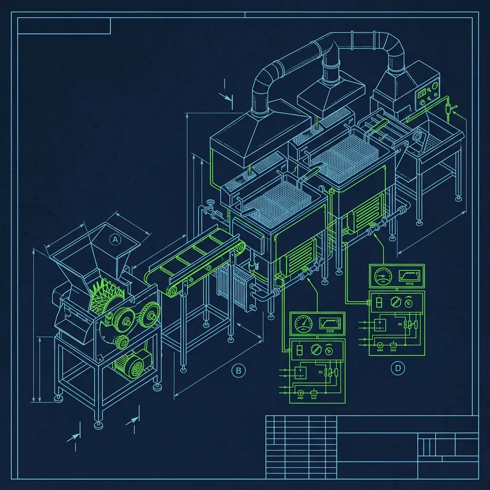
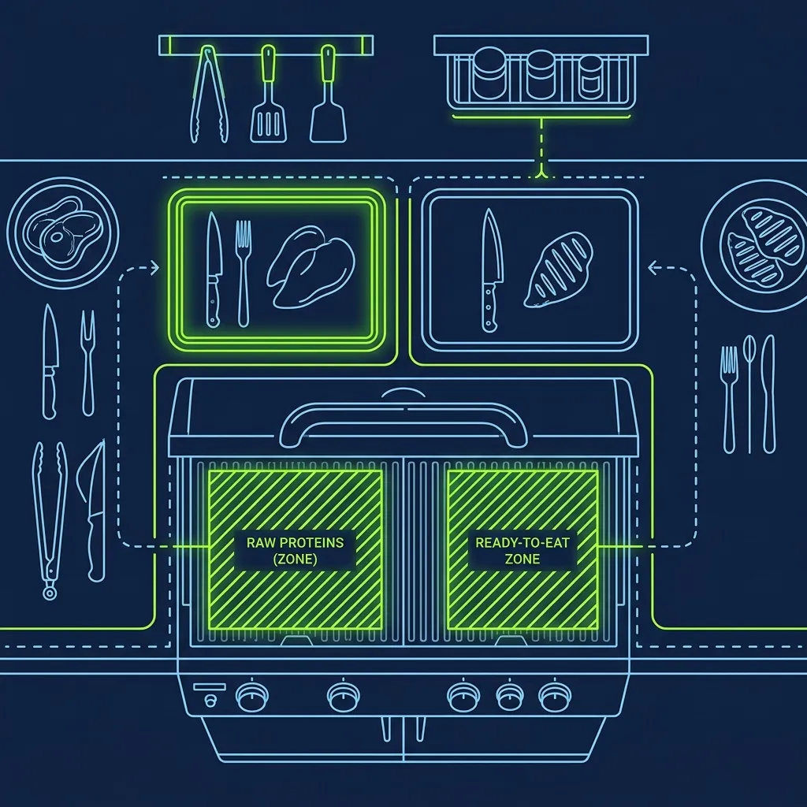

[In-N-Out](/articles/chain/in-n-out) Burger is famous for paying its people well—significantly better than the industry average, in fact. But here's the thing nobody tells you during the interview: they don't hand you that top-tier wage on day one. You earn it, one level at a time, through a structured promotion track that might be the most disciplined career progression system in all of fast food. 

It's called the Level System, and every single Associate starts at the bottom. There are no shortcuts. No skipping ahead because you managed a [Wendy's](/articles/chain/wendys) for two years. You prove yourself at each station, pass a formal evaluation, and then—and only then—do you move up and get the raise that comes with it. 

## Level 1: The Foundation (And the Filter)

Every new hire starts as a Level 1 Associate. Your universe is small: the dining room, the cleanup sink, and the trash cans. You're wiping tables, sweeping floors, emptying bins, and restocking napkins. That's it. 

I know what you're thinking—this sounds boring. And honestly, it is. But Level 1 is designed as a deliberate filter. In-N-Out management is watching you closely during this phase, and they're not just evaluating how well you clean a table. They want to know if you take unglamorous work seriously. Do you wipe that table without being asked? Do you notice when the napkin dispenser is running low? Do you greet customers walking through the door even though nobody told you to?

Associates who show up on time, keep the dining room spotless without prompting, and bring a genuinely positive attitude get promoted to Level 2 quickly—sometimes in as little as two weeks. Those who slack off, complain about cleaning duties, or show up with a bad attitude will stay at Level 1 indefinitely. Over the years, it both ways. The ones who treat Level 1 like an audition move up fast. The ones who treat it like punishment don't last.

## Levels 2 Through 4: Front-of-House Fundamentals

These middle levels are where most Associates spend the bulk of their early career, and each one teaches a critical piece of [the In-N-Out](/articles/in-n-out-board-station) operation.

**Level 2 — Order Taker:** You finally get to interact with customers. You learn the POS system, master counter orders, and—critically—memorize the [Secret Menu](/articles/in-n-out-secret-menu). Customers will throw Animal Style, Protein Style, 3x3, and Flying Dutchman orders at you constantly. If you fumble these during a Friday dinner rush, the entire line backs up.

**Level 3 — Fries:** You move to the back of the house and learn the french fry operation from scratch. This isn't dumping frozen fries into a basket. In-N-Out cuts their fries fresh from whole potatoes. You peel, dice, wash, and cook them to exact color and texture specifications. The fry station is deceptively technical—if the oil temperature drops below spec because you overcrowded the basket, the fries come out soggy and limp. That's a redo.

**Level 4 — Drive-Thru / Pay Window:** You handle the intense speed of the drive-thru lane, taking payment and organizing the massive influx of cars without making errors. The pressure here is relentless. Drive-thru times are tracked obsessively, and every second you spend fumbling for change or clarifying an order shows up in the metrics.

Each level requires a formal evaluation before promotion. And The actual situation: Your managers are watching your temperament, reliability, and how you handle stress. An Associate who cooks perfect fries but loses their cool during a rush will not be promoted to Level 4. In-N-Out puts equal weight on attitude and competence—and in my experience, that's exactly the right call.

## Levels 5 Through 7: Kitchen Mastery and Management

This is where the money gets real, but the difficulty spikes dramatically.

**Level 5 — The Board:** You're not cooking meat yet, but you're doing something arguably harder. You're dressing buns with spread, lettuce, tomatoes, and pickles, then wrapping finished burgers at insane speed. The [Board station](/articles/in-n-out-board-station) is widely considered the most demanding position in the entire store. A top-tier Board person can dress, wrap, and bag a burger in under five seconds.

**Level 6 — The Grill:** This is the holy grail. You're finally cooking the meat. Level 6 certification requires you to cook, flip, and pull rows of burgers perfectly without burning a single patty during a massive rush. The Grill cook sets the tempo for the entire kitchen, and there's an enormous amount of pride attached to earning your Level 6 stripes.

**Level 7 — Management / Shift Manager:** At Level 7, you're essentially a Shift Lead. You manage labor scheduling, handle the cash, address customer complaints, and run the floor during your shift. From here, you're eligible to enter the Store Management program—where salaries can eventually top $100,000 a year.

The jump from Level 4 to Level 5 is where During one shift, I noticed the most people either commit to a career at In-N-Out or decide this isn't for them. Levels 5 and 6 require genuine kitchen skill, physical endurance, and the ability to perform under extreme pressure. It's no longer about following scripts or learning a register. It's about cooking real food at extraordinary speed, and not everybody is built for that.

## The Pay Progression That Actually Motivates

Every level comes with a meaningful pay raise. While exact figures vary by location and market, the pattern is clear: Level 1 starts above local minimum wage, and each subsequent level adds a real bump—not a token ten cents. By Level 6 or 7, hourly Associates are earning significantly more than their peers at competing chains.

This is a massive part of In-N-Out's retention strategy. Unlike places where your only path to a raise is waiting for an annual review, the Level System gives you a visible, tangible goal at all times. You know exactly what you need to do to earn more money, and you can control the pace at which you get there. I wish every chain adopted a system like this. The employees who push through to Level 7 and beyond frequently describe it as one of the most rewarding career progressions in the restaurant industry—fast food or otherwise.

## Frequently Asked Questions

### How long does it take to go from Level 1 to Level 7?

There's no fixed timeline, but a motivated, full-time Associate can typically reach Level 7 within 12 to 18 months. Part-time Associates or those who take longer to pass evaluations may need two years or more. The pace is entirely determined by your performance and your managers' assessment of your readiness—not by tenure or seniority.

### Do you lose your level if you take time off or transfer stores?

No. Your level stays with you even if you transfer to a different In-N-Out location. If you take an extended leave, you may need a brief refresher when you return, but you won't be demoted. Your certifications are tracked in the company's system and follow you wherever you go.

### Is the $100,000 Store Manager salary real?

Yes. In-N-Out Store Managers are among the highest-paid in all of fast food. The exact salary depends on location, store volume, and experience, but six-figure compensation packages are well-documented and widely reported. It's a major reason In-N-Out has remarkably low management turnover compared to the rest of the industry.

---
