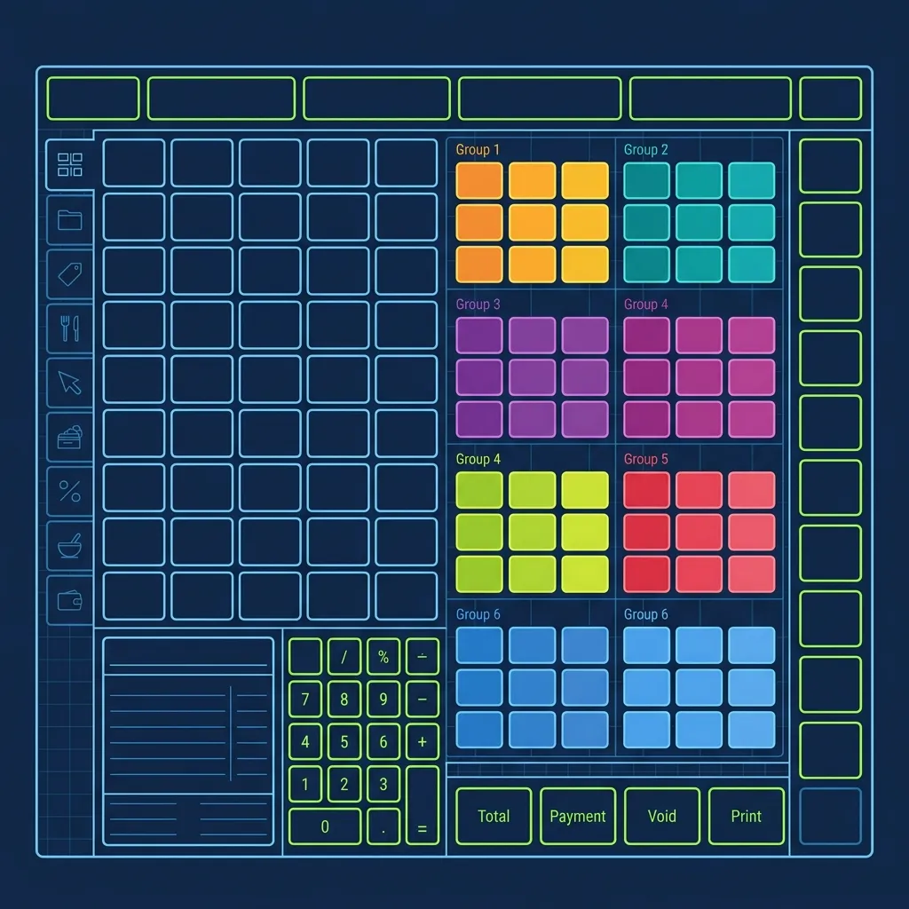
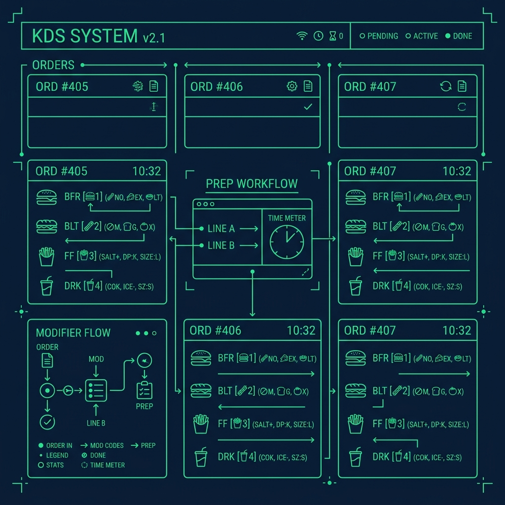

If you look at [the In-N-Out](/articles/in-n-out-board-station) drive-thru menu board, you'll count three food items: Double-Double, Cheeseburger, and Hamburger. Add fries, shakes, and drinks, and that's basically it. The simplest menu in fast food, right? 

Here's the thing nobody tells you before your first register shift: customers almost never order off that menu. They order off the legendary "Secret Menu"—and they expect you to know exactly what they're talking about without asking a single clarifying question. If you're working the counter or the drive-thru as a [What is the In-N-Out \](/articles/in-n-out-board-station/))*

## The POS System Is Built for Speed

The good news is that the Secret Menu isn't actually a secret to the Point of Sale computer. The most popular modifications have their own dedicated buttons on the touchscreen, so you're not manually typing instructions to the kitchen. 

The POS layout at In-N-Out is surprisingly intuitive once you learn the geography. The main screen shows base menu items, and tapping any one opens a modifier screen with all available customizations. Buttons are color-coded and grouped logically—proteins in one area, cooking instructions in another, topping modifications in a third. The system flows left to right, matching how customers typically build their order verbally.

I've trained new hires on POS systems at half a dozen chains, and I'll say this: In-N-Out's is one of the cleanest I've ever used. The problem isn't the interface—it's the sheer variety of modifications customers throw at you and how fast they expect you to process them.

## The Big Three Modifiers You Must Memorize Instantly

During your first week on the register, these three modifications will account for the vast majority of what you process:

- **Animal Style (Burgers):** Mustard-fried patty, extra Secret Spread, pickles, and grilled onions. You tap the burger size, then hit the "Animal Style" button. During a busy Friday dinner, you'll punch in more Animal Style Double-Doubles than regular ones. It's that popular.
- **Protein Style:** The bun is completely replaced with massive leaves of hand-leafed iceberg lettuce. One tap of the "Protein Style" modifier handles it. These take the Board person extra time to wrap because the lettuce wants to slide everywhere, so expect occasional kitchen pushback during peak hours.
- **Animal Style Fries:** A tray of fries topped with two slices of melted American cheese, grilled onions, and Secret Spread. This one fires to a different station than regular fries, so make sure you're hitting the right modifier or the order gets lost.

Getting fast at these three buttons—locating them without looking, tapping them without hesitation—is the first milestone for any new order taker. Once these are automatic, you've conquered about sixty percent of the modifications you'll encounter on a typical shift.

## The Tricky Modifiers That Catch You Off Guard

The hardest part of the POS isn't the popular items. It's the hyper-specific cooking instructions that In-N-Out allows customers to request. You need to know exactly where these toggles live on your screen:

- **"Well Done" or "Light Well" Fries:** Adjusting fryer time for extra crunch or softer fries. Customers are particular about this.
- **"Extra Toast" or "Light Toast":** Controls how long the buns sit on the grill. Extra Toast gives a crunchier bun, Light Toast keeps it softer.
- **"Flying Dutchman":** Two meat patties and two slices of cheese. No bun, no lettuce, no tomatoes, no nothing. Just meat and cheese. The first time someone orders this, it sounds made up. It's not.
- **"Mustard Fried":** Spreading mustard directly onto the raw patty before flipping it on the grill, creating a tangy, caramelized crust. This is part of Animal Style but can also be ordered separately.

Then there are the niche modifiers that come up less frequently but will absolutely trip you up: "Chopped Chilies" (small hot peppers), "Whole Grilled Onion" versus standard grilled onion (a thick slab versus finely chopped), and custom patty-to-cheese ratios like a 3x3 or the legendary 4x4. When a customer orders one of these, they expect you to know what it means without follow-up questions. Hesitation kills your drive-thru time and backs up the line.

## Navigating the Drink Screen Without Losing Your Place

One area that consistently trips up new Associates is the transition from the food screen to the drink screen. After punching in burger and fry modifications, you have to navigate to the beverage menu for shakes, sodas, or lemonade. In-N-Out shakes are made with real ice cream and are wildly popular, so you'll toggle between food modifiers and shake flavor selections constantly.

The key rule I always taught new hires: finish all food items for one customer before touching the drink screen. Do not bounce back and forth between food and beverages, or you'll lose track of the order and end up with missing items on the receipt. A missing shake might not seem like a big deal until the customer is already at the window and the [Board station](/articles/in-n-out-board-station) has already bagged their food. Now you've got a car sitting at the window while you wait for a shake to be blended, and every car behind them is watching the drive-thru timer climb.

## What the Kitchen Sees When You Hit Send

Understanding the kitchen side of the POS makes you a better order taker. When you send an order, the kitchen display shows shorthand codes: "DD AS MF" means Double-Double Animal Style Mustard Fried. "HB PS" means Hamburger Protein Style. Learning these abbreviations helps you troubleshoot when a cook asks you to clarify an order—and it happens more often than you'd think, especially with stacked modifiers on a single item.

The best advice I can give any new hire: don't panic when someone orders a "3-by-3 Protein Style, Mustard Fried, with Chopped Chilies." Just take it one word at a time. The POS interface is literally built to read the way the customer speaks. Punch it in sequentially, confirm it back, and send it.

## Frequently Asked Questions

### Is the Secret Menu officially recognized by In-N-Out?

Yes and no. In-N-Out doesn't advertise the Secret Menu on menu boards or in marketing materials. However, the company openly acknowledges these items exist, the POS has dedicated buttons for them, and every Associate is trained to take them. It's an "open secret" that is fully supported by the operation, and if you work there, you'll process Secret Menu orders all day long.

### Do customers ever order Secret Menu items that don't actually exist?

Occasionally. Social media has spawned some mythical items that aren't in the POS system. If a customer orders something you don't recognize, politely ask them to describe what they want. Nine times out of ten, it's a combination of existing modifiers you can build manually—even if the trendy name they're using isn't a real button. Stay calm and problem-solve.

### How long does it take to fully memorize the POS layout?

Most new Associates feel comfortable within one to two weeks of regular shifts. The Big Three modifiers are usually locked in within the first few days. The tricky modifiers and niche items take longer, but by the end of your first month, you should be able to handle any Secret Menu order without hesitation. The key is building spatial memory—knowing where buttons live on the screen, not just knowing the menu items exist.

---
