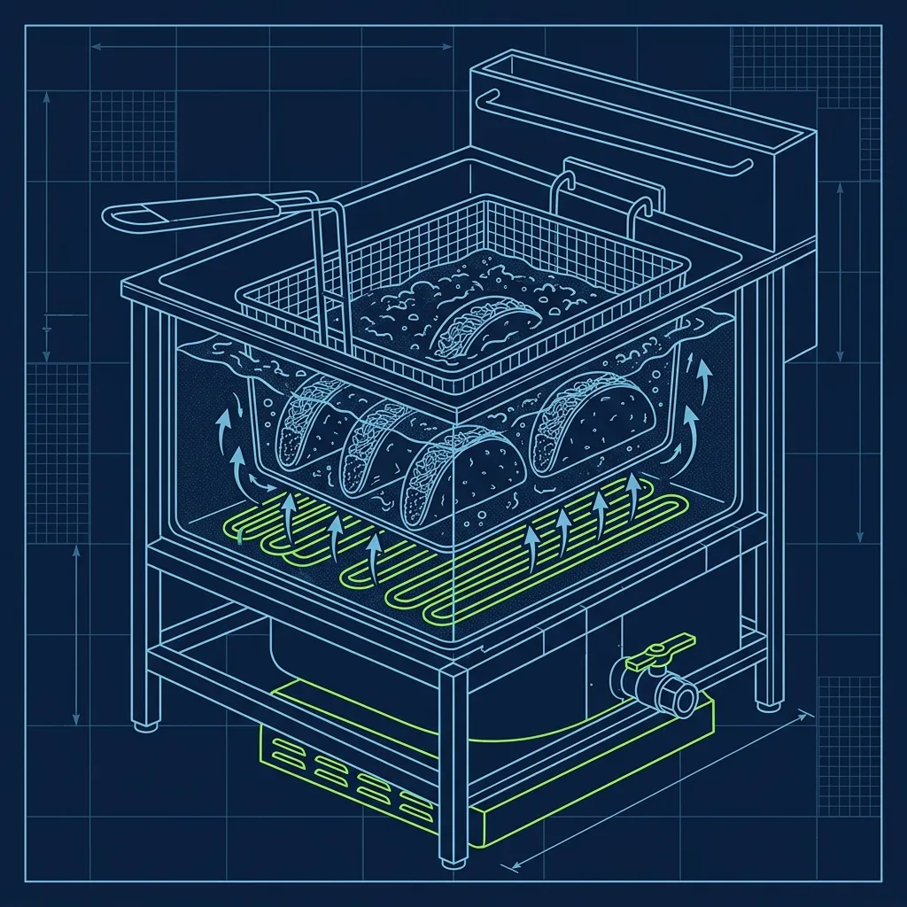
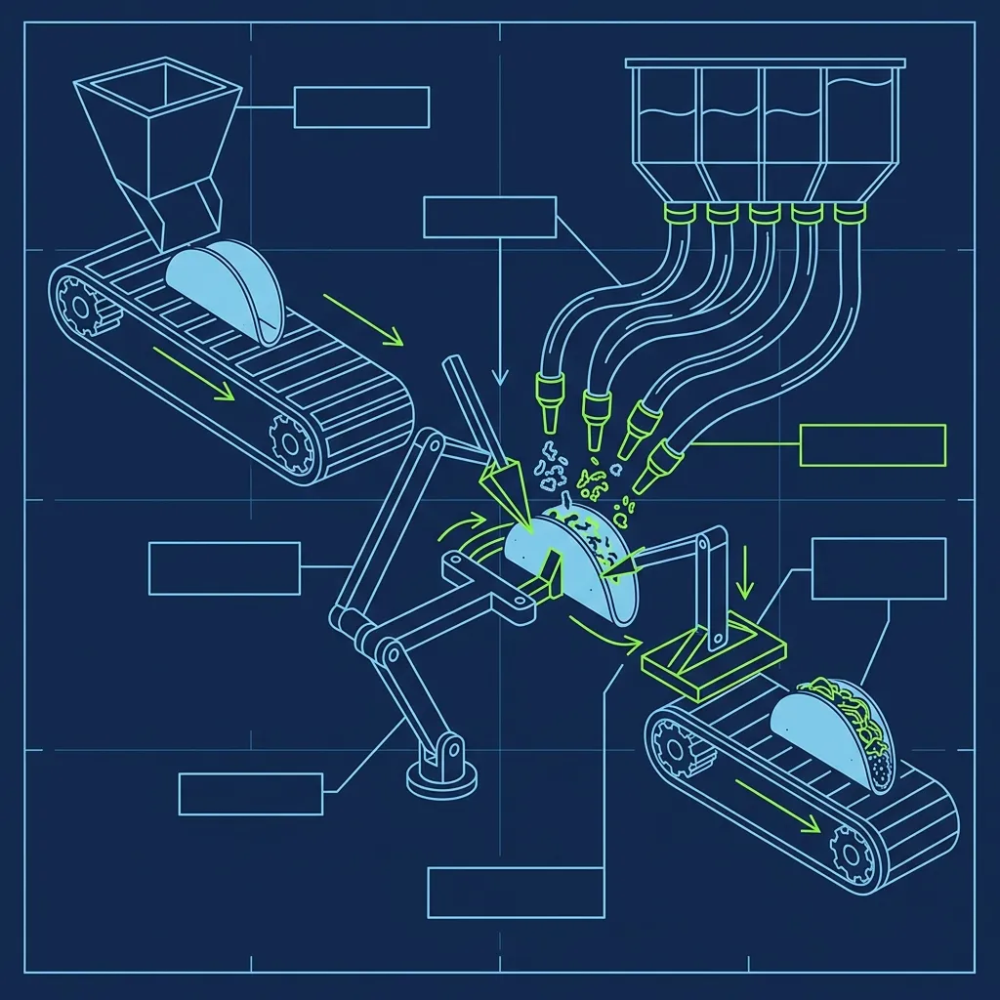

The Jack in the Box taco is one of the strangest, most polarizing items in all of fast food. It's greasy, crunchy, oddly textured, and costs almost nothing. People either love it or look at it with genuine confusion. But if you've ever held one in your hand and thought, "Wait—how did they get the cheese and lettuce inside a shell that looks like it was fried completely shut?"—you're asking exactly the right question. *(Related guide: [How Dangerous Are the KFC Pressure Fryers?](/articles/kfc-pressure-fryers/))*

The answer is weirder than you'd expect, and if you're a new Jack in the Box employee, the first time you see the process is going to catch you off guard. *(Related guide: [Does Five Guys Really Not Have Any Freezers?](/articles/five-guys-no-freezers/))*

## They Arrive Pre-Stuffed and Frozen

Here's the biggest shock for every new hire: you don't assemble the meat inside the taco shell. Not even close. The tacos arrive at the store frozen solid in massive boxes, stacked like playing cards. Each frozen taco is a flat, folded corn tortilla with a thin layer of seasoned meat paste already pressed inside and sealed shut. *(Related guide: [The Popeyes Chicken Battering Process: Why It's So Crispy](/articles/popeyes-chicken-battering-process/))*

The meat itself isn't traditional ground beef. It's a blend of beef and soy protein that's been processed into a smooth, almost paste-like consistency. If you're expecting something that looks like taco meat from Taco Bell, reset your expectations. This filling looks more like a thin smear of seasoned paste, and that's by design. The filling has to be thin enough to cook all the way through during the short frying time without the tortilla shell burning on the outside.

I've watched new cooks open their first box of frozen Jack tacos and genuinely not understand what they were looking at. "These are the tacos?" Yes. Those flat, frozen tortilla cards with a mysterious filling inside them are about to become the cult-classic snack that customers order by the dozen at 1 AM.

## The Deep Fryer Does All the Heavy Lifting

When a customer orders tacos, you grab the frozen, meat-filled tortillas and drop them directly into the deep fryer. No thawing, no prep—straight from the freezer into 350°F oil.

The frying takes roughly 60 to 90 seconds, depending on fryer temperature and batch size. You submerge the tacos using a wire basket or long tongs to keep them from floating. As the tortillas fry, they naturally curl into the iconic half-moon shape that customers recognize. The oil penetrates the corn tortilla, crisping the outside into a hard, crunchy shell while the heat simultaneously cooks the raw meat filling inside.

When they come out, the shells are deeply golden and glistening with oil. You place them on a draining rack to let the excess grease run off—and here's where experience matters. New cooks rush this step because they want to get the tacos out fast. Don't. Give them an honest 15 to 20 seconds on the drain rack. The shells firm up slightly as they cool, which makes the next step dramatically easier.

The frying process is what gives the Jack in the Box taco its signature greasy, deep-fried character. You can't replicate this texture any other way. The shell is simultaneously crunchy and oil-soaked, and the cooked meat inside has a unique consistency that doesn't exist at any other chain. Love it or hate it, the fryer is the secret.

## The Pry-and-Stuff Technique

This is where things get weird, and it's the step that makes new cooks nervous. The taco was fried shut, remember? So now you have to open it back up to add the cold toppings.

1. **The Pry:** Take your gloved fingers and gently pry the hard, greasy shell open at the top seam—just enough to create a gap. Too much pressure and the brittle shell shatters in your hand. Not enough and you can't fit anything inside.
2. **The Cheese:** Slide half a slice of standard American cheese into the crack, laying it against the piping hot meat so it immediately starts melting.
3. **The Lettuce:** Stuff a pinch of shredded iceberg lettuce into the gap on top of the cheese.
4. **The Sauce:** Squirt the signature taco sauce directly over the lettuce, then quickly wrap the finished taco in paper before the shell snaps apart.

The prying step requires a feel that only comes with practice. I've seen new cooks crush tacos like eggshells because they squeezed too hard, and I've seen others barely crack the opening and try to cram a cheese slice into a gap that's way too narrow. The technique is a gentle but firm squeeze at the top seam—just enough to crack the opening without breaking the sides. After your first shift of doing this, your fingers develop the instinct. After your first week, it's automatic.

## The Late-Night Volume Factor

Here's the operational reality that surprises most new hires: the volume on these things is absolutely staggering. Jack in the Box reportedly sells hundreds of millions of tacos per year across all locations. Because of the dirt-cheap price point—two tacos for a couple of dollars—customers order them in absurd quantities, especially during the late-night window.

A single order of 10 or 20 tacos is not unusual after midnight. I've heard stories of 50-taco orders coming through the drive-thru at 2 AM on a Saturday. That means you're frying full baskets, draining them, prying open two dozen shells in rapid succession, stuffing cheese and lettuce into each one, saucing and wrapping—all while the next batch is already bubbling in the fryer.

The assembly line rhythm becomes second nature quickly: fry a batch, drain, pry, cheese, lettuce, sauce, wrap, repeat. Batch your assembly during a rush—fry a full basket, then pry and stuff them all in sequence rather than completing one taco before starting the next. This keeps your rhythm consistent and prevents the last tacos in the batch from getting cold and brittle.

## Why This Process Creates a Cult Following

It's a weird, messy process. The tacos look nothing like traditional tacos. The meat is unconventional. The shell is soaked in fryer oil. And yet, that exact combination of crispy, greasy, cheap, and oddly satisfying is exactly what creates a cult following. The process is the product—change any step and you'd lose what makes a Jack in the Box taco a Jack in the Box taco. As a cook, once you get the rhythm down, it's actually one of the more satisfying items to crank out in volume. There's something meditative about the fry-pry-stuff-wrap cycle at 1 AM.

## Frequently Asked Questions

### What kind of meat is actually in the Jack in the Box taco?

The filling is a blend of beef and soy protein, seasoned with spices and processed into a smooth consistency. It's designed to be spread thin inside the tortilla so it cooks through quickly during frying. It doesn't taste or look like traditional ground beef—it has a softer, paste-like texture that firms up slightly after frying. It's unconventional, but that's part of the charm.

### Why are Jack in the Box tacos so cheap?

The price point works because of the production efficiency. The tacos arrive pre-assembled and frozen, so there's virtually no labor in building the base product. The frying step is fast, the toppings are minimal—half a slice of cheese, a pinch of lettuce, a squirt of sauce—and the ingredients themselves are inexpensive. It's a pure volume play with a tiny per-unit profit margin, but the chain moves hundreds of millions of them annually. Similar to how [KFC's pressure fryers](/articles/kfc-pressure-fryers) enable fast batch cooking, Jack's frozen-to-fryer process is designed around maximum throughput.

### Are the tacos gluten-free?

The shell is a corn tortilla, which is naturally gluten-free. However, the tacos are fried in shared oil with other menu items that contain gluten, so cross-contamination risk is significant. Jack in the Box does not market the tacos as gluten-free, and if a customer has celiac disease or a serious sensitivity, you should advise them accordingly.

---
