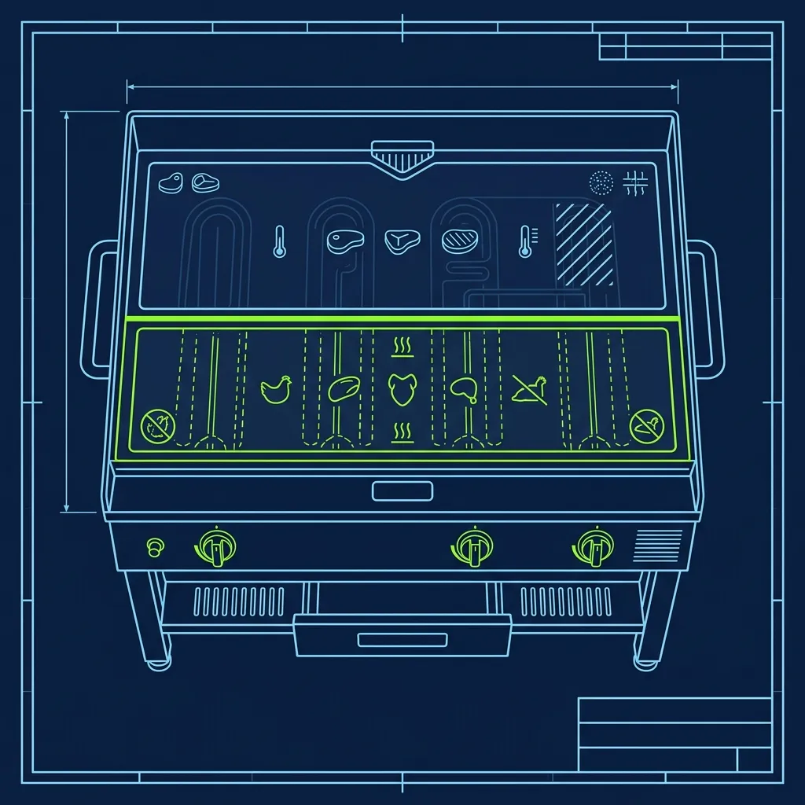
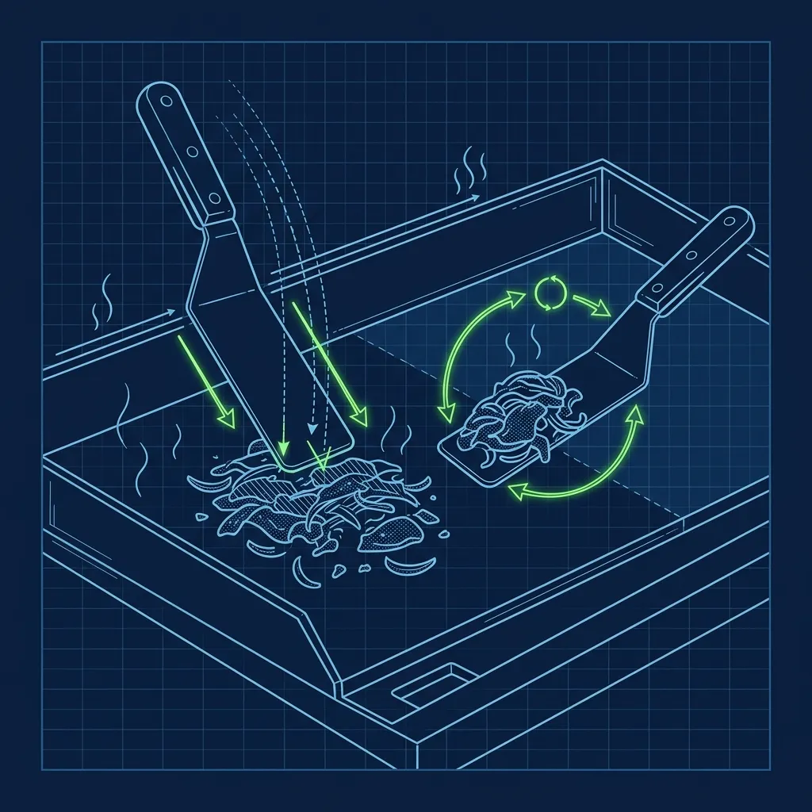

Jersey Mike's built its reputation on fresh-sliced cold subs and the famous [What is \](/articles/jersey-mikes-mikes-way/))*

The Jersey Mike's cheesesteak is cooked from raw, thinly shaved USDA Choice beef on a real flat-top grill. There's nothing pre-cooked, microwaved, or processed about it. And that distinction is exactly what makes this station both the most rewarding and the most physically punishing position in the store. 

## Raw Beef, Raw Chicken, and Zero Margin for Error

> **Russell's Note:** People always ask why this tastes different at home. Simple. We aren't afraid of butter, salt, and keeping the clamshell grill screaming hot.

> **Russell's Note:** I've got faded burn scars from exactly this kind of setup. If you aren't communicating with 'Behind!' and 'Hot!', you're going to get someone hurt.

The first thing that hits you about the grill station is the cross-contamination protocol. Because you're handling raw beef and raw chicken in close proximity to a deli counter that serves ready-to-eat cold subs, the safety requirements are intense—and non-negotiable. 

The raw steak arrives in paper-wrapped pucks stored in a dedicated cooler section, completely separate from deli meats. When you pull a puck, you handle it with one set of gloves, place it on the grill, then immediately strip those gloves off and put on a fresh pair before touching anything else. The same principle applies to raw chicken—it has its own designated grill zone, its own spatulas, and its own cutting tools. If you accidentally grab the chicken spatula and then reach toward the beef zone, you need to re-glove and sanitize. No exceptions.

You use specific spatulas for raw meat and completely different spatulas for cooked meat. These are usually color-coded or marked, but during a chaotic lunch rush, it's on you to maintain the discipline. I've seen new grill cooks grab the wrong spatula without thinking because they're under pressure and moving fast. That's exactly how cross-contamination incidents happen.

It sounds extreme, but here's the reality: health inspectors know that operations cooking raw proteins alongside ready-to-eat food are high-risk environments. A single cross-contamination event can shut a location down. The protocols exist for a very good reason.

## The Chop-and-Flip Technique That Destroys Your Forearms

Cooking a Jersey Mike's cheesesteak is a physical workout disguised as food prep. Here's the sequence:

1. Drop the puck of shaved raw steak onto the hot, oiled flat-top grill.
2. Place raw onions and peppers next to it.
3. Take two heavy metal spatulas and aggressively chop the meat, slamming them down into the pile repeatedly to tear the thin layers apart so they cook evenly.
4. Fold the grilled onions and peppers into the chopped meat.
5. Shape the pile into a tight rectangle that matches the length and width of the bread.
6. Lay slices of white American cheese on top to melt.

The chopping is what makes this station brutal. You're not gently stirring—you're slamming two metal spatulas into a pile of meat on a scorching steel surface, over and over, breaking apart thin sheets of steak until they're evenly sized and fully cooked. During a lunch rush, you might chop 30 to 40 cheesesteaks in a single hour. Your forearms, wrists, and shoulders will scream by the end of the shift.

Veteran grill cooks develop a rhythm—chop-chop-flip, chop-chop-flip—that becomes almost musical. New cooks either chop too timidly, leaving large undercooked clumps that the customer will notice, or too aggressively, sending meat flying off the grill onto the floor. The sweet spot takes a few dozen steaks to find, and there's no shortcut to getting there.

## The Bread Transfer: The Move That Makes or Breaks You

Once the cheese is melted, you place the sliced sub roll face-down directly onto the greasy, cheesy pile of meat. You slide your long spatula entirely under the meat, place your other hand lightly on top of the bread, and perform a rapid "scoop and flip" to transfer the massive sandwich onto deli paper.

This is the move that separates competent grill cooks from struggling ones. If your spatula isn't positioned far enough under the meat pile, half the filling slides off during the flip and ends up back on the grill. If you flip too slowly, the cheese separates from the meat and you get a messy, loose sub. The trick is confidence—one smooth, decisive motion. Hesitation is the enemy. No half-turns, no adjustments mid-flip. You commit and go.

During a rush with six cheesesteaks cooking simultaneously, you're performing this flip while dodging popping grease and keeping track of which steak was dropped first. Veterans make it look effortless. Rookies will fumble the first dozen attempts, and that's completely normal. It's a skill that has to be trained through repetition.

## Keeping the Flat Top Clean Between Orders

Between orders, you're responsible for keeping the grill surface clean. Burnt cheese and caramelized onion residue builds up fast, and if you don't scrape regularly, the next cheesesteak sticks to the surface and tears apart during the flip. Most stores use a heavy-duty grill brick or metal scraper between batches, followed by a thin layer of fresh oil to re-season the surface.

This isn't just about food quality—it's a health code requirement. Inspectors specifically check flat-tops for carbon buildup and residue. A dirty grill is a citation waiting to happen. The smart move is to scrape after every single steak, not just when the buildup gets visible. It takes five seconds and saves you from fighting a sticky, blackened surface during the next order.

## Pro Tips from the Flat Top

- **Shape the meat before the cheese goes on.** Take an extra two seconds to form the chopped meat into a tight rectangle that matches the bread dimensions. This makes the flip dramatically easier because the meat sits neatly inside the roll instead of hanging over the edges.
- **Watch the cheese, not the clock.** Judge cheese melt by sight—it should be fully melted and just starting to drip down the sides before you place the bread. If the cheese is still solid, the flip will cause it to slide right off.
- **Work left to right during a rush.** Oldest order on the left, newest on the right. This prevents you from losing track of which steak was dropped first and accidentally serving an overcooked or undercooked sandwich.

## Frequently Asked Questions

### Is the steak at Jersey Mike's real steak?

Yes. Jersey Mike's uses thinly shaved USDA Choice beef for their cheesesteaks. It's not processed or restructured meat—it's actual steak shaved paper-thin so it cooks quickly on the flat-top grill. If you've ever been to an [Arby's and watched their slicer](/articles/arbys-meat-slicer), you know how important meat quality claims are in fast food. Jersey Mike's delivers on theirs.

### How long does a cheesesteak take from grill to wrap?

The entire process—from the moment the raw puck hits the grill to the finished, wrapped sub—takes roughly three to four minutes. The actual cooking and chopping is about two minutes, and the cheese melting, bread transfer, and wrapping fill the rest. During a rush, you'll have multiple steaks at different stages simultaneously.

### Can you work the grill without prior cooking experience?

Yes, but expect a steep learning curve. Jersey Mike's provides on-the-job training, and new grill cooks are paired with an experienced trainer for several shifts before working solo. The chop-and-flip technique takes practice, and the cross-contamination protocols must be followed perfectly from day one—no grace period on food safety.

---
