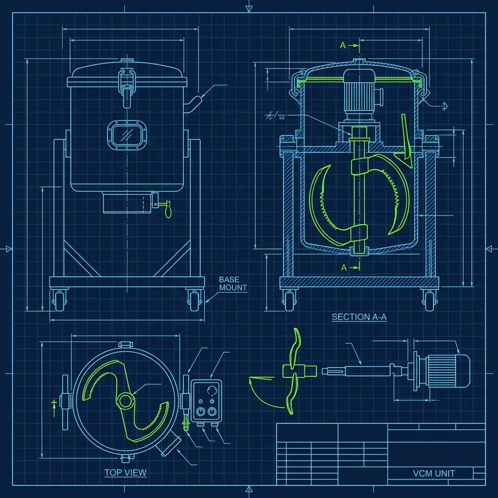
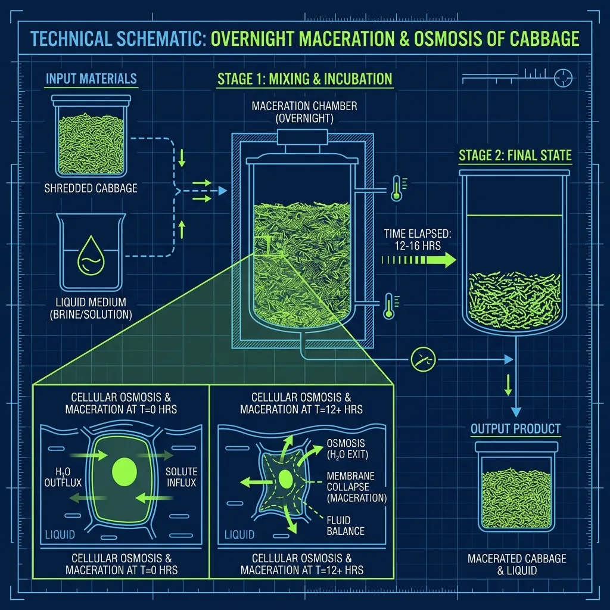

Here's something that catches every new KFC hire off guard: the coleslaw you serve at 11:00 AM opening was mixed by the closing crew the night before. That's not a corner being cut—it's the entire point. The mandatory overnight rest is what transforms a pile of chopped cabbage and acidic dressing into the creamy, sweet side that customers have been obsessing over for decades. I've watched new prep cooks taste freshly mixed coleslaw, make a face, and assume something went wrong. Nothing went wrong. It just isn't finished yet. *(Related guide: [KFC Original Recipe vs. Extra Crispy: How Are They Cooked Differently?](/articles/kfc-original-vs-extra-crispy/))*

## The Fine Chop: Why Confetti, Not Shreds

If you've ever made coleslaw at home, you probably ran a head of cabbage across a mandoline or sliced it into long, thin strips. KFC does the exact opposite. The raw cabbage, carrots, and onions get dumped into a commercial vertical cutter mixer—basically an industrial food processor with blades the size of your forearm—and chopped into tiny, confetti-like pieces in a matter of seconds. *(Related guide: [How Dangerous Are the KFC Pressure Fryers?](/articles/kfc-pressure-fryers/))*

This isn't an aesthetic choice. It's chemistry. Those tiny pieces have exponentially more exposed surface area than long shreds, which means the dressing can penetrate the vegetable tissue faster and more completely during the overnight maceration. If you used traditional thick shreds, twelve hours wouldn't be enough time for the dressing to fully break down the tough cabbage fibers. You'd end up with crunchy strips floating in a puddle of dressing instead of the soft, integrated texture KFC is known for. *(Related guide: [The Popeyes Chicken Battering Process: Why It's So Crispy](/articles/popeyes-chicken-battering-process/))*

Here's the thing nobody tells you during training: the chop consistency matters more than you'd think. If the food processor blades are getting dull—and they do, faster than management wants to replace them—you'll get an uneven chop. Some pieces come out as fine confetti, others as big, tough chunks. Those different-sized pieces macerate at completely different rates, so your finished coleslaw has some pieces that are properly soft and others that still crunch like raw salad. I've seen new hires not notice until a customer complains. If you're on prep and the chop looks ragged, flag it to your manager immediately. Dull blades need sharpening or replacing before you waste an entire batch.

## The Proprietary Dressing and the Mixing Technique

Once the vegetables are chopped, the prep cook dumps in a bag of KFC's proprietary coleslaw dressing. The exact formula is a closely guarded corporate secret, but the primary components are mayonnaise, sugar, vinegar, and buttermilk. It arrives pre-packaged in sealed bags from the supplier—no store mixes the dressing from scratch.

The mixing process itself is where experienced prep cooks separate themselves from rookies. The dressing-to-vegetable ratio has to be precise. Too much dressing and the coleslaw becomes a soupy, mayonnaise-heavy mess that pools liquid at the bottom of every serving cup. Too little and the cabbage won't macerate properly overnight, leaving you with dry, crunchy pieces that taste like a raw salad someone accidentally drizzled ranch on.

The reality is that veterans know the correct ratio by sight and feel. Every piece of vegetable should be visibly coated when you're done mixing, but there should not be a pool of excess dressing sitting at the bottom of the bin. You're folding, not stirring—big, gentle movements that distribute the dressing without crushing the vegetables into mush before they've had a chance to macerate naturally. I've seen new hires attack it like they're mixing concrete. Slow down. The overnight rest does the heavy lifting, not your arms.

## The Mandatory 12-Hour Maceration

This is the step that makes KFC coleslaw fundamentally different from anything you'd make at home. KFC has a strict corporate policy: freshly mixed coleslaw must sit in the walk-in refrigerator for a minimum of 12 hours—preferably overnight—before a single spoonful can be served to a customer.

The science behind it is straightforward. Cabbage is mostly water. As the cabbage sits in the salty, acidic dressing, osmosis kicks in. The cabbage cells release their natural water into the dressing, thinning it out, while simultaneously absorbing the sugar and vinegar from the dressing. This 12-hour exchange is what softens the cabbage to that perfect yielding texture and creates the sweet, creamy liquid that collects at the bottom of the cup.

If you eat the coleslaw immediately after mixing, it tastes terrible. The cabbage is still crunchy and raw-tasting, and the dressing tastes overwhelmingly acidic and sharp. That's why the most efficient workflow is to mix your next batch during closing prep. The coleslaw goes into the walk-in at 10 PM, the overnight hours do the work, and by the time the morning crew opens at 10:30 AM, you've got a fully macerated batch ready to serve.

## The Serving Window and Shelf Life

Even after the 12-hour rest, coleslaw doesn't last forever. KFC enforces a maximum hold time of 48 to 72 hours after mixing. Beyond that window, the cabbage breaks down too much, the texture turns mushy, and the dressing begins to separate into an unappetizing watery layer.

The prep cook writes the preparation date and time on every container when the coleslaw goes into the walk-in. Managers are responsible for checking those dates and pulling anything that's past its window—no exceptions, no "it still looks fine" judgment calls. During busy periods like weekends, holidays, or catering orders, a single KFC location might prep multiple large batches per day to stay within the freshness window. On a slow Tuesday, one batch from the night before might carry the entire day.

One critical step that gets skipped more than I'd like to admit: stirring the batch before portioning. After sitting for 12 hours, the heavier dressing and liquid settle to the bottom of the container. If you start scooping from the top without stirring, the first cups you serve are dry and bland while the last cups are swimming in liquid. Always give the batch a thorough stir before you start filling serving cups. Every customer deserves the same product.

## Why Home Recipes Never Taste the Same

This is the question I get asked more than any other. People find copycat recipes online, buy the right ingredients, and their coleslaw still doesn't taste like KFC's. The answer is almost always the same: they skipped the overnight rest. They mixed it and served it within an hour. Without the 12-hour maceration and the ultra-fine confetti chop, you're eating a completely different product. The ingredients might be similar, but the process is everything. The cabbage hasn't softened, the dressing hasn't mellowed, and the flavors haven't integrated. You've made regular coleslaw with KFC-style dressing poured on top. That's not the same thing.

## Frequently Asked Questions

### Can you buy KFC coleslaw dressing separately?

No. The dressing is proprietary and arrives at each KFC location pre-packaged in sealed bags from the supplier. It is not sold to the public under any circumstances. Dozens of copycat recipes exist online—some are surprisingly close—but the exact formula remains a corporate secret. If you're attempting a home version, buttermilk-based dressings with a heavy sugar component get you closest.

### Is KFC coleslaw actually made fresh in each store?

Yes, and this surprises a lot of people. The raw cabbage, carrots, and onions are chopped on-site in every individual KFC location using the store's vertical cutter mixer. The dressing is the only pre-made component—it arrives in sealed bags. The prep cook mixes the vegetables and dressing by hand, labels the container, and stores it in the walk-in for the 12-hour rest. Nothing about the coleslaw is assembled in a factory.

### How many calories are in a serving of KFC coleslaw?

A standard individual serving runs roughly 170 calories, with the majority coming from the mayonnaise and sugar in the dressing. Despite being marketed alongside the word "salad," this is not a low-calorie side. But that rich dressing is exactly what drives the flavor profile that keeps people ordering it decade after decade. If you're watching calories, just know what you're signing up for—and enjoy it anyway.

---

*For more KFC insider knowledge, check out our guide on [KFC Original Recipe vs. Extra Crispy](/articles/kfc-original-vs-extra-crispy) and learn about [the pressure fryers that make it all possible](/articles/kfc-pressure-fryers). You might also enjoy our breakdown of [the Popeyes chicken battering process](/articles/popeyes-chicken-battering-process) for a comparison of how different chains approach their signature products.*
