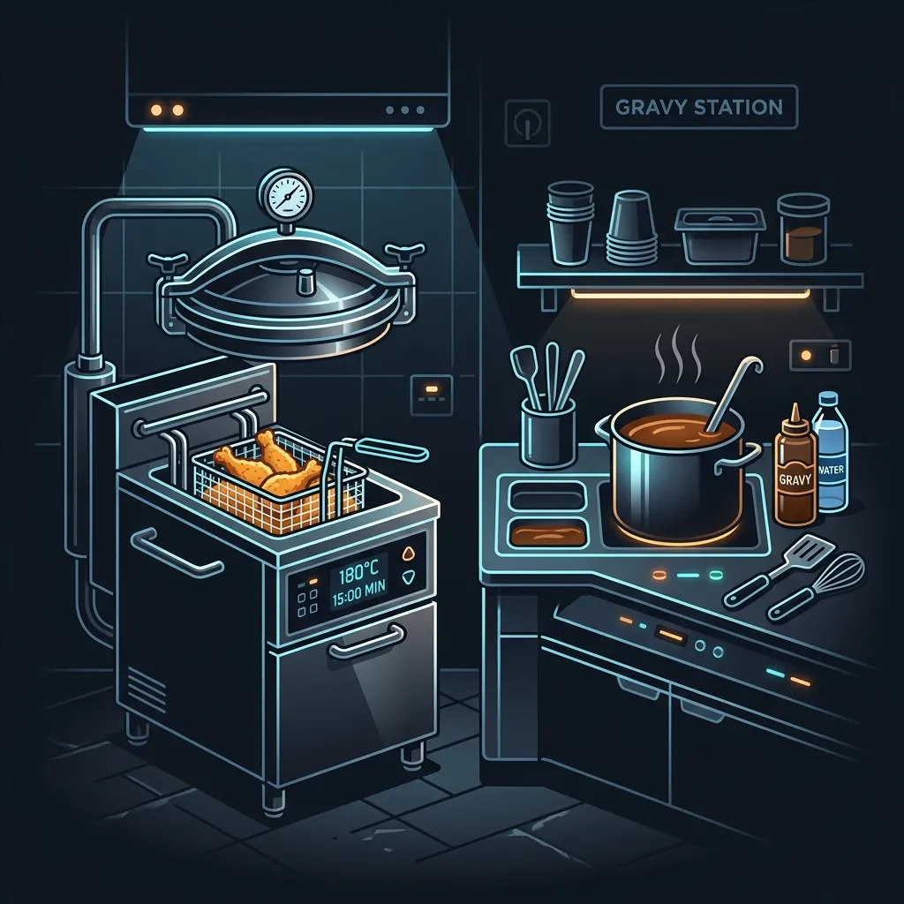

If you have ever worked in the fast food industry, you know that gravy is usually an afterthought. At most chains, making gravy involves tearing open a foil packet of brown powder, dumping it into a large metal cambro, adding boiling water from the coffee machine, and whisking until your arm falls off. It is cheap, fast, and entirely unremarkable.

KFC does things differently. While they do use a proprietary seasoning packet as a base, the secret ingredient that gives KFC gravy its dark color, rich mouthfeel, and highly specific savory flavor is a back-of-house byproduct known as "crackling."

When I managed kitchens, training new cooks on the gravy process was always an interesting shift. Watching someone realize that the brown sludge at the bottom of the deep fryer is actually the foundation of a beloved side dish is a rite of passage. Let me lay out the process:

## Harvesting the Crackling

To understand the gravy, you have to understand the frying process. KFC cooks their Original Recipe chicken in large [pressure fryers](/articles/kfc-pressure-fryers/). Throughout the day, the cooks drop rack after rack of freshly breaded chicken into the hot oil. As the chicken cooks under pressure, bits of flour, the eleven herbs and spices, and rendered chicken fat fall off the meat and sink to the bottom of the vat.

Over several hours, this debris forms a thick, dark, sludge-like layer at the bottom of the fryer. This is the crackling. 

When it is time to filter the fryers—a process that happens multiple times a day to keep the oil clean—the cook drains the hot oil through a filter system. What is left behind in the vat is a heavy layer of dark brown, highly seasoned chicken fat and cooked breading. 

Instead of throwing this away, the cook carefully scrapes the crackling out of the vat and transfers it into a specialized metal strainer or a designated crackling container. This requires a bit of skill because the cook has to separate the usable, flavorful crackling from any pieces that are completely burned and bitter.

## The Recipe and Ratios

Once the crackling is harvested, it has to be cooled and stored according to strict food safety guidelines. When a batch of gravy needs to be made, the prep cook follows a highly specific ratio.

The recipe requires three main components:
1. The proprietary KFC gravy powder packet (which contains thickeners, salt, and extra seasoning).
2. Hot water.
3. A precisely measured amount of the crackling.

The exact ratio of crackling to powder is what makes the gravy work. If a cook tries to rush the process and uses too little crackling, the gravy turns out pale, thin, and tastes like salty water. If they use too much crackling, the gravy becomes overly greasy, heavily dark, and tastes faintly of burnt flour. The standard calls for a specific number of scoops of crackling per batch, ensuring consistency across every location.

## The Whisking Process

Making the gravy requires physical effort. The cook combines the powder and the crackling in a large container. They add a specific volume of boiling water. Then, they have to whisk the mixture aggressively. 

The hot water activates the thickeners in the powder, but it also melts the chicken fat suspended in the crackling. As the cook whisks, the fat emulsifies into the liquid, while the tiny bits of seasoned flour dissolve and distribute throughout the batch. It takes several minutes of continuous, heavy whisking to ensure there are no lumps and the fat doesn't separate and float to the top.

Once mixed, the gravy is passed through a fine mesh strainer to catch any large, unappetizing chunks of breading that didn't break down during the whisking process. What flows through the strainer is the smooth, rich gravy customers know and love.

## The Decline of True Crackling

It is worth noting that the process has evolved over the years, and not always for the better. Decades ago, KFC gravy relied heavily on the cracklings from the Original Recipe chicken, resulting in a deeply savory, almost smoky gravy. 

Today, some locations try to speed up the prep process by relying more on the powder packets and less on the cracklings, especially if they are running behind during a lunch rush or if the fryers haven't produced enough usable sludge. In some international markets, or in smaller express locations, KFC has even moved toward a simplified powder-only mix to cut down on labor costs and ensure total uniformity. 

However, in a well-run traditional KFC kitchen, the crackling process is still alive and well. It is one of the last true "from scratch" prep methods left in modern fast food, heavily utilizing a byproduct that any other restaurant would simply dump in the grease trap.

## Frequently Asked Questions

### Can you taste the difference if a store doesn't use crackling?
Yes. Gravy made purely from a powder packet is noticeably lighter in color and lacks the rich, oily mouthfeel of the traditional recipe. It tastes more like generic supermarket bouillon rather than savory roasted chicken.

### Is the gravy vegetarian?
Absolutely not. Because the gravy relies on the cracklings harvested from the chicken fryers, it is packed with rendered chicken fat and meat juices. 

### Does the gravy use [Extra Crispy](/articles/kfc-original-vs-extra-crispy/) cracklings too?
No. The cracklings are specifically harvested from the [pressure fryers](/articles/kfc-pressure-fryers/) used for the Original Recipe chicken. The [Extra Crispy](/articles/kfc-original-vs-extra-crispy/) chicken is cooked in standard open fryers, and the breading runoff from those fryers does not have the same concentration of the eleven herbs and spices required to flavor the gravy correctly.
