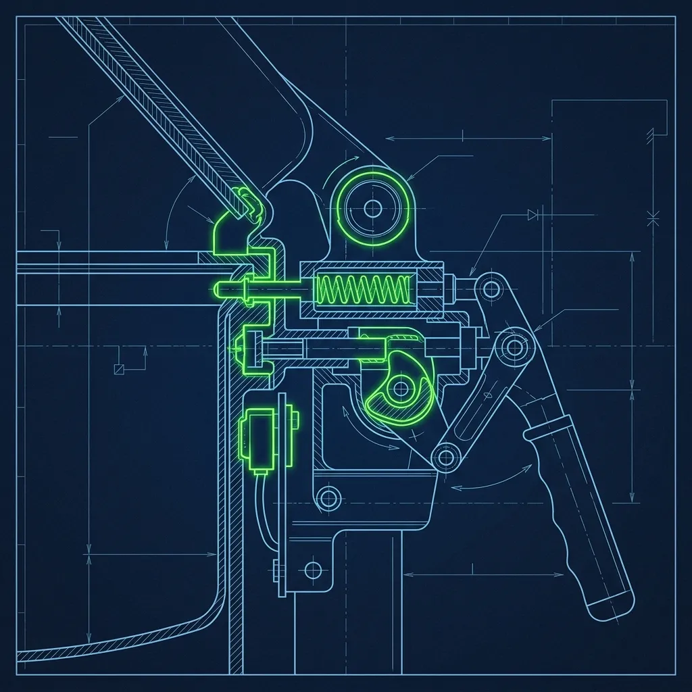
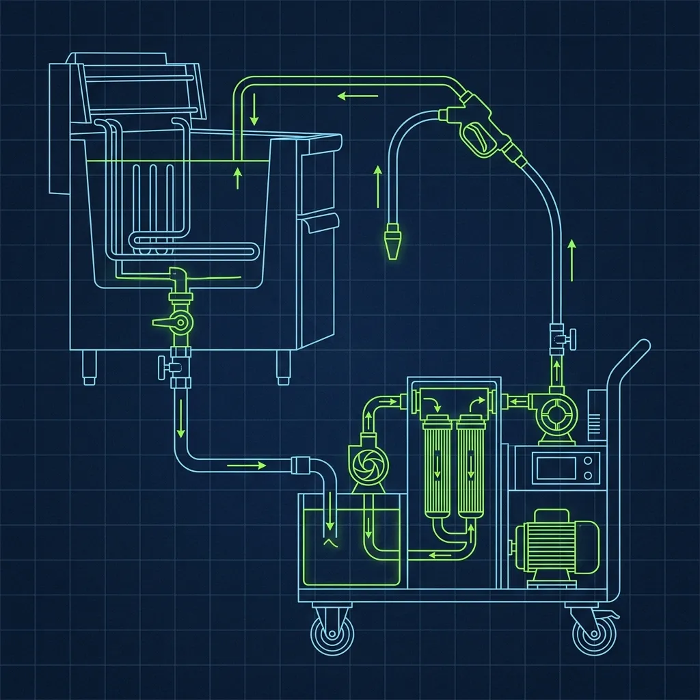

I still remember the adrenaline spike of my first "drop" into a commercial pressure fryer. You're loading racks of wet, breaded chicken into a vat of 350-degree oil, then sealing the heavy lid to let steam pressure build to terrifying levels. The Winston Collectramatic pressure fryer is the industrial workhorse behind KFC's Original Recipe, and treating this machine with anything less than absolute respect is a fast track to the emergency room. 

## The Machine and Its Safety Engineering

Let me be clear about something: if operated incorrectly, an industrial pressure fryer—whether a [Henny Penny model](https://www.hennypenny.com/) used by competitors or KFC's standard equipment—can cause catastrophic injuries. We're talking about 350-degree oil under pressure behind a sealed lid. If someone managed to force that lid open while pressurized, the oil would erupt violently. That's the nightmare scenario. 

The reason it almost never happens is that modern Collectramatic fryers are engineered with purely mechanical safety locks that make it physically impossible to open the lid until the cooking cycle is complete. The real workflow breaks down like this: This pin is entirely mechanical—no software, no electronics, no circuit boards that could glitch or freeze. A physical piece of metal engaging with a physical slot. The pin cannot retract until the internal pressure gauge reads absolute zero. 

When the 15-minute cook timer expires, the machine automatically vents the pressurized steam through a massive exhaust pipe. You can hear it—a loud, sustained hiss that fills the kitchen. Only after the venting is complete and the pressure gauge drops to zero does the locking pin retract, allowing the cook to lift the lid. Even if the power goes out mid-cycle—which happens more than you'd expect in older buildings with sketchy electrical—the pin stays locked until the pressure dissipates naturally. There is no override. There is no workaround. The machine will not let you make a lethal mistake.

KFC corporate takes this engineering seriously because the consequences of a failure would be catastrophic, both for the employee and for the brand. Every pressure fryer in every KFC location is inspected and serviced on a regular maintenance schedule, and any fryer with a questionable lock mechanism is immediately pulled from service with zero tolerance for "it's probably fine."

## The Drop: Where the Real Injuries Happen

Here's the thing nobody tells you about KFC cook injuries: they almost never come from the pressure system. They come from loading the machine.

The process is called "the drop," and it's the moment every new KFC cook dreads. You load racks of wet, raw, breaded chicken into a heavy metal basket. Then you grip a specialized handle and slowly lower that basket—which weighs a solid 15 to 20 pounds fully loaded—into a vat of boiling 350-degree oil. Because the chicken is wet from the breading process, the oil instantly bubbles and spits violently the moment it makes contact.

The correct technique is a smooth, controlled descent. About two to three seconds from the top of the vat to full submersion. No hesitation, no jerky movements, no sudden stops. If you lower it too fast, the oil erupts in a violent splash that can reach your arms, face, and chest. If you hesitate and lower it in uneven, stuttering motions, the oil splatters unpredictably—which is arguably worse because you can't anticipate where the hot oil is going to land.

Veterans make it look effortless. One smooth motion, basket goes in, lid closes, done. But During one shift, I noticed new cooks freeze halfway through the drop, basket hovering over the oil, arms trembling, oil popping up at their wrists. That's when the protective gear saves you.

## The PPE That Keeps You Alive

KFC requires cooks to wear heavy-duty rubber aprons, thick elbow-length heat-resistant gloves, and a clear plastic face shield when dropping chicken or filtering oil. This is not optional. This is not "recommended." This is required, and any manager who lets a cook skip PPE during a drop deserves to lose their job.

During one shift, I noticed the difference PPE makes. A pop of 350-degree oil on a bare forearm leaves a blister the size of a quarter that takes weeks to heal. The same pop on a heat-resistant glove? You don't even feel it. The face shield exists because oil doesn't just splash down—it can pop upward, and a drop of 350-degree oil hitting your eye or your lip is an emergency room visit.

The temptation to skip gear is real. The kitchen is already 95 degrees. You're wearing a uniform. Now you're adding a rubber apron and elbow-length gloves and a face shield, and you're sweating through all of it. During a rush, when the manager is yelling for more chicken and the timer is going off on another fryer, the thought crosses your mind: "I'll just do this quick drop without the gloves." Don't. The one time you skip is the time the oil catches you, and a burn from 350-degree oil is not a minor inconvenience—it's a second or third-degree injury that can require medical attention and leave permanent scars.

## Oil Filtration: The Closing Shift's Most Dangerous Task

Beyond the daily cooking, KFC cooks are responsible for filtering the fryer oil at the end of each shift. This process involves draining the hot oil out of the fryer vat through a filtration system, scrubbing the inside of the empty vat, and pumping the filtered oil back in.

Here's the part that makes filtration dangerous: the oil is still extremely hot. You don't wait for it to cool to a safe temperature first—that would take hours and nobody is staying until 2 AM for oil to cool down. You're working with oil that's been at 350 degrees all day, and even though it's dropped somewhat, it's still hot enough to cause serious burns.

Spills during filtration are one of the most common sources of burn injuries in KFC kitchens, and the root cause is almost always the same: rushing. It's the end of a closing shift. You've been on your feet for eight hours. You want to go home. So you skip the apron, you rush the drain, you bump the filter hose, and suddenly there's hot oil on the floor, on your shoes, on your skin. The same full PPE required for the drop is required for filtration—apron, gloves, face shield. Every single time.

A full oil change—where the old oil is completely drained and replaced with fresh oil—happens every few days depending on volume. Between full changes, the oil quality is monitored with test strips that measure acidity and breakdown levels. High-volume stores change oil more frequently. The quality of the oil directly impacts the quality of the chicken, so this isn't just a safety task—it's a product quality task.

## Frequently Asked Questions

### Has anyone ever been seriously injured by the pressure mechanism itself?

Serious injuries from the pressure system failing are extremely rare in modern KFC locations specifically because of the mechanical safety locks. The engineering is deliberately over-built—there is no software to crash, no electronic override to fail. The vast majority of burn injuries in KFC kitchens come from the drop or from oil filtration, not from the pressure system. When maintained on schedule, the Collectramatic's safety systems are remarkably robust.

### Can you buy a pressure fryer for home use?

Consumer-grade pressure fryers do exist, but they're much smaller and less powerful than the commercial Collectramatic units used at KFC. Home models typically hold a few pieces of chicken at a time and operate at lower pressures. They have their own safety mechanisms, but they're not the same industrial-grade machines. If you want to replicate KFC's pressure-frying results at home, a countertop pressure fryer will get you closer than a regular pot of oil, but the results won't be identical.

### What happens if a fryer's safety lock malfunctions?

The machine is immediately taken out of service and tagged as inoperable. A certified technician must inspect and repair the lock before the fryer can be used again—no cook, no manager, no one is allowed to override or bypass the safety lock under any circumstances. This is a zero-tolerance policy enforced at the corporate level. A store running with a reduced number of fryers during a rush is inconvenient; a cook getting hit with pressurized 350-degree oil is a lawsuit and a life-altering injury. There's no comparison.

---

*For a complete breakdown of the cooking differences between KFC's two signature products, check out our guide on [KFC Original Recipe vs. Extra Crispy](/articles/kfc-original-vs-extra-crispy). And for a look at an entirely different dangerous piece of QSR equipment, read about [how the Burger King broiler works](/articles/burger-king-broiler). You can also learn about [the secret science behind KFC's famous coleslaw](/articles/kfc-coleslaw-secret).*
