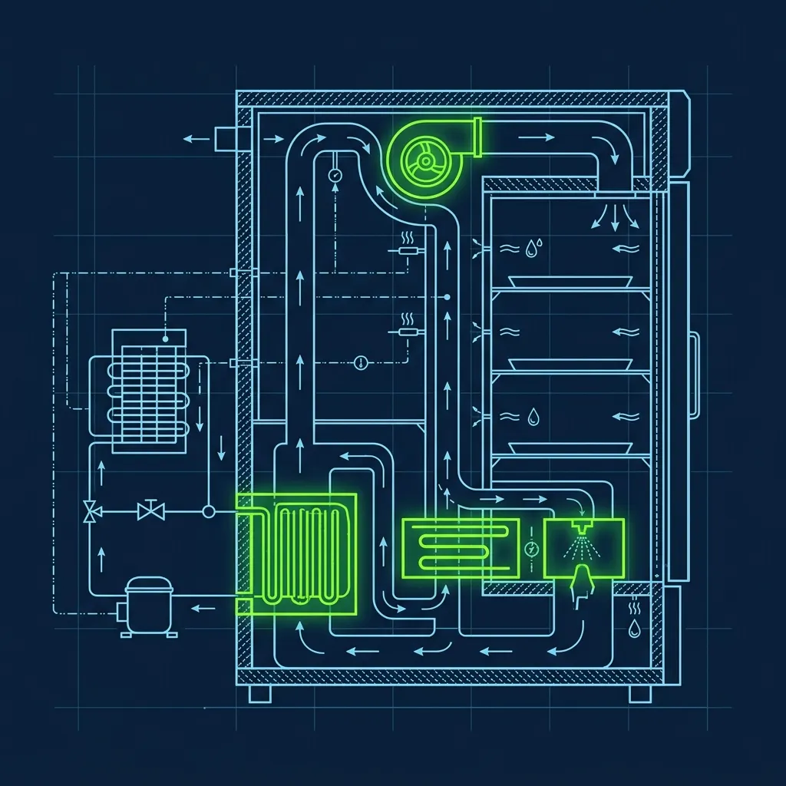
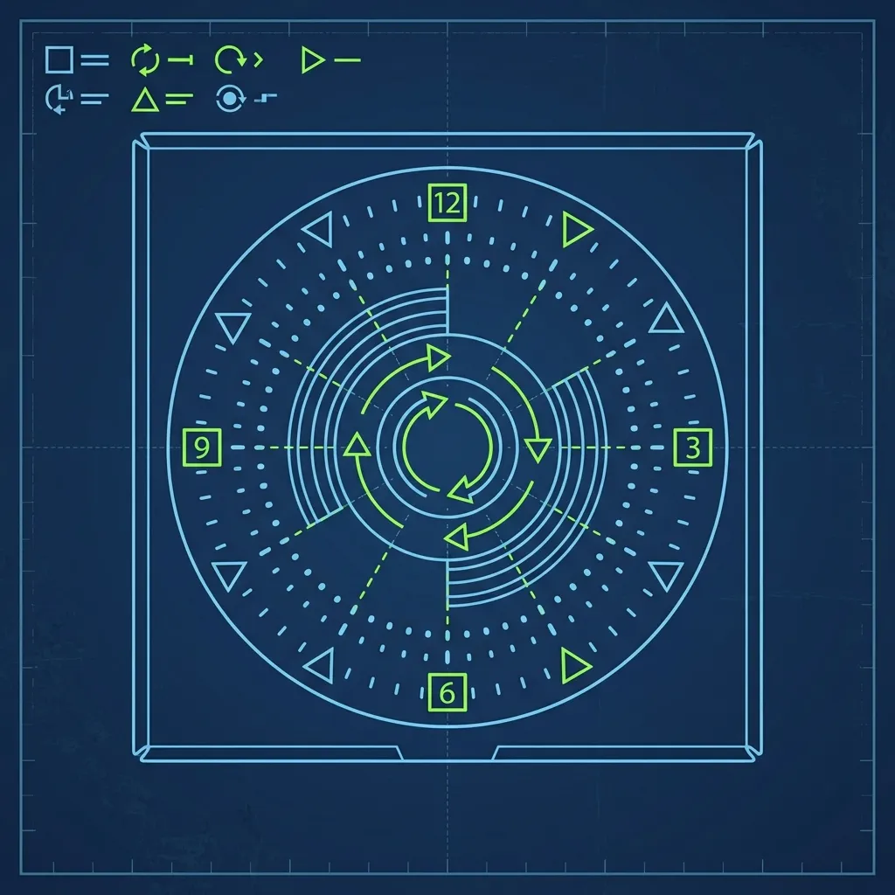

Walk into a Little Caesars, hand the cashier your money, and walk out with a hot pepperoni pizza in under thirty seconds. No ordering at a screen. No waiting for your number to be called. No "it'll be about fifteen minutes." Just pizza, immediately, in your hands. It sounds like magic. The reality is a brutally efficient system of precision holding cabinets, grease-pencil time stamps, and demand forecasting that would make a logistics engineer proud—and a shift manager lose sleep. Because here's the thing nobody on the customer side sees: every pizza in that warmer is on a 30-minute death clock, and if your production flow is even slightly off, you're either throwing away hundreds of dollars in wasted food or telling customers to wait eight minutes while the oven catches up. Neither option is acceptable. 

## The CVap Holding Cabinets: Not Just a Heat Lamp

Behind the front counter at every Little Caesars, you'll see tall, heated metal cabinets packed with boxed pizzas. Customers assume these are just warmers—big metal boxes with a heating element. They're not. Most locations use CVap (Controlled Vapor Technology) cabinets, and the engineering inside them is significantly more sophisticated than a heat lamp. 

A CVap cabinet controls two separate temperature settings simultaneously: one for the air inside the cabinet and one for a water reservoir at the bottom that generates controlled humidity. The air temperature keeps the pizza hot enough to serve safely. The humidity prevents the cheese from drying out, the crust from going stale, and the toppings from turning into leather. 

The balance between these two settings is everything. Too much humidity and the crust gets soggy—customers bite into a limp, steamy mess. Too little humidity and the pizza dries out within minutes—the cheese turns into a rubbery sheet, the crust becomes a cracker. The cabinets are calibrated to corporate specifications, and store managers are trained to check and adjust them regularly. Pulling double shifts taught me that stores where a manager let the water reservoir run dry during a rush and didn't notice until customers started complaining about rock-hard crust. That's an easily avoidable failure if you build the reservoir check into your hourly routine.

## The Clock Marking System: 30 Minutes to Live

Every pizza that comes out of the oven gets a time stamp, and the system is designed to be fast and completely idiot-proof during a rush.

When a pizza exits the oven, the Landing worker slices it, boxes it, and grabs a black grease pencil. On the side of every pizza box, there's a printed clock face—numbers arranged in a circle just like a real clock. The Landing worker slashes a line through the number that corresponds to the current time. Pizza goes into the warmer at 12:00? Slash through the 12. That's it. No writing out "12:00 PM" in neat handwriting. No sticky labels. Just a fast slash through a number that any employee can read at a glance.

The corporate standard is a 30-minute hold time. If the mark says 12:00 and the clock on the wall says 12:35, that pizza goes in the trash. No manager discretion. No "it still looks fine." No selling it at a discount. It gets documented as waste and thrown away. This sounds harsh until you taste a 45-minute-old pizza that's been slowly degrading in the cabinet—the quality difference is real, and Little Caesars' entire brand promise depends on customers getting a consistently good product every time they walk in.

During a well-run shift, the cashier grabs from the front of the warmer—oldest first—while the Landing worker loads fresh pizzas in the back. This first-in, first-out rotation is simple in theory but requires constant communication in practice. If the Landing worker stacks new pizzas in front of old ones, the old pizzas sit until they expire and get wasted while fresh ones go out the door. I witnessed this happen on every shift where a new hire works the Landing station without being explicitly told about rotation. Spell it out for them on day one.

## Managing the Flow: The Forecasting Game

Here's where the job goes from physical labor to genuine operational strategy. The shift manager controls the production flow based on historical sales data, and getting it right is the single most important skill in the building.

The data tells you that on a Tuesday at 2:00 PM, you need maybe three pepperoni pizzas in the warmer. On a Friday at 6:00 PM, you need thirty. The manager uses a combination of historical sales reports broken down by day and hour, local event calendars, weather forecasts, and even school schedules to build a production plan for each shift. A store near a high school knows to ramp up production at 3:00 PM when classes let out. A store in a business district knows Friday lunch is three times busier than Monday lunch.

The challenge is the eight-minute lag. Pizzas take eight minutes to bake. If you look at the warmer and see it's empty, you're already eight minutes behind. The production calls have to be anticipatory, not reactive. You need to tell the oven operator to start building pizzas before the warmer gets low, not after. This is where new managers consistently struggle—they wait until the warmer is empty, panic, call for production, and then have eight minutes of telling customers "it'll be just a moment" while the oven catches up.

The best managers I've worked with develop an almost instinctive feel for the flow after a few months. They walk up to the warmer, see five pepperoni pizzas, glance at the clock, mentally calculate the rate they've been selling, and know whether they need more production or can hold off. But until you develop that instinct, trust the historical data. It's based on years of actual sales at your specific store, and it's almost always more accurate than your gut feeling.

## The Waste Equation: Overproduction vs. Lost Sales

Every Little Caesars manager lives in constant tension between two bad outcomes. Overproduce by even a few pizzas per hour and the waste adds up to hundreds of dollars per week—pizzas that expire past the 30-minute mark and go straight into the dumpster. Underproduce and customers walk in, see an empty warmer, get told to wait, and a significant percentage simply leave. You've lost the sale and possibly the customer permanently.

The waste numbers are tracked ruthlessly. Every wasted pizza is logged with a reason code, and district managers review waste reports weekly. A store consistently wasting 8% or more of production will get attention from above, and not the good kind. But a store that's constantly running out and making customers wait will show up in customer satisfaction scores, which are equally scrutinized.

The sweet spot is a waste rate in the 3-5% range. That means you're keeping the warmer stocked enough to fulfill the Hot-N-Ready promise but not so aggressively that you're throwing away a quarter of your production. Hitting that target consistently, across every hour of every shift, is genuinely difficult. It's the reason experienced Little Caesars managers are worth their weight in mozzarella.

## Frequently Asked Questions

### What happens to pizzas that expire past the 30-minute mark?

They're documented as waste and thrown away. Every wasted pizza is logged with the time it was made and the time it was pulled, so managers can analyze patterns and adjust production planning. Some locations donate expired pizzas to local shelters or food banks when logistics allow, but the standard corporate procedure is disposal. The waste data directly informs the next week's production forecasts.

### Does the Hot-N-Ready system work for specialty pizzas?

The classic Hot-N-Ready is pepperoni because it's the highest-demand, most predictable item on the menu. Some stores keep a few cheese pizzas in the warmer as well, and the ExtraMostBestest has become a common Hot-N-Ready option. But specialty pizzas with unique topping combinations are almost always made to order because the demand is too unpredictable to justify pre-making them. You'd waste more than you'd sell.

### Is a 25-minute-old Hot-N-Ready pizza still good?

Thanks to the CVap holding technology, absolutely. The controlled humidity keeps the cheese melted, the crust soft, and the temperature safe. Most customers genuinely cannot tell the difference between a 5-minute-old pizza and a 25-minute-old pizza from a properly calibrated cabinet. The quality starts declining noticeably after the 30-minute mark, which is why the cutoff exists. If you're concerned about freshness, ordering during a busy period gives you the best odds of getting a recently baked pizza.

---

*For the complete picture of Little Caesars operations, read our guide on [why Little Caesars uses a Sheetout Machine](/articles/little-caesars-sheetout-machine) for dough prep. You might also enjoy our breakdown of [the Domino's Oven Tender role](/articles/dominos-oven-tender-role) to see how a different pizza chain handles their production flow, or check out [how Pizza Hut's dispatch system works](/articles/pizza-hut-dispatch).*
