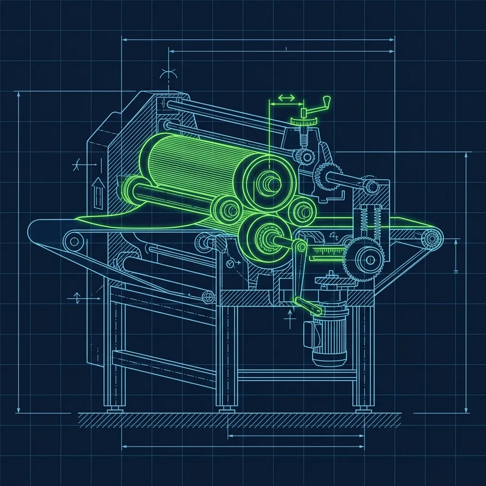
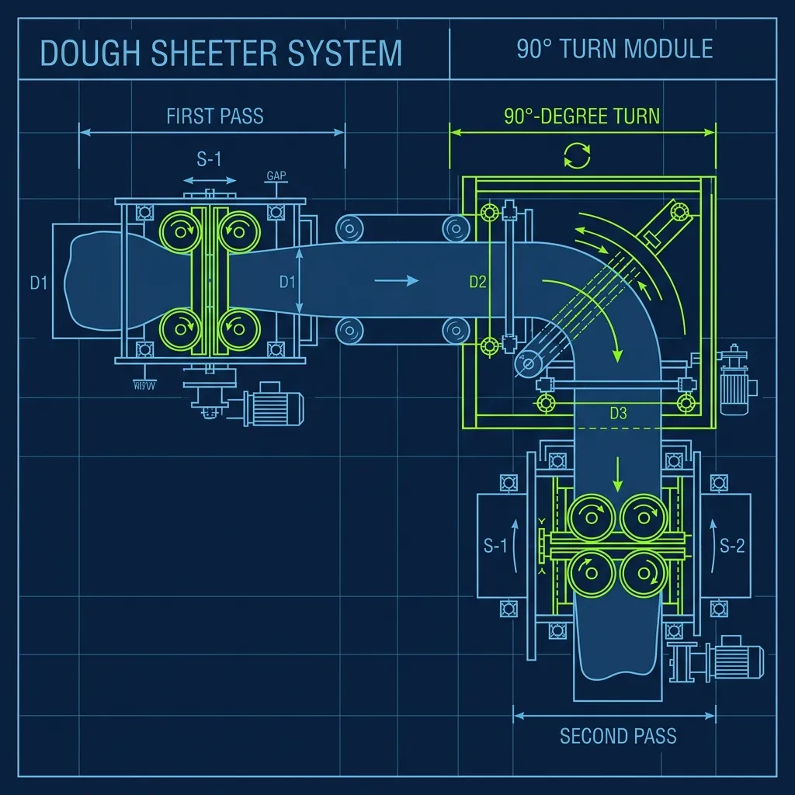

At a traditional pizzeria, making a crust is a craft. You take a dough ball, stretch it by hand, maybe toss it in the air for show, and spend 15 to 20 seconds working it into a round shape that's never quite perfectly uniform. That's charming when you're making 40 pizzas on a Saturday night. At Little Caesars, where a busy location pumps out 300 to 500 pizzas a day and the entire business model depends on having hot pizzas ready the instant a customer walks through the door, hand-tossing is a fantasy. Enter the Sheetout Machine—called "the Sheeter" by every employee who's ever used one—and the reason Little Caesars can make the Hot-N-Ready promise work at industrial scale. 

## What the Sheeter Actually Is

Picture a commercial pasta maker scaled up to pizza size. The Sheeter is a heavy-duty piece of equipment with massive, rotating metal rollers set to a precise gap width. It sits on the prep table and dominates the station. There's nothing elegant about it—it's loud, it's industrial, and it's the backbone of the entire operation. 

The rollers are calibrated to corporate specifications. The gap between them determines the exact thickness of every single pizza crust that leaves the store. When the gap is set correctly, every crust comes out at the same millimeter thickness—no thin spots, no thick spots, no holes where someone's thumb went through during an aggressive hand stretch. The consistency is the point. A customer who buys a Hot-N-Ready on Monday gets the exact same crust as the customer who buys one on Friday. That level of uniformity is impossible with hand-tossing, even with experienced pizza makers. 

## The Two-Pass Technique

The actual process takes about three to four seconds per pizza, and it involves two passes through the rollers with a critical rotation between them.

**First Pass:** The employee drops a pre-weighed dough ball into the top of the Sheeter. It feeds through the first set of rollers and comes out the bottom as an elongated oval—flattened but distinctly not round. If you stopped here, you'd be making flatbread, not pizza.

**The Turn:** The employee catches the oval, rotates it 90 degrees, and feeds it back through a second set of rollers.

**Second Pass:** The dough emerges as a flat, uniform circle, ready for panning.

The 90-degree turn is the entire secret. Without it, the second pass would just stretch the oval longer in the same direction, producing an increasingly thin rectangle. The turn redistributes the dough so the rollers flatten it in the perpendicular direction, creating an even circle. It sounds simple—and it is, once you've done it a few hundred times. But I've watched new hires forget the turn, rotate at the wrong angle, or hesitate long enough between passes that the dough starts sticking. The result is lopsided, egg-shaped crusts that don't fit the pan properly and bake unevenly. It takes a few dozen repetitions to develop muscle memory for the rotation, but once it clicks, the motion becomes completely automatic. Feed, catch, turn, feed. Three seconds, next dough ball.

## Morning Prep: Dough Mixing and Dough Balls

The Sheeter is only as good as the dough going into it, and that dough is mixed fresh every single morning using a commercial Hobart mixer.

The ingredients are straightforward—flour, water, yeast, salt, sugar, and oil—combined on-site following the corporate recipe. Nothing about the dough is shipped pre-made or frozen from a central facility. The prep cook measures the ingredients, loads the Hobart, and lets it run through its mixing cycle.

Here's where experience matters more than the recipe card lets on: water temperature. The yeast activation is temperature-dependent, and the ambient temperature of the kitchen changes the equation. On a hot summer day when the kitchen is already 85 degrees before the ovens fire up, you need slightly cooler water to prevent the yeast from over-activating. On a cold winter morning, warmer water compensates for the cool environment. Experienced prep cooks learn to adjust by feel. The corporate recipe gives a target water temperature, but the best dough comes from cooks who understand why the temperature matters and adapt accordingly.

Once the dough is mixed, it's portioned into pre-weighed dough balls. The weight determines the final pizza size—heavier balls for large pizzas, lighter for specialty sizes. Consistent portioning is critical because the Sheeter's roller gap is fixed. A dough ball that's 10% heavier than spec comes out 10% thicker than intended, throwing off bake times and crust texture.

## Panning, Proofing, and the Production Timeline

After sheeting, the flattened dough circle goes immediately into a heavily oiled, heavy-duty metal pan. The oil serves a dual purpose: it prevents the dough from sticking during baking, and it fries the bottom of the crust during the oven cycle, creating that distinctive golden, slightly crispy base that Little Caesars customers expect.

The panned dough then goes onto a proofing rack—a tall wire rack on wheels that holds dozens of pans—and sits for two to four hours while the yeast does its work. Proofing is when the yeast produces carbon dioxide, creating the air bubbles that give the crust its structure and chew.

The proofing window is non-negotiable. Under-proofed dough produces a dense, cracker-like crust with no softness or chew—customers will notice immediately. Over-proofed dough becomes bubbly and fragile, collapsing when toppings are added and producing a flat, greasy pizza with giant air pockets. The timing means the morning prep crew is working several hours ahead of the kitchen. Pizzas for the lunch rush were panned first thing in the morning. Pizzas for the dinner rush were panned mid-morning. If the morning crew falls behind on prep, the kitchen runs out of proofed dough at 5 PM during the dinner rush, and there's no way to fast-forward the proof. You're dead in the water for two hours.

## Sheeter Maintenance: When the Machine Goes Down

The Sheeter runs all day, every day, and it requires regular maintenance to stay in spec. The rollers must be cleaned at the end of every shift to prevent dried dough from accumulating and altering the thickness of the next day's crusts. A thin layer of dried dough on the roller surface might not look like much, but it effectively narrows the gap and produces thinner crusts than intended.

The roller gap itself is checked periodically. Over time, the mechanical components wear slightly, and the gap can widen. When that happens, every pizza in the store gets a thicker crust until someone catches the drift and recalibrates. The motor and gears are serviced on a scheduled basis.

A broken Sheeter during a busy shift is a genuine crisis. There is no manual backup that can match the Sheeter's output. A skilled hand-tosser can stretch one pizza every 15 to 20 seconds on a good day. The Sheeter produces a perfectly uniform crust every 3 to 4 seconds. During peak production, that speed gap is the difference between a full Hot-N-Ready warmer and an angry line of customers being told to wait. I've been in a store where the Sheeter motor burned out at 4 PM on a Friday. We tried hand-stretching. We fell behind within twenty minutes and never recovered. Get your maintenance done on schedule.

## Frequently Asked Questions

### Does Little Caesars make their dough from scratch in-store?

Yes, every day. The dough is mixed fresh each morning using a commercial Hobart mixer with flour, water, yeast, salt, sugar, and oil measured on-site following the corporate recipe. Nothing is shipped pre-made or frozen. The only variation between stores is how experienced the prep cook is at adjusting water temperature for their specific kitchen environment.

### Why doesn't Little Caesars just hand-toss pizza like other chains?

Volume. The Hot-N-Ready business model requires a production rate that hand-tossing physically cannot achieve. A skilled hand-tosser stretches one pizza every 15 to 20 seconds. The Sheeter does it in 3 to 4. At peak demand, that five-to-one speed advantage is the difference between fulfilling the Hot-N-Ready promise and running empty. The Sheeter also eliminates the inconsistency inherent in hand-tossing—no thin spots, no holes, no variation in thickness from crust to crust.

### Does the Sheeter make the crust taste different from hand-tossed?

Slightly, yes. Hand-tossed dough develops more irregular air pockets and structural variation, which creates a chewier, more artisanal texture with character. Sheeted dough is perfectly uniform, producing a consistent but marginally denser crust. The difference is subtle enough that most customers don't notice, and the trade-off in speed and consistency is essential for the business model. If you want artisanal texture, you're shopping at the wrong pizza chain—and paying three times as much.

---

*To understand the full Little Caesars production pipeline, pair this guide with our breakdown of [how the Hot-N-Ready system actually works](/articles/little-caesars-hot-n-ready-system). For a look at dough prep at a competitor, check out [Papa John's dough slapping technique](/articles/papa-johns-dough-slapping), and see how [the Domino's Oven Tender role](/articles/dominos-oven-tender-role) handles the other end of the pizza production line.*
