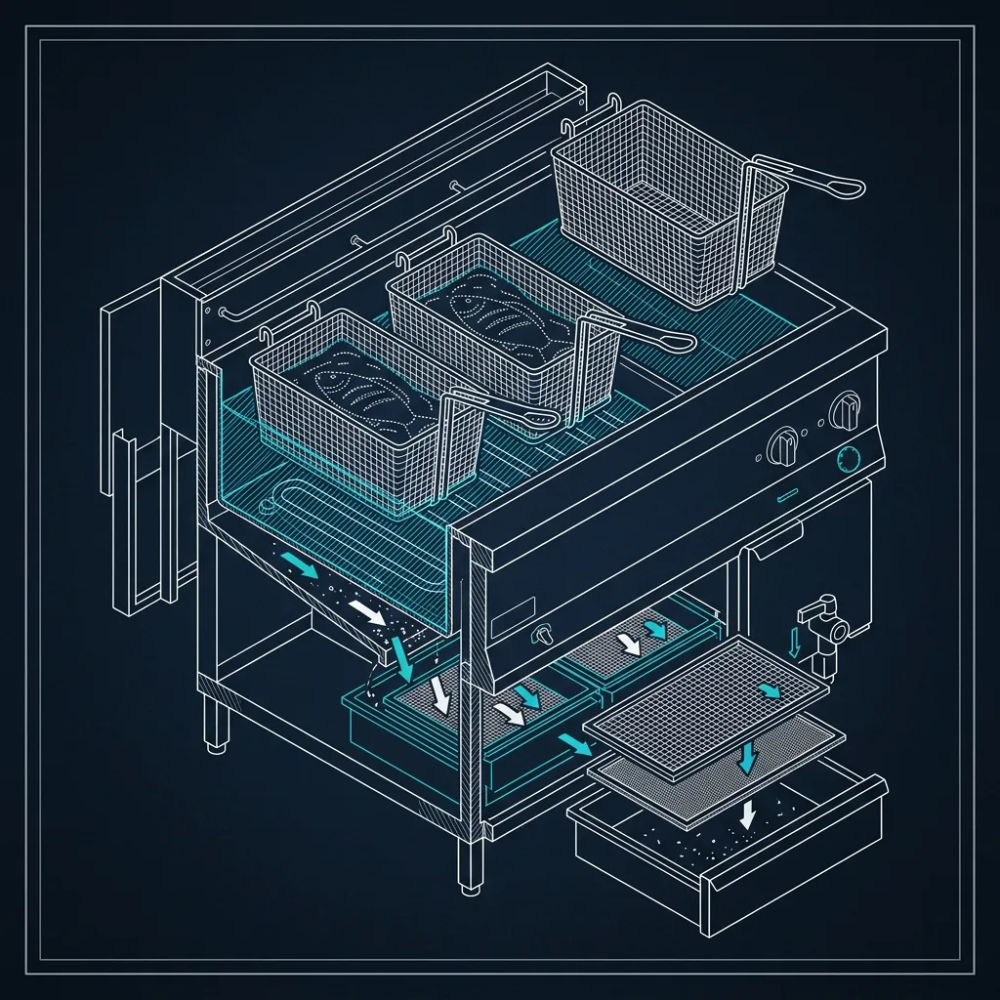

Long John Silver's has a very distinct, incredibly crispy batter that defines their entire menu. Achieving that specific texture—and maintaining it across thousands of pieces of fish a day—requires specialized fryer equipment and a technique that goes completely against how you fry standard fast food items like french fries or chicken nuggets.

If you drop battered fish into a fryer the wrong way, it sinks to the bottom, fuses to the heating elements, and ruins the entire vat of oil. On the line, it plays out like this:

## The Specialized Fryer Vat

Unlike a standard fast-food fryer which has a deep "cold zone" to catch loose salt and crumbs, a Long John Silver's fryer is engineered specifically for wet batter.

*   **The Skimmer:** Because the batter is wet and prone to flaking off during the initial cook, massive amounts of crispy batter fragments float to the surface. These are the famous "crumplies" (or "crispies"). If these are left in the oil, they burn and degrade the oil quality instantly. Fry cooks use a specialized wide skimmer to constantly sweep the surface of the oil between batches.
*   **The Temperature:** The oil is held at 350°F for fish and chicken, which is slightly lower than a standard [McDonald's](/articles/chain/mcdonalds) fry vat (375°F) but higher than a typical chicken pressure fryer at [KFC](/articles/chain/kfc) (325°F). This ensures the thick batter cooks all the way through without burning the outside before the fish inside is flaky and opaque. The fryers themselves are typically Henny Penny open-vat units or Pitco floor models, calibrated with digital thermostats that hold within ±3°F of the setpoint.

Most stores run 3–4 fryer vats total: two dedicated to fish and chicken, one for shrimp and specialty items, and one for hush puppies and french fries. Keeping these separated isn't just about flavor transfer—it's about oil life. Fish batter sheds significantly more debris into the oil than a simple french fry, so mixing them in the same vat would destroy the fry oil in half the time.

## The "Swim and Drop" Technique

You cannot load wet-battered fish into a wire basket and lower it into the oil. The batter will immediately flow through the wire mesh and cement the fish to the basket, creating a catastrophic mess.

Instead, the cooks use a technique often referred to as the "swim":
1.  **The Dip:** The raw fish fillet is submerged entirely in the thick, heavily leavened batter.
2.  **The Drag:** The cook grips the tip of the fillet with tongs (or gloved hands) and slowly drags the bottom half of the fish through the surface of the hot oil.
3.  **The Release:** This dragging motion instantly flash-fries the bottom layer of batter, creating a "canoe" that supports the fish. After about two seconds of dragging, the cook gently releases the fillet. The fish now floats safely on the surface, puffing up as the leavening agents in the batter react to the heat.

This technique is unique to wet-batter frying operations. You won't see it at a standard chicken chain. Even [Popeyes' chicken battering process](/articles/popeyes-chicken-battering-process/) uses a dry-wet-dry breading method that allows basket frying, which is a completely different mechanical approach.

## The Breading Station Layout

The flow from raw protein to finished product follows a strict left-to-right layout designed to prevent cross-contamination and minimize wasted movement.

### Station Flow

1.  **Raw storage (far left):** Cases of frozen fish fillets, chicken planks, shrimp, and clam strips are stored in a reach-in freezer directly behind the breading station. Product is pulled from the freezer and placed into a perforated thawing pan on the left end of the stainless prep table.
2.  **Batter mixing area (center-left):** Two 5-gallon stainless mixing bowls sit on the prep table. One holds the current working batch of fish batter, the other is a backup batch. The batter is mixed from a proprietary dry mix combined with cold water—always cold, because warm water activates the leavening agents prematurely and makes the batter lose its puff when it hits the oil.
3.  **Dipping zone (center):** The cook stands here, submerging each piece of protein into the batter bowl. A wire rack sits next to the bowl to allow excess batter to drip off for 2–3 seconds before the fillet moves to the fryer.
4.  **Fryer access (right):** The fryer vats are positioned immediately to the right of the dipping zone, no more than one step away. The cook pivots right, performs the swim-and-drop, and pivots back to the batter bowl in one fluid motion.

The entire station footprint is about 6 feet wide. A well-trained fry cook can process 8–10 pieces of fish per minute during a steady flow.

## The Flip

Because the fish floats, only the bottom half is submerged. Halfway through the cooking cycle—about 3.5 minutes in for a standard cod fillet—the fry cook must use a long pair of tongs or a flat skimmer to manually flip every single piece of fish, chicken, and shrimp in the vat. It's a labor-intensive process that requires constant attention, which is why working the fish station during Lent is widely considered one of the toughest shifts in the fast-food seafood industry.

## Shrimp vs. Fish Fry Time Differences

Not everything in the vat cooks at the same rate, and confusing the timers is one of the most common mistakes new fry cooks make.

*   **Fish fillets (cod or pollock):** 7 minutes total. Flip at 3.5 minutes. The visual cue for doneness is a deep golden-brown color on both sides, with the batter fully puffed and no visible wet spots.
*   **Chicken planks:** 8 minutes total. Flip at 4 minutes. Chicken is denser than fish, so it needs the extra minute. Internal temperature must hit 165°F, which managers verify with a probe thermometer on random pieces during each shift.
*   **Shrimp:** 4.5 minutes total. Flip at 2 minutes. Shrimp cook fast because they're small and thin. Overcooking shrimp turns them rubbery, which is the #1 customer complaint on shrimp-heavy orders.
*   **Clam strips:** 3.5 minutes total. No flip needed—they're small enough that the oil circulation cooks them evenly.

The fry cook manages all of these timers simultaneously across multiple vats. During a busy shift, they might have fish in vat 1 at the 5-minute mark, shrimp in vat 2 at the 2-minute mark, and chicken in vat 3 just going in. Keeping these timers straight is where experience separates a competent fry cook from a great one.

## The Hush Puppy Process

Hush puppies are a menu staple at Long John Silver's, but they use a completely different batter than the fish—and a different cooking method.

### The Batter

Fish batter is thin, smooth, and heavily leavened to create that signature puff. Hush puppy batter is thick, cornmeal-based, and has a grainy, almost dough-like consistency. It's mixed from a separate proprietary dry mix (different bag, different shelf, different recipe) combined with water and sometimes a small amount of diced onion depending on the regional recipe variant.

### The Depositor

Unlike fish, which is hand-dipped and swim-dropped, hush puppies are formed using a mechanical depositor—a spring-loaded scoop mechanism (similar to a cookie dough dropper) that portions out uniform balls of batter directly into the fryer oil. Each hush puppy is approximately 1 oz of batter, and the depositor ensures consistent size across every piece.

### Fry Time

Hush puppies fry for 3 minutes at 350°F. No flip needed—they're round and small enough that they tumble in the oil on their own. The visual cue is a uniform dark golden-brown exterior. Under-fried hush puppies have a doughy, raw center that customers will absolutely notice and complain about.

Hush puppies are fried in a dedicated vat (or at minimum, a separate basket cycle in the fry/side vat) to keep the cornmeal debris out of the fish oil.

## The "Crumply" Collection Process

Crumplies—those loose, crispy batter fragments that break off during frying—are not waste at Long John Silver's. They're a product.

### The Skimming Routine

After every batch of fish or chicken clears the fryer, the cook uses the wide flat skimmer to sweep all the floating batter fragments off the oil surface. This isn't optional—if crumplies are left in the oil for more than 2–3 minutes, they burn, turn black, and start degrading the oil's flavor and lifespan.

The skimmed crumplies are deposited into a perforated holding tray positioned above the fryer (the same type of tray used to hold finished product). This tray lets excess oil drain back into the vat while keeping the crumplies warm and crispy.

### Serving Crumplies

Every fish platter and combo meal at Long John Silver's includes a scoop of crumplies as a standard side item. Customers love them—some regulars specifically ask for extra crumplies, and most stores will oblige with a generous handful at no charge.

The crumply holding tray has a maximum hold time of 20 minutes. After that, they start going stale and lose their crunch. During slow periods, this means crumplies get tossed and replaced with fresh ones from the next fry cycle. During peak, the tray never sits long enough to matter.

## Oil Filtration Schedule

Oil management is arguably the most important operational discipline at Long John Silver's. Bad oil produces bad-tasting food, and wet batter is brutally hard on frying oil compared to dry-breaded or naked items.

### Daily Filtration

Every fryer vat is filtered at least once per day using a portable oil filtration machine (most stores use a Magnesol-based filtration system or a?"SuperSorb" filter cart). The process works like this:

1.  **The fryer is turned off** and the oil temperature is allowed to drop to around 250°F (hot enough to flow easily, cool enough to handle safely).
2.  **The drain valve opens** and oil flows through a filter paper and a layer of Magnesol powder in the filter cart. The powder absorbs free fatty acids, color bodies, and off-flavors.
3.  **Filtered oil is pumped back** into the vat. The whole process takes about 15–20 minutes per vat.

During high-volume days, a second filtration is performed mid-shift, usually around 2:00 PM between the lunch and dinner rushes. The difference between once-filtered and twice-filtered oil is visually obvious—properly filtered oil is clear and light amber. Neglected oil turns dark brown and smells rancid.

### Full Oil Changes

Complete oil changes—draining the entire vat and refilling with fresh oil—happen every 3–5 days depending on volume. Each vat holds approximately 50 lbs of shortening (Long John Silver's uses a proprietary blend of partially hydrogenated soybean oil in most markets). A full oil change costs the store roughly $35–$45 per vat, which is why filtration is so critical. Extending oil life by even one extra day through proper filtration saves the store $200–$300 per month across all vats.

This is a fundamentally different oil management challenge than what you see at [KFC's pressure fryer operation](/articles/kfc-pressure-fryers/), where the sealed pressure environment actually extends oil life significantly compared to an open-vat system.

## How Lent Season Changes Everything

Lent—the 40-day period before Easter—is Long John Silver's Super Bowl. Fish consumption spikes dramatically among Catholic customers who abstain from meat on Fridays, and Long John Silver's is one of the only national fast-food chains positioned to capitalize on that demand.

### Volume Increases

A typical Long John Silver's might serve 200–300 fish fillets on a normal Friday. During Lent Fridays, that number can jump to 500–800 fillets. Some high-volume locations in heavily Catholic markets (think the Midwest and Gulf Coast) report doubling or even tripling their normal Friday sales.

### Staffing Changes

*   **Extra fry cooks:** Stores add 1–2 additional fry cooks per shift during Lent. The normal single fry cook simply cannot keep up with the volume.
*   **Dedicated batter mixer:** During the rest of the year, the fry cook mixes their own batter between batches. During Lent, a separate team member is assigned exclusively to batter mixing and raw product staging to keep the fry cook's hands in the fryer at all times.
*   **Extended prep shifts:** The morning prep crew arrives 60–90 minutes earlier during Lent to pre-thaw additional cases of fish and pre-mix extra batches of batter. A store that normally thaws 4 cases of fish per day might thaw 8–10 during Lent.

### The Lent Prep Checklist

Managers receive a specific Lent prep guide from corporate about 3 weeks before the season begins. It includes adjusted par levels for every protein item, recommended staffing matrices, and marketing materials (the "Fish Fry Friday" signage). Smart managers also pre-order extra frying oil, because running out of oil during a Lent Friday rush is a nightmare scenario that can shut down the kitchen entirely.

## How Often Should Long John Silver's Fryer Oil Be Changed?

Under normal operating conditions, a full oil change happens every 3–5 days per vat. However, this varies based on volume. A store running 400+ pieces of fish per day might need to change oil every 2–3 days, while a slower store could stretch to 5–6 days with diligent daily filtration. The key metric is a Total Polar Materials (TPM) test—if the oil's TPM reading exceeds 24%, it's time for a full change regardless of the calendar. Most stores use a Testo 270 cooking oil tester to check TPM levels daily.

## Why Are Hush Puppies Fried Separately From Fish?

Two reasons. First, the batters are chemically different—the cornmeal in hush puppy batter sheds a different type of debris into the oil than the wheat-based fish batter, and mixing them accelerates oil degradation. Second, flavor transfer. Hush puppies fried in fish oil pick up a fishy undertone that customers notice, and fish fried in cornmeal-contaminated oil gets a gritty texture on the batter surface. Keeping them separated preserves the clean flavor profile of both products.

## What Makes Lent Season So Difficult for Long John Silver's Employees?

It's the combination of volume, speed, and physical intensity. A fry cook during Lent is standing in front of 350°F oil for 8+ hours, manually swim-dropping and flipping hundreds of pieces of fish, while simultaneously managing timers across 3–4 vats, skimming crumplies, and calling out product to the expeditor. The heat is oppressive, the pace is relentless, and the margin for error is zero—every burnt fillet or rubbery shrimp is a customer complaint during the busiest week of the year. Most veteran fry cooks consider surviving their first Lent season a rite of passage, similar to how [Raising Cane's bird specialists](/articles/raising-canes-bird-specialist/) describe their first football Saturday rush.
