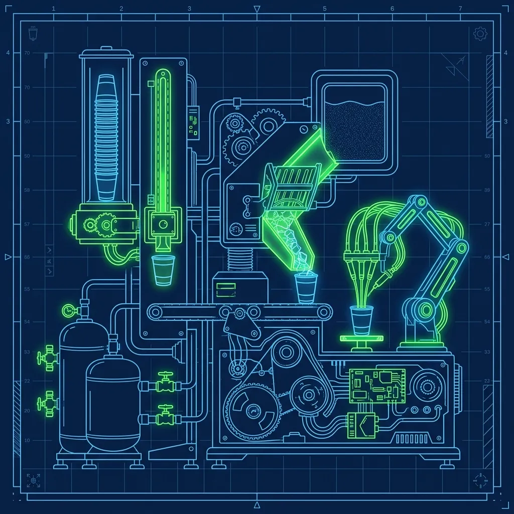
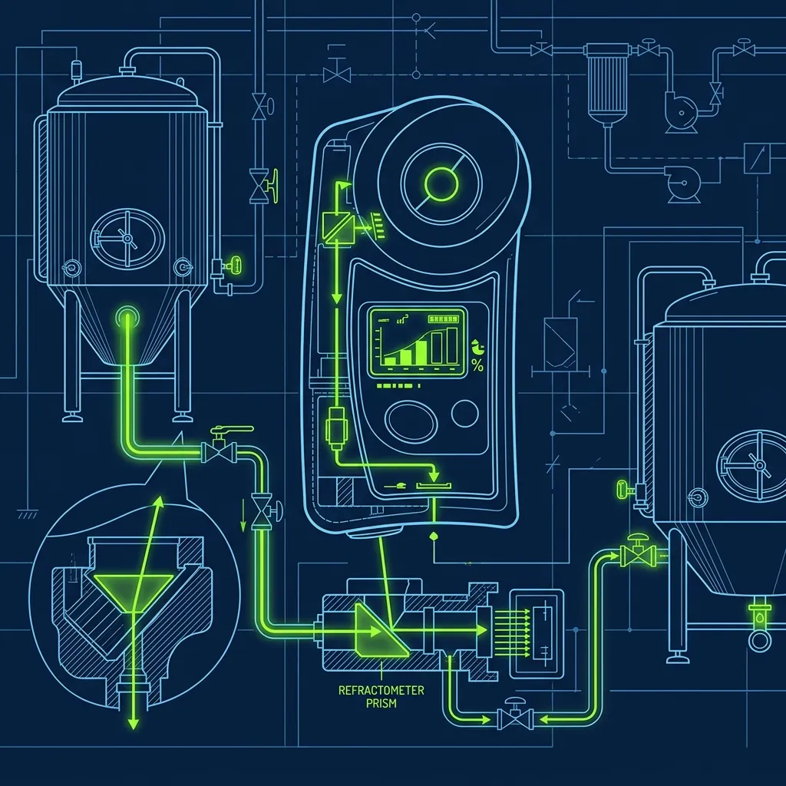

If you've been through a McDonald's drive-thru recently, you might have noticed something odd: the cashier at the window didn't pour your drink. They turned around, grabbed a cup off what looked like a small conveyor belt, snapped a lid on it, and handed it to you. The whole thing took maybe five seconds. That piece of machinery is called the ABS (Automated Beverage System)—specifically, the Multiplex ABS unit—and it is, without exaggeration, the most brilliant piece of automation in the entire fast-food industry. I've worked in half a dozen different chains, and nothing else comes close to the operational impact the ABS has on drive-thru speed. It eliminates an entire labor step from the beverage process and does it more accurately and consistently than any employee ever could. When it's working, it's invisible. When it breaks down during a Friday lunch rush, your entire operation falls apart in about ninety seconds. 

## From POS Tap to Finished Cup: The Seamless Connection

The magic starts the instant a customer places their order at the speaker box. When the order taker taps "Medium Diet Coke" on the POS touchscreen, that signal is sent directly to the ABS machine in real time over the store's internal network. There's no delay, no printed ticket, no verbal relay. The POS and the ABS are on the same system, and the moment the drink is confirmed on the register, the ABS has already started working. 

> **Russell's Note:** Time to lean, time to clean. It's an annoying cliché, but when the health inspector (the ultimate clipboard warrior) shows up unannounced, you'll be glad you wiped down the low-boys.

> **Russell's Note:** Any BOH veteran will tell you: the walk-in cooler is the only soundproof place to take a 30-second mental break when the KDS screen is totally full.

The machine has a hopper—a vertical tube—loaded with stacked cups of each size. When it receives the order for a medium, it mechanically drops a medium paper cup onto its internal conveyor belt. In a high-volume store during a dinner rush, the ABS might be processing three to four drinks simultaneously, staggering them along the belt in the exact sequence they were entered at the register. That sequence matters because the drive-thru window presenter is grabbing cups and matching them to cars in order. If the ABS dispensed drinks out of sequence, the window would become a chaotic sorting station instead of a smooth handoff point. 

## The Three-Step Fill Process

Once the cup is on the belt, three things happen in rapid succession:

**Step 1 — The Ice Drop:** The belt moves the empty cup under an ice chute. The machine is programmed to dispense the exact, corporately mandated ratio of ice for a medium cup. If the customer ordered "No Ice" or "Light Ice," the POS sends that modifier to the ABS, and the ice step is adjusted or skipped entirely. This is one of those details that sounds minor but is actually a significant engineering achievement—the machine interprets order modifiers in real time and adjusts its output accordingly.

**Step 2 — The Pour:** The cup slides down the belt to the beverage nozzles. A mechanical arm positions over the cup and dispenses the precise syrup-and-carbonated-water mixture. The ABS knows exactly how much liquid to pour based on the cup size and the ice amount already dispensed. Overfills are virtually nonexistent when the machine is properly calibrated.

**Step 3 — The Queue:** The finished drink slides to the staging area at the end of the belt, where it waits for the presenter to grab it, snap a lid on, and hand it out the window.

The entire journey—empty cup drop to finished drink in the staging area—takes roughly 15 to 20 seconds. And here's the operational beauty of it: nobody had to leave their station to make it happen. The order taker stays at the speaker. The presenter stays at the window. The drink made itself.

## Why McDonald's Coke Actually Tastes Better

This is one of the most common questions I've gotten over the years, and the ABS is a significant piece of the answer. McDonald's Coca-Cola consistently tastes crisper and more balanced than what you get at other fast food restaurants, and there are multiple factors at play.

First, McDonald's receives their Coca-Cola syrup in stainless steel tanks rather than the standard plastic bag-in-box containers used by most other chains. Stainless steel preserves the syrup's freshness better by protecting it from light and temperature fluctuations.

Second—and this is where the ABS matters—the machine dispenses a precisely calibrated syrup-to-water ratio for every single cup. The ratio is checked periodically with a Brix cup and separator, a device that splits the syrup and water into two tubes to ensure the concentration hits the exact 5.0 to 5.2 target ratio. If the Brix reading drifts from that spec, a technician adjusts the syrup flow rate. At other restaurants, an employee holds a cup under a fountain nozzle and eyeballs the fill. The ABS removes human variability from the equation entirely. Every cup gets the exact same ratio, every time, all day long. That consistency is what people are tasting when they say McDonald's Coke hits different.

## What the ABS Doesn't Handle

The ABS is impressive, but it has limits. It handles carbonated sodas, iced teas, and in some newer models, iced coffee. Everything else is manual.

Hot coffees, lattes, hot chocolates, and blended Frappes are all made at a separate beverage station by an employee. During a morning rush when the drive-thru is dominated by McCafé orders, the ABS is barely used while the hot drink station becomes the bottleneck. Some newer, higher-volume locations have ABS machines with an "Auto-Lidder" attachment that physically snaps the plastic lid onto the cup before it reaches the staging area, but most stores still require the presenter to lid drinks manually. The lidding step sounds trivial until you're doing it 200 times an hour during a dinner rush and your thumbs are going numb from pressing lids onto cups.

## When the ABS Breaks Down: Controlled Chaos

An ABS failure during peak hours is one of the most dreaded events in a McDonald's kitchen, and I've lived through several. The moment the machine goes down, the entire drive-thru operation cascades into a bottleneck.

Suddenly, one employee has to be pulled from another station—usually the assembler or the runner—to stand at the manual drink fountain and fill every single cup by hand. Ice scooped with a scoop, cup held under the correct nozzle, fill eyeballed to the line, repeat. This manual process takes 20 to 30 seconds per drink instead of the ABS's 15 seconds, and unlike the ABS, the employee can only make one drink at a time instead of three or four simultaneously.

The ripple effect is immediate. Drink assembly takes longer, which means the presenter waits longer, which means window times increase, which means the car line backs up, which means the drive-thru timer—the number that corporate watches more closely than almost any other metric—starts climbing into unacceptable territory. A good shift manager will immediately call for a technician and reorganize labor to minimize the damage, but even the best-managed store loses significant speed when the ABS is down.

The key to surviving an ABS failure is knowing how to manually pour drinks efficiently before you need to. Practice during slow periods. Learn where each syrup nozzle is by memory so you're not reading labels while cars stack up. And for the love of everything, use the ice scoop—never your hands. That's a health code violation that will get your store shut down if an inspector walks in at the wrong moment.

## Maintenance: Keeping the Machine Honest

The ABS runs all day, every day, and it requires consistent maintenance to stay calibrated. Syrup lines need periodic flushing. The ice chute must be cleaned to prevent buildup that restricts ice flow. The dispensing nozzles are sanitized on a regular schedule. The cup hoppers need to be checked and restocked—if the hopper runs out of medium cups, the machine stops, beeps, and every medium drink in the queue stalls until someone reloads it. During a rush, assign someone to check the hoppers every 30 minutes.

The ice machine feeding the ABS also demands attention. If ice production drops because of a dirty condenser or a low water supply, the ABS under-fills cups with ice and compensates with extra liquid, throwing off the taste and the portion control. The drinks taste watered down, customers notice, and you start getting complaints about "flat Coke" when the real problem is the ice machine in the back room.

## Frequently Asked Questions

### Does every McDonald's have an ABS machine?

The vast majority of McDonald's locations in the United States have an ABS installed. Some very old or very small locations may still operate with manual drink stations, but corporate has been aggressively rolling out ABS systems for years because the speed and labor savings are too significant to ignore. If you're hired at a McDonald's today, odds are extremely high you'll be working alongside an ABS.

### Can the ABS make milkshakes or McFlurries?

No. Milkshakes and McFlurries are made at a completely separate station using different equipment—the shake machine and the McFlurry mixer, respectively. The ABS handles only carbonated beverages, iced teas, and in some models, iced coffee. Blended and frozen drinks require manual preparation and are among the most time-consuming items on the menu.

### How much does an ABS machine cost a franchise?

The exact price varies by model and configuration, but commercial ABS systems represent a substantial capital investment—typically in the range of tens of thousands of dollars. The cost is justified by the labor savings alone. A single ABS handles the drink volume that would otherwise require a dedicated employee working the fountain station all day, every day. Over the life of the machine, the math works out heavily in favor of the automation.

---

*To learn what happens when the technology behind the counter fails completely, check out our guide on [what happens when the McDonald's POS system crashes](/articles/mcdonalds-pos-crash). For a look at drive-thru technology at a competitor, read about [how the Chick-fil-A iPOS system works](/articles/chick-fil-a-ipos-system), and see how [Taco Bell manages their drive-thru timer pressure](/articles/taco-bell-drive-thru-timer).*
