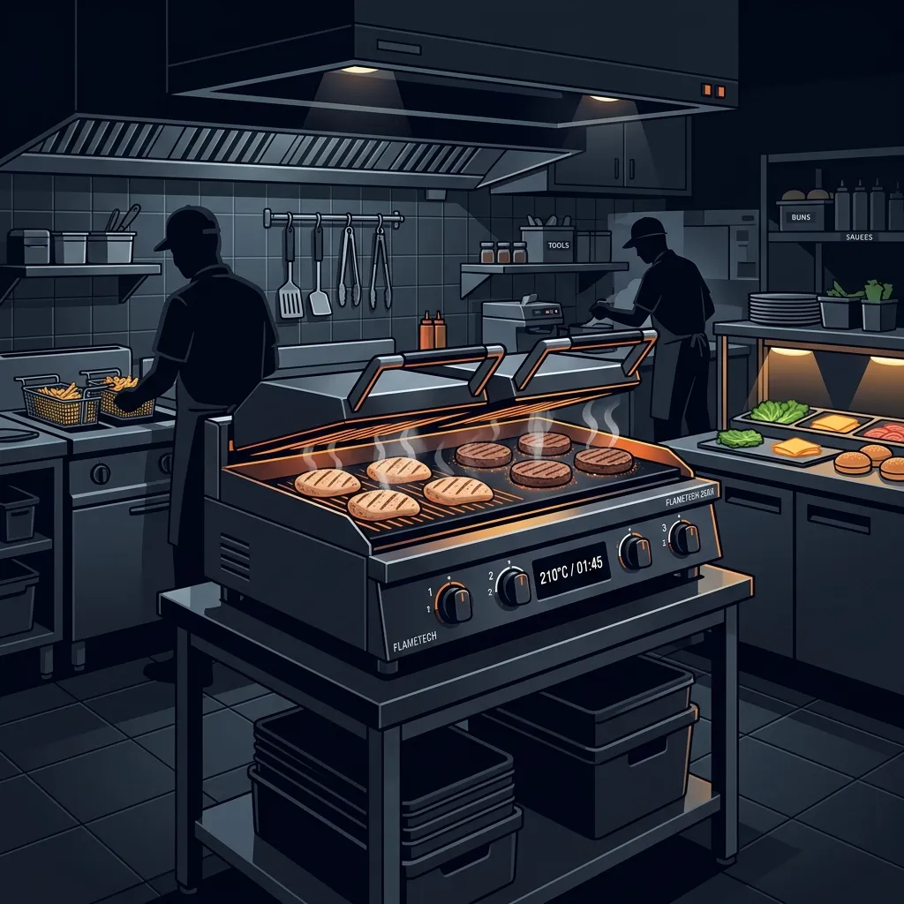

When McDonald’s announced they were switching the Quarter Pounder patty from frozen to fresh beef, the entire fast food industry paused to watch. For decades, the system was built around cooking frozen pucks of meat in massive batches and holding them in warming cabinets. Handling raw, unfrozen beef at that scale, while maintaining ticket times under two minutes, seemed impossible. 

I was running kitchens when this rollout happened. Let me tell you, it was the biggest operational shock to the system I had ever seen. The training manuals were completely rewritten, the grill stations had to be heavily modified, and the line cooks had to learn a completely new rhythm. 

It wasn’t just a menu update—it was a total tear-down of the standard operating procedure. Let me lay out the process:

## The Blue Glove Rule

The single biggest threat when introducing fresh beef to a kitchen built for frozen food is cross-contamination. With frozen patties, cooks used clear plastic gloves to grab handfuls of meat and throw them on the grill. If they touched their apron afterward, the risk was minimal because the frozen pucks were dry. Fresh beef is sticky, wet, and highly prone to spreading bacteria if not handled perfectly.

To solve this, McDonald’s introduced the Blue Glove system. The rules are absolute:
1. You put a blue plastic glove over your standard clear glove.
2. You grab the fresh beef patties from the specialized refrigerated drawer (not the standard freezer).
3. You place them on the grill.
4. You instantly remove the blue glove by pulling it inside out and throwing it in a dedicated trash can before you touch any spatulas, timers, or surfaces.

If a manager sees a cook touch a grill button while still wearing a blue glove, the entire station has to be sanitized. It’s a harsh penalty, but when you serve millions of people a day, food safety has to be drilled into the crew with zero tolerance for shortcuts.

## The Clamshell Platen Grill

McDonald’s doesn't use a standard flat-top griddle for their burgers. They use a clamshell platen grill. Imagine a giant, industrial panini press. The bottom is a standard heated steel surface, but there is a heavy upper platen covered in a specialized non-stick Teflon sheet.

When the cook lays the fresh Quarter Pounder patties on the bottom surface, they hit a button. The heavy upper platen lowers automatically and clamps down on the meat. The patties are now cooking from the top and the bottom simultaneously. This cuts the cooking time in half and ensures the patty is cooked thoroughly without the cook needing to flip it.

The temperature settings for the fresh beef are highly specific and different from the standard frozen 10:1 (tenth of a pound) patties used for regular hamburgers. The bottom plate runs at a screaming hot 425°F, while the top platen hovers around 425°F as well. The exact cook time is tightly guarded and occasionally tweaked by corporate, but it generally sits right around 60 to 80 seconds.

## The Cook and the Squeegee

Once the timer beeps, the top platen automatically raises. The cook has to act immediately. Because the beef is fresh and has a higher fat content, it leaves behind a significant amount of grease and carbonized bits on the grill surface.

The cook grabs a specialized spatula, slides it under the patties, and transfers them to the finishing tray where they are seasoned with a measured click of the salt and pepper shaker. 

But the job isn’t done. Before the cook can walk away or drop the next batch of meat, they have to clean the Teflon sheet on the upper platen. They use a long-handled squeegee tool to wipe the grease off the top platen, pushing it into the grease traps on the side of the grill. Then they use a heavy grill scraper on the bottom surface. If they skip this step, the next batch of fresh beef will stick to the carbonized bits, tear apart when the platen raises, and ruin the meat.

## Cook-to-Order vs. The UHC

The old system for Quarter Pounders involved cooking six to eight patties at a time and sliding them into a Universal Holding Cabinet (UHC)—a specialized heated drawer that keeps the meat hot for up to 20 minutes. 

With the switch to fresh beef, Quarter Pounders are strictly cook-to-order. When an order hits the KDS (Kitchen Display System), the grill cook drops the exact number of patties requested. Because the platen grill cooks them in roughly a minute, the burger assembly team builds the bun and toppings while the meat is on the grill. When the platen raises, the meat goes straight from the grill, onto the bun, into the box, and out the drive-thru window. 

This cook-to-order system is why a modern Quarter Pounder is vastly superior to the older version. It never sits in a warming drawer. The juices haven't dried out, and the fat hasn't solidified.

## Frequently Asked Questions

### Are the regular hamburgers made with fresh beef too?
No. The standard hamburgers, cheeseburgers, and Big Macs still use the traditional frozen 10:1 patties. The fresh beef program is strictly for the Quarter Pounder line (including the Double Quarter Pounder). 

### Why doesn't the cook flip the burgers?
The clamshell platen grill cooks the meat from both sides at the exact same time. The top platen provides heavy pressure and high heat, searing the top of the patty while the bottom griddle sears the underside. Flipping is unnecessary and would only slow down the assembly line.

### What happens if the blue gloves run out?
The station shuts down for fresh beef. McDonald's strict food safety procedures mandate that clear gloves cannot be used as a substitute for handling raw, unfrozen beef. If a store runs out of the blue gloves, they have to stop selling Quarter Pounders until a manager can borrow a box from a neighboring location.
