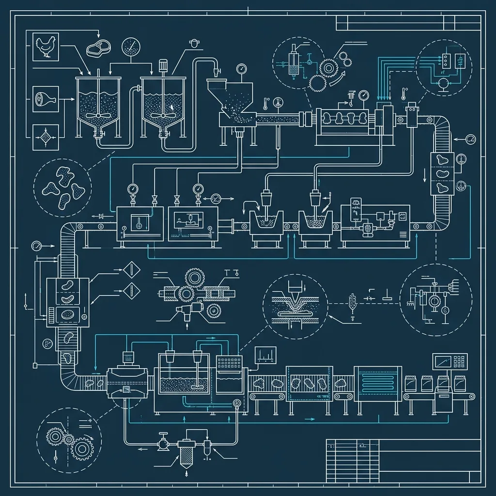
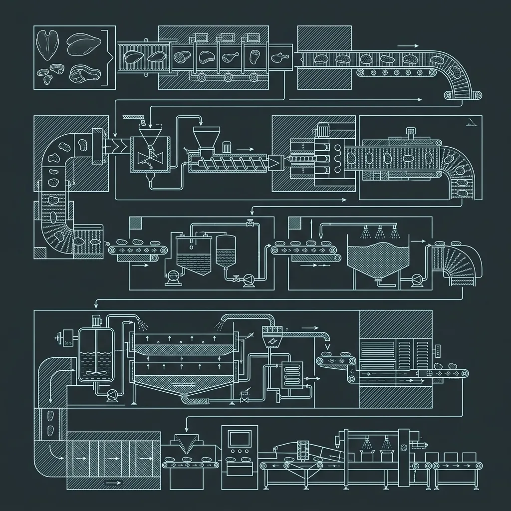

7.  How Are McDonald's Chicken McNuggets Actually Made?

If there is one fast food item that has generated more conspiracy theories, urban legends, and late-night internet rabbit holes than any other, it is the Chicken McNugget. “It’s pink slime.” “It’s mechanically separated chicken.” “They use every part of the bird.” “It’s not real meat.” I have heard all of these, and I heard them constantly from customers who would say these things while actively eating a 10-piece. The reality is far less dramatic and far more interesting than any of the myths. McNuggets are made from real chicken breast meat — white meat — processed through a manufacturing pipeline that is more food science than mystery, and finished in-store in a fryer that runs at 350°F. The exact process: 

## What McNuggets Are Actually Made Of

> **Russell's Note:** Any BOH veteran will tell you: the walk-in cooler is the only soundproof place to take a 30-second mental break when you're getting slammed and holding on drops.

> **Russell's Note:** When you're in the weeds on a Friday night, the last thing you want is a broken line. Turn and burn. That's the only way you survive until close.

Let me get the biggest misconception out of the way first: McDonald’s Chicken McNuggets are made from boneless, skinless chicken breast meat. That is not a PR claim — it is verifiable through the publicly available ingredient list and through the numerous factory tours that McDonald’s has opened to media and food journalists over the years. The chicken breast is the primary ingredient, and it constitutes the vast majority of the nugget’s mass. 

There is a small amount of chicken skin mixed in. This is not a secret, and it is not a cost-cutting measure. The skin is included for texture and flavor — without it, a ground chicken breast nugget would taste dry and bland. Chicken skin contains fat and collagen that contribute moisture and a richer mouthfeel to the finished product. The amount is small — we are talking about a minor percentage of the total blend, not a 50/50 meat-to-skin ratio. 

The chicken is also seasoned during processing with salt, pepper, and a handful of other standard food-grade ingredients that serve as binders, preservatives, and flavor enhancers. The full ingredient list is publicly available on McDonald’s website and has been for years. There is nothing on it that would surprise anyone who has ever read the back of a frozen chicken product at the grocery store.

### What McNuggets Are NOT Made Of

They are not made from mechanically separated chicken (MSC). This is the “pink slime” myth that refuses to die, largely because of a viral photo from the early 2010s showing a pink paste being extruded from a machine with a caption claiming it was McNugget meat. McDonald’s has repeatedly and explicitly stated that they stopped using mechanically separated chicken in their McNuggets in 2003. The current product uses whole chicken breast meat that is ground — not mechanically separated, which is a different process entirely.

Mechanically separated chicken involves forcing chicken carcasses (bones and all) through a high-pressure sieve that extracts every scrap of tissue. The result is a paste-like substance. That is not what happens with McNuggets. The breast meat is deboned by hand or machine, then ground into a coarse mixture. The difference is significant both in process and in the final product.

## The Factory Process: Breast to Nugget

The journey from whole chicken to finished McNugget happens in a processing facility and follows a specific sequence:

### Step 1: Grinding

Boneless, skinless chicken breasts are fed into an industrial grinder along with the small portion of chicken skin. The grinder breaks the meat down into a coarse, ground texture — similar in appearance to ground turkey you would buy at a supermarket. It is not pureed into a paste. The grind retains visible texture, which is part of why a McNugget has a slightly fibrous bite when you chew it rather than the uniform smoothness of a processed meat paste.

### Step 2: Seasoning and Mixing

The ground chicken is transferred to large industrial mixers where it is blended with the seasoning mixture — salt, pepper, and food-grade binders that help the meat hold its shape during forming. The mixing is thorough but not excessive. Over-mixing would break down the protein structure and turn the mixture into mush. The goal is even distribution of seasoning throughout the ground meat.

### Step 3: Forming the 4 Shapes

This is the part that surprises people the most. McNuggets come in exactly four shapes, and each shape has an official name:

*   **The Bell** — a wide, rounded shape that vaguely resembles a bell or a fan
*   **The Ball** — a roughly spherical nugget, the most compact of the four
*   **The Boot** — an elongated shape with a curve, resembling a boot or the state of Texas, depending on who you ask
*   **The Bone** — a longer, thinner shape that looks like a cartoon dog bone

These shapes were not chosen randomly. McDonald’s designed them deliberately for consistency in cooking and eating. Different shapes and sizes cook at different rates — if McNuggets came in random, freeform shapes, some would be overcooked while others were undercooked. The four standardized shapes ensure that every nugget in the fryer reaches the correct internal temperature at roughly the same time.

The shapes also serve a surprisingly practical purpose for kids: they are easy to pick up and dip. A six-year-old’s fingers can grip each shape comfortably, and the flat surfaces provide a stable dipping platform. The four-shape system has been in place since the 1980s and has never been changed because it works.

The forming process uses industrial molds — the seasoned ground chicken is pressed into the four shapes by machine at high speed. The formed nuggets drop onto a conveyor belt in a continuous stream.

### Step 4: The Tempura Batter

The formed nuggets pass through a battering station where they are coated in a tempura-style batter. This is a critical step because the batter is what gives a McNugget its distinctive exterior — that thin, crispy, slightly pebbled coating that crunches when you bite into it.

The batter is a tempura formulation, meaning it is lighter and thinner than the heavy breading you would find on something like a [Popeyes](/articles/chain/popeyes) chicken tender or a [KFC](/articles/chain/kfc) drumstick. It is designed to create a delicate shell rather than a thick, crunchy armor. The batter contains wheat flour, corn flour, starches, leavening agents, and spices. It is applied in a thin, even coat that adheres to the formed chicken.

After battering, the nuggets may pass through a light breading station that adds a thin layer of fine breadcrumbs or flour for additional texture. The result is a multi-layer coating: the meat, the batter, and the exterior texture layer.

### Step 5: Par-Frying

The battered nuggets are par-fried — meaning they are partially cooked in hot oil at the factory. This step sets the batter, gives the exterior its initial golden color, and partially cooks the chicken inside. Par-frying is not meant to fully cook the product. It is a preparation step that makes the final in-store cook faster and more consistent.

The par-frying happens in a continuous fryer — a long, oil-filled channel with a conveyor belt running through it. The nuggets enter one end raw and exit the other end par-fried, with a set exterior and a partially cooked interior.

### Step 6: Flash Freezing and Shipping

Immediately after par-frying, the nuggets enter a flash-freezing tunnel. Temperatures inside the tunnel are extremely low — well below 0°F — and the nuggets freeze solid within minutes. Flash freezing is critical because it prevents large ice crystals from forming inside the meat, which would damage the texture. The result is a frozen nugget that, when cooked, tastes much closer to fresh than a slow-frozen product would.

The frozen nuggets are packaged into bulk cases and shipped via refrigerated trucks to McDonald’s distribution centers, which then deliver them to individual restaurants. From the factory to the store, the nuggets remain frozen at all times. The cold chain is carefully maintained because any thawing and refreezing would degrade quality.

## In-Store: The Final Cook

When a McDonald’s crew member needs to cook McNuggets, they pull a bag of frozen nuggets from the walk-in freezer, tear it open, and load the appropriate number into a fryer basket. The nuggets go directly from frozen into the fryer — no thawing required.

The in-store fry happens at **350°F for approximately 3 minutes and 10 seconds**, though the exact time can vary slightly depending on the fryer model and how many nuggets are in the basket. Modern McDonald’s fryers have pre-programmed cook times — the crew member presses the McNugget button, lowers the basket, and the fryer beeps when they are done. There is no guesswork.

The 350°F temperature is lower than what you might expect. Many fried foods cook at 375°F or higher. The slightly lower temperature for McNuggets is intentional — it allows the inside to reach the safe internal temperature of 165°F without burning or over-crisping the thin tempura batter. A higher temperature would brown the exterior too quickly while leaving the center undercooked, especially with a product that starts frozen solid.

When the fryer beeps, the crew member lifts the basket, shakes off excess oil, and dumps the nuggets into a heated holding tray. From there, the nuggets are portioned into 4-piece, 6-piece, 10-piece, 20-piece, or 40-piece containers as orders come in.

### Holding Time

McNuggets have a holding time — the maximum period they can sit in the warming tray before they must be discarded. At McDonald’s, this window is typically around 15 to 20 minutes, depending on the store’s specific guidelines. After that, they dry out, the batter loses its crispness, and the texture degrades noticeably.

During a busy lunch or dinner rush, holding time is rarely an issue because nuggets sell as fast as they are cooked. During slow periods — mid-afternoon, late evening — holding time becomes a real concern. A well-managed store tracks cook times carefully and makes smaller batches during slow periods to minimize waste while ensuring freshness. A poorly-managed store cooks a big batch, lets them sit, and serves stale nuggets that taste like cardboard wrapped in leather. If your McNuggets taste rubbery and dry, they probably sat in the tray too long. Go during peak hours for the freshest cook.

## Why McNuggets Taste Different From Hand-Breaded Chicken

People sometimes compare McNuggets unfavorably to hand-breaded chicken from places like [Chick-fil-A](/articles/chain/chick-fil-a), Popeyes, or Raising Cane’s. The comparison is understandable but fundamentally unfair because they are different products designed for different purposes.

Hand-breaded chicken starts with whole pieces of chicken — breast filets, tenderloins, or bone-in pieces — that are dredged in seasoned flour, sometimes double-dipped in a buttermilk wash, and fried from raw in-store. The result is a thick, crunchy breading with a juicy, whole-muscle interior. The texture is chunkier, the bite is more substantial, and the flavor is more complex because the breading itself carries significant seasoning.

McNuggets are a ground-and-formed product with a thin tempura coating. The texture is softer, more uniform, and the batter is lighter. They are designed for dippability, consistency, and kid-friendliness — not for the crunchy, heavily seasoned experience of a hand-breaded chicken sandwich.

Neither approach is objectively better. They are different products solving different problems. McNuggets prioritize speed, consistency, and universal appeal. Hand-breaded chicken prioritizes bold flavor and satisfying texture. Understanding the distinction helps explain why a McNugget will never taste like a Chick-fil-A nugget and why it is not trying to.

## Frequently Asked Questions

### Are McNuggets made from real chicken?

Yes. McNuggets are made from boneless, skinless chicken breast meat (white meat) with a small amount of chicken skin added for flavor and moisture. McDonald’s stopped using mechanically separated chicken in 2003. The chicken is ground, seasoned, formed into shapes, battered, par-fried, and flash frozen before being shipped to restaurants.

### What are the 4 McNugget shapes called?

The four shapes are officially named the Bell, the Ball, the Boot, and the Bone. These shapes were designed for uniform cooking — standardized shapes ensure every nugget cooks at the same rate in the fryer. They have remained unchanged since the 1980s.

### How long are McNuggets cooked in the restaurant?

McNuggets are fried from frozen at 350°F for approximately 3 minutes and 10 seconds. The fryer is pre-programmed with the correct time and temperature. The nuggets arrive at the restaurant already par-fried and flash frozen, so the in-store cook is a finishing step rather than a full cook from raw.

### Why do McNuggets sometimes taste stale or rubbery?

McNuggets have a holding time of roughly 15 to 20 minutes in the warming tray after cooking. If they sit beyond that window, the batter loses its crispness and the meat dries out. For the freshest nuggets, visit during busy periods (lunch and dinner rushes) when turnover is highest, or ask the crew if a fresh batch can be dropped.

* * *

_For more McDonald’s behind-the-counter breakdowns, check out our guides on [how the McDonald’s ABS automated beverage system works](/articles/mcdonalds-abs-system), [the McDonald’s fry station process](/articles/mcdonalds-fry-station), and [how Popeyes batters their chicken](/articles/popeyes-chicken-battering-process)._

* * *

**Related Guide:** [How Does the McDonald's ABS (Automated Beverage System) Work?](/articles/mcdonalds-abs-system/)

RR

Russell Roseberry

10-Year QSR Veteran & Former Kitchen Manager

Russell Roseberry spent over a decade managing kitchens at major fast food chains across the Southeast. From Chick-fil-A to [Wendy's](/articles/chain/wendys) to [Taco Bell](/articles/chain/taco-bell), he's worked every station, trained hundreds of new hires, and learned the operational secrets that most customers never see. He created Fast Food Guides to share real insider knowledge with the people who actually want to know how the food gets made.
