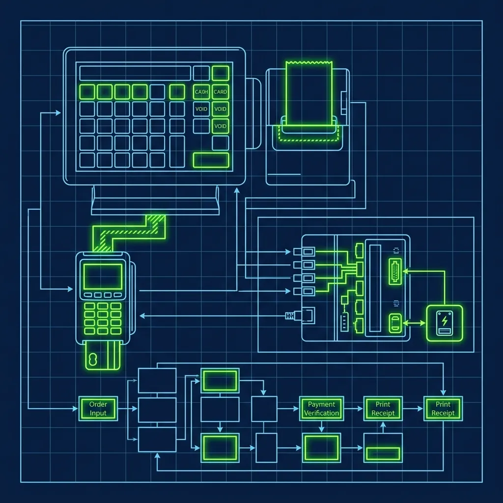
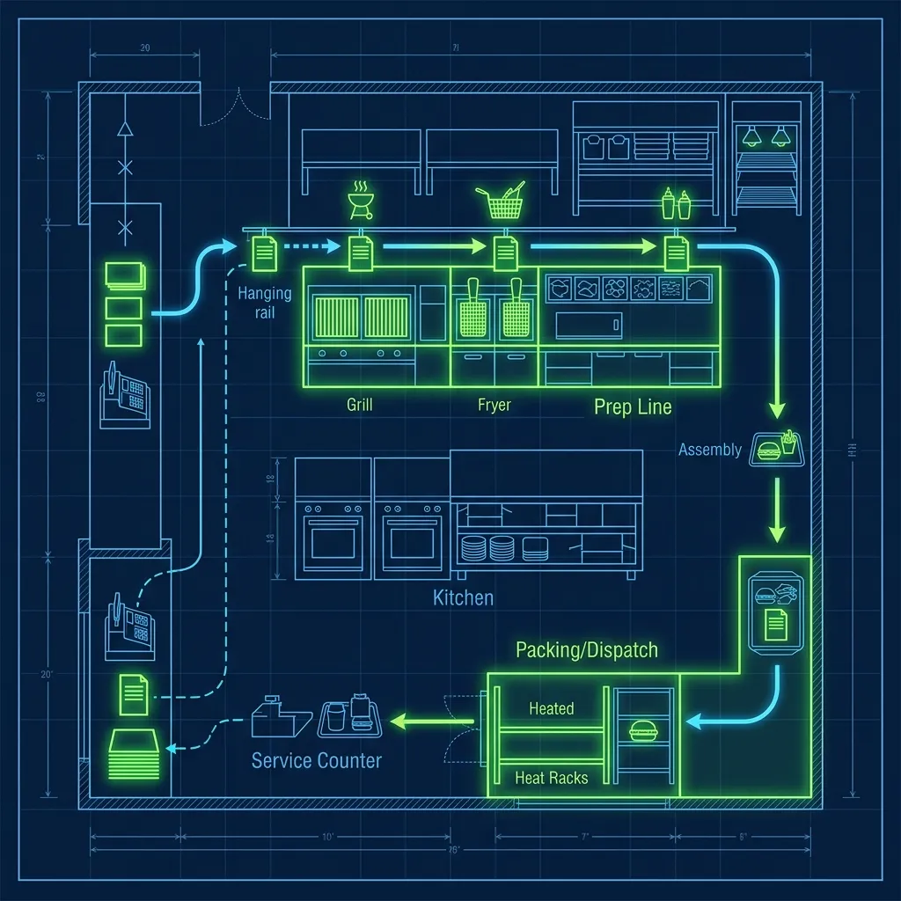

McDonald's is a masterclass in technological efficiency. The registers talk to the kitchen display screens, the drive-thru sensors report to the manager's tablet, and every single order flows through a tightly integrated digital ecosystem that makes a busy store feel almost automated. It runs like clockwork — right up until the moment it doesn't. *(Related guide: [How Does the McDonald's ABS (Automated Beverage System) Work?](/articles/mcdonalds-abs-system/))*

Here's the thing nobody tells you during orientation: a severe thunderstorm, a bad network switch, or even a botched software update from corporate can send every POS terminal in the building into a simultaneous black screen. And when that happens during a Friday night dinner rush with 14 cars in the drive-thru lane, the store doesn't close. You break out the Crash Kit and go full 1985. *(Related guide: [How Does the Taco Bell Drive-Thru Timer Actually Work?](/articles/taco-bell-drive-thru-timer/))*

## The Manual Crash Kit

Every McDonald's has an emergency box tucked away in the manager's office — usually on a high shelf behind stacks of promo materials nobody ever uses. Inside this box is everything you need to run a 21st-century fast-food restaurant with nothing but paper and a calculator. *(Related guide: [What Is the Burger King Expeditor Role During a Rush?](/articles/burger-king-expeditor-role/))*

- **Basic calculators**: Two or three of them, because one will inevitably have dead batteries when you need it most.
- **Laminated tax charts**: The POS normally calculates local sales tax automatically. Without it, cashiers use these charts to manually look up the tax on every order total. I've seen new hires completely freeze when they realize they need to add tax by hand.
- **Carbon-copy order pads**: The old-school kind with a pink and white sheet. Cashiers write every single order by hand, tear off the copy, and keep one for reconciliation later.
- **Pre-printed price lists**: Organized by category — burgers, chicken, breakfast, drinks, sides — because nobody has every price memorized. These get updated whenever prices change, but I've worked at stores where the price list was two promos out of date. That creates its own fun problems during reconciliation.

Some locations also keep a backup cash drawer with a pre-counted starting bank specifically designated for crash situations. The idea is that within five minutes of total system failure, the store should be operational again. In reality, it takes closer to ten or fifteen minutes because everybody panics first, then reads the instructions.

## The Chaos in the Kitchen

The hardest part of a system crash isn't calculating money — it's communicating with the grill. When those kitchen display screens go black, the cooks are completely blind. They have zero visibility into what's been ordered.

This is where the operation gets creative and messy:

- **The Runner**: The shift manager assigns one employee to physically carry handwritten paper slips from the front counter back to the kitchen. This person sprints back and forth for the entire duration of the crash, and believe me, they earn every penny of their minimum wage that night.
- **The Translation Problem**: Fast food cooks are trained to read specific digital abbreviations on screen — things like "NO Pckl, SUB Mac Sauce." When cashiers start furiously handwriting orders under pressure, their handwriting becomes hieroglyphics. I've watched a grill person squint at a slip for twenty seconds trying to figure out if it says "No Onion" or "No Mustard." Multiply that by every order, and the assembly line grinds to a crawl.
- **The Cash-Only Rule**: When the POS goes down, the credit card readers go with it. The store instantly becomes cash-only. Since cashiers are punching numbers on basic calculators, asking customers for exact change becomes a desperate plea to keep the drive-thru line moving. I've seen managers pull cash from their own wallets to make change when the drawer runs low.

The kitchen bottleneck is the real killer during a crash. Even if the front counter keeps orders flowing, the grill team is operating at maybe 40% of normal speed because they're decoding handwriting instead of reading clean digital tickets.

## Managing the Drive-Thru During a Crash

The drive-thru is where a POS crash transforms from stressful to genuinely chaotic. Under normal conditions, the [drive-thru timer is sacred](/articles/taco-bell-drive-thru-timer) — managers are evaluated on average service times down to the second. During a crash, those metrics go completely out the window, and honestly, that's the one silver lining.

The headset system usually runs on a separate circuit, so drive-thru employees can still hear customers talking. But without the POS screen, the order-taker has to scribble the order on paper, shout a total from the tax chart, and hand the slip to the Runner. The customer confirmation screen goes dark, meaning customers have no way to verify their order before they pull forward. This alone doubles the error rate at the pickup window.

Some managers will make the tough call to shut down the drive-thru entirely during a severe crash and funnel all customers through the front counter. This is an absolute last resort — it sends a line of cars out into the street and creates a traffic hazard — but sometimes it's the only way to maintain any semblance of order. I've had to make that call twice in my career, and both times the owner called me within the hour asking what was going on. You explain, they understand, but nobody's happy about it.

## The Aftermath: The Reconciliation Nightmare

When the system finally comes back online — whether that takes twenty minutes or three hours — the work is far from over. Every single paper order written during the crash has to be manually entered into the POS system after the fact.

This process is called reconciliation, and it usually falls on the shift manager. You sit down with a stack of carbon-copy slips, enter each order into the register one by one, and try to match the cash collected to the orders taken. Here's the reality: there will always be discrepancies. A cashier forgot to write down a drink. A customer was undercharged because the tax chart was hard to read in dim backup lighting. A slip got crumpled and lost in the kitchen chaos. These shortages come directly out of the store's daily profit margin.

I've done reconciliation after a two-hour crash that happened during a Saturday dinner peak, and I was off by almost $40. That's not theft — that's the natural entropy of running a high-volume restaurant on paper slips and calculators. But it still shows up on the P&L, and the franchise owner still asks about it.

The [ABS (Automated Beverage System)](/articles/mcdonalds-abs-system) is another casualty during a crash. Without digital orders triggering the drink machines, crew members have to manually make every single beverage, which adds even more time to each order.

## What About Mobile and Kiosk Orders?

If the POS goes down, the self-order kiosks and the McDonald's app typically go down with it, since they all connect to the same back-end system. This actually helps in one way — it stops new digital orders from flooding in. But it also means angry customers who pre-paid on the app may show up expecting food that the store has no record of.

Most managers honor these orders on good faith and sort it out during reconciliation. You ask the customer to show their confirmation screen, make the food, and write it on a slip marked "APP ORDER" so you can reconcile it later. It's messy, but turning away a customer who already paid is a much bigger problem than eating the cost.

## Pro Tips for Surviving a Crash

If you work at McDonald's long enough, you will live through a POS crash. Here's how to make it survivable:

- **Memorize the top five combo prices.** If you already know that a Big Mac meal is $9.49 and a 10-piece McNugget is $5.29, you can keep the line moving without constantly flipping through the price chart.
- **Develop a shorthand system with your kitchen crew.** If you and the cooks agree on quick abbreviations like "QPC" for Quarter Pounder with Cheese and "NP" for no pickles, the handwritten slips are much easier to decode. Some veteran crews practice this during slow shifts specifically so they're ready.
- **Keep a personal flashlight on your keychain.** During storm-related crashes, the lights may flicker or go dim on backup power. A small flashlight makes reading paper slips and tax charts dramatically easier, especially at the drive-thru window. This tip alone saved me more than once.

If you are working during a system crash, it will be the most stressful shift of your career. But veteran employees look back on it as a rite of passage — the shift that separates the crew members who can handle pressure from the ones who can't. Similar to the chaos of the [Burger King expeditor role during a rush](/articles/burger-king-expeditor-role), a crash forces you to rely on communication and teamwork instead of technology.

## Frequently Asked Questions

### How often do POS crashes actually happen?

It depends heavily on the location and the age of the equipment. A brand-new store with modern hardware might go a year or more without a serious crash. Older stores with aging network equipment might experience partial or full crashes several times a year, especially during storm season when power surges are common. Partial crashes — where one or two registers go down but the kitchen screens stay up — are much more frequent and far less disruptive.

### Do employees get paid extra for working during a crash?

No. There is no special "crash pay" or bonus for surviving a system failure. You earn your regular hourly wage. However, many managers will reward the crew with free meals after a particularly brutal crash shift as a morale booster. I always made sure to do this — when your team just survived two hours of paper-slip chaos, the least you can do is buy them dinner.

### Can the store just close during a crash?

Technically, a franchise owner could decide to close, but it almost never happens. Corporate expectations are that the store remains open during posted business hours. Closing during a dinner rush would result in significant lost revenue and potential scrutiny from the corporate field consultant. The Crash Kit exists specifically so that closing is never necessary — even if the service is painfully slow.

---
