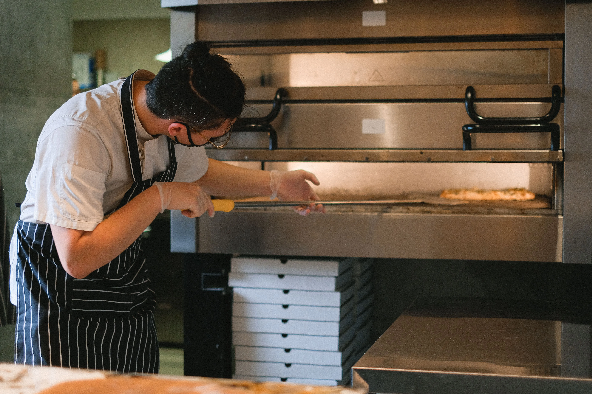

If you’ve ever watched a McDonald's kitchen during a massive 12:30 PM lunch rush, you might wonder how they manage to assemble a 10-piece McNugget, a McChicken, and a Filet-O-Fish in under 45 seconds. The answer isn't that they are cooking these items to order. The secret to McDonald's unprecedented speed of service is a piece of equipment called the **Universal Holding Cabinet (UHC)**.

I know that the UHC is the absolute heartbeat of the McDonald's kitchen. Without it, the modern drive-thru model would collapse under its own weight. 

## What is the Universal Holding Cabinet?

<strong>ProTip: Equipment:</strong> Always use a high-quality commercial thermometer for temping. We recommend the <a href="https://amazon.com/dp/B01D536F3O?tag=fastfoodguide-20" target="_blank" rel="noopener sponsored">Taylor Commercial Digital Thermometer</a> for the fastest read times during a rush.

The UHC is a large, open-faced stainless steel shelving unit that sits squarely between the grill/fry area and the assembly line (the prep table). 

It features multiple horizontal slots. Into these slots go rectangular plastic trays (often called "UHC trays" or "meat trays"). When the grill team finishes a batch of McChicken patties, they slide the tray into a UHC slot from the back. When the assembly line needs a McChicken patty to build a sandwich, they pull it from the front of the same tray. 

But it’s not just a warm box. It’s a highly calibrated thermal environment.

## Zone Temperatures and Moisture Control

Not all fast food proteins require the same holding environment. A fried, breaded McChicken patty will become soggy if held in a high-humidity environment. Conversely, grilled chicken or sausage patties will dry out and turn into hockey pucks if held in a dry environment. 

The brilliance of the UHC is that each horizontal slot has independent top and bottom heater plates. The environment inside the tray is controlled by the type of tray used:
- **Fried Products (Nuggets, Crispy Chicken):** Placed in a tray with a slotted wire rack at the bottom to allow airflow, preventing the breading from getting soggy.
- **Grilled/Moist Products (Sausage, Folded Eggs):** Placed in a solid tray, sometimes with a specialized lid, to lock in moisture and prevent dehydration.

## The Digital Timer System

Above every single slot on the UHC is a digital display with a timer button. This is where the food safety and quality control magic happens. 

Every McDonald's product has a specific, scientifically tested holding time. 
- McNuggets might have a 20-minute holding time.
- Crispy Chicken patties might hold for 45 minutes. 
- (Note: *Quarter Pounder beef is cooked fresh-to-order and does not go in the UHC.*)

When the grill team slides a fresh tray of nuggets into the cabinet, they press the button above the slot. The timer instantly begins counting down. 

When the timer expires, the display flashes and an audible beep sounds. At this point, the standard operating procedure (SOP) is rigid: the expired product must be thrown into the waste bucket. 

**ProTip:** The UHC relies on color-coded bin displays. If a light turns Yellow, the grill team should already be dropping the next batch. If it's flashing, that product is expired and must be discarded.

## Daily Cleaning and Sanitation Procedures (Preventing Carbon Buildup)

Because the UHC maintains constant temperatures between 175°F and 200°F (80°C to 93°C) for 24 hours a day, grease and moisture evaporate and re-condense on the underside of the aluminum heating plates. Over a busy shift, this vaporizes into a hard, blackened layer of carbon and caramelized fat. Maintaining thermal conductivity requires a strict daily breakdown and sanitation routine:
- **Nightly Wipe-Downs & Carbon Removal:** At closing (or during the 3:00 AM maintenance window in 24-hour locations), crew members must power down individual UHC banks and allow them to cool for 30 minutes. 

**ProTip:** When cleaning the UHC, only use approved cleaners and brushes. Using steel wool or harsh chemical oven cleaners is strictly forbidden, as scratching the anodized aluminum plate creates micro-fissures that harbor bacteria and cause uneven heat distribution.

- **Wire Rack and Tray Sanitization:** All amber and black polycarbonate holding trays, wire drainage grates, and vapor lids must be run through the high-temperature commercial dishwasher and sanitized at least once every 4 hours. If grease is allowed to accumulate on the wire grates, fried products will sit in their own pooled oil, turning extra crispy breading into a soggy, unpalatable texture within 10 minutes.

## Troubleshooting Heater Plate Failures and Calibration Audits

A shift manager's worst nightmare during a Friday night dinner rush is a UHC heater plate failure. Because each slot is controlled by an independent solid-state relay and thermocouple, a single broken heating element can compromise an entire production line without triggering an obvious external alarm.
- **Monthly Pyrometer Calibration Audits:** To guarantee food safety compliance under EcoSure and local health department standards, shift managers must conduct monthly temperature audits using a calibrated digital pyrometer with a flat surface probe. The manager inserts the thermocouple probe directly between the upper and lower plates of each slot to verify that the actual physical temperature matches the digital LED readout within a ±2°F tolerance.
- **Identifying "Cold Spots" and Sensor Drift:** If a slot's lower thermocouple drifts out of calibration, the heating plate may drop to 135°F while the readout still claims 175°F. Food held in this zone falls into the FDA "Temperature Danger Zone" (between 41°F and 135°F), allowing rapid bacterial growth. When an audit reveals sensor drift, the manager must immediately lock out the slot with red maintenance tape, re-assign that protein to an adjacent vacant bank, and dispatch a work order for an authorized equipment technician to replace the solid-state relay board.

## The "Level" System: Staying Ahead of the Rush

The UHC relies on the kitchen manager accurately predicting the future. 

McDonald's uses a system called "Levels" or "Cabinet Management" to determine how much food should be held in the UHC at any given time of day. 
- At 2:00 PM (a slow period), the system might call for a "Level 1" on nuggets, meaning only one small tray of nuggets should be held.
- At 12:15 PM (peak lunch), the system calls for a "Level 4," meaning multiple trays of nuggets are cooking and holding simultaneously.

The grill team constantly monitors the UHC levels. If the assembly line pulls the last McChicken patty from a tray, they yell "Waiting on McChicken!" The grill team must already have the next batch frying so the UHC slot can be replenished before the next order drops. 

When the UHC is managed properly, the assembly team never waits on the grill team, and the customer receives their food in under two minutes. When the UHC is mismanaged, the entire restaurant falls into chaos, resulting in parked cars and ballooning drive-thru timers.

The next time you receive your food impossibly fast, thank the UHC. It’s the invisible engine powering the global fast food industry.

### See Also

- [McDonald's ABS System: Made-for-You Explained](/articles/mcdonalds-abs-system/)
- [Your First Day at McDonald's: What Actually Happens (From a Manager Who Ran Orientation)](/articles/mcdonalds-first-day-training/)
- [McDonald's Fresh Beef: The Grill Process](/articles/mcdonalds-fresh-beef-grill-process/)
