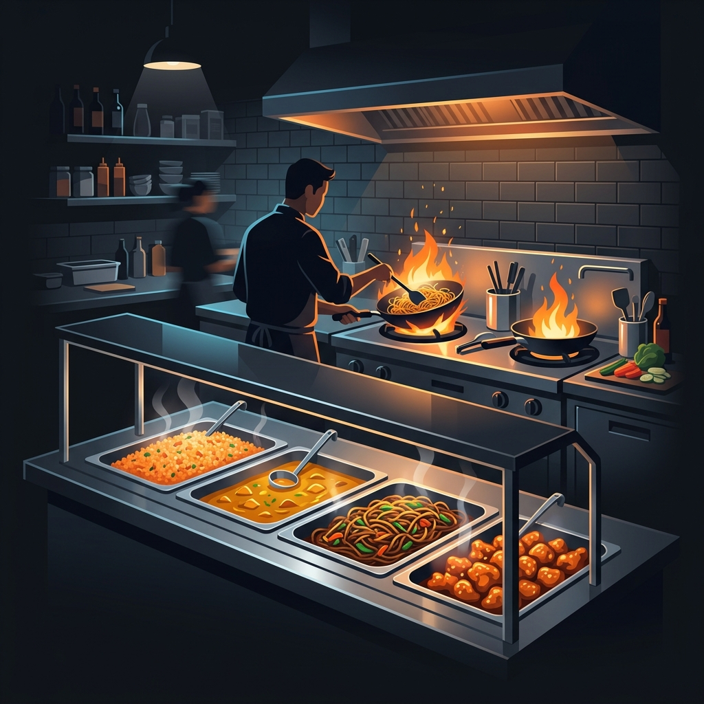

When you walk into a modern fast food restaurant, the kitchen usually runs on a Kitchen Display System (KDS). A customer places an order at the register, a digital ticket pops up on a screen above the grill, and the cooks quietly assemble the meal. It is a highly digitized, tracked, and silent operation. 

Panda Express rejects this entirely for its hot food prep. 

If you stand in line at Panda Express during a lunch rush, you will hear a constant stream of yelling. The front-of-house workers (the people serving your food) are shouting things like, "Half pan Orange!" or "Batch two Beijing Beef!" while the wok chefs shout back to acknowledge the order. 

This verbal loop is called "calling food," and it is the single most important operational system in a Panda Express kitchen. Without it, the steam table runs empty, ticket times collapse, and the entire store grinds to a halt. Here is how the system works and why it is so difficult to master.

## The Problem with the KDS

Why doesn't Panda Express just use digital screens? The answer lies in their service model. Unlike a burger joint where every item is cooked to order, Panda Express relies on a steam table model. Food is cooked in bulk batches and held in heated pans on the serving line. 

A digital screen only tells the kitchen what the customer just bought; it doesn't tell the kitchen how much food is actually left in the pan on the line. If a customer orders a massive catering plate of Orange Chicken, the pan might instantly empty. If three customers in a row order Kung Pao Chicken, that pan might need a refill immediately, even if the daily sales projections didn't anticipate it.

The only way to know when to cook more food is to have a human being physically look at the steam table, judge the remaining volume, and verbally command the wok chef to start cooking.

## The Role of the Caller

The responsibility of calling food usually falls to the associate working the front of the steam table, or the shift lead managing the line. This person has to serve customers quickly while simultaneously acting as the air traffic controller for the kitchen.

They are constantly scanning the pans. The standard rule is that when a pan drops to one-quarter full, the caller must alert the kitchen. The calls are highly structured so there is no confusion over the roar of the exhaust hoods and the sizzling woks.

A standard call sounds like this: **"Waiting on Batch One Orange Chicken!"**

The wok chef must immediately reply: **"Heard, Batch One Orange!"**

If the wok chef does not repeat the call back, the caller assumes they didn't hear it and will yell it again. This confirmation loop guarantees that the kitchen has registered the order and is actively starting the prep.

## Understanding Batch Sizes

The callers don't just ask for food; they dictate exactly how much food the wok chef needs to cook based on the current flow of customers. Panda Express categorizes cooks by "batches," which correspond to the raw weight of the meat hitting the wok.

*   **Batch One:** The standard size for slower periods. It is enough to fill a standard steam table pan about halfway. This ensures the food stays hot and fresh and doesn't sit on the line drying out for an hour.
*   **Batch Two:** The lunch rush standard. This is a massive amount of food, filling the pan to the brim. If a caller asks for a Batch Two, the wok chef knows the store is getting slammed.
*   **Batch Three:** Rarely called unless a massive catering order drops or a bus pulls into the parking lot. A Batch Three pushes the physical limits of the wok and requires serious arm strength from the chef to toss the meat and sauce properly.

A skilled caller constantly adjusts the batch sizes. If they call a Batch Two at 3:00 PM when the store is dead, the manager will pull them aside because that food will inevitably expire and have to be thrown away, ruining the store's food cost metrics.

## The Domino Effect of a Bad Call

When I managed kitchens, the fastest way to identify a weak front-of-house crew was to watch the steam table during a rush. A bad caller waits until a pan is completely empty before yelling to the kitchen. 

This creates a disastrous domino effect. If the Orange Chicken pan is empty, the customer at the counter has to wait. Because Orange Chicken is the most popular item, the next five customers in line are likely waiting for it too. The line stops moving. The wok chef now has to rush a batch, which takes at least three to four minutes. In the fast food world, making a line of customers stare at an empty pan for four minutes is an eternity. 

A great caller anticipates the flow. They see the pan getting low, they see three people walking through the front doors, and they call the food *before* it runs out. The fresh food arrives from the kitchen just as the spoon scrapes the bottom of the old pan, ensuring the line never stops moving.

## Frequently Asked Questions

### Do they ever use timers for the food?
While the callers dictate when to cook the food, Panda Express does use strict timers for food safety and quality control. Once a fresh pan hits the steam table, a dry-erase marker or a digital timer is used to track how long it has been sitting. If it sits too long, it must be discarded.

### Can the wok chef refuse a call?
No, but they can negotiate priority. If a caller asks for Kung Pao Chicken and Beijing Beef at the exact same time, a busy wok chef will shout back a priority order, telling the caller which dish will hit the table first so the front-of-house can manage customer expectations.

### Why do they sometimes mix old food with new food?
During busy rushes, a fresh batch of food is sometimes poured directly on top of the small amount of remaining food in the pan. This is standard practice to keep the line moving, but strict food safety rules mandate that pans must be fully swapped and cleaned out on a regular schedule to prevent the bottom layer from burning or expiring.
