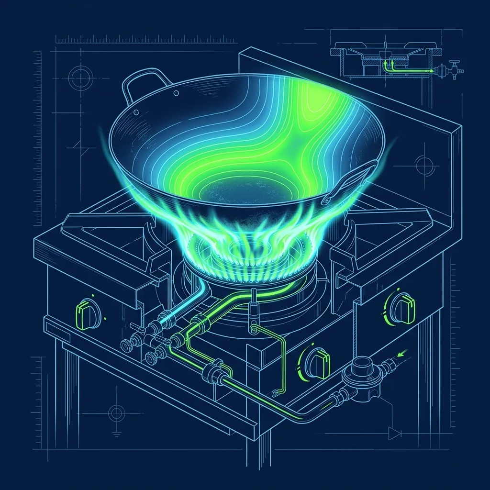
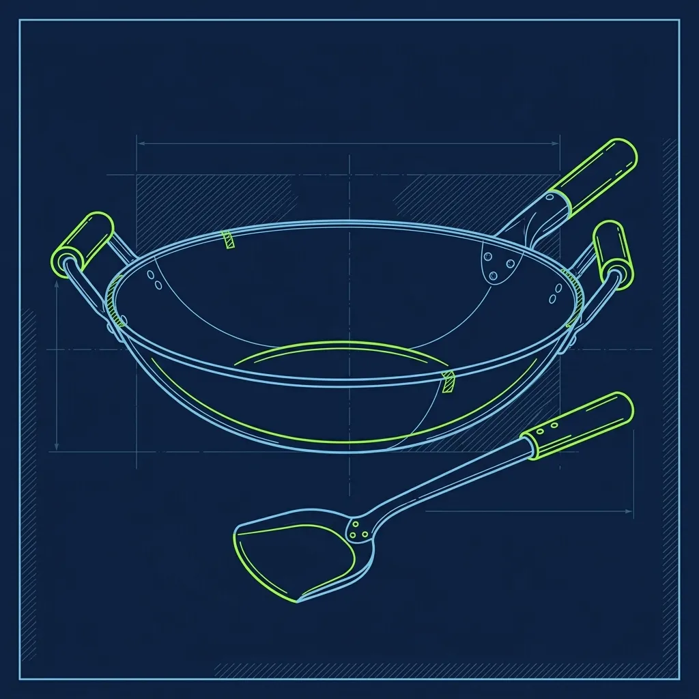

Walk into a Panda Express during a dinner rush and the first thing that hits you isn't the smell of orange sauce — it's the wall of heat and the violent sound of metal on metal. The Wok Chefs are standing over open flames, tossing 8-pound loads of battered chicken through fire and boiling sugar sauce, and doing it all at a speed that would make most home cooks panic. This isn't a flat-top grill job. This isn't pushing buttons on a fryer. This is one of the most physically demanding and genuinely dangerous positions in the entire fast-casual industry. 

I've trained people across multiple chains, and No exaggeration — honestly — the Panda Express wok station is in a league of its own when it comes to physical punishment. 

## The Heat and the Fire

Most fast-food restaurants use enclosed deep fryers with automatic basket lifts, or computerized flat-top grills that beep when they're done. Panda Express uses traditional Chinese wok burners that pump out massive BTU output, often reaching 600°F or higher inside the wok bowl. The flames don't stay politely beneath the pan — they literally shoot up around the sides, licking at your forearms if you're not careful. 

The hazards are constant and unforgiving:

- **Hot oil splatter**: Every time you drop raw battered chicken into a wok full of hot oil, the moisture in the batter flash-vaporizes and sends a spray of 350°F oil in every direction. Minor grease burns on the forearms aren't occasional — they're a standard hazard of the job.
- **Sugar sauce eruptions**: The Orange Chicken sauce contains a high sugar content that boils rapidly and can cause severe burns if it hits bare skin. Sugar sticks and keeps burning, unlike oil which rolls off. This is the injury that catches new hires off guard the most.
- **Singed arm hair**: If you still have arm hair after your first month on the wok, you weren't standing close enough. Veteran Wok Chefs joke about this, but it's not really a joke.

The environment around the wok station is brutal year-round, but summer is a special kind of misery. Even with the store's HVAC system running at full capacity, the area directly around the burners can exceed 110°F. Dehydration is a genuine medical concern — experienced Wok Chefs keep a water bottle within arm's reach and learn to take quick sips between batches. Some stores place a small fan near the wok station, but many managers discourage this because the airflow can cause the open flames to flare unpredictably and increase the risk of grease fires.

## The Physical Toll of the Wok

A standard commercial wok at Panda Express, when fully loaded with 8 pounds of battered chicken swimming in thick orange sauce, is incredibly heavy. And you can't just stir it with a ladle and call it done.

As a Wok Chef, you are required to "toss" the food. You use a heavy metal spatula called a chuan in one hand while using your other arm to physically lift and jerk the wok back and forth over the flame to coat every piece evenly without burning the sugar. This isn't a gentle wrist flick — it's a full-arm, shoulder-engaged motion that you repeat hundreds of times per shift. Doing this for 8 hours a day requires serious upper body and forearm strength that you simply don't have when you start.

Many new Wok Chefs report that their wrists, forearms, and shoulders are painfully sore for the first two to three weeks. It is common to wake up in the morning unable to fully close your fist because your grip muscles are so fatigued from the chuan. Over time, you build the endurance, but the first month feels like a bootcamp — and Back when I was running shifts, people quit within the first week because they weren't prepared for the physical reality.

Long-term Wok Chefs who don't take care to stretch and rest properly on days off can develop chronic wrist tendinitis or shoulder impingement issues. The repetitive strain risk is real and well-documented within the chain. This is similar to the physical demands of [working the Chipotle grill station](/articles/chipotle-grill-validation), but the wok involves overhead lifting that the flat grill doesn't.

## The Wok Test

Because of the safety risks and the physical demands, you are not allowed to be the primary cook until you pass the Wok Test. This isn't a formality — it's a hands-on evaluation where a manager watches you cook a complete batch from start to finish and grades you on multiple criteria:

- **Safety protocol**: Do you turn the gas flame down before adding volatile ingredients like cooking wine or fresh oil? Do you keep your face away from the wok when adding wet ingredients to hot oil?
- **Speed**: Can you clean your wok with a bamboo brush and boiling water in under 15 seconds between batches? That cleaning step is where most new hires lose time, and slow cleaning means the whole kitchen falls behind.
- **Recipe accuracy**: Are you measuring the exact ladle quantities for each sauce without looking at the recipe cards? A half-ladle too much of the soy-based glaze, and an entire 8-pound batch tastes wrong.

The Wok Test isn't a one-time event, either. Most GMs will re-evaluate their Wok Chefs periodically, especially if quality issues surface or a health inspection is approaching. If a Wok Chef starts cutting corners — not cleaning the wok properly between batches, guessing at sauce measurements, or skipping the temperature-down step before adding wine — the manager can pull them off the wok and demote them back to prep or front counter until they can demonstrate proper technique again. I witnessed it happen to people who had been cooking for months. Complacency on the wok is dangerous.

## The Wok Chef Hierarchy and Career Path

Inside a busy Panda Express, there is an unspoken hierarchy among the staff. At the bottom are the prep workers who chop vegetables, portion raw chicken, and mix sauces. In the middle are the front-of-house employees who work the steam table and serve customers. At the top sits the Wok Chef.

If you can handle the heat and the heavy lifting, Wok Chefs are typically the highest-paid hourly employees in the store — usually $1 to $3 more per hour than front counter or prep workers. That pay premium reflects the skill level, the physical demands, and the reality that not everyone can do it.

The position also serves as a direct stepping stone to management. Many Panda Express Assistant Managers and General Managers started their careers on the wok. Corporate values the discipline, multitasking, and stress management that successful Wok Chefs develop, and they actively recruit from the wok station when looking for leadership candidates. If you can manage a five-ticket queue on the wok during a dinner rush while keeping your station clean and your batch times consistent, you can manage a restaurant.

## Protecting Yourself on the Wok

The [Jersey Mike's hot sub grill station](/articles/jersey-mikes-hot-sub-grill) has its own burn risks, but the Panda wok is on another level. Here's what veterans do to stay safe:

- **Invest in heat-resistant forearm sleeves.** Not all stores require them, but wearing long cotton or heat-resistant sleeves under your uniform dramatically reduces minor grease burns. Some experienced Wok Chefs buy inexpensive welding sleeves online — they're $8 on Amazon — and trim them to fit under their uniform.
- **Develop a consistent wok-cleaning rhythm.** The fastest Wok Chefs don't think about cleaning — they do it on autopilot. The moment you dump a finished batch into the steam table pan, you immediately hit the wok with the bamboo brush and boiling water. Making this a reflex instead of a conscious decision shaves seconds off every batch and keeps your station significantly cleaner.
- **Stretch your wrists and forearms before every shift.** Simple wrist circles, forearm stretches, and grip exercises before you clock in make a real difference in preventing chronic pain. I recommend five minutes of stretching in the parking lot before every shift. Your future self will thank you.

## Frequently Asked Questions

### How long does it take to pass the Wok Test?

Most new hires spend one to three weeks training on the wok before they're allowed to attempt the test. Some people pass on their first try, while others need two or three attempts. It depends on your comfort with high heat, your physical strength, and how quickly you can memorize the recipes. There's no shame in needing multiple attempts — the test exists because the wok is genuinely dangerous, and nobody wants you getting hurt.

### What happens if you fail the Wok Test?

If you fail, you continue training for another week or two and then try again. If a new hire fails the test multiple times, the manager will usually reassign them to a different position — front counter, prep, or steam table service. Not everyone is physically suited for the wok station, and there's no shame in that. The chain needs great people in every role, not just on the wok.

### Are there any long-term health risks from working the wok?

The most common long-term concerns are repetitive strain injuries in the wrists and shoulders, minor scarring from accumulated grease burns, and potential hearing issues from constant exposure to loud kitchen noise — the combination of roaring burners, clanging metal, and exhaust fans creates a consistently loud environment. Staying hydrated, wearing protective gear, and stretching regularly can mitigate most of these risks, but the job does take a physical toll over years.

---
