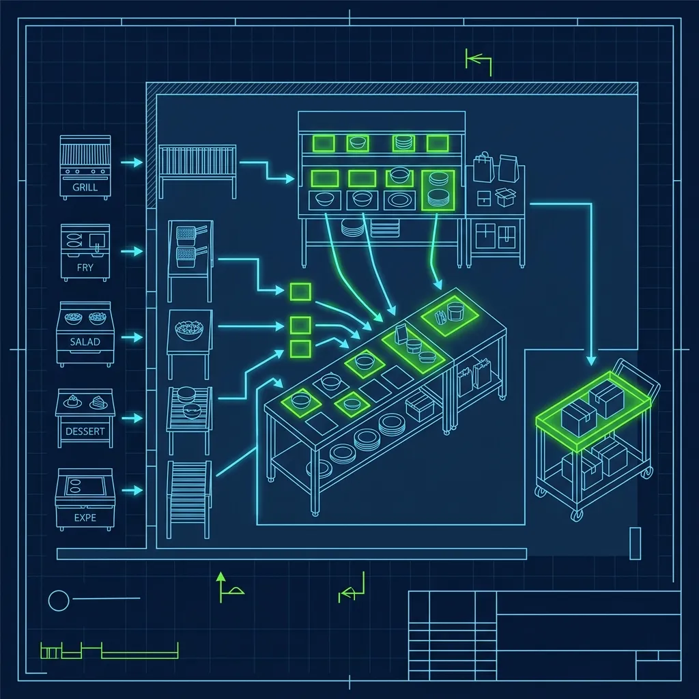
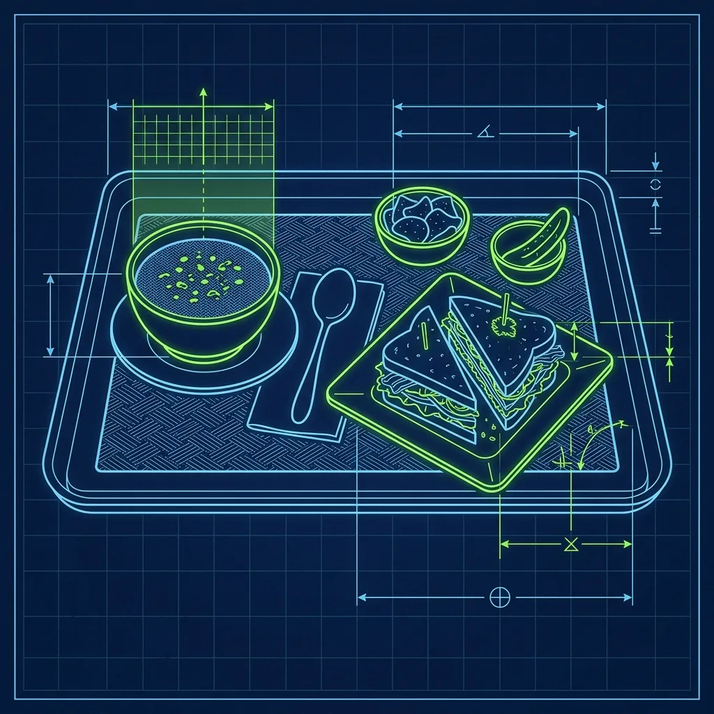

During a lunch rush at Panera Bread, the production line is a flurry of organized chaos. There are people making sandwiches on one station, people tossing salads on another, and people ladling soup at a third. Items come off these stations at different speeds, in different containers, heading to different customers — and somehow, they all need to end up on the right tray with the right side item before reaching the right person. 

That's where the Consolidator comes in. Standing at the very end of the production line, this person touches every single order before it leaves the kitchen. If you get assigned to this position, you are the final boss. You are the last line of defense between the kitchen and an angry customer holding a bowl of Broccoli Cheddar soup that was supposed to be Tomato. 

## The Master of the "You Pick Two"

> **Russell's Note:** When your KDS screen is going red on a Friday night, the last thing you want is a broken line. You have to run a 120-second window or you're dead in the water.

> **Russell's Note:** You don't know true panic until a 15-item catering order drops right in the middle of a Sunday brunch shift. I still have nightmares about it.

Here's the thing nobody tells you about Panera: the most popular menu item is also the biggest operational headache. The "You Pick Two" lets a customer pair a half-sandwich with a half-salad or a cup of soup. Customers love it. The kitchen hates it. 

Why? Because the sandwich comes from one station, the soup comes from a completely different station, and the salad comes from yet another. These items don't finish at the same time. The Turkey Bravo might be done 90 seconds before the Broccoli Cheddar is ladled. During that gap, the Consolidator is holding a half-sandwich with no matching partner, watching the screen fill up with more incomplete orders.

During peak lunch hours — roughly 11:30 AM to 1:30 PM — there might be 15 to 20 "You Pick Two" orders on the screen simultaneously, each with a different combination. One customer wants a half Frontega Chicken with a cup of Tomato Soup. The next wants a half Mediterranean Veggie with a Caesar Salad. The Consolidator has to mentally pair each sandwich with its matching second item, even when they arrive minutes apart and the physical staging area on the counter is getting crowded.

If you lose track of which half-sandwich belongs to which combo, the entire order queue grinds to a halt. I've seen new Consolidators freeze up during a rush when they have six incomplete trays in front of them and can't remember which half-sandwich goes with which soup. It's a mental tracking exercise that makes your brain feel like a browser with forty tabs open.

## The Quality Control Check

The Consolidator is Panera's last line of defense against remakes and customer complaints. Before a plate leaves the kitchen, the Consolidator must quickly verify:

- **Modification accuracy**: Did the customer ask for no tomatoes? You lift the top of the sandwich and check. Did they request dressing on the side? You confirm the ramekin is there.
- **Correct side item**: Did they get the baguette, the chips, or the apple? A wrong side seems trivial, but it generates a disproportionate number of complaints.
- **Presentation standards**: Wipe drips of soup off the rim of the bowl. Make sure the sandwich isn't falling apart. Straighten the bread on the tray. It's all about clean presentation.

This quality check has to happen in seconds, not minutes. During a rush, the Consolidator is visually inspecting and releasing an order roughly every 20 to 30 seconds. There is no time to unwrap a sandwich and rebuild it — if something looks wrong, you either make a quick fix on the spot or call it back to the station for a remake, which adds time to every order behind it.

The Consolidator also checks that every tray includes the correct utensils. A soup order needs a spoon. A salad needs a fork. A bread bowl needs both. Missing utensils seem like a minor issue, but they generate a wildly disproportionate number of customer complaints because the customer has already sat down and started eating before realizing they have nothing to eat with. That walk of shame back to the counter is what triggers the negative review.

## Calling the Line

Because the Consolidator has eyes on the master order screen, they effectively dictate the pace of the entire kitchen. This is similar in principle to the [Burger King expeditor role](/articles/burger-king-expeditor-role), but with significantly more complexity because of the multi-station food combinations.

If the sandwich makers are flying through orders but the salad maker is three tickets behind, the Consolidator shouts: "Salad station — I need the Fuji Apple for Order 42 to complete the ticket!" A great Consolidator does more than just react to what's on the screen — they anticipate bottlenecks before they happen.

If the Consolidator sees four Broccoli Cheddar soups queued up in a row, they might call out to the soup station early: "Heads up, I've got four BrocCheds coming." This gives the soup station time to refill the well before they get slammed with four consecutive ladling requests and run dry mid-rush.

The Consolidator also serves as the communication bridge between the front counter and the kitchen. If a cashier takes a special modification — extra dressing on the side, or a substitution that didn't print cleanly on the ticket — and the kitchen didn't catch it, the Consolidator is the last chance to flag the error before it reaches the customer. This requires the Consolidator to not just read the screen, but actually understand what should and shouldn't be on each item.

## The Mental Stamina Required

Working Consolidator requires extreme mental organization. You're tracking 10 to 15 different orders in your head simultaneously, monitoring three separate production stations, managing a physical staging area, and making quality control decisions every 20 seconds. It is rarely given to a new hire — this is a position reserved for veteran team members or shift managers.

The mental fatigue of working a full lunch rush as Consolidator is often compared to air traffic control. You are constantly scanning, prioritizing, and making split-second decisions about what to hold, what to release, and what to send back. After a two-hour lunch peak, most Consolidators are mentally exhausted in a way that's different from physical tiredness — your body feels fine, but your brain feels like mush.

This is why many managers rotate the position every couple of hours or assign their absolute strongest team member for the entire rush and then give them a less demanding station afterward. The [Starbucks Customer Support cycle](/articles/starbucks-customer-support-cycle) follows a similar rotation philosophy — high-intensity roles need built-in recovery time to prevent burnout and maintain quality.

## How to Excel as a Consolidator

The difference between a mediocre Consolidator and a great one is visible in the remake numbers. Here's what separates the best:

- **Develop a physical "parking" system for incomplete orders.** When you have a half-sandwich sitting on the counter waiting for its matching soup, place it in a consistent spot. Left side for orders waiting on soup, right side for orders waiting on salads. This prevents you from losing track of items when the screen gets packed. Physical organization is mental organization.
- **Communicate loudly and with specificity.** A mumbled callout gets ignored in a noisy kitchen. Use the order number, the item name, and the station you're talking to. "Soup station — I need a cup of Tomato for Order 57" is dramatically more effective than "I need that soup." The kitchen is loud, and vague requests waste time.
- **Read the screen two or three orders ahead.** Don't just focus on the current order. If you can see that Order 44 is a simple sandwich-only and Order 45 is a complex You Pick Two, you can mentally prepare for the harder order while you're finishing the easy one. Anticipation is the single most important Consolidator skill.

Stepping into the Consolidator role at Panera is also one of the fastest paths to the [overnight baker position](/articles/panera-overnight-baker) or shift supervisor — managers notice who can handle the mental pressure and who cracks under it.

## Frequently Asked Questions

### How long does it take before a new employee gets trained on Consolidator?

Most Panera locations require at least two to three months of experience before an employee is even considered for Consolidator training. You need a thorough understanding of every station in the kitchen first, because the Consolidator interacts with all of them. If you don't know what a properly made Fuji Apple Salad looks like, you can't quality-check one in three seconds.

### Is the Consolidator position paid more than other roles?

Not typically. The Consolidator is considered a regular team member position and is usually paid at the same hourly rate. However, consistently performing well as Consolidator is one of the fastest paths to a Team Lead or Shift Supervisor promotion, which does come with a pay increase. Think of it as an audition for leadership.

### What happens if the Consolidator makes a mistake and sends out the wrong order?

The front counter or the customer catches the error, and the order comes back as a "remake." The Consolidator's job is to minimize remakes, but they happen — even to the best. If remakes become frequent during a single shift, the manager will usually coach the Consolidator or reassign the position to someone else for the remainder of the rush.

---
