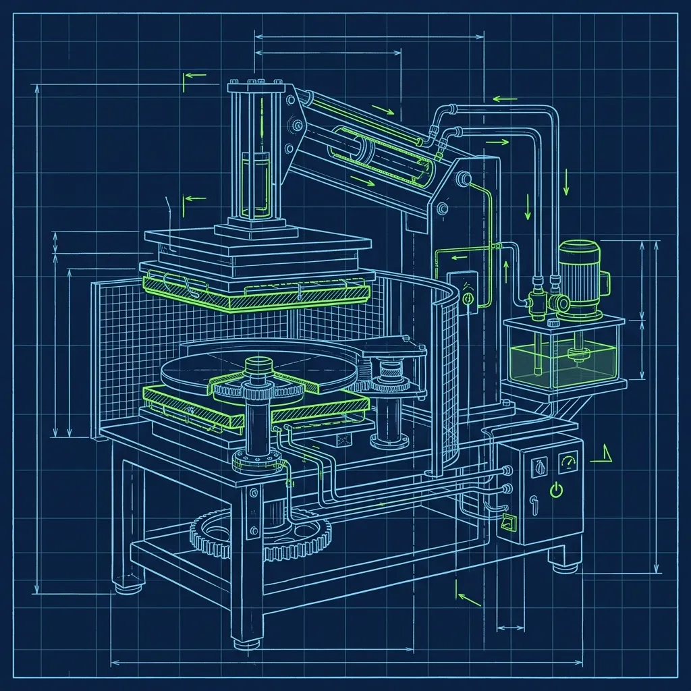
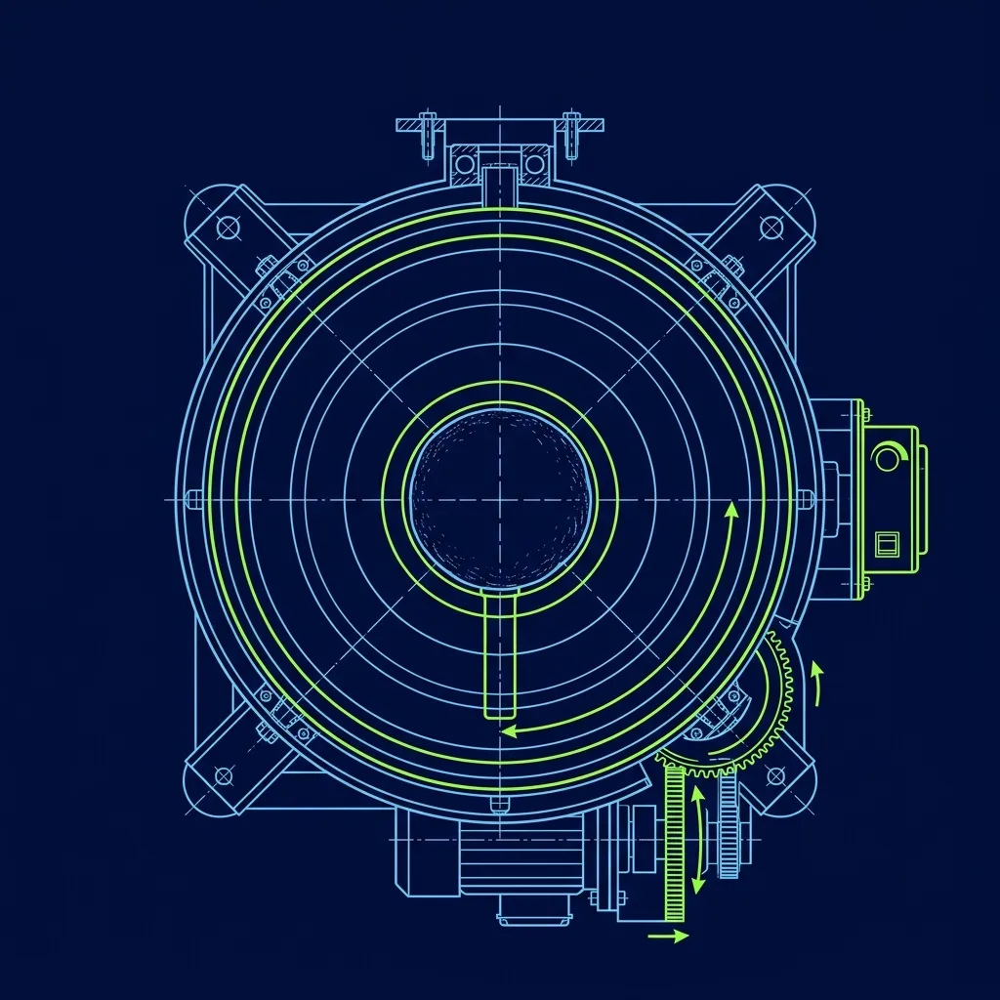

For decades, making a pizza at Papa John's required one specific physical skill that separated the seasoned Insiders from the terrified new hires: The Dough Slap. You had to pull a cold, springy dough ball out of the cooler, slap it between your hands, stretch it, spin it, and somehow create a perfectly round 14-inch base without punching a hole through the center. I've watched new employees destroy a dozen dough balls in their first hour, flour flying everywhere, dough stuck to the ceiling. It was a brutal learning curve — and honestly, kind of beautiful when you finally got it right. 

Then the Dough Spinner showed up, and everything changed.

## What the Dough Spinner Actually Is

> **Russell's Note:** You don't know true panic until a 15-item catering order drops right in the middle of a Sunday brunch shift. It instantly backs you up to the window.

> **Russell's Note:** Forget the fancy gadgets. Give me a sharp 8-inch chef's knife and a 32oz deli container labeled with blue painter's tape, and I can run any station.

The Dough Spinner — sometimes called a dough press or a dough sheeter, depending on who you ask — is basically a massive waffle iron without the grids. Picture two heavy, flat metal platens bolted to a hydraulic arm, sitting on your makeline prep table like a cast-iron anchor. The thing weighs a ton and eats up precious counter space that you could be using for sauce cups and cheese bins. 

Most models are literally bolted down to the table because the pressing motion generates enough force to walk the machine right off the edge if it's unsecured. The platens are coated with a non-stick surface and heated to a specific temperature — warm enough to relax the gluten in the dough so it doesn't snap back like a rubber band, but not hot enough to actually start cooking it. Getting that temperature wrong is one of the most common problems stores run into, and I'll get to that in a minute. 

Here's the thing nobody tells you about this machine: it hums. There's a constant low electrical hum when it's warmed up and ready to go. After a few hours on the makeline, that sound becomes the background noise of your entire shift.

## How the Machine Actually Works

Instead of the theatrical slapping and spinning that [Papa John's traditionalists love](/articles/papa-johns-dough-slapping), the process is almost insultingly simple:

1. **Coat the dough ball in Dustinator** — that's the cornmeal blend that prevents sticking and gives the bottom crust its texture.
2. **Place the ball dead center on the bottom platen.** And I mean dead center. I've seen new hires eyeball this and produce lopsided crusts that are thick on one side and paper-thin on the other. Some veteran operators actually make a tiny flour mark on the platen as a centering guide.
3. **Pull the lever down.** The machine physically crushes the dough ball flat in about three seconds.

That's it. Three seconds. What used to take a skilled Insider 30 to 45 seconds of hand-slapping now takes the time it takes you to blink twice. The heated platens relax the gluten instantly, so when you lift the lever, the dough stays flat instead of contracting back into a lumpy blob.

The reality is, centering the dough ball matters way more than people think. Even a half-inch off-center and your pizza base comes out looking like an egg — thicker on one side, thinner on the other. During a Friday night rush, when you're pressing out 40 pizzas an hour, your centering instinct has to be automatic. There's no time to measure.

## The Debate: Craft vs. Consistency

Among veteran Papa John's employees, the Dough Spinner is basically a religious war. I've heard heated arguments in the walk-in cooler that lasted longer than some relationships.

**The case for the machine:** A brand-new, 16-year-old Insider can produce a perfectly round pizza base on their very first shift. No wasted dough balls. No torn crusts. No three-week training period where the store absorbs the cost of a new hire destroying expensive dough. During Super Bowl Sunday, Halloween, or any major rush event, the machine keeps the makeline moving at a pace that hand-slapping simply can't match.

**The case against it:** Traditionalists — and I tend to side with them — argue that the machine crushes the air out of the outer crust, the cornicione. When you hand-slap, you gently push air toward the edges, creating that puffy, bubbly, charred ring that pizza purists lose their minds over. The Spinner flattens everything uniformly, producing a denser, flatter edge. Veteran employees who've worked both methods swear they can identify a machine-pressed crust just by looking at it after it comes out of the oven.

Here's the uncomfortable truth: in blind taste tests among staff, the results are almost always split. Some people genuinely prefer the consistency of the pressed crust. Most customers — loaded up with sauce, cheese, and toppings — never notice the difference. The machine wins on efficiency. The hand-slap wins on soul.

## The Training Impact Nobody Talks About

The Spinner's biggest impact isn't on the pizza. It's on the people making it. Before the machine, new Insiders needed one to three weeks of practice before they could reliably slap dough without tearing it. That training period was expensive — wasted dough, slower makeline speeds, a trainer pulled off their own station to babysit. With the Spinner, a new hire is pressing perfect bases within minutes of their first training shift.

But here's the trap I've seen play out a dozen times: when the machine breaks — and it will break, usually during the worst possible moment — a store full of machine-trained employees suddenly can't produce pizzas. I once watched a Friday night rush grind to a halt because the Spinner's heating element died and not a single closer knew how to hand-slap. The GM had to call a veteran employee at home and beg them to come in. Learn the hand-slap even if your store has a Spinner. You become the most valuable person in the building the night that machine goes down.

## Maintaining the Machine

The Dough Spinner requires more attention than most new operators realize. The platens need to be wiped down with a dry towel every 10 to 15 presses. Dustinator and dough residue build up on the non-stick surface, which causes sticking and uneven pressing. Always verify the platen temperature before your first press of the shift — if the machine hasn't been turned on or hasn't fully heated, the dough will snap back and you'll end up with a thick, shrunken base. Give it a solid 10 to 15 minutes to reach operating temperature. Most [commercial dough presses cost between $1,500 and $4,000](/articles/little-caesars-sheetout-machine), so franchises aren't exactly excited about replacing them when operators skip basic maintenance.

Regardless of where you stand on the debate, the Dough Spinner is becoming standard equipment as franchises prioritize speed and consistency over the old-school pizza-making craft. The hand-slap isn't dead yet — but it's definitely on life support.

## Frequently Asked Questions

### Does every Papa John's location have a Dough Spinner?

No. The decision to purchase one is made at the franchise level. Some franchise owners are old-school and refuse to buy the machine, insisting their Insiders learn the traditional hand-slap. Others have installed Spinners in every location they own. Corporate doesn't mandate one method over the other, which is why your pizza experience can vary dramatically between two Papa John's stores five miles apart.

### Can you use the Dough Spinner for all pizza sizes?

Most newer models have adjustable pressure settings for different sizes, but some older machines are calibrated specifically for the standard 14-inch pizza. For a 10-inch personal pizza or an extra-large 16-inch, you may need to adjust the settings or finish with a small amount of hand-stretching after the press. This is another reason knowing basic [dough-slapping technique](/articles/papa-johns-dough-slapping) matters — the machine doesn't always handle every size perfectly.

### Does using the Dough Spinner change the pizza's bake time?

Slightly. Because the machine-pressed dough is more uniform in thickness, it bakes more evenly, which can shave 15 to 30 seconds off the bake time. Most stores keep the [oven settings identical](/articles/dominos-oven-tender-role) regardless of prep method since the difference is minimal — but sharp oven tenders will notice the pressed crusts finishing a touch faster.

---
